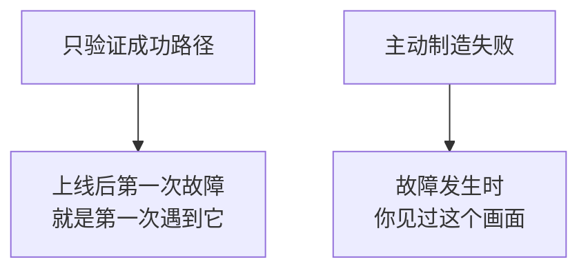
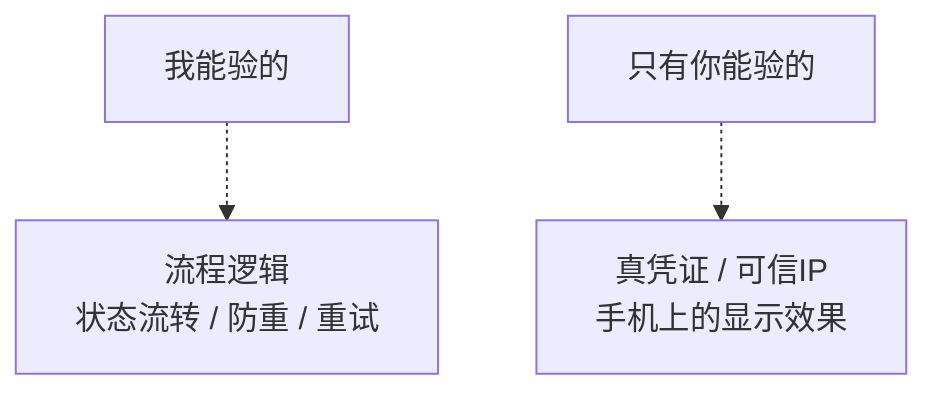
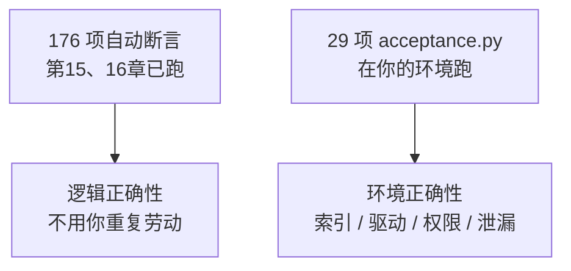
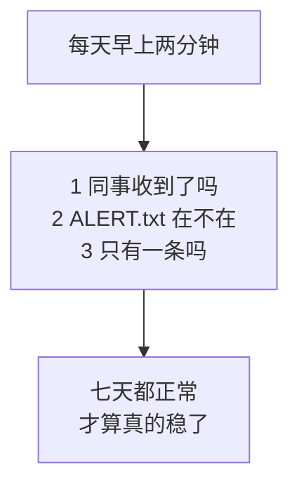

# 第 17 章　测试和验收清单

> 前十六章每一章都有"本章完成标志"。本章把它们汇总成一份**能逐条打勾、能签字**的验收清单，并交付一个**验收辅助脚本** `acceptance.py`，把其中能自动查的部分（26 项）一次查完。
>
> 本章的核心主张只有一句：**没见过它失败的样子，就不算验收过。**

---

## 17.0 本章交付什么

| 交付物 | 内容 |
|---|---|
| `acceptance.py`（542 行） | 自动检查 26~29 项，**默认只读、不发消息** |
| 人工验收清单（12 组） | 每组给"怎么造条件 / 期望看到什么 / 不符合去看哪一节" |
| 验收矩阵 | 一张表说清：哪些我已替你验过、哪些**必须你在真环境验** |
| 验收记录表模板 | 可复制、可填写、可签字 |

**实测：`acceptance.py` 自身写了 10 组测试、35 项断言，全部通过。**这一点值得说明——**验收脚本自己也需要被验收**：它必须在"环境有问题时真的报失败"，否则就是一个只会说"一切正常"的摆设。

---

## 17.1 验收的三条原则

### 17.1.1 必须亲手制造一次失败

这是本章最重要的一条。

大多数人的"验收"是：跑一次，同事收到了，打勾，上线。**这只验证了"顺利的时候它能工作"**，而运维阶段真正会遇到的是不顺利的时候。



具体到本项目，**至少要亲手制造这四种失败**：

| 制造方法 | 你应该看到 | 对应章节 |
|---|---|---|
| 把 `WECOM_AGENT_ID` 改成 `999999` | **一次不重试**、状态 `Dead`、生成 `logs/ALERT.txt` | 第 13 章 |
| 把某人从应用可见范围移出 | 状态 `Failed`（不是 `Dead`），加回来后**自动补发** | 第 13 章 |
| 把 `DB_SERVER` 改成一个不存在的地址 | 报出人话（`HYT00` + 三种可能），**程序不崩** | 第 10 章 |
| 连续跑两次 `main.py once` | 第二次**一条都不发** | 第 12 章 |

**每一种都要看到那句日志、看到那条记录。**看到了，你才真的拥有这套机制。

### 17.1.2 分清"我替你验过的"和"你必须自己验的"

前十六章我在沙箱里跑了 **176 项自动断言**（第 15 章 111 项 + 第 16 章 65 项），但那都是在**假企业微信服务器 + sqlite** 上跑的。

有一类事情**只有你能验**，因为它们依赖真实的企业微信和真实的 SQL Server：



17.5 节那张矩阵会逐项说清。**别把我的实测当成你的验收**——它只能省掉你排查逻辑错误的时间。

### 17.1.3 验收要留下记录

半年后出问题时，"当初验收过吗"这个问题必须有答案。所以 17.7 节给了一张记录表：**谁、什么时候、在哪个环境、验了哪些项、结论是什么。**

这不是形式主义。真实场景是：**同事说"我上周就没收到过"**，而你需要知道上周那个时间点，程序是什么版本、验收记录是什么状态。

---

## 17.2 验收前的准备

### 17.2.1 五样东西

| 准备 | 说明 |
|---|---|
| **一个测试用 UserID** | 你自己的。所有"真发"的验收都先发给自己 |
| **可控的测试数据** | 在业务表里插几条**能预测结果**的待办（逾期的、今天到期的、金额为 NULL 的） |
| **一个不忙的时间窗** | 别在早上 9 点验收——那正是定时任务要跑的时刻 |
| **灰度名单先填上自己** | `TASK_ONLY_TO_USER_IDS=你的UserID`（第 16 章 16.10.2 节） |
| **打个招呼** | 如果要验"多人发送"，提前告诉那两三个同事"我在测试，会发几条测试消息" |

**最后一条经常被忽略，代价却最大。**没打招呼就发测试消息，同事的第一反应是"这什么东西"，第二反应是把这个应用**屏蔽掉**——那你之后的真实提醒他也收不到了。

### 17.2.2 验收用的测试数据

```sql
-- 验收专用：四条能预测结果的数据（把 UserID 换成你自己的）
INSERT INTO dbo.待办事项 (标题, 负责人, 金额, 截止时间, 状态, 备注) VALUES
(N'【验收】逾期三天的事项', 'your_userid', 12800.00, DATEADD(DAY, -3, GETDATE()), N'待处理', N'应该排最前、标红'),
(N'【验收】今天到期',       'your_userid', NULL,     GETDATE(),                   N'待处理', N'不应显示金额'),
(N'【验收】金额为零',       'your_userid', 0.00,     DATEADD(DAY, 1, GETDATE()),  N'待处理', N'应显示 0.00 元'),
(N'【验收】已完成的',       'your_userid', 100.00,   DATEADD(DAY, -1, GETDATE()), N'已完成', N'【不该出现在消息里】');
```

**标题都带【验收】前缀**，验完一条 SQL 就能删干净：

```sql
DELETE FROM dbo.待办事项 WHERE 标题 LIKE N'【验收】%';
DELETE FROM dbo.企业微信发送记录 WHERE 接收人 = 'your_userid' AND 业务编号 LIKE 'p%';
```

> **注意第二条 `DELETE`**：不删发送记录的话，你今天已经"发过"了，再验收就全被防重挡住——然后你会以为程序坏了。**这是验收阶段最容易困住人的一件事。**

---

## 17.3 自动验收：`acceptance.py`

### 17.3.1 三条设计原则

```python
"""
验收辅助脚本（第 17 章新增）：把"能自动查的验收项"一次查完。

用法：
    python acceptance.py                     只做只读检查，【不发任何消息】
    python acceptance.py --send-to zhangsan  额外真发一条给指定的人（自己）
    python acceptance.py --dedup-test zhangsan  连发两次，验证第二次被防重挡住

设计原则（三条，决定了这个脚本长什么样）：

    1. 【默认只读】不加参数时绝不发消息、绝不改数据。
       验收脚本本身不能成为一次误发事故。

    2. 【一次跑完，不中途退出】哪一项失败都继续往下查。
       部署时往往好几处都不对，一次给出全部问题比"改一处跑一次"快得多。
       这和第 15 章 check 模式的取舍是同一个（15.5.1 节）。

    3. 【结论只有三种】通过 / 警告 / 失败。
       警告的含义是"能跑，但你应该知道"——比如上线后还开着演练模式。

它【不能】替代人工验收：手机上消息长什么样、同事有没有真收到、
可信 IP 配没配对，这些只有人能确认。本章 17.5 起逐项说明。
"""

import argparse
import os
import re
```

**"默认只读"这条不是客套。**验收脚本要在生产环境上跑，如果它默认就发消息，那它自己就成了一个误发风险。所以真发消息必须显式加参数：

```bash
python acceptance.py                          # 只读检查，安全
python acceptance.py --send-to zhangsan       # 追加：真发一条给自己
python acceptance.py --dedup-test zhangsan    # 追加：防重复实测
```

### 17.3.2 它检查什么

| 组 | 检查项 | 重点 |
|---|---|---|
| 1 配置 | 7 项 | 演练模式 / `@all` / 灰度名单 / **停发开关有没有忘了删** |
| 2 环境 | 5 项 | **是否用虚拟环境** / 项目目录 / **时区** / **ODBC 驱动名** / 日志可写 |
| 3 数据库 | 10 项 | 连接 / 表与列 / **唯一索引** / 重复键 / 待办数 / 节假日表 / 死信 / 卡住的记录 |
| 4 企业微信 | 2 项 | 取 token / 缓存状态 |
| 5 日志 | 2 项 | `ALERT.txt` 是否存在 / **敏感信息扫描** |
| 6 发送（可选） | 1 项 | 真发一条 |
| 7 防重（可选） | 2 项 | 同一业务键第二次占位被挡住 / 清理验收记录 |

### 17.3.3 一个跨数据库的小技巧：查表和查列一条语句搞定

```python
def table_columns(connection, table: str) -> list:
    """
    取一张表的列名。表不存在时抛异常。

    用 WHERE 1=0 是【故意的】：不读任何数据，只要元信息。
    这样即使表里有几百万行，这个检查也是瞬间完成。
    """
    from contextlib import closing
    with closing(connection.cursor()) as cursor:
        cursor.execute(f"SELECT * FROM {table} WHERE 1=0")
        return [d[0] for d in cursor.description]


# ============================================================
# 第一组：配置
# ============================================================
```

**为什么不查 `INFORMATION_SCHEMA`？**因为那是方言（各家不同），而 `cursor.description` 是 DB-API 2.0 标准。这个技巧还有个附带好处：**表不存在时它直接抛异常**——于是"表在不在""列全不全"两件事一条语句就查完了。

### 17.3.4 最关键的一项：唯一索引在不在

```python
def check_unique_index(connection, report: Report) -> None:
    """
    唯一索引在不在——【这是整套防重机制的地基】。

    为什么值得单独一个函数、还查两遍？
        因为它缺失时【程序完全不报错】：占位照样成功，防重照样"看起来在工作"，
        直到某天两个进程同时跑，同一个人收到两条一样的消息。
        而那时候你已经上线三个月了。

    查两遍是因为两种方法各有盲区：
        ① 查 sys.indexes  —— 直接、准确，但需要权限，且只适用于 SQL Server
        ② 查有没有重复键 —— 任何数据库都能查，但只在"已经发生过重复"时才报警
    """
    found = None
    try:
        rows = db.query_all(connection, SQL_UNIQUE_INDEX, (UNIQUE_INDEX_NAME,))
        found = list(rows[0].values())[0] if rows else 0
    except Exception as error:
        report.add("数据库", "唯一索引（查系统表）", WARN,
                   f"查不到 sys.indexes（权限不足或非 SQL Server）：{str(error)[:80]}")

    if found:
        report.add("数据库", "唯一索引存在", PASS, UNIQUE_INDEX_NAME)
    elif found == 0:
        report.add("数据库", "唯一索引存在", FAIL,
                   f"【严重】找不到 {UNIQUE_INDEX_NAME}。"
                   "防重复完全失效，两个进程同时跑就会重复发送。"
                   "请执行 sql/02_send_log.sql 里建索引那一段")

    try:
        rows = db.query_all(connection, SQL_DUPLICATE_KEYS)
        dup = list(rows[0].values())[0] if rows else 0
        if dup:
            report.add("数据库", "重复业务键实测", FAIL,
                       f"已经有 {dup} 组重复键——说明唯一索引确实没生效过")
        else:
            report.add("数据库", "重复业务键实测", PASS, "没有重复")
    except Exception as error:
        report.add("数据库", "重复业务键实测", WARN, str(error)[:100])
```

**为什么这一项值得单独写、还查两遍？**

因为唯一索引缺失时，**程序完全不报错**：占位照样成功、防重照样"看起来在工作"，直到某天两个进程同时跑，同一个人收到两条一样的消息。**而那时候你已经上线三个月了。**

真实的发生方式：执行 `sql/02_send_log.sql` 时只跑了 `CREATE TABLE` 那一段，建索引那一段因为报错（或者被光标选中范围漏掉）没执行——**而这个错误在验收时是看不出来的**，因为单进程跑的时候"先查再插"的逻辑碰巧也能挡住重复。

**实测（把索引删掉再跑一次验收）：**

```text
[失败] 唯一索引存在　→ 【严重】找不到 UX_企业微信发送记录_业务唯一键。防重复完全失效，两个进程同时跑就会重复发送。请执行 sql/02_send_log.sql 里建索引那一段
```

**而且它会追着查第二遍**——万一 `sys.indexes` 查不了（权限不够、或者你换了别的数据库），"有没有已经发生过重复"这一条任何数据库都能查：

```text
[失败] 重复业务键实测　→ 已经有 1 组重复键——说明唯一索引确实没生效过
```

> **两种查法的分工**：查系统表能**提前**发现问题（还没重复就报警），查重复键能**兜住**权限不足的情况（但只在已经出事后才报）。都要有。

### 17.3.5 敏感信息扫描：验收方式变了

第 14 章写了脱敏过滤器，怎么验收它？**不是去读代码确认写了没有，而是拿真实密钥去日志里搜。**

```python
    scanned, hits = 0, []
    for name in sorted(os.listdir(log_dir)) if os.path.isdir(log_dir) else []:
        if not (name.endswith(".log") or ".log." in name or name == "ALERT.txt"):
            continue
        path = os.path.join(log_dir, name)
        try:
            with open(path, encoding="utf-8", errors="ignore") as handle:
                content = handle.read()
        except OSError:
            continue
        scanned += 1
        for label, value in secrets.items():
            if value and len(value) >= 8 and value in content:
                hits.append(f"{name} 里出现了{label}")

    if not scanned:
        report.add("日志", "敏感信息扫描", WARN,
                   f"{log_dir} 里还没有日志文件，先跑一次 main.py once 再验收这一项")
    elif hits:
        report.add("日志", "敏感信息扫描", FAIL,
                   f"扫了 {scanned} 个文件，发现泄漏：{hits}")
    else:
        report.add("日志", "敏感信息扫描", PASS,
                   f"扫了 {scanned} 个日志文件，没有出现 Secret / 数据库密码 / CorpID 原文")


# ============================================================
# 第六组：需要真发消息的项（必须显式要求）
# ============================================================
```

**实测（正常情况）：**

```text
[通过] 敏感信息扫描　→ 扫了 2 个日志文件，没有出现 Secret / 数据库密码 / CorpID 原文
```

**实测（故意往日志里塞一行明文）：**

```text
[失败] 敏感信息扫描　→ 扫了 2 个文件，发现泄漏：['wecom.log 里出现了企业微信 Secret']
```

**这个检查值得每次升级后都跑一遍。**因为泄漏往往是新加的一行 `log.info` 带进来的——第 14 章那六种泄露方式，没有一种是"故意打印密钥"。

### 17.3.6 完整实测输出

这是在本章沙箱环境里跑出来的真实结果，一个字没改：

```text
================================================================
验收检查　2026-09-06 05:11:06　项目目录 /projects/sandbox/_ch17_build
================================================================

=== 1. 配置 ===
  [通过] 必填项齐全、格式正确　→ AgentId=1000002
  [通过] 演练模式（WECOM_DRY_RUN）　→ 已关闭，会真实发送
  [通过] 允许发给全员（@all）　→ 已关闭
  [通过] 灰度名单　→ 为空，全部负责人都会收到
  [通过] 告警接收人　→ ['admin_user']
  [通过] 停发开关　→ 不存在，发送正常
  [通过] 定时与防重策略　→ 每天 09:05（Asia/Shanghai）｜每人每天一条｜最多尝试 3 次

=== 2. 运行环境 ===
  [警告] 使用虚拟环境　→ 当前是系统 Python（/usr/bin/python3）。服务器上建议用项目内 .venv/bin/python
  [通过] 项目目录 / 当前工作目录　→ /projects/sandbox/_ch17_build｜/projects/sandbox/_ch17_build
  [警告] 系统时区 vs 任务时区　→ 系统=UTC+0000，任务=Asia/Shanghai。两者不一致时日志时间和触发时间会差几小时（第 16 章 16.12.2 节）
  [失败] ODBC 驱动　→ 配置里写的 'ODBC Driver 18 for SQL Server' 不在系统已装列表里：['PostgreSQL', 'MySQL', 'MySQL-5', 'FreeTDS', 'MariaDB']（会报 IM002）
  [通过] 日志目录可写　→ /projects/sandbox/_ch17_build/logs

=== 3. 数据库 ===
  [通过] 连接　→ 127.0.0.1 / DemoDB
  [通过] 表 dbo.待办事项　→ 8 列齐全
  [通过] 表 dbo.企业微信发送记录　→ 12 列齐全
  [通过] 唯一索引存在　→ UX_企业微信发送记录_业务唯一键
  [通过] 重复业务键实测　→ 没有重复
  [通过] 符合条件的待办　→ 8 条
  [通过] 节假日表　→ 未来还有 0 天记录
  [通过] 最近 7 天状态分布　→ {'Sent': 3}
  [通过] 死信（Dead）　→ 0 条
  [通过] 卡在 Processing 的记录　→ 0 条

=== 4. 企业微信 ===
  [通过] 取 access_token　→ 长度 18
  [通过] 凭证缓存　→ token缓存：有 剩余6899秒 命中0次 取回1次 强制刷新0次

=== 5. 日志与敏感信息 ===
  [通过] 告警文件 ALERT.txt　→ 不存在（正常）
  [通过] 敏感信息扫描　→ 扫了 2 个日志文件，没有出现 Secret / 数据库密码 / CorpID 原文

=== 6. 真实发送 ===
  （跳过。要发测试消息请加 --send-to 你的UserID）

=== 7. 防重复实测 ===
  （跳过。要做请加 --dedup-test 你的UserID）

================================================================
验收项 26 项：通过 23｜警告 2｜失败 1

必须解决的问题：
  ✗ [环境] ODBC 驱动：配置里写的 'ODBC Driver 18 for SQL Server' 不在系统已装列表里：['PostgreSQL', 'MySQL', 'MySQL-5', 'FreeTDS', 'MariaDB']（会报 IM002）

需要你确认是否符合预期：
  ! [环境] 使用虚拟环境：当前是系统 Python（/usr/bin/python3）。服务器上建议用项目内 .venv/bin/python
  ! [环境] 系统时区 vs 任务时区：系统=UTC+0000，任务=Asia/Shanghai。两者不一致时日志时间和触发时间会差几小时（第 16 章 16.12.2 节）
```

**这份输出里那个"失败"是真的**：本章的沙箱里没装微软的 ODBC Driver 18（只有 PostgreSQL / MySQL / FreeTDS 这几个），所以脚本如实报了失败，**并把系统里实际有哪些驱动列出来了**——这正是第 10 章那个 `IM002` 错误最快的定位方式。

两个"警告"也都是真的：这里用的是系统 Python 而不是虚拟环境；系统时区是 UTC 而任务时区是上海。**警告的意思是"能跑，但你要知道"**，不阻断验收。

### 17.3.7 结尾那两段是刻意设计的

```python
        if self.count(FAIL):
            print("\n必须解决的问题：")
        ...
        if self.count(WARN):
            print("\n需要你确认是否符合预期：")
```

**因为验收时人是滚动着看的**，26 行里混着的那一行"失败"很容易被划过去。所以末尾把失败项和警告项**再单独列一遍**，并且**退出码只在有失败时才是 1**——这样它也能直接放进部署脚本里当门禁。

### 17.3.8 `--send-to` 与 `--dedup-test`

**实测：**

```text
=== 6. 真实发送（发给 zhangsan）===
  [通过] 发给 zhangsan　→ msgid=MOCK_MSGID_2｜请到手机上确认收到了、且排版正常

=== 7. 防重复实测（业务类型=验收测试）===
  [通过] 同一业务键第二次占位被挡住　→ True → False，唯一索引生效
  [通过] 清理验收记录　→ 已删除业务类型=验收测试的记录
```

两个细节：

| 细节 | 为什么 |
|---|---|
| 提示"**请到手机上确认**" | 脚本只能证明"接口返回成功"，**证明不了消息好看**。人必须看一眼 |
| 防重实测用**专门的业务类型**`验收测试` | 不和真实的"待办提醒"记录混在一起，验完一条 `DELETE` 删干净 |

```python
def check_dedup(config, client, report: Report, to_user: str) -> None:
    """
    防重复的实测：同一个业务键连发两次，第二次必须被挡住。

    注意用了一个【专门的业务类型】"验收测试"，
    这样不会和真实的"待办提醒"记录混在一起，验收完删起来也方便。
    """
    print(f"\n=== 7. 防重复实测（业务类型=验收测试）===")
    key = send_log.SendKey(
        业务类型="验收测试",
        业务编号=datetime.now().strftime("acc%Y%m%d%H%M%S"),
        接收人=to_user,
        消息版本=send_log.version_by_day(),
    )
    try:
        connection = db.connect(config.database)
    except db.DatabaseError as error:
        report.add("防重", "连接数据库", FAIL, str(error))
        return

    try:
        first = send_log.try_claim(connection, key)
        second = send_log.try_claim(connection, key)
        if first and not second:
            report.add("防重", "同一业务键第二次占位被挡住", PASS,
                       "True → False，唯一索引生效")
        else:
            report.add("防重", "同一业务键第二次占位被挡住", FAIL,
                       f"第一次={first}，第二次={second}（期望 True → False）。"
                       "唯一索引很可能不存在")
        # 清理：把验收用的记录删掉，别留在业务表里
        db.execute(connection,
                   "DELETE FROM dbo.企业微信发送记录 WHERE 业务类型 = ?",
                   ("验收测试",))
        report.add("防重", "清理验收记录", PASS, "已删除业务类型=验收测试的记录")
    finally:
        connection.close()


# ============================================================
# 入口
# ============================================================
```

---

## 17.4 人工验收清单（12 组）

下面每一组的格式是固定的：**怎么造条件 → 期望看到什么 → 不符合去看哪一节**。

### 17.4.1 单人文本消息

| | |
|---|---|
| **怎么做** | `python acceptance.py --send-to 你的UserID` |
| **期望** | 手机上收到消息；标题、正文、颜色都正常；**没有出现 `<font>` 之类的原始标记** |
| **不符合** | 收不到 → 18.3 节；显示出标签 → 第 7 章 7.5 节（企业微信只支持 Markdown 子集） |
| **我验过吗** | ✅ 逻辑已验（mock）｜❌ **手机上的显示效果只有你能看** |

### 17.4.2 多人 / 部门 / 标签

| | |
|---|---|
| **怎么做** | 清空灰度名单，插入两三个不同负责人的待办，跑 `main.py once` |
| **期望** | 每人各收到**一条**（不是每人收到全部）；日志里"涉及 N 个负责人"数字对；**大小写不同的同一人只收到一条** |
| **不符合** | 一人收到别人的待办 → 第 11 章 11.3 节分组逻辑；同一人收到两条 → 第 6 章 6.4 节 UserID 大小写 |
| **我验过吗** | ✅ 已验（含 `LiSi`/`lisi` 合并）｜❌ 部门和标签发送需要你的真实通讯录 |

### 17.4.3 无效 UserID

| | |
|---|---|
| **怎么做** | 把某条待办的负责人改成 `not_exist_user_999`，跑一次 |
| **期望** | 接口 `errcode=0` **但** `invaliduser` 里有这个人；日志"发送未全部送达"；记录状态 `Failed`（不是 `Sent`） |
| **不符合** | 记录是 `Sent` → 第 6 章 6.10 节（`errcode=0` 不等于都收到了） |
| **我验过吗** | ✅ 已验（mock 返回 `invaliduser`） |

### 17.4.4 `access_token` 过期与失效

| | |
|---|---|
| **怎么做** | 两种：① 在企业微信后台**重置 Secret**（旧 token 立即失效）② 等 2 小时后再跑 |
| **期望** | 日志出现"token 失效（errcode=40014/42001），换新 token 重试一次"，**然后发送成功** |
| **不符合** | 直接失败 → 第 8 章 8.8 节 |
| **我验过吗** | ✅ 换 token 重试的逻辑已验｜❌ **真实的 2 小时过期只有你能等** |

> **重置 Secret 之后记得改 `.env`**，否则下一次连 token 都取不到（`40001`）。而且第 3 章提醒过：**`40001` 错误多次会导致 IP 被封 1 小时。**

### 17.4.5 SQL Server 无数据

| | |
|---|---|
| **怎么做** | `UPDATE dbo.待办事项 SET 状态 = N'已完成'`（先备份），跑一次 |
| **期望** | 日志"没有需要提醒的待办，本次不发送"；**一条消息都不发**；退出码 0 |
| **不符合** | 发出了空消息 → 检查 `TASK_NOTIFY_WHEN_EMPTY` |
| **我验过吗** | ✅ 已验 |

### 17.4.6 SQL Server 多条数据

| | |
|---|---|
| **怎么做** | 给自己插 25 条待办，跑一次 |
| **期望** | **分成 3 页发送**，标题写着"第 1/3 页"；每页条目 ≤10；逾期的排最前；发送记录有 `p1`/`p2`/`p3` **三条独立记录** |
| **不符合** | 只发一页 → 第 11 章 11.6 节分页；顺序乱 → 11.5 节排序必须稳定 |
| **我验过吗** | ✅ 已验（24 条 → 3 页） |

### 17.4.7 消息超长

| | |
|---|---|
| **怎么做** | 插一条标题特别长的待办（复制一段 300 字的文字） |
| **期望** | 消息**被截断并带"内容过长已截断"**，而不是发送失败；日志没有 `40058`/`44004` |
| **不符合** | 发送失败 → 第 7 章 7.3 节（按**字节**截断，一个汉字 3 字节） |
| **我验过吗** | ✅ 已验（含"不会把汉字切成两半"） |

### 17.4.8 定时任务重复触发

| | |
|---|---|
| **怎么做** | 把 `TASK_DAILY_HOUR/MINUTE` 设成两分钟后，启动 `main.py schedule`，等它触发；然后**不关程序**，再手工跑一次 `main.py once` |
| **期望** | 定时那次正常发出；手工那次**被单实例锁挡住**（"已经有一个实例在运行"，退出码 0） |
| **不符合** | 两个都发了 → 第 16 章 16.8 节；都没发 → 检查时区（16.12.2 节） |
| **我验过吗** | ✅ 已验（真启动、真等触发、真按 Ctrl+C） |

### 17.4.9 两个程序同时启动（并发防重）

| | |
|---|---|
| **怎么做** | 开两个终端，**同时**敲 `main.py once`（或者把锁文件删掉再同时跑，绕过单实例锁去验数据库那层） |
| **期望** | 同事**只收到一条**；发送记录里那个业务键**只有一行** |
| **不符合** | 收到两条 → 唯一索引很可能不存在，跑 `acceptance.py` 看第 3 组 |
| **我验过吗** | ✅ 已验（5 线程实测：4 个被唯一索引挡住） |

### 17.4.10 网络超时与失败重试

| | |
|---|---|
| **怎么做** | 最简单的办法：把 `.env` 里的 `WECOM_TIMEOUT_SECONDS` 改成 `1`，然后在网络较慢时跑；或者临时把 `qyapi.weixin.qq.com` 指到一个不通的 IP（改 hosts） |
| **期望** | **连接超时**：日志"等待 N 秒后重试"，秒数翻倍；**读取超时**：不重试、状态保留 `Processing`、日志"结果不确定，转人工确认" |
| **不符合** | 读取超时后重发了 → 第 13 章 13.3 节（`ReadTimeout` 不能重试） |
| **我验过吗** | ✅ 已验（用真实的不可达地址和慢速服务器分别验证两种超时） |

### 17.4.11 程序重启后的防重复

| | |
|---|---|
| **怎么做** | 跑一次 `once`（发出消息），然后重启服务 / 再跑 `once` 三次 |
| **期望** | **一条都不再发**；日志"跳过（今天已发过）"；发送记录数量不变 |
| **不符合** | 又发了 → 检查防重策略是不是被改成了"内容变化即重发"，或者唯一索引缺失 |
| **我验过吗** | ✅ 已验（含 `schedule` 模式启动补跑三次都不重发） |

### 17.4.12 敏感信息泄漏检查

| | |
|---|---|
| **怎么做** | ① 跑 `acceptance.py`（自动扫日志）② **人工再看一遍**：`grep -i "secret\|pwd\|password" logs/wecom.log` |
| **期望** | 搜不到明文；能看到 `***已隐藏***`；`git status` 里**没有 `.env`** |
| **不符合** | 有明文 → 第 14 章 14.7 节；`.env` 被 git 跟踪了 → **立刻去企业微信后台重置 Secret**（Git 历史删不干净） |
| **我验过吗** | ✅ 已验（六种泄露方式逐个验证 + 扫描器自身测试） |

---

## 17.5 验收矩阵：谁验什么



| 验收项 | 我的沙箱（mock） | `acceptance.py`（你的环境） | **必须人工** |
|---|---|---|---|
| 消息内容与排版 | ✅ 逻辑 | — | **手机上看一眼** |
| 单人 / 多人发送 | ✅ | ✅ `--send-to` | 同事确认收到 |
| 部门 / 标签发送 | — | — | **真实通讯录** |
| 无效 UserID | ✅ | — | — |
| 可信 IP 配置 | — | — | **真实公网 IP** |
| token 换新重试 | ✅ | — | 真实 2 小时过期 |
| 无数据 / 多条 / 分页 | ✅ | ✅ 待办条数 | — |
| 消息超长截断 | ✅ | — | — |
| **唯一索引存在** | ✅ | ✅ **两种查法** | — |
| 并发防重 | ✅ 5 线程 | ✅ `--dedup-test` | — |
| 重启后防重 | ✅ | — | — |
| 超时与重试分类 | ✅ 真实超时 | — | — |
| 死信与告警 | ✅ | ✅ 死信数 / `ALERT.txt` | 确认收到告警消息 |
| 敏感信息不泄漏 | ✅ 六种 | ✅ 扫日志 | `git status` |
| ODBC 驱动名 | — | ✅ | — |
| 时区 | ✅ | ✅ | **看"接下来三次触发时刻"** |
| 服务自启 / 优雅停止 | ✅ | — | **重启一次服务器** |

**"必须人工"那一列就是本章真正要你做的事**，其余的是"跑个脚本确认一下"。

---

## 17.6 最终验收标准

**七条，全部满足才算通过。**这七条是从前十六章的"本章完成标志"里提炼出来的，每条都对应一类事故。

| # | 标准 | 对应事故 |
|---|---|---|
| 1 | `acceptance.py` **零失败项**，警告项你都确认过 | 环境没配好就上线 |
| 2 | 同事在**真手机**上收到消息，且排版正常 | 只看接口返回就以为成功 |
| 3 | **同一天连跑五次，只收到一条** | 重复骚扰 |
| 4 | 亲手制造过 `Dead`、看到过 `ALERT.txt` | 出故障时无人知晓 |
| 5 | 亲手制造过 `Failed`，并看到**修好后自动补发** | 一次失败就永久丢消息 |
| 6 | 服务器**重启一次**，第二天照常收到提醒 | 重启后再也不跑 |
| 7 | 日志里搜不到任何密钥，`.env` 不在 Git 里 | 凭证泄漏 |

### 17.6.1 特别说明第 3 条

"连跑五次只收到一条"是**整套系统唯一的、不可讨价还价的验收标准**。

因为其他毛病都有补救余地（发晚了可以补发、格式丑可以改），而**重复骚扰会直接导致同事屏蔽这个应用**——一旦被屏蔽，后面所有的努力都白费，而且你不会收到任何通知。

---

## 17.7 验收记录表模板

复制下面这张表，填完存档（建议放进 `docs/验收记录-YYYYMMDD.md`）：

```markdown
# 企业微信待办提醒　验收记录

| 项目 | 内容 |
|---|---|
| 验收人 | |
| 验收日期 | |
| 环境 | 服务器：____　数据库：____　应用 AgentId：____ |
| 代码版本 | git commit：____ |
| 配置快照 | 防重策略：____　定时：__:__　时区：____ |

## 一、自动检查（acceptance.py）

| 项 | 结果 | 备注 |
|---|---|---|
| 总计 | 通过 __ ｜警告 __ ｜失败 __ | 失败必须为 0 |
| 唯一索引存在 | □ 通过 | **最关键** |
| 敏感信息扫描 | □ 通过 | |
| ODBC 驱动 | □ 通过 | |
| 死信 / 卡住的记录 | □ 均为 0 | |
| 警告项确认 | | 逐条写明"为什么可以接受" |

## 二、人工验收（12 组）

| # | 验收项 | 结果 | 证据 / 备注 |
|---|---|---|---|
| 1 | 单人消息，手机上排版正常 | □ | 截图存档 |
| 2 | 多人各收一条，大小写合并 | □ | 收件人：____ |
| 3 | 无效 UserID → Failed | □ | |
| 4 | token 失效后换新重试 | □ | 重置 Secret 时间：____ |
| 5 | 无数据时不发 | □ | |
| 6 | 25 条 → 分 3 页 | □ | |
| 7 | 超长内容被截断 | □ | |
| 8 | 定时触发 + 手工被锁挡住 | □ | |
| 9 | 两个程序同时跑只发一条 | □ | |
| 10 | 连接超时会重试、读取超时转人工 | □ | |
| 11 | 重启后不重发 | □ | 连跑 __ 次 |
| 12 | 日志无密钥、.env 未入库 | □ | |

## 三、故障演练（至少四种）

| 制造的故障 | 看到的现象 | 符合预期 |
|---|---|---|
| AgentId 改错 | | □ |
| 移出可见范围 | | □ |
| 数据库地址改错 | | □ |
| 连跑五次 | | □ |

## 四、结论

- [ ] 七条最终验收标准全部满足
- [ ] 遗留问题（写明责任人和期限）：
- [ ] 上线日期：____　灰度名单清空日期：____

验收人签字：__________　日期：__________
```

---

## 17.8 上线后 7 天

验收通过不等于结束。**头 7 天每天早上花两分钟做三件事：**



| 天 | 重点看什么 |
|---|---|
| 第 1 天 | 灰度名单里只有你自己，确认内容无误 |
| 第 2 天 | **清空灰度名单**，问两三个同事"收到了吗、只有一条吗" |
| 第 3~4 天 | 看 `main.py dead`：有没有积累的 `Failed`/`Dead` |
| 第 5 天 | **周末前**确认：周末要不要发？（`add_weekday_job` 还是节假日表） |
| 第 6~7 天 | 看日志文件大小和轮转是否正常；看数据库记录增长速度 |

**第 5 天那条最容易忘。**很多提醒系统上线一周后收到的第一条反馈是："周六为什么给我发工作提醒？"

---

## 17.9 本章改动清单

### 17.9.1 新增文件

| 文件 | 行数 | 作用 |
|---|---|---|
| `acceptance.py` | 542 | 验收辅助脚本，26~29 项自动检查，**默认只读** |

### 17.9.2 代码改动

**没有。**本章不改任何业务代码——这是刻意的：**验收工具不应该要求被验收的系统为它做改动**，否则你验的就不是原来那个系统了。

### 17.9.3 `acceptance.py` 用到的既有能力

| 来自 | 用到什么 |
|---|---|
| 第 5 章 | `load_config` 的 `ConfigError` |
| 第 10 章 | `db.connect` / `query_all` / `DatabaseError` |
| 第 12 章 | `SendKey` / `try_claim` / `version_by_day` |
| 第 13 章 | `status_summary` / `find_stuck` / `STATUS_DEAD` |
| 第 14 章 | `setup_logging`（脱敏由它保证） |
| 第 16 章 | `paths.resolve` / 停发开关 / 灰度名单 |

**它没有自己写一行 SQL 连接逻辑、没有自己拼一次 HTTP 请求。**这是"分层做对了"的一个侧面证据：**新工具可以直接复用，不需要抄代码。**

---

## 17.10 本章完成标志

- [ ] `python acceptance.py` 在你的服务器上跑通，**失败项为 0**
- [ ] 每个警告项你都能说出"为什么可以接受"
- [ ] `python acceptance.py --send-to 你的UserID` 后，**手机上真的收到了**
- [ ] `python acceptance.py --dedup-test 你的UserID` 显示 `True → False`
- [ ] 故意把唯一索引删掉，确认验收脚本**报失败**（然后建回来）
- [ ] 故意往日志里写一行明文密钥，确认扫描**报失败**（然后删掉那行）
- [ ] 17.4 节 12 组人工验收全部打勾
- [ ] 17.6 节七条最终标准全部满足
- [ ] 验收记录表填完并存档

### 本章完成标志

> 你能把一份填好的验收记录表交给别人，上面每一项都有证据；并且你**亲手见过**这套程序失败时的样子。

---

## 17.11 本章小结

### 17.11.1 本章必须带走的 10 条结论

1. **没见过它失败的样子，就不算验收过。**至少亲手制造四种失败。
2. **验收脚本自己也要被验收**——否则它可能只是个"永远说一切正常"的摆设。
3. **验收脚本必须默认只读**，真发消息要显式加参数。
4. **唯一索引缺失时程序完全不报错**，所以必须专门检查它。
5. **检查唯一索引要用两种方法**：查系统表（提前发现）+ 查重复键（兜住权限不足）。
6. **`cursor.description` 是跨数据库查列名的标准方式**，比 `INFORMATION_SCHEMA` 通用。
7. **脱敏的验收方式是拿真密钥去日志里搜**，不是去读代码确认写了没有。
8. **验收前先删掉今天的发送记录**，否则全被防重挡住，你会以为程序坏了。
9. **验收失败项和警告项要在末尾再列一遍**——人是滚动着看输出的。
10. **"连跑五次只收到一条"是唯一不可讨价还价的标准**，因为重复骚扰会导致应用被屏蔽。

### 17.11.2 自测题

1. 为什么验收脚本默认不发消息？（17.3.1）
2. 唯一索引缺失时，为什么单进程测试发现不了？（17.3.4）
3. `SELECT * FROM 表 WHERE 1=0` 这个写法验收了哪两件事？（17.3.3）
4. 怎么验收第 14 章的脱敏过滤器？（17.3.5）
5. 验收前为什么要删今天的发送记录？（17.2.2）
6. 读取超时的正确表现是什么？（17.4.10）
7. 哪些验收项**只能**在真环境做，我在沙箱里做不到？（17.5）
8. 七条最终标准里，哪一条不可讨价还价，为什么？（17.6.1）
9. 上线后第 5 天的重点是什么？（17.8）
10. 为什么本章不改任何业务代码？（17.9.2）

### 17.11.3 下一章预告

第 18 章是**故障排查手册**，按**现象**组织，而不是按错误码——因为出事的时候你手上只有现象：

- "同事说没收到" → 十种可能，按排除成本从低到高排
- "日志没更新" → 程序死了？还是日志写到别处了？
- "程序不启动" → 三个退出码分别指向什么
- "定时任务没执行" → 时区？misfire？服务没起来？
- "同一条消息发了两次" → 唯一索引？防重策略被改了？

每一条都给：**先看什么 → 再看什么 → 确诊后怎么修**，并标注对应的章节。

第 19 章（如果还需要）是常见问题与延伸方向；附录 A~G 是速查手册。

---

## 参考的官方文档

1. [企业微信开发者中心：全局错误码](https://developer.work.weixin.qq.com/document/path/90313) —— 验收清单里各错误码的含义
2. [企业微信开发者中心：发送应用消息](https://developer.work.weixin.qq.com/document/path/90236) —— `invaliduser` 字段的语义（17.4.3 节）
3. [企业微信开发者中心：获取 access_token](https://developer.work.weixin.qq.com/document/path/91039) —— 有效期与重置 Secret 后的行为（17.4.4 节）
4. [Microsoft Learn：sys.indexes](https://learn.microsoft.com/sql/relational-databases/system-catalog-views/sys-indexes-transact-sql) —— 唯一索引检查用到的系统视图
5. [Python 官方文档：PEP 249 DB-API 2.0](https://peps.python.org/pep-0249/) —— `cursor.description` 的标准定义（17.3.3 节）
6. [Python 官方文档：argparse](https://docs.python.org/3/library/argparse.html) —— `--send-to` / `--dedup-test` 参数

> 本章的 `acceptance.py` 及其 26~29 项检查，在 Python 3.9.25 环境中实际运行验证；脚本自身写了 10 组测试、**35 项断言全部通过**（覆盖唯一索引缺失、重复键已发生、驱动名写错、日志泄漏 Secret 与数据库密码、停发开关未删、`ALERT.txt` 残留、死信与卡住记录、待办 0 条、表缺列、真实发送、`invaliduser`、防重实测与清理）。文中标注"实测"的输出均为真实运行结果。数据库部分用 sqlite3 验证 DB-API 通用行为，`sys.indexes` 查询为 SQL Server 专有语法（测试时转译为等价的 `sqlite_master` 查询以覆盖"索引在/不在"两个分支）。17.4 节标注"只有你能验"的项目，依据前十六章查证的官方文档说明期望行为。
