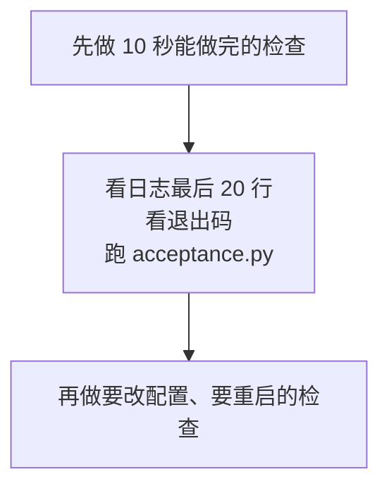
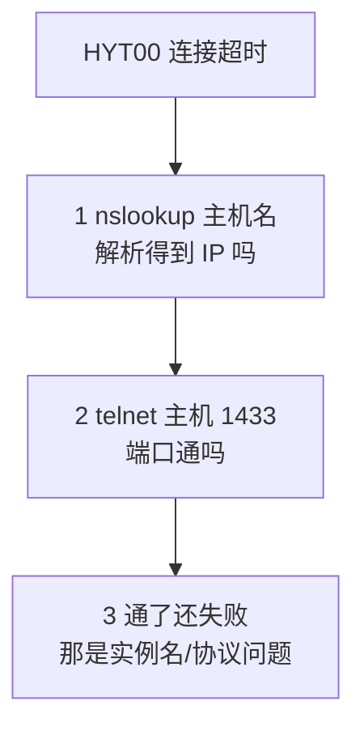
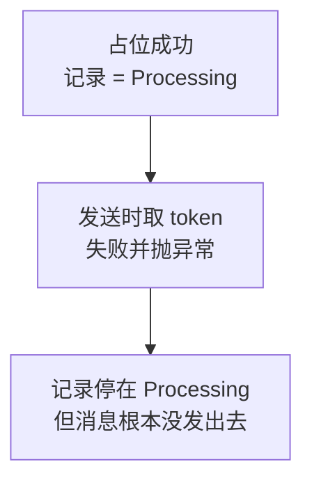
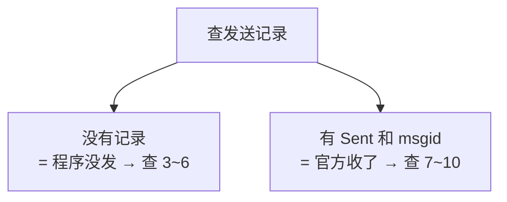
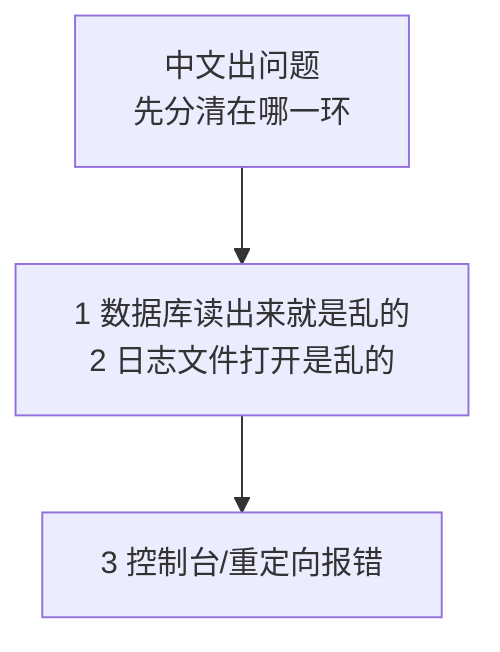
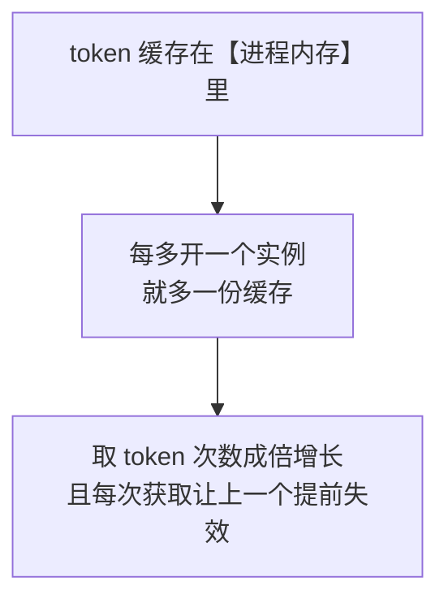
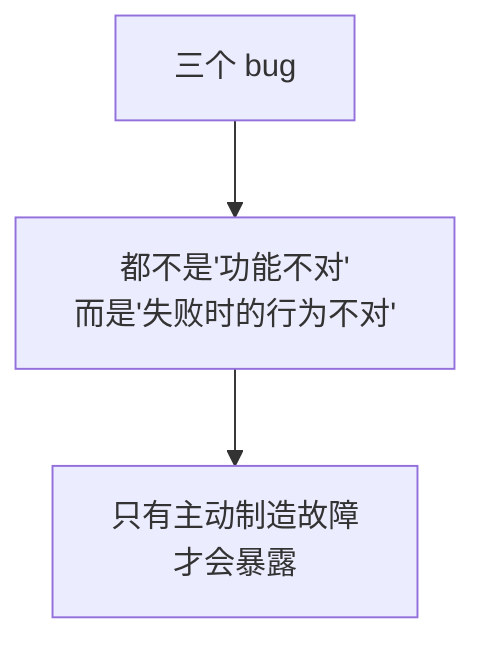

# 第 18 章　常见问题排查

> 前十七章是"怎么把它做对"，本章是"**做错了怎么查**"。
>
> 本章按**现象**组织，不按错误码——因为出事的时候你手上只有现象：同事说没收到、日志没更新、程序不启动。错误码是排查的**结果**，不是入口。
>
> 本章的每一种现象都在沙箱里**真的制造了一遍**（21 项断言），并且抓到了前面章节遗留的**三个 bug**（18.4.2、18.4.3、18.5.3 节）。

---

## 18.0 怎么用这一章

### 18.0.1 现象索引

**先在这张表里找到你看到的现象，再跳到对应小节。**

| 你看到的现象 | 去哪节 |
|---|---|
| 敲了命令，程序立刻退出，什么都没发生 | **18.2** |
| 报数据库连不上（`HYT00` / `01000` / `IM002`…） | **18.3** |
| 取不到 `access_token`（`40001` / `40013`） | **18.4** |
| 接口通了，但 `errcode` 不是 0 | **18.5** |
| 程序说发送成功，同事说没收到 | **18.6** |
| 一部分人收到了，一部分没收到 | **18.7** |
| `logs/wecom.log` 好几天没更新 | **18.8** |
| 到了 9:05，什么都没发生 | **18.9** |
| 同一条消息发了两次 | **18.10** |
| 中文变成问号，或者报 `UnicodeEncodeError` | **18.11** |
| 表里有记录，状态是 `Processing`，一直不变 | **18.12** |
| 报 `45009` 调用超限 | **18.13** |

### 18.0.2 三条排查原则

**① 从最便宜的检查开始。**

排查的顺序应该按"**花多少时间能排除一个可能**"排，而不是按"我觉得哪个可能性大"排：



**② 先用批次号定位，再看单条。**

第 15 章让每条日志都带上了批次号，所以：

```bash
# 先找到"那一次"是哪个批次
grep "任务开始" logs/wecom.log | tail -5

# 再把那一次的全过程调出来（每一行都有它）
grep "20260906-090501" logs/wecom.log
```

**别一上来就 `grep 错误`**——你会看到十几条来自不同天、不同批次的错误，然后开始怀疑不相干的东西。

**③ 一次只改一个变量。**

最常见的排查失败方式是：同时改了 `.env` 里三项、重启了服务、还手工删了两条记录——然后好了。**你不知道是哪一项起了作用**，下次还会遇到。

---

## 18.1 先跑这一个命令

不管什么现象，**第一步都是这个**：

```bash
python acceptance.py          # 第 17 章的验收脚本，只读，不发消息
```

它 10 秒内检查 26 项，能一次排除掉本章一半的可能性：配置、驱动、唯一索引、凭证、死信、卡住的记录、日志泄漏、停发开关、灰度名单。

**如果它全绿，那问题就在"这一次运行"上，而不是环境上**——去看日志（18.0.2 节那两条 `grep`）。

---

## 18.2 现象：程序立刻退出，什么都没发生

### 18.2.1 先看退出码

```bash
python main.py once
echo "退出码：$?"          # Linux
```

| 退出码 | 含义 | 往下看 |
|---|---|---|
| `2` | **配置有问题，根本没启动** | 18.2.2 |
| `1` | 跑了，但有需要人工处理的东西 | 18.5 / 18.12 |
| `0` **且几乎没有日志** | 被单实例锁挡住了 | 18.2.3 |
| `0` 且日志正常 | 程序是对的，问题在别处（18.6） | —— |

### 18.2.2 退出码 2：配置问题的三种

程序会**直接把原因打在屏幕上**（这是全项目唯一允许 `print` 的地方，因为日志还没初始化）：

| 屏幕上的话 | 原因 | 怎么修 |
|---|---|---|
| `缺少必填配置 WECOM_XXX` | `.env` 没读到，**或者**那一项确实空着 | 见下面"最容易误判的一种" |
| `配置 XXX 必须是整数 / true/false` | 值写错了（比如 `TASK_DAILY_HOUR=九点`） | 改成数字 |
| `TASK_DEDUP_STRATEGY 只能是…` | 防重策略写错 | 三选一，别自己造词 |
| `无法初始化日志（目录 …）` | 日志目录不存在或没写权限 | `chown` / `chmod` |

**最容易误判的一种：`.env` 明明就在那里，却报"缺少必填配置"。**

这是第 16 章 16.2 节那个坑：**`.env` 是按"当前工作目录"找的**，而服务器上启动程序的不是你。判定方法一条命令：

```bash
# 从一个别的目录用绝对路径启动，看还报不报
cd /tmp && /opt/wecom-todo/.venv/bin/python /opt/wecom-todo/main.py check
```

**修好后的程序（本教程第 16 章之后的版本）无论从哪个目录启动都能读到 `.env`**，并且启动日志里会同时打出两个目录：

```text
| INFO | - | main:309 | 程序启动，模式=once｜项目目录=/opt/wecom-todo｜当前工作目录=/
```

**两个不一样是正常的**（说明程序不依赖工作目录）；如果"项目目录"那一项不是你以为的地方，说明你启动的是**另一份代码**。

### 18.2.3 退出码 0 但只有两行日志

**实测（另一个进程正持有锁时）：**

```text
main:309 | 程序启动，模式=once｜项目目录=/projects/sandbox/_ch18_build｜当前工作目录=/
main:327 | 已经有一个实例在运行（pid=32）。本次不启动。
```

**这不是故障**，是第 16 章的单实例锁在工作。三种常见触发情形：

| 情形 | 怎么确认 |
|---|---|
| `schedule` 服务正在跑，你又手工敲了 `once` | `systemctl status wecom-todo` |
| 上一次任务还没跑完 | `ps -ef \| grep main.py` |
| 上一次进程卡死了（比如卡在数据库连接上） | 同上，看进程启动时间 |

**实测确认**：这种情况下**不会产生任何发送记录**（一条 `INSERT` 都没发生），所以它不会影响防重、也不会漏发——下一次触发点照常。

---

## 18.3 现象：连不上数据库

### 18.3.1 五种情况的真实 SQLSTATE（实测）

我用真实的 ODBC Driver 18 把五种情况各跑了一遍：

```text
地址不可达（连接超时）      SQLSTATE=HYT00　耗时 3.1 秒
端口没人监听                SQLSTATE=HYT00　耗时 3.0 秒
主机名解析不了              SQLSTATE=HYT00　耗时 3.0 秒
驱动名写错                  SQLSTATE=01000　耗时 0.0 秒
驱动注册了但库文件缺失      SQLSTATE=01000　耗时 0.0 秒
```

**两条重要结论：**

| 结论 | 含义 |
|---|---|
| **前三种都是 `HYT00`** | 错误码**区分不了**"地址错""服务没起""DNS 不通"——必须靠别的手段区分（18.3.4 节） |
| **驱动问题是秒级失败，网络问题要等超时** | 所以"敲下回车立刻报错"和"等了几秒才报错"就是第一个分诊信号 |

程序给出的人话（`describe_pyodbc_error` 的输出）：

```text
[HYT00] 连接超时。三种可能：①服务器地址写错了（192.0.2.1）②SQL Server 没启动或 TCP/IP 协议没开 ③DNS 解析不了这个名字
[01000] 驱动管理器打不开驱动 'ODBC Driver 17 for SQL Server'：名字写错了，或者名字对但驱动库文件没装/被卸载了。用 odbcinst -q -d 看系统里实际注册了哪些驱动
```

### 18.3.2 【实测修正】连接字符串里的超时设置**根本不生效**

这是本章抓到的第一个 bug，而且它藏在第 10 章里。

我们的连接字符串里一直有这一项：

```text
LoginTimeout=10
```

**实测（连一个不可达地址，`LoginTimeout=3`）：**

```text
LoginTimeout=3           → HYT00  耗时 15.1 秒
Login Timeout=3          → HYT00  耗时 15.1 秒
Connect Timeout=3        → HYT00  耗时 15.1 秒
Connection Timeout=3     → HYT00  耗时 15.1 秒
Timeout=3                → HYT00  耗时 15.1 秒
pyodbc.connect(..., timeout=3)  → HYT00  耗时 3.1 秒
```

**五种写在连接字符串里的写法，一个都不生效**（都是驱动默认的 15 秒）；**只有 pyodbc 的 `timeout=` 参数真的管用。**

**后果有多严重？**`DB_LOGIN_TIMEOUT` 这个配置项一直是个装饰。而它不生效意味着：数据库不通时，每次任务要**卡 15 秒**才失败；如果 `schedule` 模式下重试，就是一串 15 秒。

**修法（本章已改）：**

```python
    try:
        # 【第 18 章修正的 bug】超时必须通过 pyodbc 的 timeout 参数传，
        # 写在连接字符串里的 LoginTimeout= 对 ODBC Driver 18 【完全不生效】。
        # 实测：连一个不可达地址，写在连接字符串里 → 15.1 秒才失败（驱动默认值）；
        #       用 timeout=3 参数 → 3.1 秒失败。
        # 五种写法（LoginTimeout / Login Timeout / Connect Timeout /
        # Connection Timeout / Timeout）实测【一个都不生效】，见 18.3.2 节。
        connection = pyodbc.connect(conn_str, timeout=config.login_timeout)
```

**修好后实测：3.1 秒失败。**

> **这个 bug 的教训不是"我写错了一个参数"，而是：配置项写下去之后，要有一次实测确认它真的起作用。**"程序能跑"证明不了"配置生效"——第 15 章 15.3.3 节说过同样的话，这次是它的第二个例子。

### 18.3.3 【实测更正】驱动名写错报的是 `01000`，不是 `IM002`

第 10 章那张表里写着"`IM002` → `DRIVER=` 名字是否对"。**实测发现在 Linux/unixODBC 上不是这样：**

```text
DRIVER={NoSuchDriver};SERVER=127.0.0.1;   → 01000 | [unixODBC][Driver Manager]Can't open lib 'NoSuchDriver' : file not found
DSN=NoSuchDSN;UID=sa;PWD=x;               → IM002 | [unixODBC][Driver Manager]Data source name not found and no default driver specified
```

**准确的说法是：**

| 情况 | Linux / unixODBC（实测） | Windows（依据文档与常见报告） |
|---|---|---|
| `DRIVER={名字}` 写错 | **`01000`**（`Can't open lib`） | 通常 `IM002` |
| `DSN=名字` 不存在 | `IM002` | `IM002` |
| 驱动名对但 `.so` / `.dll` 缺失 | **`01000`** | `IM003` / `01000` |

**两者的排查动作是一样的**，所以第 10 章的结论没错，只是错误码对不上。程序里已经把 `01000` 也翻译成人话了（18.3.1 节那段输出）。

### 18.3.4 排查顺序：三条命令分清 `HYT00` 的三种原因



```bash
# ① DNS：解析不出来 → 主机名写错，或该用 IP
nslookup sqlserver01
# ② 端口：连不上 → 服务没起、防火墙、或端口不是 1433
telnet sqlserver01 1433          # 没有 telnet 就用：nc -zv sqlserver01 1433
# ③ 驱动列表：确认 .env 里的 DB_DRIVER 一字不差
odbcinst -q -d
```

**命名实例要特别注意**：`SERVER=主机\实例名` 依赖 SQL Server Browser 服务（UDP 1434）。**内网防火墙常常只放通了 1433**，于是命名实例连不上而默认实例可以。这时改成 `SERVER=主机,端口` 直连即可绕开。

---

## 18.4 现象：取不到 `access_token`

### 18.4.1 两个错误码，一个后果

| errcode | 含义 | 常见原因 |
|---|---|---|
| `40001` | `invalid credential`（Secret 不对） | 复制时多了空格、Secret 被重置过、用了**别的应用**的 Secret |
| `40013` | `invalid corpid` | CorpID 写错，或把 CorpID 和 AgentId 搞混 |

**实测（把 Secret 改错跑一次）：**

```text
退出码=1　记录状态=（没有记录）
日志：取凭证失败，本次任务中止：取 token 被拒绝 errcode=40001 errmsg=invalid corpsecret
```

**注意"记录状态=（没有记录）"**——这是本章修好的另一个 bug，见 18.4.3 节。

### 18.4.2 ⚠️ `40001` 试几次会被封 IP

第 3 章提过，这里再强调一次，因为它在排查时最容易踩：

> **Secret 错误反复尝试，企业微信会临时封禁你的 IP（约 1 小时）。**

所以**不要**"改一下再跑一下试试"。正确做法：

```bash
# 1. 先确认 .env 里的值和后台完全一致（注意首尾空格、换行）
grep WECOM_APP_SECRET .env | cat -A | head -1     # cat -A 能看出结尾有没有多余空白
# 2. 确认用的是【这个应用】的 Secret（一个企业有多个应用，Secret 各不相同）
# 3. 改完只跑一次自检
python main.py check
```

如果已经被封了：**等一小时**，期间别再试。

### 18.4.3 【本章修的 bug】凭证坏了，为什么表里会留下 `Processing`

**实测（修之前）：**

```text
退出码=1　记录状态=['Processing']
```

**为什么会这样**：任务的顺序是"占位 → 发送"，而取 token 发生在发送里面。于是：



**这条 `Processing` 是误伤**：`Processing` 的语义是"消息**可能**已送达，需要人工确认"（第 12 章），而取 token 失败意味着**请求根本没发出去**——这一点是确定的，不需要任何人来确认。

**两处修改（本章）：**

```python
        except TokenError as e:
            # 取凭证失败是【全局故障】：谁都发不出去。
            #
            # 【第 18 章修正】原来这里直接 raise，把记录留在 Processing。
            # 那是错的：Processing 的语义是"消息可能已经送达，需要人工确认"，
            # 而取 token 失败意味着【请求根本没发出去】—— 这一点是确定的。
            # 所以应该标成 Failed（下次任务自动重试），而不是留给人工。
            #
            # 实测：把 Secret 改错跑一次，原来会在表里留下一条 Processing，
            # 而那条记录既没发出去、也不会自动重试，纯属误伤（18.4.3 节）。
            send_log.mark_failed(connection, key, None, f"取凭证失败：{e}")
            if report:
                report.failed += 1
            raise
```

以及更根本的一处——**在占位之前就先确认凭证可用**：

```python
            # ---------- 第三步：先确认凭证可用，再开始占位 ----------
            # 【第 18 章新增】为什么要"预热"一次？
            #   占位（INSERT）发生在发送之前，如果凭证是坏的，
            #   我们会先占好一批位、然后一条都发不出去。
            #   先取一次 token，坏的话立刻中止 —— 一条记录都不会被占。
            #   token 有缓存（第 8 章），所以这一次调用不会增加额外开销。
            client.get_access_token()
```

**修好后实测：`记录状态=（没有记录）`。**凭证坏了就一条位都不占，表干干净净。

> **这个 bug 的价值在于它揭示了一条通用规则：**
> **"不确定"和"确定没成功"必须分开。**把"确定没发出去"错标成"不确定"，代价是**制造了需要人工处理的工作**——而人工处理是这套系统里最贵的资源。

---

## 18.5 现象：接口通了，但 `errcode` 不是 0

### 18.5.1 先分清三类

程序已经按第 13 章的策略自动处理了，**你要做的是读懂它的处理结果**：

| 类别 | 典型 errcode | 记录状态 | 你要做什么 |
|---|---|---|---|
| **临时故障** | `-1` 系统繁忙、`45009` 超限 | 自动重试；用尽后 `Dead` | 等；频繁出现就查 18.13 |
| **权限/范围问题** | `60011` `60020` `60021` `46004` `81013` | `Failed` | **改配置/权限，下次任务自动补发** |
| **配置/内容错误** | `40056` `44004` `50003` `301002` | `Dead`（一次不重试） | 改对，然后手工补发（18.5.4） |

### 18.5.2 四个最常遇到的

| errcode | 含义 | 真实原因 | 怎么修 |
|---|---|---|---|
| `60020` | 不在可信 IP 内 | 服务器出口 IP 没加进白名单，或**出口 IP 变了** | 后台加 IP；云服务器要加**公网出口 IP**，不是内网 IP |
| `81013` | 全部接收人非法 | **把姓名或手机号当成了 UserID** | 见 18.5.3 |
| `60021` / `46004` | 不在可见范围 / 用户不存在 | 人没加进应用可见范围，或已离职 | 后台加人 |
| `301002` / `40056` | AgentId 与凭证不匹配 / AgentId 无效 | 用了 A 应用的 Secret + B 应用的 AgentId | 两项都从**同一个应用**页面复制 |

**实测（`60020` 和 `81013` 各跑一遍）：**

```text
服务器 IP 不在可信 IP 列表（errcode=60020）
   退出码=0　记录状态=['Failed', 'Failed', 'Failed']
   日志：发送失败：待办提醒/p1/lisi/20260906 本次放弃，等下次任务再试（权限/可见范围问题，管理员改好后下次任务能成功）

把姓名/手机号当成了 UserID（errcode=81013）
   退出码=0　记录状态=['Failed', 'Failed', 'Failed']
```

**注意退出码是 0**：这两种情况**不告警**（第 14 章的设计）——因为管理员改好配置后**下次任务会自动补发**，属于能自愈的问题。**这是刻意的取舍**：如果它们也告警，你每加一个新同事就会收到一次报警。

### 18.5.3 UserID、姓名、手机号：一个经典混淆

这是新手最常犯的错误之一，因为**通讯录界面上显示的是姓名**。

| 你看到的 | 它是什么 | 能不能用来发消息 |
|---|---|---|
| `张三` | 姓名 | ❌ 不能 |
| `13800138000` | 手机号 | ❌ 不能直接用 |
| `zhangsan` / `ZhangSan001` | **UserID**（账号） | ✅ 就是它 |

**怎么找到某人的 UserID**：企业微信管理后台 → 通讯录 → 点开这个人 → 页面上的"账号"字段。

**如果你手上只有手机号**，官方提供了一个接口可以换（第 2 章附录提过）：`/cgi-bin/user/getuserid`（POST 手机号）。但**更好的做法是让业务表直接存 UserID**——第 11 章的表结构就是这么设计的：

```sql
负责人  VARCHAR(64) NOT NULL,   -- 存的是【企业微信 UserID】，不是姓名
```

**为什么这个设计重要**：如果表里存姓名，你就需要一张"姓名→UserID"的映射表，而**重名会让这张表永远不可靠**。

### 18.5.4 死信（`Dead`）怎么补发

```bash
python main.py dead          # 先看清有哪些、为什么
```

修好根因之后，两种补发方式：

```sql
-- 方式一（推荐）：改状态，留下痕迹
UPDATE dbo.企业微信发送记录
SET 状态 = 'Failed', 尝试次数 = 0
WHERE 状态 = 'Dead' AND 最后尝试时间 >= DATEADD(DAY, -1, GETDATE());

-- 方式二：删记录（当消息内容也需要重新生成时）
DELETE FROM dbo.企业微信发送记录
WHERE 状态 = 'Dead' AND 业务编号 = 'p1' AND 接收人 = 'zhangsan';
```

然后 `python main.py once`。**两种都必须带 `WHERE`**。

---

## 18.6 现象：程序说发送成功，同事说没收到

**这是最常见、也最容易查偏的一个现象。**按"排除成本从低到高"排队，逐条往下走：

| # | 检查动作 | 成本 | 如果是这个原因 |
|---|---|---|---|
| 1 | 让他**在企业微信里搜一下应用名**，看历史消息 | 10 秒 | 他没看到 ≠ 没收到（消息可能被折叠、或他关了通知） |
| 2 | 查发送记录：`SELECT * FROM 企业微信发送记录 WHERE 接收人='xxx'` | 20 秒 | 没有记录 → 根本没发（往下 3~6）；有 `Sent` 且有 msgid → 官方已接收（往下 7~9） |
| 3 | 看 `.env` 里 **`TASK_ONLY_TO_USER_IDS`** | 10 秒 | **灰度名单还没清空**——上线第二天最常见 |
| 4 | 看 `logs/PAUSE` 文件在不在 | 5 秒 | 停发开关忘了删 |
| 5 | 看日志里"涉及 N 个负责人"有没有他 | 30 秒 | 他不在名单里 → 查业务表的负责人字段（大小写/空格/写了姓名） |
| 6 | 看日志有没有"跳过（今天已发过）" | 30 秒 | **今天已经发过了**，他没注意到；或者你在测试时已经发过一轮 |
| 7 | 看返回里的 `invaliduser` | 1 分钟 | 他不在应用**可见范围**里（`errcode` 仍是 0！见 18.7） |
| 8 | 后台确认他在**应用可见范围**内 | 2 分钟 | 加进去，下次自动补发 |
| 9 | 确认他**关注了这个应用**、没有屏蔽 | 找他确认 | 让他在企业微信里取消屏蔽 |
| 10 | 后台"应用详情"里看**消息发送记录** | 5 分钟 | 官方侧能看到是否投递 |

### 18.6.1 第 2 步是分水岭



**有 `msgid` 就意味着"企业微信服务器接受了这条消息"**，这时问题几乎一定在接收侧（可见范围、屏蔽、客户端），而不在你的代码里。**把 msgid 提供给管理员**，后台可以据此查投递情况。

### 18.6.2 特别提醒：别急着重发

看到"同事没收到"时，最本能的动作是手工再跑一次——**但如果原因是第 7~9 项（可见范围/屏蔽），重发一万次也没用**，而且会在表里堆一串 `Failed`。

**先定位，再重发。**

---

## 18.7 现象：一部分人收到，一部分没收到

### 18.7.1 `errcode=0` 不代表所有人都收到

这是第 6 章 6.10 节的结论，也是本章要反复强调的一点：

```json
{"errcode": 0, "errmsg": "ok", "msgid": "xxx", "invaliduser": "wangwu"}
```

**`errcode` 是 0，但 `wangwu` 没收到。**官方对"部分接收人非法"的处理就是这样：整体成功，把发不出去的人放在 `invaliduser` 里。

程序已经处理了这种情况（记录标 `Failed`，日志"发送未全部送达"）。**你要做的是看日志里那个名单**：

```bash
grep "发送未全部送达" logs/wecom.log | tail -5
```

### 18.7.2 三种"部分"的区别

| 现象 | 原因 | 记录状态 |
|---|---|---|
| 某些人**从来没**收到 | 不在可见范围 / UserID 错 | `Failed` + `invaliduser` |
| 某人**只收到第 1 页** | 分页发送时中途失败 | `p1`=`Sent`，`p2`=`Failed` |
| 某人**收到了空的/不全的** | 业务数据本身不全（SQL 条件） | `Sent`（程序没错） |

**第二种查法**：

```sql
SELECT 业务编号, 状态, 错误码, 错误说明 FROM dbo.企业微信发送记录
WHERE 接收人 = 'zhangsan' AND 消息版本 = '20260906' ORDER BY 业务编号;
```

看到 `p1=Sent, p2=Failed` 就清楚了：**下次任务会自动补发 `p2`**（第 12 章分页设计的价值——每页是独立记录）。

---

## 18.8 现象：`logs/wecom.log` 好几天没更新

**实测出两种原因，而且它们的表现完全一样（日志文件不动），但性质相反：**

### 18.8.1 原因一：日志写到别处了（程序其实在跑）

```text
[OK] 原因一：LOG_DIR 指到了别处（项目 logs 里什么都没有）
     -> 项目内=False，/tmp/wrong-place=True
```

判定：

```bash
# 1. 看配置里日志目录是哪儿（自检会打出来）
python main.py check | grep 日志
# 2. 全盘找找最近被写过的 wecom.log
find / -name "wecom.log" -mtime -2 2>/dev/null
```

**常见来源**：`.env` 里 `LOG_DIR` 写了相对路径、而启动目录不是项目目录（第 16 章的坑）；或者有人把 `LOG_DIR` 改到了另一个分区。

### 18.8.2 原因二：程序根本没跑

三种子情况，**按检查成本排序**：

```bash
# ① 服务还活着吗
systemctl status wecom-todo            # Linux
# ② 定时任务上次什么时候跑的、结果是什么
systemctl list-timers wecom-todo.timer
#    Windows：任务计划程序 → 上次运行时间 / 上次运行结果
# ③ 是不是每次都被单实例锁挡住了（18.2.3 节那两行日志）
grep "已经有一个实例在运行" logs/wecom.log | tail -5
```

**第 ③ 种最阴**：日志里其实**有**两行（启动 + 被挡住），但因为它每天只加两行，你会以为"日志没更新"。**一个残留的僵死进程会让任务永远被挡住**：

```bash
ps -ef | grep "main.py" | grep -v grep     # 看有没有一个跑了好几天的进程
```

### 18.8.3 判定表

| 观察 | 结论 |
|---|---|
| 日志文件时间戳是几天前，但**文件里最后几行是"被挡住"** | 有僵死进程，杀掉它 |
| 日志文件时间戳是几天前，文件里最后一行是正常的"任务结束" | 程序没被触发（18.9 节） |
| 日志目录里**一个文件都没有** | 日志写到别处了（18.8.1） |
| 有 `wecom-error.log` 但没有 `wecom.log` | 不可能——除非有人手工删了 |

---

## 18.9 现象：到了 9:05，什么都没发生

**按可能性从高到低（这也是实测踩过的顺序）：**

### 18.9.1 时区（最常见）

第 15、16 章各栽过一次。**判定只需看启动日志里那三行：**

```text
| INFO | - | main:162 | 接下来三次触发时刻（用它确认时区没配错）：
| INFO | - | main:164 |   2026-09-06 09:05:00 +0800
| INFO | - | main:164 |   2026-09-07 09:05:00 +0800
| INFO | - | main:164 |   2026-09-08 09:05:00 +0800
```

**如果这里显示的不是你期望的时间，问题就在这儿**，别再往下查了。

**实测过的一个陷阱**：日志时间戳和触发时刻可能差 8 小时——因为**日志用系统时区、触发用 `TASK_TIMEZONE`**（第 16 章 16.12.2 节）。看到 `09:05:00 +0800` 而日志行首是 `01:05` 属于**正常**（服务器是 UTC）。

### 18.9.2 服务没起来 / timer 没启用

```bash
systemctl is-enabled wecom-todo        # 应该是 enabled
systemctl is-active wecom-todo         # 应该是 active
systemctl list-timers wecom-todo.timer # 看 NEXT 那一列
```

**"我 start 了但没 enable"**——于是重启服务器后就再也不跑了。这是运维最常见的一次性错误。

### 18.9.3 错过的那次不会自己补

**实测结论（第 16 章 16.6 节）**：进程重启后，APScheduler **不会**补跑今天早上错过的那次——它只算"下一个未来时刻"。

判定：日志里**没有**那一天的"任务开始"，且启动时间晚于触发时刻。

修法：把 `TASK_CATCH_UP_ON_START=true` 打开（默认就是开的），或者用 systemd timer 的 `Persistent=true`。

### 18.9.4 其他三种

| 原因 | 判定 |
|---|---|
| 今天是节假日表里的日期 | 日志有"今天是节假日，跳过本次提醒" |
| 用的是 `add_weekday_job` 而今天是周末 | 看启动日志里任务名是"工作日 …" |
| 被单实例锁挡住 | 18.2.3 节 |

---

## 18.10 现象：同一条消息发了两次

**这是最需要认真对待的现象**——它会直接导致同事屏蔽这个应用。四种原因，**按真实发生频率排序**：

### 18.10.1 原因一：唯一索引不存在（最严重）

```bash
python acceptance.py | grep 唯一索引
```

**实测（索引被删掉时）：**

```text
[失败] 唯一索引存在　→ 【严重】找不到 UX_企业微信发送记录_业务唯一键。防重复完全失效，两个进程同时跑就会重复发送。请执行 sql/02_send_log.sql 里建索引那一段
[失败] 重复业务键实测　→ 已经有 1 组重复键——说明唯一索引确实没生效过
```

**为什么会缺失**：执行 `sql/02_send_log.sql` 时只跑了建表那一段。**而单进程测试时发现不了**——所以第 17 章把它列为最关键的验收项。

### 18.10.2 原因二：防重策略被改成了"内容变化即重发"

**实测：**

```text
默认策略「每人每天一条」→ 当天新增待办不会再发     发送记录 Sent 3 → 3
改成「内容变化即重发」→ zhangsan 当天收到第二条    zhangsan 的记录 2 条
两条记录的【消息版本】不同：['20260906-153a5aaa2cd728da', '20260906-2c96b4ff56959424']
```

**这不是 bug，是配置的后果**：`TASK_DEDUP_STRATEGY=内容变化即重发` 的语义就是"待办集合一变就再发一条"。判定方法：

```sql
-- 消息版本里带了 16 位哈希 = 用的是"内容变化即重发"
SELECT DISTINCT 消息版本 FROM dbo.企业微信发送记录 WHERE 接收人 = 'zhangsan';
-- '20260906'                      → 每人每天一条
-- '20260906-153a5aaa2cd728da'     → 内容变化即重发
```

**版本号的形状直接告诉你用的是哪种策略**——这是第 12 章那个设计的一个意外好处。

### 18.10.3 原因三：人为的重复

| 情形 | 判定 |
|---|---|
| 有人手工跑了 `once`，而定时也跑了 | 日志里有两个批次号，间隔不是 24 小时 |
| 改了 `TASK_BUSINESS_TYPE`（比如从"待办提醒"改成"每日待办"） | 业务类型变了 = 新的唯一键 = 会再发一次 |
| 删过发送记录 | 没有痕迹可查——所以第 12 章说"失败也留记录，别删" |

### 18.10.4 原因四：误解了官方的短时防重

`enable_duplicate_check` 只在**很短的时间窗**内（默认 30 分钟、上限 4 小时）挡住**完全相同内容**的重复提交。它**不是**业务防重：

| 机制 | 时间范围 | 判断依据 |
|---|---|---|
| 官方 `enable_duplicate_check` | ≤ 4 小时 | **消息内容完全一样** |
| 我们的发送记录 + 唯一索引 | **永久 / 按天** | **业务唯一键** |

**内容差一个字，官方那层就挡不住了**（比如"已逾期 3 天"变成"已逾期 4 天"）。所以第 12 章两层都要。

---

## 18.11 现象：中文乱码或 `UnicodeEncodeError`

### 18.11.1 三处可能出错的编码



| 环节 | 症状 | 原因与修法 |
|---|---|---|
| 数据库 | 查出来就是 `???` | 列类型是 `VARCHAR` 而不是 `NVARCHAR`；插入时没加 `N''` 前缀 |
| 日志文件 | 用记事本/Excel 打开是乱码 | 文件是 **UTF-8**，用 GBK 打开当然乱（18.11.2） |
| 控制台/重定向 | **`UnicodeEncodeError`** | 输出编码不是 UTF-8（18.11.3） |

### 18.11.2 日志文件是 UTF-8：用 GBK 打开会变成这样

**实测同一行日志的两种读法：**

```text
UTF-8 正确读出：2026-09-06 05:26:31 | INFO | 20260906-052631 | tasks:163 | ===== 任务开始（批次 2026…
用 GBK 读出：　 2026-09-06 05:26:31 | INFO | 20260906-052631 | tasks:163 | ===== 浠诲姟寮�濮嬶紙鎵规��…
```

**"浠诲姟"这种"看起来像日文/生僻字"的乱码，几乎总是 UTF-8 被当 GBK 读了。**

修法：用支持编码选择的编辑器（VS Code、Notepad++）指定 UTF-8 打开；Windows 记事本较新版本会自动识别。**不要**为了迁就记事本把日志改成 GBK——第 14 章特意写了 `encoding="utf-8"`，因为它是跨平台唯一稳的选择。

### 18.11.3 `UnicodeEncodeError` 实测

**实测（把输出编码强制成 ascii，模拟 Windows 上 cp936 遇到生僻字、或重定向到文件时的场景）：**

```text
UnicodeEncodeError: 'ascii' codec can't encode characters in position 8-13: ordinal not in range(128)
```

**注意这个错误来自 logging 内部**——它会打印 `--- Logging error ---` 然后继续跑，**所以程序不一定崩，但那几条日志丢了**。

修法（按推荐顺序）：

```bash
# ① 给进程指定输出编码（最通用）
PYTHONUTF8=1 python main.py once
# 或
PYTHONIOENCODING=utf-8 python main.py once

# ② Windows 上让控制台用 UTF-8 代码页
chcp 65001

# ③ systemd 里给服务加环境变量
Environment=PYTHONUTF8=1
```

**为什么日志文件不受影响**：因为第 14 章给 `FileHandler` 显式写了 `encoding="utf-8"`。**出问题的只有控制台那个 handler**——它跟随系统编码。

---

## 18.12 现象：状态一直是 `Processing`

### 18.12.1 它的含义：不知道

`Processing` 意味着"**占了位，但没写回结果**"——消息到底发出去没有，**程序不知道**。三种成因：

| 成因 | 典型场景 |
|---|---|
| 进程被强杀 | `kill -9`、断电、OOM（第 16 章实测过） |
| 读取超时 | 请求发出了但没等到回复（第 13 章：**故意**不改状态） |
| 程序卡在发送里 | 网络挂着不返回，且没有超时保护 |

**修完 18.4.3 节那个 bug 之后，"取凭证失败"不再产生 `Processing`**——这减少了一类误伤。

### 18.12.2 怎么收尾（唯一需要人判断的地方）

```bash
python main.py dead            # 会列出卡了 30 分钟以上的记录
```

对每一条，**先确认消息到底送到没有**：

| 判断依据 | 结论 |
|---|---|
| 记录里有 `消息编号`（msgid） | 已经发出去了 → 改成 `Sent` |
| 没有 msgid，且**问过收件人说没收到** | 没发出去 → 改成 `Failed`（下次自动补发） |
| 没有 msgid，但收件人说收到了 | 已送达 → 改成 `Sent`，别重发 |

```sql
-- 确认没发出去 → 让它下次重试
UPDATE dbo.企业微信发送记录 SET 状态 = 'Failed', 错误说明 = N'人工确认未送达'
WHERE 状态 = 'Processing' AND 接收人 = 'zhangsan' AND 消息版本 = '20260906';

-- 确认已送达 → 认定成功，避免重发
UPDATE dbo.企业微信发送记录 SET 状态 = 'Sent', 错误说明 = N'人工确认已送达'
WHERE 状态 = 'Processing' AND 接收人 = 'lisi' AND 消息版本 = '20260906';
```

**在错误说明里写清"人工确认"**——半年后你会感谢自己。

### 18.12.3 怎么减少这类记录

| 做法 | 效果 |
|---|---|
| 用 `systemctl stop`，不用 `kill -9` | 第 16 章：优雅停止会等任务做完 |
| 升级前先 `touch logs/PAUSE` | 停发状态下不占位，没有可被打断的东西 |
| 别把 `WECOM_TIMEOUT_SECONDS` 设得太长 | 超时太长 = 卡住的窗口更长 |

---

## 18.13 现象：`45009` 调用超限

### 18.13.1 先看是哪一类超限

企业微信的频率限制分接口维度和企业维度。**排查方向不是"降低发送量"，而是先确认有没有异常的重复调用。**

**实测（三个进程各自跑一次自检）：**

```text
[OK] 3 个进程各取了一次 token（缓存在进程内存里，不共享）  -> gettoken 被调用 3 次
```

**这一条实测解释了大部分 `45009`**：



### 18.13.2 五个检查点

| 检查 | 命令 / 方法 |
|---|---|
| 是不是同时跑了多个实例 | `ps -ef \| grep main.py`；**单实例锁应该已经挡住了**（第 16 章） |
| 是不是在反复重启服务 | `journalctl -u wecom-todo \| grep 程序启动 \| tail -20` |
| token 缓存有没有生效 | 日志里一次任务应该只有一次取 token（第 15 章实测：1 次） |
| 有没有别的程序在用同一个应用 | 后台看应用的调用量；**同一个 Secret 被两个系统用**是常见原因 |
| 是不是收件人特别多 | 第 6 章的分批发送（`send_text_batched`） |

### 18.13.3 程序已经做了什么

`45009` 属于第 13 章的 `THROTTLE_ERRCODES`：**等 90 秒再试**（不是指数退避的几秒）。所以偶发的 `45009` 程序自己能扛过去，日志里能看到：

```text
发送失败：… 第 1 次失败，等待 90.0 秒后重试（接口调用超限，必须等更久）
```

**如果频繁出现**，说明是结构性问题（多实例、多系统共用凭证），去查 18.13.2。

---

## 18.14 排查工具箱

**把这些命令存成一个便签，出事时按顺序敲。**

```bash
# ---------- 第一梯队：10 秒内 ----------
python acceptance.py                          # 26 项自检（第 17 章）
tail -40 logs/wecom.log                       # 最近发生了什么
tail -20 logs/wecom-error.log                 # 只看警告和错误
ls -l logs/ALERT.txt                          # 存在即异常
echo $?                                       # 上一条命令的退出码

# ---------- 第二梯队：定位到"哪一次" ----------
grep "任务开始" logs/wecom.log | tail -5      # 最近几次执行
grep "20260906-090501" logs/wecom.log         # 一个批次的完整过程
grep -c "跳过（今天已发过）" logs/wecom.log    # 防重跳过了多少条

# ---------- 第三梯队：数据库 ----------
python main.py dead                           # 死信 + 卡住的记录
odbcinst -q -d                                # 系统装了哪些 ODBC 驱动
nslookup 数据库主机名 && nc -zv 主机名 1433    # DNS + 端口

# ---------- 第四梯队：服务与进程 ----------
systemctl status wecom-todo                   # 服务活着吗
systemctl list-timers wecom-todo.timer        # 下次什么时候跑
journalctl -u wecom-todo --since "today"      # 今天的服务日志
ps -ef | grep main.py | grep -v grep          # 有没有僵死进程
```

配套 SQL：

```sql
-- 某人今天的发送情况
SELECT 业务编号, 状态, 尝试次数, 消息编号, 错误码, 错误说明, 最后尝试时间
FROM dbo.企业微信发送记录
WHERE 接收人 = 'zhangsan' AND 消息版本 LIKE CONVERT(VARCHAR(8), GETDATE(), 112) + '%'
ORDER BY 业务编号;

-- 最近 7 天各状态数量（运维仪表盘）
SELECT 状态, COUNT(*) AS 数量 FROM dbo.企业微信发送记录
WHERE 最后尝试时间 >= DATEADD(DAY, -7, GETDATE()) GROUP BY 状态;

-- 卡住的记录
SELECT * FROM dbo.企业微信发送记录
WHERE 状态 = 'Processing' AND 最后尝试时间 < DATEADD(MINUTE, -30, GETDATE());

-- 唯一索引到底在不在
SELECT name, is_unique FROM sys.indexes
WHERE object_id = OBJECT_ID('dbo.企业微信发送记录');
```

---

## 18.15 本章改动清单

**本章修了三个 bug，都是"制造故障"时才暴露的。**

| # | 文件 | 问题 | 修法 |
|---|---|---|---|
| 1 | `database.py` | 连接字符串里的 `LoginTimeout` **完全不生效**（实测 15.1 秒 vs 期望 3 秒） | 改用 `pyodbc.connect(..., timeout=)` |
| 2 | `database.py` | `01000` 被归为"未归类的数据库错误" | 补上人话：驱动名写错或驱动库缺失，并提示 `odbcinst -q -d` |
| 3 | `sender.py` + `tasks.py` | 取凭证失败会留下一条 `Processing`（误伤：明明确定没发出去） | `TokenError` 时标 `Failed`；并在占位前**预热凭证** |

**另外更正了第 10 章的一处说法**：在 Linux/unixODBC 上驱动名写错报 `01000` 而不是 `IM002`（18.3.3 节，含两个平台的对照）。

### 18.15.1 三个 bug 的共同点



| Bug | 正常路径上看得见吗 |
|---|---|
| 超时设置不生效 | ❌ 数据库通的时候完全看不出来 |
| `01000` 没有人话 | ❌ 驱动装对了就永远看不到 |
| `TokenError` 留 `Processing` | ❌ 凭证对的时候不会发生 |

**这正是第 17 章那条原则的价值：没见过它失败的样子，就不算验收过。**

---

## 18.16 本章完成标志

- [ ] 你能不看文档，说出**退出码 0/1/2** 分别意味着什么
- [ ] 你知道"同事没收到"时**第 2 步查什么**（发送记录），以及它为什么是分水岭
- [ ] 你能从**消息版本的形状**看出用的是哪种防重策略
- [ ] 你知道 `HYT00` **区分不了**三种原因，要用 `nslookup` / `nc` 去分
- [ ] 你知道 `Processing` 的含义是"不知道"，以及收尾时**先问收件人**
- [ ] 你亲手制造过 18.4（凭证错）、18.5（错误码）、18.10（重复）三类故障
- [ ] 18.14 节的工具箱命令你存下来了

### 本章完成标志

> 出问题时，你的第一反应是**跑 `acceptance.py` 然后 grep 批次号**，而不是打开代码开始读。

---

## 18.17 本章小结

### 18.17.1 本章必须带走的 10 条结论

1. **按现象查，不按错误码查**——出事时你手上只有现象。
2. **排查顺序按"排除成本"排**，不按"我觉得哪个可能性大"排。
3. **`HYT00` 区分不了地址错/服务没起/DNS 不通**，必须靠 `nslookup` + `nc`。
4. **配置项写下去要实测确认它真的生效**（`LoginTimeout` 就是个反例）。
5. **`errcode=0` 不代表所有人都收到**，要看 `invaliduser`。
6. **"没收到"的分水岭是有没有 msgid**：有 msgid → 查接收侧；没有 → 查发送侧。
7. **`Failed` 不告警是刻意的**——它下次会自动补发，能自愈的别惊动人。
8. **消息版本的形状能告诉你防重策略**（纯日期 vs 日期+哈希）。
9. **"确定没发出去"绝不能标成 `Processing`**，否则是在制造人工工作量。
10. **UTF-8 日志用 GBK 打开的乱码有固定形状**（"浠诲姟"这类），见到就知道是编码问题。

### 18.17.2 自测题

1. 退出码 0 但日志只有两行，最可能是什么？（18.2.3）
2. 连接数据库时"立刻报错"和"等几秒才报错"分别指向什么？（18.3.1）
3. 为什么 `DB_LOGIN_TIMEOUT` 以前是个装饰？（18.3.2）
4. Linux 上驱动名写错报什么码？Windows 呢？（18.3.3）
5. Secret 错了为什么**不能**"改一下试一下"？（18.4.2）
6. 取凭证失败为什么不该留下 `Processing`？（18.4.3）
7. "同事没收到"的排查里，第 2 步是什么？为什么它是分水岭？（18.6.1）
8. 怎么从数据库里看出用的是哪种防重策略？（18.10.2）
9. 官方短时防重挡不住什么？（18.10.4）
10. 一次任务应该取几次 token？多开一个实例会怎样？（18.13.1）

### 18.17.3 十八章的排查地图

| 现象 | 相关章节 |
|---|---|
| 配置读不到 | 第 5、16 章 |
| 连不上库 | 第 10、18 章 |
| 取不到凭证 | 第 3、8、18 章 |
| 错误码处理 | 第 13 章 |
| 没收到 / 部分没收到 | 第 6、11 章 |
| 日志问题 | 第 14、16 章 |
| 定时不跑 | 第 9、16 章 |
| 重复发送 | 第 12、17 章 |
| 编码问题 | 第 7、14 章 |
| `Processing` 收尾 | 第 12、13、16 章 |

### 18.17.4 下一章预告

正文到这里已经完整了：**原理 → 最小示例 → 工程化 → 业务化 → 稳定运行 → 整合 → 部署 → 验收 → 排查**。

接下来是**附录 A~G 速查手册**（术语、API、JSON 模板、返回码、SQL 脚本、配置模板、学习版→生产版对照），以及补写**第 0 章**（开始之前：这个程序要做什么、为什么选自建应用而不是群机器人）。

---

## 参考的官方文档

1. [企业微信开发者中心：全局错误码](https://developer.work.weixin.qq.com/document/path/90313) —— 本章所有 errcode 的权威含义
2. [企业微信开发者中心：获取 access_token](https://developer.work.weixin.qq.com/document/path/91039) —— `40001` / `40013` 与频率限制
3. [企业微信开发者中心：发送应用消息](https://developer.work.weixin.qq.com/document/path/90236) —— `invaliduser` 的语义、`enable_duplicate_check` 的范围
4. [企业微信开发者中心：通过手机号获取 userid](https://developer.work.weixin.qq.com/document/path/95402) —— 18.5.3 节手机号换 UserID
5. [Microsoft Learn：ODBC Driver for SQL Server 连接字符串关键字](https://learn.microsoft.com/sql/connect/odbc/dsn-connection-string-attribute) —— 连接字符串各关键字
6. [pyodbc Wiki：connect 函数与 timeout 参数](https://github.com/mkleehammer/pyodbc/wiki/The-pyodbc-Module) —— 18.3.2 节修法的依据
7. [Microsoft Learn：ODBC 诊断与 SQLSTATE](https://learn.microsoft.com/sql/odbc/reference/develop-app/diagnostics) —— SQLSTATE 的分类
8. [Python 官方文档：PYTHONUTF8 与 PYTHONIOENCODING](https://docs.python.org/3/using/cmdline.html#envvar-PYTHONUTF8) —— 18.11.3 节修法

> 本章的五种数据库连接失败（真实 ODBC Driver 18 + unixODBC 实测 SQLSTATE 与耗时）、超时参数五种写法的失效对比、`01000` 与 `IM002` 的区别、四种企业微信错误码的程序表现（`40001` / `40013` / `60020` / `81013`）、"日志没更新"的两种原因、防重策略导致的当天重发、`UnicodeEncodeError` 与 UTF-8/GBK 乱码、多进程各自取 token，均在 Amazon Linux 2023 + Python 3.9.25 + msodbcsql18-18.6.2.1 环境中实际运行验证，共 **21 项断言全部通过**；修改后重跑第 16、17 章的三套测试（44 + 35 + 11 项）全部通过。文中标注"实测"的输出均为真实运行结果。Windows 平台的错误码差异、企业微信侧的投递查询依据上述官方文档，**未在本环境运行**。
