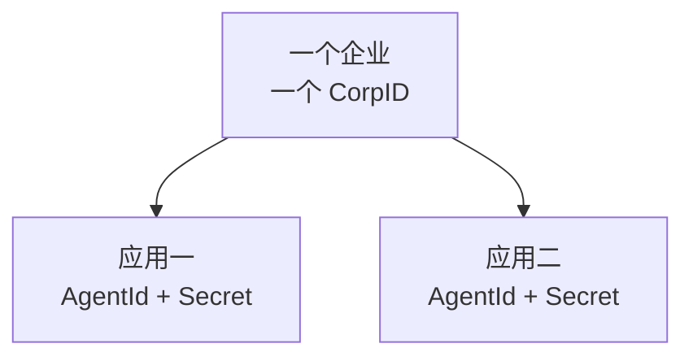
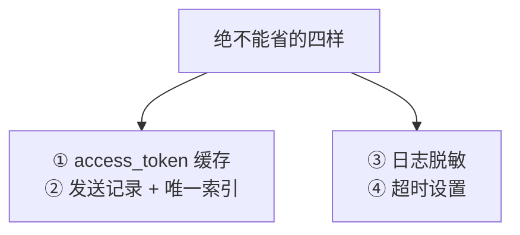

# 附录　速查手册（A~G）

> 这份附录是给**已经读过正文、现在在动手**的人用的：查一个字段名、抄一段 JSON、复制一遍建表脚本、核对一个返回码。
>
> **七个附录合成一个文件**，因为速查场景下 `Ctrl+F` 一次搜完，比在七个小文件之间跳快得多。
>
> 写这份附录时我重新逐条核对了官方文档，**发现了代码里的一处遗漏**（`unlicenseduser` 字段）和**一个没实现的能力**（撤回消息），两者都已补上——见附录 B 末尾。

---

## 目录

| 附录 | 内容 | 什么时候翻 |
|---|---|---|
| **A** | 关键术语速查 | 分不清 CorpID / AgentId / UserID 时 |
| **B** | 常用 API 速查（5 个接口 + 频率限制） | 要调一个新接口时 |
| **C** | 消息 JSON 模板（6 种，实测生成） | 要发一种没试过的消息类型时 |
| **D** | 返回码与排查顺序 | 拿到一个 errcode 时 |
| **E** | SQL Server 脚本（建表 / 索引 / 示例数据 / 清理） | 部署到新环境时 |
| **F** | 配置模板（`.env.example` / `.gitignore` / `requirements.txt`） | 新环境配置时 |
| **G** | 从学习版到生产版的功能对照 | 判断"我需要做到哪一步"时 |

---

# 附录 A　关键术语速查

## A.1 七个必须分清的名词

| 术语 | 是什么 | 长什么样 | 在哪里找 |
|---|---|---|---|
| **CorpID** | **企业**的唯一标识，一个企业只有一个 | `ww` 开头的一串字符 | 管理后台 → 我的企业 → 企业信息（页面最下方） |
| **Secret** | **应用**的凭证密钥，**等同密码** | 一长串随机字符 | 应用管理 → 自建 → 你的应用 → Secret（点"查看"会发到企业微信上） |
| **AgentId** | **应用**的 ID | 纯数字，如 `1000002` | 和 Secret 同一个页面 |
| **UserID** | **成员**的账号 | `zhangsan` / `ZhangSan001`，1~64 字节 | 通讯录 → 点开某人 → "账号"字段 |
| **access_token** | 调接口的临时凭证 | 一长串，**最长 512 字节** | 用 CorpID + Secret 换（附录 B.1） |
| **media_id** | 上传素材后拿到的标识 | 一长串，**只有 3 天有效** | 上传临时素材接口返回 |
| **msgid** | 一条已发消息的 ID | 一长串 | 发送接口返回；**24 小时内可用它撤回** |

## A.2 最容易混淆的三组

### A.2.1 CorpID / AgentId / Secret



| 错误组合 | 报什么 |
|---|---|
| CorpID 写错 | `40013` invalid corpid |
| Secret 写错 | `40001` invalid credential（**试多次会封 IP 1 小时**） |
| A 应用的 Secret + B 应用的 AgentId | `301002` / `40056` |

> **每个应用的 access_token 是彼此独立的**（官方原文）。所以缓存 token 时要按应用区分——这也是第 8 章把缓存放在 `WeComClient` 实例里的原因。

### A.2.2 UserID / 姓名 / 手机号

| 你看到的 | 能用来发消息吗 |
|---|---|
| `张三`（姓名） | ❌ |
| `13800138000`（手机号） | ❌ 要先换成 UserID（附录 B.5） |
| `zhangsan`（UserID） | ✅ |

**官方明确：返回包中的 userid 不区分大小写、统一转为小写。**这就是本教程从第 6 章起坚持"UserID 一律转小写"的依据——不是洁癖，是和官方行为对齐。

### A.2.3 可见范围 / 可信 IP / 基础接口许可

**三个都会导致"发不出去"，但完全不是一回事：**

| 概念 | 管什么 | 配在哪 | 不满足时 |
|---|---|---|---|
| **应用可见范围** | 这个应用能给**谁**发 | 应用设置 → 可见范围 | `60011` / `60021` / `invaliduser` |
| **企业可信 IP** | 允许**哪台服务器**调接口 | 应用设置 → 企业可信 IP | `60020` |
| **基础接口许可** | 这个成员有没有**账号许可** | 管理后台 → 应用管理/许可 | `errcode=0` 但在 `unlicenseduser` 里 |

> **第三行是本次核对官方文档时才补上的**（附录 B.6）。它最阴险：**接口返回成功**，人却收不到。

## A.3 部门 ID 与标签 ID

| | 形态 | 在哪找 | 上限 |
|---|---|---|---|
| 部门 ID（`toparty`） | 整数 | 通讯录 → 部门 → 右侧详情 | 一次最多 **100 个** |
| 标签 ID（`totag`） | 整数 | 通讯录 → 标签 | 一次最多 **100 个** |
| 成员（`touser`） | UserID | 见 A.1 | 一次最多 **1000 个** |

**`touser` 指定为 `@all` 时，`toparty` 和 `totag` 会被忽略**（官方原文）——第 6 章实测过这个行为。

---

# 附录 B　常用 API 速查

> 本附录的字段与限制**逐条核对过官方文档**（文末列出页面）。标注"官方原文"的是直接摘录的要点。

## B.1 获取 access_token

```text
GET https://qyapi.weixin.qq.com/cgi-bin/gettoken?corpid=ID&corpsecret=SECRET
```

| 项 | 值 |
|---|---|
| 返回 | `{"errcode":0,"errmsg":"ok","access_token":"...","expires_in":7200}` |
| 有效期 | 正常 7200 秒（2 小时），**以返回的 `expires_in` 为准** |
| 长度 | access_token **最长 512 字节**，数据库字段要留够 |
| 官方原文要点 | ① **不能频繁调用**，否则会受到频率拦截　② 每个应用的 token **彼此独立**，缓存要按应用区分　③ **企业微信可能出于运营需要提前使 token 失效**，程序必须实现"失效后重新获取" |

> 第 8 章的 `TokenCache`（缓存 + 提前量 + `40014/42001` 时强制刷新）正是对应上面三条。**第三条是很多人漏掉的**：token 没到期也可能失效。

## B.2 发送应用消息

```text
POST https://qyapi.weixin.qq.com/cgi-bin/message/send?access_token=ACCESS_TOKEN
```

**收件人字段（三者不能同时为空）：**

| 字段 | 内容 | 上限 |
|---|---|---|
| `touser` | UserID，多个用 `|` 分隔 | 1000 个；`@all` 表示全员 |
| `toparty` | 部门 ID | 100 个 |
| `totag` | 标签 ID | 100 个 |

**通用可选字段：**

| 字段 | 含义 |
|---|---|
| `agentid` | **必填**，应用 ID（整型） |
| `safe` | `1` = 保密消息（不能转发、显示水印），默认 `0` |
| `enable_id_trans` | `1` = 把 userid/部门 id 转成名字显示 |
| `enable_duplicate_check` | `1` = 开启官方短时防重 |
| `duplicate_check_interval` | 防重时间窗，默认 1800 秒，**最大 4 小时** |

**返回字段（重点）：**

```json
{
  "errcode": 0, "errmsg": "ok",
  "invaliduser": "userid1|userid2",
  "invalidparty": "partyid1",
  "invalidtag": "tagid1",
  "unlicenseduser": "userid3|userid4",
  "msgid": "xxxx",
  "response_code": "xyzxyz"
}
```

| 字段 | 含义 | 我们怎么处理 |
|---|---|---|
| `invaliduser` | 不合法/不存在/不在可见范围 | 记 `Failed`，下次任务重试 |
| `unlicenseduser` | **在可见范围内但没有基础接口许可** | 同上（**本次新增**，见 B.6） |
| `msgid` | 消息 ID | 存进发送记录表，可用于撤回和排查 |

**官方原文的两条限制（很重要）：**

> ① **每应用不可超过账号上限数 × 200 人次/天**（发给 1000 人算 1000 人次）
> ② **每应用对同一个成员不可超过 30 次/分钟、1000 次/小时，超过部分会被丢弃不下发**

**第②条值得记住**：超限的消息是**被丢弃**，不是排队——所以"给同一个人循环发送"这种写法很危险。

> 官方还有一条建议，和第 9 章的结论完全一致：
> **"大部分企业应用在每小时的 0 分或 30 分触发推送消息，容易造成资源挤占……建议尽量避开这两个时间点。"**
> 这就是本教程默认时间是 **9:05** 而不是 9:00 的官方依据。

**如果全部接收人都无权限或不存在**，本次调用返回失败，`errcode=81013`。

## B.3 撤回应用消息

```text
POST https://qyapi.weixin.qq.com/cgi-bin/message/recall?access_token=ACCESS_TOKEN
包体：{"msgid": "发送时返回的 msgid"}
```

| 项 | 说明 |
|---|---|
| 时限 | **24 小时内** |
| 范围 | **只撤企业微信端**，微信插件端撤不掉 |
| 前提 | 手上要有 `msgid` —— 这是第 12 章坚持把 msgid 存进发送记录表的又一个理由 |

**本次已在项目里实现（`wecom_client.recall()`）：**

```python
    def recall(self, msgid: str) -> None:
        """
        撤回一条已发出的应用消息（附录 B 新增）。

        官方限制（依据官方文档）：
            - 只能撤回【24 小时内】通过发送应用消息接口推的消息
            - 只撤回企业微信端，微信插件端撤不掉

        什么时候用得上：内容发错了、发给了不该发的人。
        用法：msgid 就是发送记录表里那个"消息编号"字段 ——
             这也是第 12 章坚持把 msgid 存下来的又一个理由。
        """
        if not msgid:
            raise InvalidRequestError("撤回消息必须提供 msgid")
        token = self.get_access_token()
        try:
            response = self.session.post(
                RECALL_URL, params={"access_token": token},
                json={"msgid": msgid}, timeout=self.timeout,
            )
            response.raise_for_status()
            data = response.json()
        except requests.RequestException as error:
            raise WeComError(f"撤回消息时网络异常：{type(error).__name__}") from error
        if data.get("errcode", 0) != 0:
            raise SendMessageError(data.get("errcode", -1), data.get("errmsg", ""))
        logger.warning("已撤回消息 msgid=%s", msgid[:16])
```

**发错内容时的应急流程：**

```sql
-- 1. 找出刚才发出去的 msgid
SELECT 接收人, 消息编号, 最后尝试时间 FROM dbo.企业微信发送记录
WHERE 状态 = 'Sent' AND 最后尝试时间 >= DATEADD(MINUTE, -30, GETDATE());
```

```python
# 2. 逐个撤回（24 小时内有效）
for msgid in ["...", "..."]:
    client.recall(msgid)
```

## B.4 上传临时素材

```text
POST https://qyapi.weixin.qq.com/cgi-bin/media/upload?access_token=ACCESS_TOKEN&type=TYPE
用 multipart/form-data 上传，文件字段名固定为 media
```

| type | 大小上限 | 格式 | 备注 |
|---|---|---|---|
| `image` | 10 MB | JPG、PNG | —— |
| `voice` | 2 MB | **仅 AMR** | 播放长度 ≤ 60 秒 |
| `video` | 10 MB | MP4 | —— |
| `file` | 20 MB | 不限 | 保密消息只支持部分格式（见 B.2 的 `safe`） |

**官方原文的三条：**

> ① **所有文件 size 必须大于 5 个字节**（空文件会被拒）
> ② `media_id` **仅三天内有效**
> ③ `media_id` **在同一企业内的应用之间可以共享**

**`filename` 决定了收件人看到的文件名**——所以上传时别用 `tmp123.xlsx` 这种临时名。

## B.5 通过手机号获取 UserID

```text
POST https://qyapi.weixin.qq.com/cgi-bin/user/getuserid?access_token=ACCESS_TOKEN
包体：{"mobile": "13430388888"}
返回：{"errcode":0,"errmsg":"ok","userid":"zhangsan"}
```

| 项 | 说明 |
|---|---|
| 权限 | 应用须拥有该成员的查看权限 |
| 手机号长度 | 5~32 字节 |
| ⚠️ **官方警告** | **若出错次数超出企业人数上限的 20%，会导致 1 天不可调用** |

**那条警告意味着：不要拿这个接口去"试"手机号。**如果你有一批手机号要转换，先确认它们都在通讯录里；更好的做法是**让业务表直接存 UserID**（第 11 章的表设计）。

## B.6 本次核对官方文档带来的两处代码改动

**这是写附录时的真实产出**——逐字核对官方返回字段，发现代码漏了一个：

### B.6.1 漏解析 `unlicenseduser`

**官方原文**：`unlicenseduser` 是"没有基础接口许可(包含已过期)的 userid"，**返回时 `errcode` 仍然是 0**。

而我们的 `SendResult` 只解析了 `invaliduser` / `invalidparty` / `invalidtag`——于是这种情况会被判成"全部送达"。

**改动：**

```python
    # 【附录 B 核对官方文档时发现的遗漏】
    # unlicenseduser：这些人【在应用可见范围内，但没有基础接口许可】。
    # 官方对这种情况同样返回 errcode=0，只是把人放在这个字段里 ——
    # 也就是说：不解析它，就会把"没许可导致没收到"误判成"发送成功"。
    # 这正是第 6 章 6.10 节那条结论（errcode=0 不等于都收到了）的第二个例子。
    unlicensed_users: list = field(default_factory=list)
```

`all_delivered()` 也跟着改：

```python
        return not (self.invalid_users or self.invalid_parties
                    or self.invalid_tags or self.unlicensed_users)
```

**实测（让假服务器返回 `unlicenseduser`）：**

```text
sender:72 | 发送未全部送达：待办提醒/p1/lisi/20260906 部分失败 msgid=MOCK_MSGID_2 无接口许可=['wangwu']
记录状态：[('lisi','Failed'), ('wangwu','Failed'), ('zhangsan','Failed')]
```

**顺带修了记录里的原因文字**：原来无论哪种情况都写"部分接收人非法：[]"（空列表，因为人在 `unlicenseduser` 里），现在会区分：

```text
无接口许可 → "部分失败 msgid=MOCK_MSGID_2 无接口许可=['wangwu']"
非法用户   → "部分失败 msgid=... 非法用户=['wangwu']"
```

> **这是第 6 章那条结论的第二个例子：`errcode=0` 不代表所有人都收到了。**第一次是 `invaliduser`，这次是 `unlicenseduser`——**同一个坑有两个入口**，而我第一次只堵了一个。

### B.6.2 补上撤回能力

见 B.3。**为什么值得补**：这套程序每天自动发消息，一旦模板写错、或者名单错了，"能撤回"和"不能撤回"是完全不同的处境。

---


# 附录 C　消息 JSON 模板

> **下面 ① ~ ⑤ 是用项目里的 `message_builder.py` 真实生成的**（不是手抄的），所以字段名和结构一定对得上代码。⑥ ~ ⑨ 依据官方文档整理。

## C.1 单人文本

```json
{
  "msgtype": "text",
  "text": {
    "content": "你好，这是一条测试消息。"
  },
  "agentid": "1000002",
  "touser": "zhangsan"
}
```

## C.2 多人文本（竖线分隔）

```json
{
  "msgtype": "text",
  "text": {
    "content": "大家好。"
  },
  "agentid": "1000002",
  "touser": "zhangsan|lisi|wangwu"
}
```

## C.3 发给部门 + 标签

```json
{
  "msgtype": "text",
  "text": {
    "content": "部门通知。"
  },
  "agentid": "1000002",
  "toparty": "2|3",
  "totag": "5"
}
```

## C.4 Markdown（本教程主用）

```json
{
  "msgtype": "markdown",
  "markdown": {
    "content": "## 待办提醒\n共 2 项：\n\n1. 审核对账单｜<font color=\"warning\">已逾期 3 天</font>\n2. 提交盘点表｜今天到期"
  },
  "agentid": "1000002",
  "touser": "zhangsan"
}
```

**企业微信支持的 Markdown 是子集**：标题、加粗、引用、列表、链接、`<font color="...">`。**不支持表格和图片**。颜色只有三种：`info`（绿）、`comment`（灰）、`warning`（橙红）。

## C.5 文本卡片

```json
{
  "msgtype": "textcard",
  "textcard": {
    "title": "待办提醒",
    "description": "您有 2 项待办需要处理，点击查看详情。",
    "url": "https://example.com/todo",
    "btntxt": "查看"
  },
  "agentid": "1000002",
  "touser": "zhangsan"
}
```

**卡片的 `description` 支持三种颜色的 `div`**（官方内置）：

```html
<div class="gray">2026年9月26日</div>
<div class="normal">正常黑色文字</div>
<div class="highlight">高亮文字</div>
```

## C.6 开启官方短时防重（任何类型都能加）

```json
{
  "touser": "zhangsan",
  "msgtype": "text",
  "agentid": "1000002",
  "text": {
    "content": "..."
  },
  "enable_duplicate_check": 1,
  "duplicate_check_interval": 1800
}
```

## C.7 图片 / 语音 / 视频 / 文件（都要先上传拿 media_id）

```json
{ "msgtype": "image",  "agentid": "1000002", "touser": "zhangsan",
  "image": { "media_id": "MEDIA_ID" } }

{ "msgtype": "voice",  "agentid": "1000002", "touser": "zhangsan",
  "voice": { "media_id": "MEDIA_ID" } }

{ "msgtype": "video",  "agentid": "1000002", "touser": "zhangsan",
  "video": { "media_id": "MEDIA_ID", "title": "标题", "description": "说明" } }

{ "msgtype": "file",   "agentid": "1000002", "touser": "zhangsan",
  "file":  { "media_id": "MEDIA_ID" } }
```

## C.8 各类型的长度上限（项目常量 = 官方文档）

| 类型 | 字段 | 上限 | 单位 |
|---|---|---|---|
| text | `content` | **2048** | **字节**（一个汉字 3 字节 → 约 682 字） |
| markdown | `content` | **4096** | 字节 |
| textcard | `title` | 128 | 字符 |
| textcard | `description` | 512 | 字符 |
| textcard | `url` | 2048 | 字节，**必须带 http/https** |
| textcard | `btntxt` | 4 | 文字，默认"详情" |
| video | `title` / `description` | 128 / 512 | 字节 |
| 防重 | `duplicate_check_interval` | 14400 | 秒（4 小时） |

**"字节"和"字符"混着来，是这张表最容易踩的地方**——第 7 章为此专门写了按字节安全截断的函数（不会把汉字切成两半）。

## C.9 一个容易忽略的官方限制

> **如果在管理端对应用设置了"在微工作台中始终进入主页"**，应用在**微信端**只能接收到文本消息，**长度限制 20 字节**，超过会被截断；其他类型也会被转成文本提示用户到企业微信查看。

也就是说：**同一条消息，在企业微信 App 里正常、在微信里可能只剩一句提示。**如果同事反馈"消息不全"，先确认他是在哪个客户端看的。

---

# 附录 D　返回码与排查顺序

## D.1 拿到一个 errcode，先看它属于哪一类

程序已经按第 13 章的策略自动处理了，**这张表告诉你"它会怎么处理"和"你要做什么"**：

| 类别 | errcode | 程序的动作 | 记录状态 | 你要做什么 |
|---|---|---|---|---|
| **系统繁忙** | `-1` | 指数退避重试（≤3 次） | 成功→`Sent`；用尽→`Dead` | 通常什么都不用做 |
| **凭证失效** | `40014` `42001` | **换新 token 重试一次** | 一般能成功 | 无需干预 |
| **调用超限** | `45009` `45033` `45036` | 等 **90 秒**再试 | 同上 | 频繁出现 → 查第 18 章 18.13 |
| **并发冲突** | `6000` `45035` | 重试 | 同上 | —— |
| **配置/内容错误** | `40001` `40013` `40056` `44004` `50003` `301002` `301014` | **一次都不重试** | `Dead` | 改配置，然后手工补发 |
| **权限/范围问题** | `60011` `60020` `60021` `46004` `81013` | 本次放弃 | `Failed` | 改权限，**下次任务自动补发** |
| **未归类** | 其他 | 转人工 | 保留 `Processing` | 查官方错误码文档 |

**这张表就是 `retry_policy.py` 里的分类**（第 13 章）——代码和文档是同一份事实。

## D.2 最常遇到的 12 个码

| errcode | 官方含义 | 最可能的真实原因 | 去哪一节 |
|---|---|---|---|
| `-1` | 系统繁忙 | 企业微信侧临时抖动 | 第 13 章 |
| `40001` | invalid credential | **Secret 写错**（⚠️ 多次会封 IP 1 小时） | 18.4 |
| `40013` | invalid corpid | CorpID 写错 | 18.4 |
| `40014` | invalid access_token | token 过期/被顶掉 | 第 8 章 |
| `40056` | invalid agentid | AgentId 写错 | 18.5 |
| `41001` | 缺少 access_token 参数 | 请求没带 token | 第 4 章 |
| `44004` | 内容为空 | 消息正文是空字符串 | 第 7 章 |
| `45009` | 接口调用超限 | 多实例 / 多系统共用凭证 | 18.13 |
| `46004` | 用户不存在 | UserID 写错或人已离职 | 18.5 |
| `50003` | 应用已禁用 | 应用被停用 | 后台启用 |
| `60020` | 不在可信 IP 内 | **服务器出口 IP 没加白名单** | 18.5 |
| `81013` | 全部接收人非法 | **把姓名/手机号当成了 UserID** | 18.5 |
| `301002` | 无权限操作应用 | A 应用 Secret + B 应用 AgentId | 18.5 |

> **`errcode=0` 也要看返回体**：`invaliduser` 和 `unlicenseduser` 里的人**没有收到**（附录 B.2、B.6）。

## D.3 排查顺序（不看错误码，看现象）

**这是第 18 章的入口表，放在这里方便速查：**

| 现象 | 第 18 章 |
|---|---|
| 程序立刻退出 | 18.2 |
| 连不上数据库 | 18.3 |
| 取不到 token | 18.4 |
| errcode 不是 0 | 18.5 |
| 同事说没收到 | 18.6 |
| 一部分人没收到 | 18.7 |
| 日志没更新 | 18.8 |
| 定时没执行 | 18.9 |
| 发了两次 | 18.10 |
| 中文乱码 | 18.11 |
| 状态卡在 `Processing` | 18.12 |
| `45009` 超限 | 18.13 |

## D.4 数据库侧的 SQLSTATE（实测）

| SQLSTATE | 含义 | 实测耗时 | 怎么分清 |
|---|---|---|---|
| `HYT00` | 连接超时 | 等到超时才失败 | **三种原因共用这一个码**：地址错 / 服务没起 / DNS 不通。用 `nslookup` + `nc -zv 主机 1433` 分辨 |
| `01000` | 驱动管理器打不开驱动 | **立刻失败** | Linux 上驱动名写错或 `.so` 缺失。`odbcinst -q -d` 看实际注册了什么 |
| `IM002` | 找不到数据源/驱动 | 立刻失败 | 用了 `DSN=` 但 DSN 不存在；Windows 上驱动名写错常报这个 |
| `28000` | 登录失败 | 立刻失败 | 用户名或密码错（依据文档，本环境无 SQL Server 实例未实测） |
| `42000` | 打不开数据库 | 立刻失败 | 库名写错或账号无权限（同上） |

**"立刻失败"还是"等一会儿才失败"，是第一个分诊信号。**

---

# 附录 E　SQL Server 脚本

> 三个脚本按顺序执行：`01` 建业务表 → `02` 建发送记录表（**含唯一索引**）→ `03` 灌示例数据（可选）。
>
> **验证说明**：本教程环境里没有 SQL Server 实例，这三个脚本的**语法未在真实 SQL Server 上执行过**；等价的表结构与全部流程逻辑在 sqlite 上跑通了（第 15~18 章共 111 项断言）。脚本里的写法（`IDENTITY`、`NVARCHAR`、`CONSTRAINT`、`sys.indexes`）依据 Microsoft 官方文档。**请在测试库上先跑一遍**。

## E.1 `sql/01_demo_table.sql`　业务表 + 节假日表

```sql
/* ============================================================
   01_demo_table.sql —— 业务表（第 11 章）

   这是【示例】业务表。真实项目里你会换成自己的表，
   那时只需要改 todo_repository.py 里的 SQL，别的文件都不用动。
   ============================================================ */

USE [DemoDB];
GO

IF OBJECT_ID('dbo.待办事项', 'U') IS NULL
BEGIN
    CREATE TABLE dbo.待办事项
    (
        待办编号   INT            IDENTITY(1,1) NOT NULL,
        标题       NVARCHAR(200)  NOT NULL,
        /* 负责人存的是【企业微信 UserID】，不是姓名。
           这样查出来就能直接发送，不需要再做一次转换。
           长度按官方说明：UserID 长度为 1~64 个字节。 */
        负责人     VARCHAR(64)    NOT NULL,
        /* 金额允许为 NULL：因为"没填金额"和"金额是 0"业务含义不同 */
        金额       DECIMAL(18, 2) NULL,
        截止时间   DATETIME       NOT NULL,
        状态       VARCHAR(20)    NOT NULL CONSTRAINT DF_待办事项_状态 DEFAULT ('待处理'),
        备注       NVARCHAR(500)  NULL,
        更新时间   DATETIME       NOT NULL CONSTRAINT DF_待办事项_更新时间 DEFAULT (GETDATE()),

        CONSTRAINT PK_待办事项 PRIMARY KEY CLUSTERED (待办编号)
    );
END
GO

/* 查询条件是"状态 + 截止时间 + 负责人"，所以按这个顺序建索引。
   没有这个索引，表一大定时任务就会拖慢整个库。 */
IF NOT EXISTS (SELECT 1 FROM sys.indexes
               WHERE name = 'IX_待办事项_状态_截止时间'
                 AND object_id = OBJECT_ID('dbo.待办事项'))
BEGIN
    CREATE NONCLUSTERED INDEX IX_待办事项_状态_截止时间
        ON dbo.待办事项 (状态, 截止时间) INCLUDE (负责人);
END
GO

/* ------------------------------------------------------------
   节假日表。结构极简单，但要有人维护 ——
   【每年年初把国务院公布的放假安排录进去】。
   为什么不能用算法算？因为含调休，"周六要上班"这种没法算。
   ------------------------------------------------------------ */
IF OBJECT_ID('dbo.节假日', 'U') IS NULL
BEGIN
    CREATE TABLE dbo.节假日
    (
        日期     DATE          NOT NULL,
        名称     NVARCHAR(50)  NOT NULL,
        CONSTRAINT PK_节假日 PRIMARY KEY CLUSTERED (日期)
    );
END
GO
```

## E.2 `sql/02_send_log.sql`　发送记录表（含唯一索引）

**这个脚本里最重要的是唯一索引那一段**——它是整套防重机制的地基。第 17 章的验收脚本会专门检查它在不在。

```sql
/* ============================================================
   02_send_log.sql —— 发送记录表（第 12 章，第 13 章增补 Dead 状态）

   这张表回答一个问题：【这条业务消息，我到底发过没有？】
   ============================================================ */

USE [DemoDB];
GO

IF OBJECT_ID('dbo.企业微信发送记录', 'U') IS NULL
BEGIN
    CREATE TABLE dbo.企业微信发送记录
    (
        记录编号     BIGINT         IDENTITY(1,1) NOT NULL,

        /* ---------- 业务唯一键的四个组成部分 ---------- */

        /* 业务类型：区分不同的提醒业务。
           以后加了"审批超时提醒""库存预警"，它们和"待办提醒"互不干扰。 */
        业务类型     VARCHAR(50)    NOT NULL,

        /* 业务编号：这条消息对应哪条业务记录（这里是页码 p1/p2）。
           用 VARCHAR 而不是 INT，因为别的业务可能用单号、合同号这类字符串。 */
        业务编号     VARCHAR(100)   NOT NULL,

        /* 接收人：企业微信 UserID。
           【必须统一小写存入】，否则 ZhangSan 和 zhangsan 会被当成两个人。 */
        接收人       VARCHAR(64)    NOT NULL,

        /* 消息版本：同一条业务在什么条件下允许再发一次。
           - 按天防重：存日期，如 '20260905'
           - 永久防重：存固定值 'once'
           - 内容变更后允许重发：日期 + 内容哈希 */
        消息版本     VARCHAR(64)    NOT NULL,

        /* ---------- 状态与诊断信息 ---------- */

        /* 取值：Pending / Processing / Sent / Failed / Dead
           Dead 是第 13 章新增的"死信"——不再自动重试，等人处理。
           字段类型不用改，原本就是 VARCHAR(20)。 */
        状态         VARCHAR(20)    NOT NULL,

        尝试次数     INT            NOT NULL CONSTRAINT DF_发送记录_尝试次数 DEFAULT (0),
        消息编号     VARCHAR(64)    NULL,      /* 官方返回的 msgid，排查"说没收到"时的证据 */
        错误码       INT            NULL,
        错误说明     NVARCHAR(500)  NULL,
        首次尝试时间 DATETIME       NOT NULL CONSTRAINT DF_发送记录_首次 DEFAULT (GETDATE()),
        最后尝试时间 DATETIME       NOT NULL CONSTRAINT DF_发送记录_最后 DEFAULT (GETDATE()),

        CONSTRAINT PK_企业微信发送记录 PRIMARY KEY CLUSTERED (记录编号)
    );
END
GO

/* ============================================================
   最重要的一行：业务唯一键

   这个唯一索引是整套防重机制的【最后一道防线】。
   即使程序被同时启动两次、即使代码里的判断有 bug，
   数据库也会拒绝插入第二条相同的记录。

   注意：靠"先查再插"是不可靠的（第 12 章 12.7.3 节有 5 线程实测），
        只有数据库层面的唯一约束才能真正防住并发。
   ============================================================ */
IF NOT EXISTS (SELECT 1 FROM sys.indexes
               WHERE name = 'UX_企业微信发送记录_业务唯一键'
                 AND object_id = OBJECT_ID('dbo.企业微信发送记录'))
BEGIN
    CREATE UNIQUE NONCLUSTERED INDEX UX_企业微信发送记录_业务唯一键
        ON dbo.企业微信发送记录 (业务类型, 业务编号, 接收人, 消息版本);
END
GO

/* 辅助索引一：按状态和时间找（查死信、查卡住的记录、每日汇总都用它） */
IF NOT EXISTS (SELECT 1 FROM sys.indexes
               WHERE name = 'IX_企业微信发送记录_状态_最后尝试时间'
                 AND object_id = OBJECT_ID('dbo.企业微信发送记录'))
BEGIN
    CREATE NONCLUSTERED INDEX IX_企业微信发送记录_状态_最后尝试时间
        ON dbo.企业微信发送记录 (状态, 最后尝试时间);
END
GO

/* 辅助索引二：按接收人查历史（"他这周收到过什么"） */
IF NOT EXISTS (SELECT 1 FROM sys.indexes
               WHERE name = 'IX_企业微信发送记录_接收人'
                 AND object_id = OBJECT_ID('dbo.企业微信发送记录'))
BEGIN
    CREATE NONCLUSTERED INDEX IX_企业微信发送记录_接收人
        ON dbo.企业微信发送记录 (接收人, 最后尝试时间);
END
GO
```

## E.3 `sql/03_sample_data.sql`　示例数据

**十条数据每一条都在测一个边界**（逾期、今天到期、金额为 NULL、金额为 0、大小写不同的同一人、已完成、超出范围、脏数据、超长标题）。

```sql
/* ============================================================
   03_sample_data.sql —— 示例数据（第 11 章）

   这十条数据是【刻意设计】的，每一条都在测一个边界。
   把 UserID 换成你自己的，然后跑 python main.py once，
   收到的消息应该正好体现出下面注释里说的效果。
   ============================================================ */

USE [DemoDB];
GO

DELETE FROM dbo.待办事项;
GO

INSERT INTO dbo.待办事项 (标题, 负责人, 金额, 截止时间, 状态, 备注) VALUES
/* 1. 已逾期 —— 应该排在最前面，且标红 */
(N'审核 8 月供应商对账单', 'zhangsan', 12800.00, DATEADD(DAY, -3, GETDATE()), N'待处理', N'对方催了两次'),
/* 2. 今天到期 */
(N'提交季度库存盘点表',   'zhangsan', NULL,     GETDATE(),                    N'待处理', NULL),
/* 3. 明天到期 */
(N'确认新员工入职设备',   'zhangsan', 0.00,     DATEADD(DAY, 1, GETDATE()),   N'待处理', N'金额是 0，应显示 0.00 元'),
/* 4. 3 天内 —— 在提醒范围内 */
(N'归档 7 月合同扫描件',   'zhangsan', 350.50,  DATEADD(DAY, 2, GETDATE()),   N'待处理', NULL),

/* 5、6. 【大小写不同的同一个人】—— 应该合并成一条消息发给 lisi */
(N'核对差旅报销单',       'LiSi',     2680.00, DATEADD(DAY, 1, GETDATE()),   N'待处理', N'负责人写成了 LiSi'),
(N'更新客户联系人资料',   'lisi',     NULL,    DATEADD(DAY, -1, GETDATE()),  N'待处理', NULL),

/* 7. 已完成 —— 【不该出现】在消息里 */
(N'打印上月报表',         'zhangsan', 20.00,   DATEADD(DAY, -5, GETDATE()),  N'已完成', N'状态过滤测试'),
/* 8. 30 天后到期 —— 超出 TASK_DAYS_AHEAD 范围，【不该出现】 */
(N'年度审计资料准备',     'zhangsan', 99999.99, DATEADD(DAY, 30, GETDATE()), N'待处理', N'时间范围过滤测试'),
/* 9. 负责人是空格 —— 脏数据，【不该出现】也不该让程序崩 */
(N'来源不明的任务',       '   ',      100.00,  DATEADD(DAY, 1, GETDATE()),   N'待处理', N'脏数据测试'),
/* 10. 超长标题 —— 测截断和分页 */
(N'配合信息部完成生产管理系统与企业微信消息通道的联调测试并出具测试报告及验收意见书',
                          'wangwu',   5000.00, DATEADD(DAY, 2, GETDATE()),   N'待处理', N'超长标题测试');
GO

/* 节假日示例。想验证"节假日跳过"时，把今天的日期插进去跑一次。 */
IF NOT EXISTS (SELECT 1 FROM dbo.节假日 WHERE 日期 = '2026-10-01')
BEGIN
    INSERT INTO dbo.节假日 (日期, 名称) VALUES
    ('2026-10-01', N'国庆节'),
    ('2026-10-02', N'国庆节'),
    ('2026-10-03', N'国庆节');
END
GO

SELECT 待办编号, 标题, 负责人, 金额, 截止时间, 状态 FROM dbo.待办事项 ORDER BY 负责人, 截止时间;
GO
```

## E.4 历史记录清理

发送记录表会一直长大。**只清 `Sent`**——`Failed` / `Dead` / `Processing` 都是"还没了结的事"，清掉等于把问题藏起来。

```sql
/* ============================================================
   清理 90 天前的成功记录。建议每月执行一次，或做成作业。

   为什么只删 Sent：
     Failed  —— 还会重试，删了等于放弃
     Dead    —— 等人处理，删了就没人知道出过什么事
     Processing —— 结果不确定，删了永远查不清
   ============================================================ */
DELETE TOP (5000) FROM dbo.企业微信发送记录
WHERE 状态 = 'Sent'
  AND 最后尝试时间 < DATEADD(DAY, -90, GETDATE());
```

**用 `DELETE TOP (5000)` 分批删**，而不是一次删光：一次删几十万行会长时间持锁，把正在跑的任务堵住。反复执行直到 `@@ROWCOUNT` 为 0。

程序里也有对应的函数（第 12 章 `delete_old_records()`），两种方式选一个即可。

## E.5 运维常用查询

```sql
/* ① 今天发了什么（最常用） */
SELECT 接收人, 业务编号, 状态, 尝试次数, 消息编号, 最后尝试时间
FROM dbo.企业微信发送记录
WHERE 消息版本 LIKE CONVERT(VARCHAR(8), GETDATE(), 112) + '%'
ORDER BY 接收人, 业务编号;

/* ② 最近 7 天各状态数量（运维仪表盘：Dead 应长期为 0） */
SELECT 状态, COUNT(*) AS 数量
FROM dbo.企业微信发送记录
WHERE 最后尝试时间 >= DATEADD(DAY, -7, GETDATE())
GROUP BY 状态;

/* ③ 需要人工处理的：死信 */
SELECT 接收人, 业务编号, 错误码, 错误说明, 最后尝试时间
FROM dbo.企业微信发送记录
WHERE 状态 = 'Dead' ORDER BY 最后尝试时间 DESC;

/* ④ 需要人工确认的：卡住的记录 */
SELECT 接收人, 业务编号, 尝试次数, 消息编号, 最后尝试时间
FROM dbo.企业微信发送记录
WHERE 状态 = 'Processing' AND 最后尝试时间 < DATEADD(MINUTE, -30, GETDATE());

/* ⑤ 唯一索引到底在不在（最关键的一条自检） */
SELECT name, is_unique FROM sys.indexes
WHERE object_id = OBJECT_ID('dbo.企业微信发送记录');

/* ⑥ 有没有已经发生过的重复（不依赖 sys.indexes 权限） */
SELECT 业务类型, 业务编号, 接收人, 消息版本, COUNT(*) AS 重复数
FROM dbo.企业微信发送记录
GROUP BY 业务类型, 业务编号, 接收人, 消息版本
HAVING COUNT(*) > 1;

/* ⑦ 修好配置后，让死信重新参与重试 */
UPDATE dbo.企业微信发送记录
SET 状态 = 'Failed', 尝试次数 = 0, 错误说明 = N'人工重置，等待重试'
WHERE 状态 = 'Dead' AND 最后尝试时间 >= DATEADD(DAY, -1, GETDATE());

/* ⑧ 人工确认后收尾 Processing（两种结论二选一） */
UPDATE dbo.企业微信发送记录 SET 状态 = 'Sent', 错误说明 = N'人工确认已送达'
WHERE 状态 = 'Processing' AND 接收人 = 'zhangsan' AND 消息版本 = '20260906';

UPDATE dbo.企业微信发送记录 SET 状态 = 'Failed', 错误说明 = N'人工确认未送达'
WHERE 状态 = 'Processing' AND 接收人 = 'lisi' AND 消息版本 = '20260906';
```

**⑦ 和 ⑧ 一定要带 `WHERE`。**这两条是全书最容易手滑的 SQL。

---


# 附录 F　配置模板

## F.1 `.env.example`（33 项配置全清单）

**这个文件是交付物的一部分**：同事拿到项目，第一件事就是 `cp .env.example .env` 然后填值。所以它自带说明，不用回头翻文档。

> **`.env` 本身绝不能提交 Git**（见 F.2），并且建议 `chmod 600`。

```ini
# ============================================================
# 配置样例。使用方法：
#   1. 复制成 .env         cp .env.example .env
#   2. 填上真实值
#   3. 【确认 .env 已经在 .gitignore 里】
#
# 规则：本文件列出【全部】可用配置项。
#      带 (必填) 的没有默认值，缺了程序不启动。
#      其余项都可以整行删掉，删掉就用注释里写的默认值。
# ============================================================

# ---------------- 企业微信（第 5、6、7、8 章）----------------

# (必填) 企业 ID。企业微信管理后台 -> 我的企业 -> 企业信息，最下面
WECOM_CORP_ID=ww1234567890abcdef

# (必填) 应用的 Secret。应用管理 -> 自建 -> 你的应用 -> Secret（点"查看"会发到企业微信上）
# 【这一项等同于密码。泄露了任何人都能用你的企业身份发消息】
WECOM_APP_SECRET=your_app_secret_here

# (必填) 应用的 AgentId，纯数字。和 Secret 在同一个页面
WECOM_AGENT_ID=1000002

# 默认收件人，多个用英文逗号分隔。用于自检和"没有待办时的空报告"
# 注意填的是【UserID】不是姓名（通讯录里点开某人能看到）
WECOM_DEFAULT_USER_IDS=zhangsan,lisi

# 请求超时秒数（默认 10）
WECOM_TIMEOUT_SECONDS=10
# 上传素材的超时秒数（默认 60）。传 20MB 文件时 10 秒是不够的
WECOM_UPLOAD_TIMEOUT_SECONDS=60

# 演练模式：true = 只打印不真发（默认 false）
# 改收件人名单、改消息内容时，先用 true 跑一次
WECOM_DRY_RUN=false

# 允许发给全体成员 @all（默认 false）
# 【这是最危险的一个开关】发错了撤不回来，除非确实要全员通知，别打开
WECOM_ALLOW_SEND_TO_ALL=false

# ---------------- 数据库（第 10 章）----------------

# (必填) 服务器地址。命名实例写 主机名\实例名，非默认端口写 主机名,1433
DB_SERVER=192.168.1.100
# (必填) 数据库名
DB_DATABASE=DemoDB

# SQL Server 身份验证的账号密码（用 Windows 验证时留空）
DB_USER=sa
DB_PASSWORD=your_db_password

# ODBC 驱动名（默认 ODBC Driver 18 for SQL Server）
# 必须和系统里【实际安装】的驱动名完全一致，写错报 IM002
DB_DRIVER=ODBC Driver 18 for SQL Server

# 是否加密连接（默认 true）
DB_ENCRYPT=true
# 是否信任服务器证书（默认 true）
# 【Driver 18 起 Encrypt 默认变成 yes】，内网自签证书必须信任，否则连不上
DB_TRUST_SERVER_CERTIFICATE=true

# 用 Windows 身份验证（默认 false，只在 Windows 上可用）
DB_USE_WINDOWS_AUTH=false
# 连接超时秒数（默认 10）
DB_LOGIN_TIMEOUT=10

# ---------------- 定时（第 9 章）----------------

# 每天几点几分跑（默认 9 点 5 分）
# 【别用整点和 30 分】——那是全世界定时任务最拥挤的时刻
TASK_DAILY_HOUR=9
TASK_DAILY_MINUTE=5

# 时区（默认 Asia/Shanghai）
# 【必须显式写】服务器时区是 UTC 时，不写会变成北京时间 17:05 才跑
TASK_TIMEZONE=Asia/Shanghai

# 错过触发时刻多少秒之内还补跑（默认 300）
TASK_MISFIRE_GRACE_SECONDS=300

# ---------------- 业务范围（第 11 章）----------------

# 提醒未来几天内到期的待办（默认 3）。逾期的总是会提醒
TASK_DAYS_AHEAD=3
# 什么状态算"待处理"（默认 待处理）
TASK_PENDING_STATUS=待处理
# 没有待办时要不要发一条"今天没有待办"（默认 false）
TASK_NOTIFY_WHEN_EMPTY=false
# 节假日是否跳过（默认 true）。依赖数据库里的 节假日 表，每年年初要维护
TASK_SKIP_HOLIDAY=true

# ---------------- 防重（第 12 章）----------------

# 业务类型标识（默认 待办提醒）。以后加别的提醒业务时，各用各的名字
TASK_BUSINESS_TYPE=待办提醒

# 防重策略（默认 每人每天一条），三选一：
#   每人每天一条    —— 同一人一天只收一条汇总，当天新增等明天
#   内容变化即重发  —— 待办集合一变就再发，新事项当天能通知到，可能重复看到旧事项
#   永久只发一次    —— 一辈子只发一次，适合"账号已开通"这类一次性通知
TASK_DEDUP_STRATEGY=每人每天一条

# 是否启用企业微信官方的短时防重（默认 true）
TASK_ENABLE_DUPLICATE_CHECK=true
# 官方防重的时间窗，秒（默认 1800，上限 14400）
TASK_DUPLICATE_CHECK_INTERVAL=1800

# 上次失败的记录，这次要不要重新领取重试（默认 true）
TASK_RETRY_FAILED=true

# ---------------- 重试（第 13 章）----------------

# 同一条消息在一次任务里最多尝试几次（默认 3）
# 官方对"系统繁忙"的建议也是不超过 3 次
TASK_MAX_ATTEMPTS=3

# ---------------- 告警（第 14 章）----------------

# 出现死信/结果不确定时通知谁，多个用逗号分隔
# 【留空也能工作】——告警会写进 logs/ALERT.txt，但没人会主动收到
TASK_ALERT_USER_IDS=admin_userid

# ---------------- 日志（第 14 章）----------------

# 日志目录（默认 logs）
LOG_DIR=logs
# 文件日志级别（默认 INFO）。排查问题时临时改成 DEBUG
LOG_LEVEL=INFO
# 控制台日志级别（默认 INFO）
LOG_CONSOLE_LEVEL=INFO
# 单个日志文件最大字节数（默认 5242880 = 5MB）
LOG_MAX_BYTES=5242880
# 保留几个历史日志文件（默认 10）
LOG_BACKUP_COUNT=10

# ---------------- 部署相关（第 16 章）----------------

# 启动 schedule 模式时是否立刻补跑一次（默认 true）
# 【为什么需要】服务器重启错过的那次触发，调度器【不会】自己补（16.6 节实测）。
# 而因为有防重，多跑一次是安全的：发过就跳过。
# 用 systemd timer 方案（Persistent=true）时可以关掉这一项
TASK_CATCH_UP_ON_START=true

# 灰度名单：非空时【只发给这些人】，其他人跳过（不留发送记录，所以第二天照样能收到）
# 上线第一天填自己的 UserID，确认无误后清空这一行
TASK_ONLY_TO_USER_IDS=

# 停发开关文件（默认 logs/PAUSE）
# 这个文件存在时，任务只查询不发送，也【不占位】。
#   立刻停发： touch logs/PAUSE
#   恢复：     rm logs/PAUSE
# 为什么用文件而不是配置项：改配置要重启，而出事时你要的是立刻停下
TASK_PAUSE_FILE=logs/PAUSE
```

## F.2 `.gitignore`

```text
# ============================================================
# 第一条最重要：绝不提交 .env
# 它里面有 Secret 和数据库密码。
# 【一旦提交过，删掉文件也没用】——Git 历史里永远留着，
# 必须去企业微信后台重置 Secret。
# ============================================================
.env

# 虚拟环境
.venv/
venv/

# 日志（含告警文件 logs/ALERT.txt）
logs/

# Python 缓存
__pycache__/
*.pyc

# 编辑器
.idea/
.vscode/
*.swp
```

> **第一条 `.env` 是最重要的一行。**一旦提交过，删文件也没用——Git 历史里永远留着，必须去企业微信后台**重置 Secret**。

## F.3 `requirements.txt`

```text
# 只有四个依赖。每一个都说明"为什么需要它"，
# 这样将来有人问"能不能去掉"，你答得出来。

# 发 HTTP 请求（第 3 章）
requests==2.32.5

# 从 .env 读配置（第 2 章）
python-dotenv==1.2.1

# 连 SQL Server（第 10 章）。注意它还需要系统级的 ODBC 驱动
pyodbc==5.3.0

# 定时调度（第 9 章）
APScheduler==3.11.3
```

**只有四个直接依赖，但实际会装 9 个包**（传递依赖）。第 16 章实测的 `pip freeze` 结果：

```text
APScheduler==3.11.3      ← 直接依赖
certifi==2026.7.22
charset-normalizer==3.5.1
idna==3.19
pyodbc==5.3.0            ← 直接依赖
python-dotenv==1.2.1     ← 直接依赖
requests==2.32.5         ← 直接依赖
tzlocal==5.3.1
urllib3==2.6.3
```

**部署到生产建议同时留一份全量锁定版：**

```bash
./.venv/bin/pip freeze > requirements.lock.txt
```

改依赖时看 `requirements.txt`（4 行、带注释、人读的），装环境时用 `requirements.lock.txt`（9 行、机器用的）。

## F.4 别忘了系统级依赖

`pip install` 装不了的东西：

| 组件 | 为什么需要 | 怎么装 |
|---|---|---|
| **unixODBC** | `pyodbc` 依赖的驱动管理器（Linux） | `dnf install unixODBC` / `apt install unixodbc` |
| **msodbcsql18** | 真正会说 SQL Server 协议的驱动 | 按 Microsoft 官方文档加仓库后安装 |

**装完用 `odbcinst -q -d` 确认驱动名**，它必须和 `.env` 里的 `DB_DRIVER` 一字不差（否则报 `01000` / `IM002`，见附录 D.4）。

## F.5 项目文件清单

```text
wecom-message-service/
├── .env                    ← 【不提交】真实配置，chmod 600
├── .env.example            ← 33 项配置清单
├── .gitignore
├── requirements.txt
├── main.py                 ← 入口：check / once / schedule / dead
├── acceptance.py           ← 验收脚本（第 17 章）
│
├── paths.py                ← 路径基准（第 16 章）
├── config.py               ← 配置四组
├── logging_setup.py        ← 日志与脱敏
├── single_instance.py      ← 单实例锁（第 16 章）
│
├── wecom_client.py         ← 企业微信接口
├── token_cache.py          ← 凭证缓存
├── message_builder.py      ← 消息体构造
│
├── database.py             ← 数据库连接
├── todo_repository.py      ← 业务查询
├── todo_message.py         ← 消息排版
│
├── send_log.py             ← 发送记录 / 防重
├── retry_policy.py         ← 重试策略（纯函数）
├── sender.py               ← 带重试的发送
│
├── task_report.py          ← 任务统计
├── alerting.py             ← 告警
├── scheduler_setup.py      ← 定时调度
├── tasks.py                ← 业务总装
│
├── deploy/                 ← 部署文件（第 16 章）
│   ├── wecom-todo.service          ← 常驻方案
│   ├── wecom-todo-once.service     ← timer 方案
│   ├── wecom-todo.timer
│   ├── run_task.sh                 ← Linux 包装脚本
│   ├── run_task.bat                ← Windows 包装脚本
│   └── task_scheduler.xml          ← Windows 计划任务定义
├── sql/                    ← 附录 E 的三个脚本
└── logs/                   ← 【不提交】日志 + ALERT.txt
```

**20 个 Python 文件、约 4200 行**（含注释）。

---

# 附录 G　从学习版到生产版的功能对照

## G.1 十四个阶段，每一步解决一个问题

| 阶段 | 章 | 新增能力 | 它解决了什么问题 | 不做的后果 |
|---|---|---|---|---|
| **1** | 3 | 单人文本发送 | 验证最小调用链路通了 | —— |
| **2** | 5 | 拆成多文件 + 异常体系 | 改一处不用翻全文 | 单文件 300 行后无法维护 |
| **3** | 6 | 多人/部门/标签 + 安全检查 | 一次通知一批人 | 循环单发，且可能误发全员 |
| **4** | 7 | 多种消息类型 + 按字节截断 | 消息可读、不因超长失败 | 长内容直接发送失败 |
| **5** | 8 | `access_token` 缓存 | 不被频率拦截、不互相顶掉 | 多进程互相让 token 失效 |
| **6** | 9 | 定时调度 + 时区 | 无人值守 | 靠人记得手工跑 |
| **7** | 10、11 | 连数据库 + 排版分页 | 内容来自真实业务 | 只能发死消息 |
| **8** | 12 | **发送记录 + 唯一索引** | **绝不重复骚扰** | 任务重跑就多发一遍，同事屏蔽应用 |
| **9** | 13 | 分类重试 + 死信 | 临时故障自愈、永久故障留证 | 一次抖动就漏发，或无限重试 |
| **10** | 14 | 日志脱敏 + 告警 | 出事有人知道、密钥不泄漏 | 故障静默、Secret 进日志 |
| **收口** | 15 | 整合成完整项目 | 能交付 | 一堆片段 |
| **部署** | 16 | 路径无关 + 单实例 + 优雅停止 | 服务器上跑得住 | 本地能跑、服务器必挂 |
| **验收** | 17 | `acceptance.py` + 清单 | 上线前知道哪里不对 | 上线后由同事替你发现 |
| **运维** | 18 | 按现象排查 | 出事能自己查 | 每次故障都从头猜 |

## G.2 我只想做个简单的，能省哪些

**能省的：**

| 可以先不做 | 代价 | 什么时候必须补 |
|---|---|---|
| 分页（第 11 章） | 内容超长会被截断 | 单人待办超过 10 条时 |
| 多种消息类型（第 7 章） | 只能发纯文本/Markdown | 需要发文件或卡片时 |
| 告警（第 14 章） | 出故障没人知道 | 这个提醒变成"业务依赖"时 |
| 灰度名单（第 16 章） | 上线第一天直接全员 | 收件人超过 5 个人时 |
| 撤回（附录 B.3） | 发错了只能道歉 | 消息内容涉及金额/考核时 |

**不能省的四样（省了会出事）：**



| 不能省 | 省了会怎样 |
|---|---|
| **① `access_token` 缓存**（第 8 章） | 被频率拦截；多实例互相顶掉 token |
| **② 发送记录 + 唯一索引**（第 12 章） | 重复骚扰 → **同事屏蔽应用** → 之后所有提醒都白费 |
| **③ 日志脱敏**（第 14 章） | Secret 进日志 → 谁能读日志谁就能用你的企业身份发消息 |
| **④ 请求超时**（第 4 章） | 一次网络挂起就卡死定时任务，之后再也不跑 |

> **②是最不能省的。**其他毛病都能补救（发晚了可以补、格式丑可以改），而重复骚扰导致的屏蔽**是静默发生的、你不会收到任何通知**。

## G.3 换成你自己的业务，要改哪几个文件

本教程用"待办提醒"作为示例业务。**换成"审批超时提醒""库存预警"时，只需要改三个文件：**

| 文件 | 改什么 |
|---|---|
| `todo_repository.py` | 换成你的 SQL（哪些记录该提醒、负责人是哪一列） |
| `todo_message.py` | 换成你的排版（一行显示什么、怎么排序） |
| `.env` 里 `TASK_BUSINESS_TYPE` | 换个名字，比如"审批超时提醒" |

**其余 17 个文件一个字都不用改**——凭证、发送、防重、重试、日志、告警、调度、部署全部复用。

> **这就是第 15 章 15.2 节那张依赖图的价值**：`wecom_client.py` 不认识业务，所以业务换了它不用动。**如果换个业务需要改十个文件，说明分层做错了。**

## G.4 两个业务共存时

第二个业务来了，**先别复制整个项目**。正确做法：

```text
共用：config.py / wecom_client.py / token_cache.py / send_log.py
      retry_policy.py / sender.py / logging_setup.py / alerting.py
      paths.py / single_instance.py / scheduler_setup.py

各自一份：
  todo_repository.py    →  approval_repository.py
  todo_message.py       →  approval_message.py
  tasks.py              →  tasks_todo.py / tasks_approval.py
```

**并且给两个业务不同的 `业务类型`**（`TASK_BUSINESS_TYPE`）——这样它们的发送记录互不干扰，防重各算各的。第 12 章把"业务类型"作为唯一键的第一个字段，就是为这一天准备的。

**什么时候该拆成 `app/` 包**：当 `tasks_*.py` 超过 3 个、`sql/` 下的脚本也要分家的时候（第 15 章 15.1.1 节）。

---

# 参考的官方文档

本附录的每一处字段、限制、警告都核对过下列页面（**核对日期：2026 年 9 月**）：

1. [获取 access_token](https://developer.work.weixin.qq.com/document/path/91039) —— `expires_in`、512 字节、"不能频繁调用"、"可能提前失效"
2. [发送应用消息](https://developer.work.weixin.qq.com/document/path/90236) —— 全部消息类型的字段与长度、`invaliduser` / `unlicenseduser`、频率限制、"避开 0 分和 30 分"的官方建议
3. [撤回应用消息](https://developer.work.weixin.qq.com/document/path/94867) —— 24 小时、仅企业微信端
4. [上传临时素材](https://developer.work.weixin.qq.com/document/path/90253) —— 四种类型的大小与格式、>5 字节、`media_id` 三天有效且同企业内应用可共享
5. [手机号获取 userid](https://developer.work.weixin.qq.com/document/path/95402) —— 请求包体、"出错超过企业人数 20% 会 1 天不可调用"
6. [全局错误码](https://developer.work.weixin.qq.com/document/path/90313) —— 附录 D 的错误码含义
7. [Microsoft Learn：sys.indexes](https://learn.microsoft.com/sql/relational-databases/system-catalog-views/sys-indexes-transact-sql) —— 唯一索引自检
8. [Microsoft Learn：ODBC 驱动安装（Linux）](https://learn.microsoft.com/sql/connect/odbc/linux-mac/installing-the-microsoft-odbc-driver-for-sql-server) —— 附录 F.4
9. [pyodbc 文档](https://github.com/mkleehammer/pyodbc/wiki/The-pyodbc-Module) —— `connect(timeout=)` 与连接字符串的区别（第 18 章 18.3.2 节）

> **本附录的验证方式**：附录 C 的 ① ~ ⑤ 由项目代码 `message_builder.py` 实际生成；附录 B.6 的两处代码改动（`unlicenseduser` 解析、`recall()`）已实现并实测（用假服务器返回 `unlicenseduser`，确认状态从误判的 `Sent` 变成正确的 `Failed`，且记录里写明"无接口许可"）；改动后重跑第 16~18 章的四套测试（44 + 35 + 11 + 21 = **111 项断言全部通过**）。附录 E 的 SQL 脚本**语法未在真实 SQL Server 上执行**（本环境无实例），等价结构在 sqlite 上验证；附录 B、C、D 中标注"官方原文"的内容摘自上述文档。
