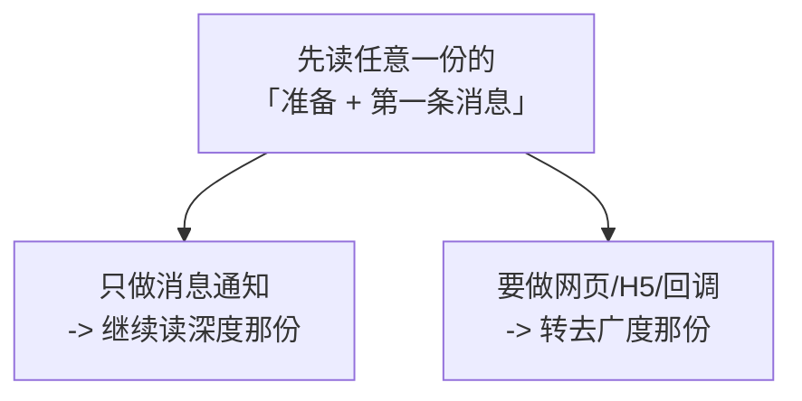

# summary

个人技术教程与规则文档仓库。每一份都是**写给自己（和同样从零开始的人）看的实操教程**，不是概念摘要——代码都实际跑过，踩过的坑都留在正文里。

---

## 目录

| 内容 | 一句话定位 | 技术栈 | 状态 |
|---|---|---|---|
| [**LangChain1.3教程**](./LangChain1.3教程/) | LangChain 1.3 新手实用教程，做出一个带工具和记忆的可用助手 | Python + DeepSeek（可换 OpenAI / Ollama） | 进行中 |
| [**企业微信API新手教程**](./企业微信API新手教程/) | 企业微信开发的**广度**教程：网页应用、身份登录、JS-SDK、回调、通讯录同步 | Python + C# WebForms + React 19/.NET 10 + IIS + SQL Server | 第 01~11 章已完成 |
| [**Python企业微信应用消息API教程**](./Python企业微信应用消息API教程/) | 企业微信**应用消息**的**深度**教程：把一条消息通知做到生产可交付 | 纯 Python + SQL Server | ✅ 全书完成（19 章 + 附录） |
| [SQL语句转换为存储过程规则.md](./SQL语句转换为存储过程规则.md) | 把 WebForm 页面里的内联 SQL 改写成存储过程的固定规则 | C# ASP.NET WebForms + SQL Server | 规则文档 |

---

## 两份企业微信教程怎么选

仓库里有**两份**企业微信教程，它们**不是新旧版本关系，而是广度与深度的分工**。

### 一句话区分

```text
企业微信API新手教程            —— 企业微信「能做哪些事」，一件一件都试一遍
Python企业微信应用消息API教程   —— 其中「发消息」这一件，做到能无人值守跑一年
```

### 逐项对比

| | 企业微信API新手教程 | Python企业微信应用消息API教程 |
|---|---|---|
| **覆盖面** | 广：发消息、素材、**网页应用主页**、**OAuth2.0 身份登录**、**JS-SDK 与定位**、**回调事件**、通讯录双向同步、项目群、Excel 报表、考勤 | 窄：**只做"给指定成员发应用消息"这一条链路** |
| **技术栈** | Python + **C# ASP.NET WebForms** + **React 19/TypeScript** + **.NET 10 Minimal API** + IIS + SQL Server | **纯 Python** + SQL Server |
| **深度取向** | 每种能力打通一遍，能跑起来 | 一条链路做到**生产可交付**：防重复发送、分类重试与死信、日志脱敏、部署、验收、故障排查 |
| **章节规模** | 24 章规划（**01~11 有正文，12~24 为待写占位**） | **19 章 + 附录 A~G，全部完成**（约 22400 行、187 张图） |
| **需要 HTTPS 域名吗** | 第 07 章起**需要**（应用主页、OAuth、JS-SDK 都依赖可信域名） | **不需要**（只调服务端 API） |
| **需要服务器吗** | 需要 Windows Server + IIS（第 13 章从零搭） | 一台能上网的机器即可；上线部分讲 systemd 和 Windows 计划任务 |

### 我该看哪一份

| 你要做的事 | 看哪份 |
|---|---|
| 每天定时把业务数据推给相关同事（提醒、预警、日报） | **Python企业微信应用消息API教程** |
| 做一个在企业微信里打开的网页（H5），要拿到"当前是谁" | **企业微信API新手教程**（07、08 章） |
| 手机端扫码、定位、拍照 | 企业微信API新手教程（09、10 章） |
| 接收企业微信推给我的事件（成员变更、审批） | 企业微信API新手教程（11 章） |
| 把通讯录和 SQL Server 双向同步 | 企业微信API新手教程（15~17 章，待写） |
| 我的消息**绝不能重复发送**、失败要能自愈、上线要有验收标准 | **Python企业微信应用消息API教程**（12~18 章） |
| 用 C# WebForms 而不是 Python 做 | 企业微信API新手教程（06、08~11 章） |

### 两份重叠的部分

两份都会讲**"创建自建应用、拿到三个凭证、用 Python 发出第一条消息"**（广度那份的 01~05 章 ≈ 深度那份的 2~11 章）。

**建议：**



如果你的目标是**消息通知**，直接从深度那份开始，它的第 0 章会先帮你确认"这条技术路线是不是你要的"（包括**什么时候该改用群机器人**）。

---

## 这些教程的共同写法

| 约定 | 说明 |
|---|---|
| **代码先跑再写** | 文中标注"实测"的输出都是真实运行结果，不是手写示例 |
| **验证来源分级标注** | 实测 / 依据官方文档 / 等价环境验证，三类分开写明，不把没验证的说成实测 |
| **踩的坑留在正文里** | 包括作者自己写错又修正的过程——那些 bug 往往只在特定条件下才暴露，看别人怎么发现它比看"一开始就正确"的代码有用 |
| **每章都有完成标志** | 一个可以动手打勾的清单；打不完就别往下走 |
| **引用官方文档** | 每条限制（长度、频率、有效期）都注明出处；**接口会变，以官方为准** |
