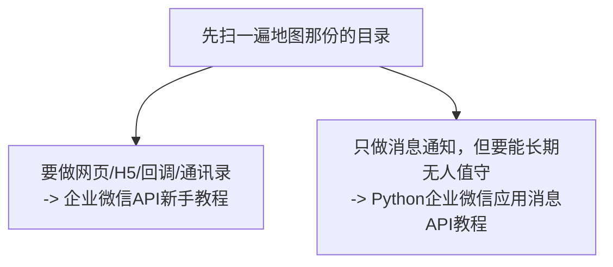

# summary

个人技术教程与规则文档仓库。每一份都是**写给自己（和同样从零开始的人）看的实操教程**，不是概念摘要——代码都实际跑过，踩过的坑都留在正文里。

---

## 目录

| 内容 | 一句话定位 | 技术栈 | 规模 |
|---|---|---|---|
| [**LangChain1.3教程**](./LangChain1.3教程/) | LangChain 1.3 新手实用教程，做出一个带工具和记忆的可用助手 | Python + DeepSeek（可换 OpenAI / Ollama） | 进行中 |
| [**企业微信API新手教程**](./企业微信API新手教程/) | 企业微信开发的**全景地图**：消息、网页应用、身份登录、JS-SDK、回调、通讯录同步、报表 | Python + C# WebForms + React 19/.NET 10 + IIS + SQL Server | 24 章 / 35112 行 / 299 图 |
| [**Python企业微信应用消息API教程**](./Python企业微信应用消息API教程/) | 其中**"发应用消息"这一条链路**的施工手册：做到能无人值守跑一年 | 纯 Python + SQL Server | 19 章 / 22414 行 / 187 图 |
| [SQL语句转换为存储过程规则.md](./SQL语句转换为存储过程规则.md) | 把 WebForm 页面里的内联 SQL 改写成存储过程的固定规则 | C# ASP.NET WebForms + SQL Server | 规则文档 |

**两份企业微信教程都已写完**，它们不是新旧版本关系，分工见下。

---

## 两份企业微信教程怎么选

### 一句话区分

```text
企业微信API新手教程            —— 企业微信开发的【地图】：能做哪些事，每件都打通一遍
Python企业微信应用消息API教程   —— 其中一条路的【施工手册】：把消息通知做到生产可交付
```

### 逐项对比

| | 企业微信API新手教程 | Python企业微信应用消息API教程 |
|---|---|---|
| **覆盖方向** | 消息与素材、**应用主页**、**OAuth2.0 身份登录**、**JS-SDK 与定位**、**回调事件**、**通讯录双向同步**、**项目群**、**Excel 日报**、**考勤报表**、调度、可靠性基线 | **只有一条链路**：查 SQL Server → 排版 → 给指定成员发应用消息 |
| **技术栈** | Python + **C# ASP.NET WebForms** + **React 19/TypeScript/Vite** + **.NET 10 Minimal API** + IIS + SQL Server | **纯 Python** + SQL Server（不涉及前端与 C#） |
| **写法** | **递进式**：每章 V1→V7 逐版加功能点，先说"上一版有什么问题"再给代码 | **实测驱动**：全书 300+ 项断言，每章 12~24 组测试；作者自己写错又修正的过程也留在正文 |
| **额外交付** | 从零搭 Windows Server + IIS（第 13 章）；React H5 + Minimal API 端到端实战（第 14 章） | 验收脚本 `acceptance.py`（26 项自动检查）；按**现象**查的故障排查手册 |
| **需要 HTTPS 域名吗** | 第 07 章起**需要**（应用主页、OAuth、JS-SDK 都依赖可信域名） | **不需要**（只调服务端 API） |
| **需要服务器吗** | 第 07 章起需要（第 13 章教从零搭 Windows Server + IIS） | 一台能上网的机器即可；上线部分讲 systemd 与 Windows 计划任务 |

### 我该看哪一份

| 你要做的事 | 看哪份 |
|---|---|
| 做一个在企业微信里打开的网页（H5），要拿到"当前是谁" | **企业微信API新手教程**（07、08 章） |
| 手机端扫码、定位、拍照 | 企业微信API新手教程（09、10 章） |
| 接收企业微信推给我的事件（成员变更、审批） | 企业微信API新手教程（11 章 C# / 24 章 Python，**两条替代路线只能选一个**） |
| 通讯录与 SQL Server 双向同步 | 企业微信API新手教程（15~17 章） |
| 创建管理项目群、发 Excel 日报、做考勤报表 | 企业微信API新手教程（18~21 章） |
| 用 C# WebForms 或 React + .NET 10 做 | 企业微信API新手教程（06、08~11、14 章） |
| 从零搭 Windows Server + IIS | 企业微信API新手教程（13 章） |
| **每天定时把业务数据推给相关同事**（提醒、预警） | **Python企业微信应用消息API教程** |
| 我的消息**绝不能重复发送**，要三种防重策略里挑一种 | **Python企业微信应用消息API教程**（12 章） |
| 需要一份**能签字的上线验收清单**和**按现象查的排查手册** | **Python企业微信应用消息API教程**（17、18 章） |
| 先搞清"这条技术路线是不是我要的"（含**什么时候该改用群机器人**） | **Python企业微信应用消息API教程**（第 0 章） |

### 重叠的部分怎么读

两份都讲这些，**但角度不同**：

| 主题 | 企业微信API新手教程 | Python企业微信应用消息API教程 |
|---|---|---|
| 建应用、拿凭证、发第一条 | 01、02 章 | 2、3、4 章（第 4 章逐行解释那 30 行代码） |
| SQL Server 数据设计 | 03 章（7 张表，含通讯录镜像、消息任务） | 10、11 章（连接与错误码、取数与排版分页） |
| 幂等 / 重试 / 结果不确定 | 19、23 章（幂等键、原子领取、失败退避） | 12、13 章（三种防重策略、错误码分类重试、死信） |
| 日志脱敏 | 23 章 | 14 章（六种泄露方式逐个验证） |
| 部署与排查 | 12 章（两套环境、IIS、计划任务） | 16、18 章（systemd/计划任务、按现象排查） |
| 定时调度 | 22 章（APScheduler 独立调度进程） | 9 章（时区、misfire、补跑） |

**建议：**



如果你的目标就是**消息通知**，直接从施工手册那份开始，它的第 0 章会先帮你确认这条路线对不对。

---

## 这些教程的共同写法

| 约定 | 说明 |
|---|---|
| **代码先跑再写** | 文中标注"实测"的输出都是真实运行结果，不是手写示例 |
| **验证来源分级标注** | 实测 / 依据官方文档 / 等价环境验证，三类分开写明，不把没验证的说成实测 |
| **踩的坑留在正文里** | 包括作者自己写错又修正的过程——那些 bug 往往只在特定条件下才暴露，看别人怎么发现它比看"一开始就正确"的代码有用 |
| **每章都有完成标志** | 一个可以动手打勾的清单；打不完就别往下走 |
| **引用官方文档** | 每条限制（长度、频率、有效期）都注明出处；**接口会变，以官方为准** |
| **图窄** | Mermaid 图最宽不超过 2 列节点，保证打开就能看全、不用缩放 |
