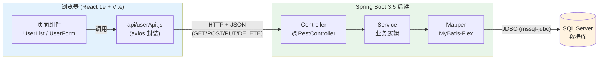
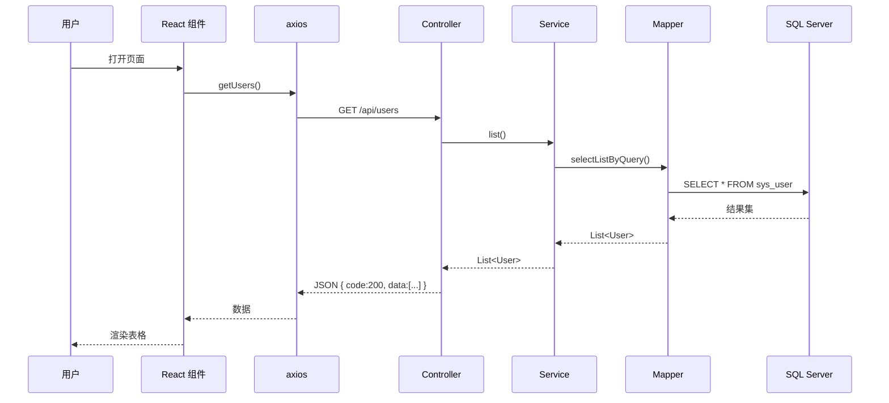
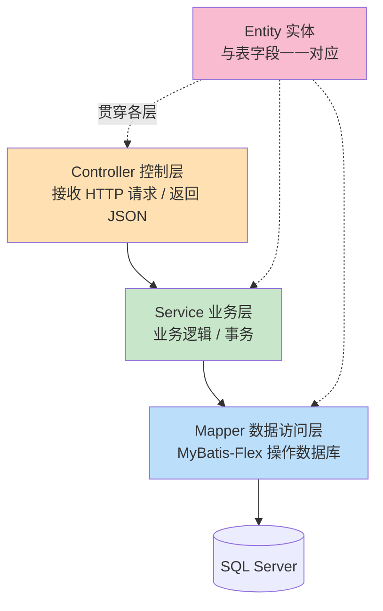
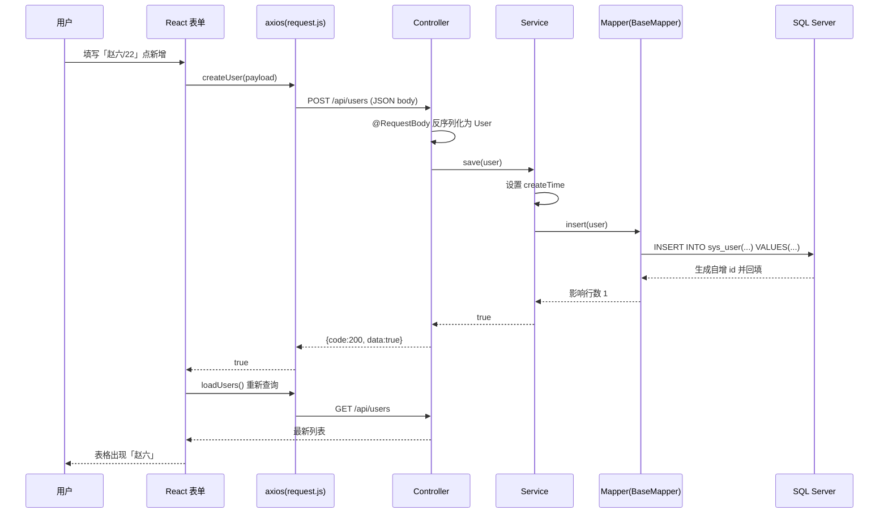
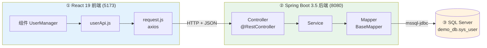

# React 19 + Spring Boot 3.5 + SQL Server 全栈 CRUD 实战教程

> 技术栈：**React 19（Vite）** + **Spring Boot 3.5** + **MyBatis-Flex** + **SQL Server** + **Gradle** + **IntelliJ IDEA 2026**
>
> 本教程从零开始，手把手带你做出一个前后端分离、可对 SQL Server 数据库进行「增、删、改、查」的完整项目。每一步都有讲解，配有架构图与数据流图。

---

## 目录

1. [整体架构与技术选型](#1-整体架构与技术选型)
2. [环境准备（JDK / Node / SQL Server / IDEA）](#2-环境准备)
3. [第一步：SQL Server 建库建表](#3-第一步sql-server-建库建表)
4. [第二步：用 IDEA + Gradle 创建 Spring Boot 3.5 后端](#4-第二步用-idea--gradle-创建-spring-boot-35-后端)
5. [第三步：配置数据库连接与 MyBatis-Flex](#5-第三步配置数据库连接与-mybatis-flex)
6. [第四步：编写后端分层代码（Entity → Mapper → Service → Controller）](#6-第四步编写后端分层代码)
7. [第五步：统一返回结果、跨域、异常处理](#7-第五步统一返回结果跨域异常处理)
8. [第六步：启动并用 IDEA HTTP Client 测试接口](#8-第六步启动并测试接口)
9. [第七步：用 Vite 创建 React 19 前端](#9-第七步用-vite-创建-react-19-前端)
10. [第八步：封装 axios 与 API 层](#10-第八步封装-axios-与-api-层)
11. [第九步：编写 React CRUD 页面](#11-第九步编写-react-crud-页面)
12. [第十步：前后端联调与完整数据流](#12-第十步前后端联调与完整数据流)
13. [常见问题排查（FAQ）](#13-常见问题排查faq)

---

## 1. 整体架构与技术选型

### 1.1 为什么是这套组合？

| 层次 | 技术 | 作用 | 选它的理由 |
|------|------|------|-----------|
| 前端 | React 19 + Vite | 页面渲染、用户交互 | React 19 带来 Actions、`useActionState`、`use()` 等新特性；Vite 启动秒开 |
| 通信 | Axios（HTTP/JSON） | 前后端数据交换 | 拦截器、统一错误处理方便 |
| 后端 | Spring Boot 3.5 | REST API、业务逻辑 | 生态成熟，基于 Spring Framework 6 / Java 17+ |
| ORM | MyBatis-Flex 1.11.x | Java 对象 ↔ 数据库表映射 | 比 MyBatis-Plus 更轻量，`QueryWrapper` 强大，APT 生成类型安全的字段定义 |
| 数据库 | SQL Server | 数据持久化 | 企业常用，事务/存储过程能力强 |
| 构建 | Gradle | 依赖管理、打包 | 比 Maven 更快、脚本更灵活 |
| IDE | IntelliJ IDEA 2026 | 开发环境 | Spring / Gradle 支持一流 |

### 1.2 前后端分离架构图



**一句话理解**：React 负责「界面」，Spring Boot 负责「业务和数据」，两者通过 HTTP + JSON 通信，MyBatis-Flex 负责把 Java 对象翻译成 SQL 语句去操作 SQL Server。

### 1.3 一次「查询用户列表」的完整调用链（时序图）



---

## 2. 环境准备

在写代码前，请确认下列软件已安装。**版本号是本教程验证过的推荐组合**。

| 软件 | 推荐版本 | 验证命令 |
|------|---------|---------|
| JDK | 17 或 21（Spring Boot 3.5 最低要求 JDK 17） | `java -version` |
| Node.js | 20 LTS 或更高（React 19 需要 Node 18+） | `node -v` |
| npm | 随 Node 一起 | `npm -v` |
| SQL Server | 2019 / 2022（或 Express 免费版） | 用 SSMS 连接测试 |
| IntelliJ IDEA | 2026（Ultimate 版对 Spring 支持更完整） | — |
| Gradle | 无需单独装，用项目自带 wrapper（`gradlew`） | `./gradlew -v` |

> **提示**：SQL Server 需要额外开启「TCP/IP 协议」和「SQL Server 身份验证」，第 3 步会讲。

---

## 3. 第一步：SQL Server 建库建表

### 3.1 开启 SQL Server 网络与登录

1. 打开 **SQL Server Configuration Manager（配置管理器）**。
2. 「SQL Server 网络配置」→「MSSQLSERVER 的协议」→ 右键 **TCP/IP** → **启用**。
3. 双击 TCP/IP →「IP 地址」标签 → 拉到最底部 `IPAll` → 把 **TCP 端口** 设为 `1433`。
4. 重启「SQL Server」服务。
5. 用 **SSMS（SQL Server Management Studio）** 连接，右键服务器 →「属性」→「安全性」→ 勾选 **「SQL Server 和 Windows 身份验证模式」**（即混合模式），这样才能用账号密码从 Java 连。
6. 建一个登录账号（示例用 `sa`，生产环境请另建专用账号）。

### 3.2 建库建表脚本

在 SSMS 里新建查询，执行下面的脚本。我们做一个最经典的「用户表」。

```sql
-- 1. 创建数据库
IF DB_ID('demo_db') IS NULL
    CREATE DATABASE demo_db;
GO

USE demo_db;
GO

-- 2. 创建用户表
IF OBJECT_ID('dbo.sys_user', 'U') IS NULL
CREATE TABLE dbo.sys_user (
    id          BIGINT IDENTITY(1,1) PRIMARY KEY,   -- 自增主键
    username    NVARCHAR(50)  NOT NULL,             -- 用户名
    age         INT           NULL,                 -- 年龄
    email       NVARCHAR(100) NULL,                 -- 邮箱
    create_time DATETIME      NOT NULL DEFAULT GETDATE()  -- 创建时间
);
GO

-- 3. 插入几条测试数据
INSERT INTO dbo.sys_user (username, age, email) VALUES
    (N'张三', 25, N'zhangsan@test.com'),
    (N'李四', 30, N'lisi@test.com'),
    (N'王五', 28, N'wangwu@test.com');
GO

SELECT * FROM dbo.sys_user;
```

**字段说明**：
- `IDENTITY(1,1)`：SQL Server 的自增列，等价于 MySQL 的 `AUTO_INCREMENT`。MyBatis-Flex 里对应主键策略 `KeyType.Auto`。
- `NVARCHAR`：存储 Unicode（能存中文），前面加 `N'...'` 表示 Unicode 字符串字面量。
- `GETDATE()`：数据库端默认当前时间。

执行后应能看到 3 行数据。数据库端准备完成 ✅

---

## 4. 第二步：用 IDEA + Gradle 创建 Spring Boot 3.5 后端

### 4.1 用 Spring Initializr 生成骨架

在 IDEA 2026：**File → New → Project → Spring Boot（Spring Initializr）**，填写：

| 选项 | 值 |
|------|----|
| Language | Java |
| Type（构建工具） | **Gradle - Groovy**（或 Kotlin DSL，本教程用 Groovy） |
| Group | `com.example` |
| Artifact | `crud-backend` |
| Java | 17（或 21） |
| Spring Boot | 3.5.x |

**Dependencies（依赖）** 只勾选：
- **Spring Web**（提供 REST、内嵌 Tomcat）
- **Lombok**（可选，少写 getter/setter）

> MyBatis-Flex 和 SQL Server 驱动 Initializr 里没有内置选项，我们下一节手动加到 `build.gradle`。

点击 **Create**，IDEA 会自动下载 Gradle 依赖并生成如下结构：

```
crud-backend/
├── build.gradle              ← 依赖与构建脚本（重点）
├── settings.gradle
├── gradlew / gradlew.bat     ← Gradle Wrapper，无需本地装 Gradle
├── gradle/wrapper/...
└── src/
    ├── main/
    │   ├── java/com/example/crudbackend/
    │   │   └── CrudBackendApplication.java   ← 启动类
    │   └── resources/
    │       └── application.yml               ← 配置文件（默认是 .properties，可改成 .yml）
    └── test/
```

### 4.2 完整的 build.gradle

打开 `build.gradle`，替换成下面内容（**注意版本号**，MyBatis-Flex 用 `mybatis-flex-spring-boot3-starter`，专为 Spring Boot 3 适配）：

```groovy
plugins {
    id 'java'
    id 'org.springframework.boot' version '3.5.3'
    id 'io.spring.dependency-management' version '1.1.6'
}

group = 'com.example'
version = '0.0.1-SNAPSHOT'

java {
    sourceCompatibility = '17'
}

repositories {
    // 国内建议加阿里云镜像，下载更快
    maven { url 'https://maven.aliyun.com/repository/public' }
    mavenCentral()
}

// 统一管理 MyBatis-Flex 版本
ext {
    mybatisFlexVersion = '1.11.0'
}

dependencies {
    // --- Web ---
    implementation 'org.springframework.boot:spring-boot-starter-web'

    // --- MyBatis-Flex（Spring Boot 3 专用 starter）---
    implementation "com.mybatis-flex:mybatis-flex-spring-boot3-starter:${mybatisFlexVersion}"

    // --- MyBatis-Flex APT 处理器：编译期生成 XxxTableDef 类型安全字段 ---
    annotationProcessor "com.mybatis-flex:mybatis-flex-processor:${mybatisFlexVersion}"

    // --- SQL Server JDBC 驱动 ---
    runtimeOnly 'com.microsoft.sqlserver:mssql-jdbc:12.8.1.jre11'

    // --- 数据库连接池（HikariCP，Spring Boot 默认自带，可省略显式声明）---

    // --- Lombok（可选）---
    compileOnly 'org.projectlombok:lombok'
    annotationProcessor 'org.projectlombok:lombok'

    // --- 测试 ---
    testImplementation 'org.springframework.boot:spring-boot-starter-test'
}

tasks.named('test') {
    useJUnitPlatform()
}
```

**关键依赖讲解**：

| 依赖 | 作用 |
|------|------|
| `mybatis-flex-spring-boot3-starter` | MyBatis-Flex 与 Spring Boot 3 的自动装配，帮你自动配置 `SqlSessionFactory`、扫描 Mapper |
| `mybatis-flex-processor`（annotationProcessor） | **编译期注解处理器**。它会为每个带 `@Table` 的实体生成一个 `实体名Table` 或 `实体名TableDef` 类（如 `UserTableDef.USER`），让你在写 `QueryWrapper` 时用 `USER.USERNAME.eq(...)` 这种类型安全、可重构的写法，而不是手写字符串列名 |
| `mssql-jdbc` | 微软官方 SQL Server JDBC 驱动。`jre11` 后缀表示适配 Java 11+，可用于 JDK 17/21 |
| `runtimeOnly` | 表示这个 jar 只在运行时需要（编译时不引用它的类），驱动类正合适 |

改完后点击 IDEA 右上角的 **Gradle 刷新（大象图标 / Load Gradle Changes）**，等待依赖下载完成。

---

## 5. 第三步：配置数据库连接与 MyBatis-Flex

### 5.1 application.yml

把 `src/main/resources/application.properties` 重命名为 `application.yml`，写入：

```yaml
server:
  port: 8080

spring:
  datasource:
    driver-class-name: com.microsoft.sqlserver.jdbc.SQLServerDriver
    url: jdbc:sqlserver://localhost:1433;databaseName=demo_db;encrypt=true;trustServerCertificate=true
    username: sa
    password: 你的密码
    # HikariCP 连接池参数（可选）
    hikari:
      maximum-pool-size: 10
      minimum-idle: 5

# MyBatis-Flex 配置
mybatis-flex:
  # Mapper XML 位置（本教程用注解/QueryWrapper，一般不需要 XML，可留空）
  mapper-locations: classpath*:/mapper/**/*.xml
  configuration:
    # 控制台打印执行的 SQL，方便调试
    log-impl: org.apache.ibatis.logging.stdout.StdOutImpl
```

**连接串（url）逐段讲解**——SQL Server 的 JDBC URL 是初学者最容易踩坑的地方：

| 片段 | 含义 |
|------|------|
| `jdbc:sqlserver://localhost:1433` | 协议 + 主机 + 端口（1433 是 SQL Server 默认端口） |
| `databaseName=demo_db` | 连接哪个数据库 |
| `encrypt=true` | mssql-jdbc 12.x 起**默认开启加密** |
| `trustServerCertificate=true` | 本地开发没有正式证书时必须加，否则会报 `SSL/TLS` 证书错误 |

> ⚠️ 常见报错：不加 `trustServerCertificate=true` 会出现 `The driver could not establish a secure connection ... PKIX path building failed`。本地开发直接信任即可。

### 5.2 在启动类上开启 Mapper 扫描

打开启动类 `CrudBackendApplication.java`，加上 `@MapperScan`：

```java
package com.example.crudbackend;

import com.mybatisflex.core.mybatis.FlexConfiguration;
import org.mybatis.spring.annotation.MapperScan;
import org.springframework.boot.SpringApplication;
import org.springframework.boot.autoconfigure.SpringBootApplication;

@SpringBootApplication
@MapperScan("com.example.crudbackend.mapper")  // 扫描 Mapper 接口所在包
public class CrudBackendApplication {
    public static void main(String[] args) {
        SpringApplication.run(CrudBackendApplication.class, args);
    }
}
```

`@MapperScan` 告诉 MyBatis-Flex 去哪个包找 Mapper 接口并生成实现类（代理对象）。

---


## 6. 第四步：编写后端分层代码

分层是后端的灵魂。一次请求会「自上而下」穿过这几层，每层各司其职：



先把包结构建好：

```
src/main/java/com/example/crudbackend/
├── CrudBackendApplication.java
├── entity/
│   └── User.java
├── mapper/
│   └── UserMapper.java
├── service/
│   ├── UserService.java
│   └── impl/UserServiceImpl.java
├── controller/
│   └── UserController.java
└── common/
    └── Result.java        (第 7 步创建)
```

### 6.1 Entity 实体类

`entity/User.java`——用 MyBatis-Flex 的注解把 Java 类和 `sys_user` 表关联起来：

```java
package com.example.crudbackend.entity;

import com.mybatisflex.annotation.Id;
import com.mybatisflex.annotation.KeyType;
import com.mybatisflex.annotation.Table;
import lombok.Data;

import java.time.LocalDateTime;

@Data                       // Lombok：自动生成 getter/setter/toString
@Table("sys_user")          // 对应数据库表名
public class User {

    @Id(keyType = KeyType.Auto)   // 主键，Auto = 数据库自增（对应 SQL Server IDENTITY）
    private Long id;

    private String username;

    private Integer age;

    private String email;

    private LocalDateTime createTime;   // 驼峰 createTime ↔ 下划线 create_time（默认自动映射）
}
```

**讲解**：
- `@Table("sys_user")`：指定表名。
- `@Id(keyType = KeyType.Auto)`：主键自增，插入后 MyBatis-Flex 会自动回填生成的 `id`。
- **驼峰转下划线**：MyBatis-Flex 默认开启 `createTime` ↔ `create_time` 的自动映射，无需额外配置。
- 编译一次后，APT 处理器会生成一个 `UserTableDef`（静态字段 `USER`），后面写查询会用到。

### 6.2 Mapper 接口

`mapper/UserMapper.java`——**只需继承 `BaseMapper<User>`，即可白得一整套 CRUD 方法**：

```java
package com.example.crudbackend.mapper;

import com.mybatisflex.core.BaseMapper;
import com.example.crudbackend.entity.User;

public interface UserMapper extends BaseMapper<User> {
    // 无需写任何方法！
    // BaseMapper 已内置：insert、deleteById、update、selectOneById、selectListByQuery ...
    // 如需自定义复杂 SQL，可在此加方法并配 XML 或 @Select 注解
}
```

**这就是 MyBatis-Flex 的爽点**：`BaseMapper` 提供了 `insert / update / deleteById / selectOneById / selectListByQuery / paginate` 等几十个开箱即用的方法，简单 CRUD 一行 SQL 都不用写。

### 6.3 Service 层

Service 层承载业务逻辑。先定义接口，再写实现。

`service/UserService.java`：

```java
package com.example.crudbackend.service;

import com.example.crudbackend.entity.User;
import java.util.List;

public interface UserService {
    List<User> listAll();          // 查询全部
    User getById(Long id);         // 按 id 查询
    boolean save(User user);       // 新增
    boolean updateById(User user); // 修改
    boolean removeById(Long id);   // 删除
}
```

`service/impl/UserServiceImpl.java`：

```java
package com.example.crudbackend.service.impl;

import com.example.crudbackend.entity.User;
import com.example.crudbackend.mapper.UserMapper;
import com.example.crudbackend.service.UserService;
import com.mybatisflex.core.query.QueryWrapper;
import org.springframework.stereotype.Service;

import java.time.LocalDateTime;
import java.util.List;

import static com.example.crudbackend.entity.table.UserTableDef.USER;  // APT 生成的表定义

@Service
public class UserServiceImpl implements UserService {

    private final UserMapper userMapper;

    // 构造器注入（Spring 推荐方式）
    public UserServiceImpl(UserMapper userMapper) {
        this.userMapper = userMapper;
    }

    @Override
    public List<User> listAll() {
        // 类型安全的查询：SELECT * FROM sys_user ORDER BY id DESC
        QueryWrapper query = QueryWrapper.create()
                .orderBy(USER.ID.desc());
        return userMapper.selectListByQuery(query);
    }

    @Override
    public User getById(Long id) {
        return userMapper.selectOneById(id);
    }

    @Override
    public boolean save(User user) {
        user.setCreateTime(LocalDateTime.now());
        return userMapper.insert(user) > 0;   // insert 返回受影响行数
    }

    @Override
    public boolean updateById(User user) {
        return userMapper.update(user) > 0;
    }

    @Override
    public boolean removeById(Long id) {
        return userMapper.deleteById(id) > 0;
    }
}
```

**讲解**：
- `import static ... UserTableDef.USER`：这就是 APT 处理器生成的类。`USER.ID`、`USER.USERNAME` 是类型安全的字段引用。改了字段名，编译期就会报错，比手写字符串 `"username"` 安全得多。
- `QueryWrapper.create().orderBy(USER.ID.desc())`：链式构造查询条件，最终翻译成 SQL。
- 如果第一次找不到 `UserTableDef`，**先 Build 一次项目**（`Build → Build Project` 或 `./gradlew compileJava`），APT 才会生成它。

### 6.4 Controller 层（REST CRUD 接口）

`controller/UserController.java`——这是暴露给前端的 REST 接口，完整覆盖增删改查：

```java
package com.example.crudbackend.controller;

import com.example.crudbackend.common.Result;
import com.example.crudbackend.entity.User;
import com.example.crudbackend.service.UserService;
import org.springframework.web.bind.annotation.*;

import java.util.List;

@RestController                 // = @Controller + @ResponseBody，返回值自动转 JSON
@RequestMapping("/api/users")   // 该控制器统一前缀
public class UserController {

    private final UserService userService;

    public UserController(UserService userService) {
        this.userService = userService;
    }

    // 查询全部： GET /api/users
    @GetMapping
    public Result<List<User>> list() {
        return Result.ok(userService.listAll());
    }

    // 按 id 查询： GET /api/users/1
    @GetMapping("/{id}")
    public Result<User> getOne(@PathVariable Long id) {
        return Result.ok(userService.getById(id));
    }

    // 新增： POST /api/users  （请求体为 JSON）
    @PostMapping
    public Result<Boolean> create(@RequestBody User user) {
        return Result.ok(userService.save(user));
    }

    // 修改： PUT /api/users/1
    @PutMapping("/{id}")
    public Result<Boolean> update(@PathVariable Long id, @RequestBody User user) {
        user.setId(id);
        return Result.ok(userService.updateById(user));
    }

    // 删除： DELETE /api/users/1
    @DeleteMapping("/{id}")
    public Result<Boolean> delete(@PathVariable Long id) {
        return Result.ok(userService.removeById(id));
    }
}
```

**REST 风格与 HTTP 方法对应关系（务必记住这张表）**：

| 操作 | HTTP 方法 | URL | 说明 |
|------|-----------|-----|------|
| 查询列表 | `GET` | `/api/users` | 幂等、无副作用 |
| 查询单条 | `GET` | `/api/users/{id}` | 路径参数 |
| 新增 | `POST` | `/api/users` | 数据放请求体（JSON） |
| 修改 | `PUT` | `/api/users/{id}` | 数据放请求体 |
| 删除 | `DELETE` | `/api/users/{id}` | 按 id 删 |

- `@RequestBody`：把前端发来的 JSON 自动反序列化成 `User` 对象。
- `@PathVariable`：取 URL 路径里的变量（如 `{id}`）。
- `@RestController`：返回的对象会被 Jackson 自动转成 JSON。

---


## 7. 第五步：统一返回结果、跨域、异常处理

### 7.1 统一返回结果 Result

前端最怕后端每个接口返回格式都不一样。我们定义一个统一「信封」结构，所有接口都返回 `{ code, message, data }`。

`common/Result.java`：

```java
package com.example.crudbackend.common;

import lombok.Data;

@Data
public class Result<T> {
    private int code;        // 状态码：200 成功，500 失败
    private String message;  // 提示信息
    private T data;          // 真正的数据

    public static <T> Result<T> ok(T data) {
        Result<T> r = new Result<>();
        r.setCode(200);
        r.setMessage("success");
        r.setData(data);
        return r;
    }

    public static <T> Result<T> fail(String message) {
        Result<T> r = new Result<>();
        r.setCode(500);
        r.setMessage(message);
        return r;
    }
}
```

前端拿到的 JSON 长这样：

```json
{
  "code": 200,
  "message": "success",
  "data": [
    { "id": 3, "username": "王五", "age": 28, "email": "wangwu@test.com", "createTime": "2026-07-07T10:00:00" }
  ]
}
```

### 7.2 全局跨域配置（CORS）

前端跑在 `http://localhost:5173`（Vite 默认端口），后端在 `http://localhost:8080`。**浏览器同源策略**会拦截跨端口请求，必须在后端放行。

`config/CorsConfig.java`：

```java
package com.example.crudbackend.config;

import org.springframework.context.annotation.Configuration;
import org.springframework.web.servlet.config.annotation.CorsRegistry;
import org.springframework.web.servlet.config.annotation.WebMvcConfigurer;

@Configuration
public class CorsConfig implements WebMvcConfigurer {
    @Override
    public void addCorsMappings(CorsRegistry registry) {
        registry.addMapping("/api/**")                 // 拦截所有 /api 接口
                .allowedOrigins("http://localhost:5173") // 允许的前端地址
                .allowedMethods("GET", "POST", "PUT", "DELETE", "OPTIONS")
                .allowedHeaders("*")
                .allowCredentials(true);
    }
}
```

> **跨域是前后端分离的高频坑**：如果前端报 `has been blocked by CORS policy`，99% 是这里没配或地址/端口不匹配。

### 7.3 全局异常处理（可选但强烈推荐）

`common/GlobalExceptionHandler.java`——避免把 Java 堆栈直接暴露给前端：

```java
package com.example.crudbackend.common;

import org.springframework.web.bind.annotation.ExceptionHandler;
import org.springframework.web.bind.annotation.RestControllerAdvice;

@RestControllerAdvice
public class GlobalExceptionHandler {
    @ExceptionHandler(Exception.class)
    public Result<Void> handle(Exception e) {
        e.printStackTrace();  // 服务端记录日志
        return Result.fail("服务器异常：" + e.getMessage());
    }
}
```

---

## 8. 第六步：启动并测试接口

### 8.1 启动后端

在 IDEA 里运行 `CrudBackendApplication` 的 `main` 方法（点绿色三角），或命令行：

```bash
./gradlew bootRun
```

看到日志 `Tomcat started on port 8080` 就成功了。若之前配了 `log-impl: StdOutImpl`，访问接口时控制台会打印真实执行的 SQL。

### 8.2 用 IDEA 自带 HTTP Client 测试

在 `src/test` 或任意位置新建一个 `api.http` 文件（IDEA 原生支持，无需 Postman）：

```http
### 查询全部用户
GET http://localhost:8080/api/users

### 按 id 查询
GET http://localhost:8080/api/users/1

### 新增用户
POST http://localhost:8080/api/users
Content-Type: application/json

{
  "username": "赵六",
  "age": 22,
  "email": "zhaoliu@test.com"
}

### 修改用户
PUT http://localhost:8080/api/users/1
Content-Type: application/json

{
  "username": "张三改",
  "age": 26,
  "email": "new@test.com"
}

### 删除用户
DELETE http://localhost:8080/api/users/4
```

点击每个请求左侧的绿色三角逐个执行，看到返回 `{"code":200,...}` 即表示后端 CRUD 全部打通 ✅。**先确保后端单独可用，再去接前端，能省掉大量联调时间。**

---

## 9. 第七步：用 Vite 创建 React 19 前端

### 9.1 创建项目

打开终端（可用 IDEA 内置 Terminal），执行：

```bash
npm create vite@latest crud-frontend -- --template react
cd crud-frontend
npm install
```

> `--template react` 生成 JavaScript 版；想用 TypeScript 就用 `react-ts`。Vite 会自动装最新的 React 19。

安装 axios：

```bash
npm install axios
```

启动开发服务器：

```bash
npm run dev
```

默认地址是 `http://localhost:5173`（和上面 CORS 配的要一致）。

### 9.2 前端目录结构

```
crud-frontend/
├── index.html
├── vite.config.js
├── package.json
└── src/
    ├── main.jsx          ← 入口
    ├── App.jsx           ← 根组件
    ├── api/
    │   ├── request.js    ← axios 实例（拦截器）
    │   └── userApi.js    ← 用户相关接口
    └── components/
        └── UserManager.jsx   ← CRUD 页面
```

---

## 10. 第八步：封装 axios 与 API 层

### 10.1 axios 实例与拦截器

`src/api/request.js`——统一 baseURL、统一处理后端的 `Result` 信封：

```javascript
import axios from 'axios';

const request = axios.create({
  baseURL: 'http://localhost:8080/api', // 后端地址前缀
  timeout: 10000,
});

// 响应拦截器：自动剥离外层 Result，出错时统一提示
request.interceptors.response.use(
  (response) => {
    const res = response.data; // { code, message, data }
    if (res.code === 200) {
      return res.data;         // 直接把 data 交给业务代码
    }
    alert(res.message || '请求失败');
    return Promise.reject(new Error(res.message));
  },
  (error) => {
    alert('网络错误：' + error.message);
    return Promise.reject(error);
  }
);

export default request;
```

**讲解**：通过响应拦截器，业务代码里 `await getUsers()` 拿到的直接就是用户数组，不用每次都写 `res.data.data`，非常清爽。

### 10.2 用户 API 层

`src/api/userApi.js`——把每个后端接口封装成一个函数：

```javascript
import request from './request';

// 查询全部
export const getUsers = () => request.get('/users');

// 按 id 查询
export const getUser = (id) => request.get(`/users/${id}`);

// 新增
export const createUser = (user) => request.post('/users', user);

// 修改
export const updateUser = (id, user) => request.put(`/users/${id}`, user);

// 删除
export const deleteUser = (id) => request.delete(`/users/${id}`);
```

**分层的好处**：组件里不直接写 URL，将来后端地址或路径变了，只改这一个文件。

---


## 11. 第九步：编写 React CRUD 页面

### 11.1 完整的用户管理组件

`src/components/UserManager.jsx`——一个包含「列表 + 新增 + 编辑 + 删除」的完整页面。用 React 19 的 Hooks（`useState`、`useEffect`）实现：

```jsx
import { useEffect, useState } from 'react';
import {
  getUsers, createUser, updateUser, deleteUser,
} from '../api/userApi';

const emptyForm = { username: '', age: '', email: '' };

export default function UserManager() {
  const [users, setUsers] = useState([]);   // 用户列表
  const [form, setForm] = useState(emptyForm); // 表单数据
  const [editingId, setEditingId] = useState(null); // 正在编辑的 id（null=新增）
  const [loading, setLoading] = useState(false);

  // 加载列表
  const loadUsers = async () => {
    setLoading(true);
    try {
      const data = await getUsers();
      setUsers(data);
    } finally {
      setLoading(false);
    }
  };

  // 组件首次挂载时加载一次
  useEffect(() => {
    loadUsers();
  }, []);

  // 表单输入变化
  const handleChange = (e) => {
    const { name, value } = e.target;
    setForm((prev) => ({ ...prev, [name]: value }));
  };

  // 提交（新增 或 修改）
  const handleSubmit = async (e) => {
    e.preventDefault();
    const payload = { ...form, age: Number(form.age) || null };
    if (editingId) {
      await updateUser(editingId, payload); // 修改
    } else {
      await createUser(payload);            // 新增
    }
    setForm(emptyForm);
    setEditingId(null);
    loadUsers(); // 重新拉列表
  };

  // 点击「编辑」：把该行数据填进表单
  const handleEdit = (user) => {
    setEditingId(user.id);
    setForm({ username: user.username, age: user.age ?? '', email: user.email ?? '' });
  };

  // 删除
  const handleDelete = async (id) => {
    if (!window.confirm('确定删除这条数据吗？')) return;
    await deleteUser(id);
    loadUsers();
  };

  return (
    <div style={{ maxWidth: 800, margin: '40px auto', fontFamily: 'sans-serif' }}>
      <h2>用户管理（React 19 + Spring Boot 3.5 + SQL Server）</h2>

      {/* 表单区 */}
      <form onSubmit={handleSubmit} style={{ marginBottom: 20 }}>
        <input name="username" placeholder="用户名" value={form.username}
               onChange={handleChange} required />
        <input name="age" placeholder="年龄" type="number" value={form.age}
               onChange={handleChange} style={{ marginLeft: 8 }} />
        <input name="email" placeholder="邮箱" value={form.email}
               onChange={handleChange} style={{ marginLeft: 8 }} />
        <button type="submit" style={{ marginLeft: 8 }}>
          {editingId ? '保存修改' : '新增'}
        </button>
        {editingId && (
          <button type="button" onClick={() => { setEditingId(null); setForm(emptyForm); }}
                  style={{ marginLeft: 8 }}>
            取消
          </button>
        )}
      </form>

      {/* 列表区 */}
      {loading ? <p>加载中...</p> : (
        <table border="1" cellPadding="8" style={{ borderCollapse: 'collapse', width: '100%' }}>
          <thead>
            <tr>
              <th>ID</th><th>用户名</th><th>年龄</th><th>邮箱</th><th>操作</th>
            </tr>
          </thead>
          <tbody>
            {users.map((u) => (
              <tr key={u.id}>
                <td>{u.id}</td>
                <td>{u.username}</td>
                <td>{u.age}</td>
                <td>{u.email}</td>
                <td>
                  <button onClick={() => handleEdit(u)}>编辑</button>
                  <button onClick={() => handleDelete(u.id)} style={{ marginLeft: 8 }}>删除</button>
                </td>
              </tr>
            ))}
            {users.length === 0 && (
              <tr><td colSpan="5" style={{ textAlign: 'center' }}>暂无数据</td></tr>
            )}
          </tbody>
        </table>
      )}
    </div>
  );
}
```

### 11.2 挂载到 App

`src/App.jsx`：

```jsx
import UserManager from './components/UserManager';

export default function App() {
  return <UserManager />;
}
```

**核心逻辑讲解**：
- `useState` 管理三份状态：`users`（列表）、`form`（表单）、`editingId`（区分新增/编辑）。
- `useEffect(() => loadUsers(), [])`：空依赖数组表示「只在组件首次渲染后执行一次」，用来初始化加载列表。
- **每次增删改成功后都调用 `loadUsers()` 重新拉取列表**，保证界面和数据库一致（最简单可靠的刷新策略）。
- 表单复用：`editingId` 为 `null` 时是新增，有值时是编辑，提交时据此选择调用 `createUser` 还是 `updateUser`。

> **React 19 进阶（可选）**：也可以用 `useActionState` + `<form action={fn}>` 的新写法来管理提交状态，或用 `useOptimistic` 做乐观更新。本教程用经典 Hooks，便于初学者理解数据流。

---

## 12. 第十步：前后端联调与完整数据流

### 12.1 启动顺序

1. 确认 **SQL Server 服务已启动**。
2. 启动**后端**：IDEA 运行 `CrudBackendApplication`（端口 8080）。
3. 启动**前端**：`npm run dev`（端口 5173）。
4. 浏览器打开 `http://localhost:5173`，即可看到用户表格。

### 12.2 一次「新增用户」的端到端数据流



### 12.3 数据在各层的「形态变化」

| 位置 | 数据形态 |
|------|---------|
| React 表单 | JS 对象 `{ username, age, email }` |
| 网络传输 | JSON 字符串 |
| Controller | Java 对象 `User`（Jackson 反序列化） |
| Mapper → DB | SQL 语句 + 参数 |
| SQL Server | 表中的一行记录 |
| 返回时 | 逆向：行记录 → User → JSON → JS 对象 → 渲染 DOM |

理解这条「形态变化链」，就真正理解了全栈 CRUD 的本质。

---

## 13. 常见问题排查（FAQ）

| 现象 | 原因 | 解决 |
|------|------|------|
| `The driver could not establish a secure connection ... PKIX` | mssql-jdbc 12+ 默认加密但无证书 | URL 加 `encrypt=true;trustServerCertificate=true` |
| `Login failed for user 'sa'` | 未开混合验证 / 密码错 / sa 被禁用 | SSMS 开启混合模式，启用并重设 sa 密码 |
| `TCP/IP connection to host localhost failed` | SQL Server TCP/IP 未开或端口不对 | 配置管理器开 TCP/IP，端口设 1433，重启服务 |
| 前端报 `blocked by CORS policy` | 后端未放行跨域 | 检查 `CorsConfig` 的 `allowedOrigins` 是否等于前端实际地址 |
| 找不到 `UserTableDef` / `table` 包 | APT 处理器还没跑 | 先 `Build Project` 或 `./gradlew compileJava`，并确认 `annotationProcessor` 依赖已加 |
| 中文乱码 | 表字段不是 `NVARCHAR` 或未加 `N'...'` | 用 `NVARCHAR`，连接串可加 `sendStringParametersAsUnicode=true`（驱动默认已是） |
| 时间字段报错 | 类型不匹配 | 实体用 `LocalDateTime`，表用 `DATETIME` |
| 端口被占用 `Port 8080 already in use` | 已有进程占用 | 改 `server.port` 或结束占用进程 |

---

## 附：全流程一图总览



**恭喜！** 到这里你已经拥有一条完整、可运行的全栈 CRUD 链路：

> React 页面 → axios → Spring Boot REST 接口 → Service → MyBatis-Flex Mapper → SQL Server → 原路返回渲染。

后续可扩展方向：分页查询（MyBatis-Flex 的 `paginate`）、参数校验（`@Valid`）、登录鉴权（Spring Security + JWT）、前端换 Ant Design 美化界面、Docker 部署等。
