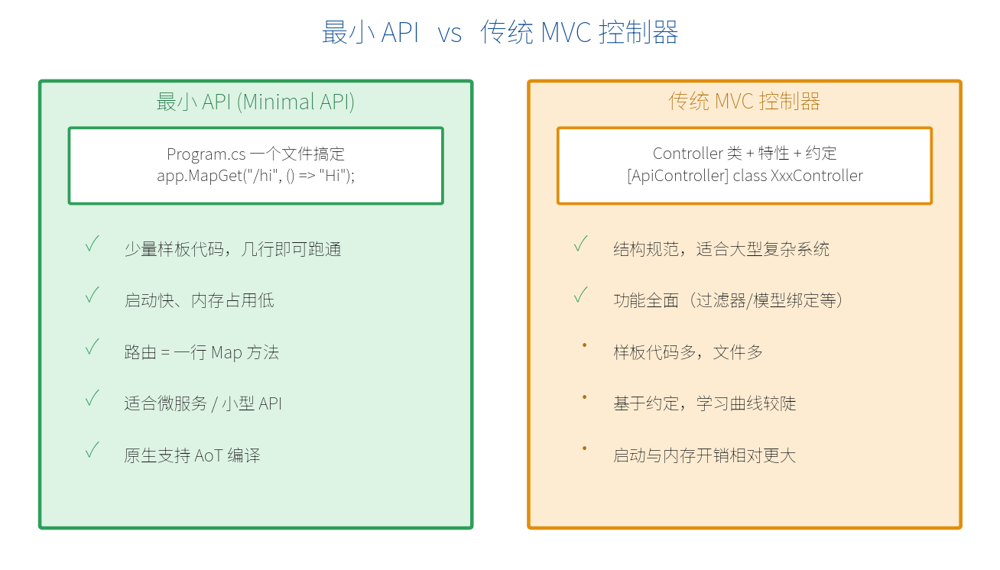
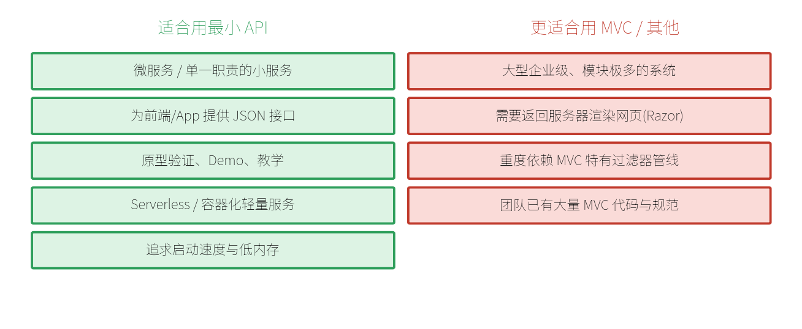

# 第一部分　入门与原理

> **【阅读提示】** 本教程前三章重在讲清"是什么、为什么、怎么跑起来"，从第 4 章开始进入具体功能。关于"前端如何调用这些接口、前后端怎么协作"的内容，集中放在书末**附录 A**，初学者可在读完第 3 章后先翻阅附录 A 建立整体认知，再回到第 4 章深入。标有"（.NET 10 新特性）"的章节是相较旧版本的重要升级点，建议重点掌握。

# 第 1 章　认识最小 API

在写第一行代码之前，我们先花一章时间把两个最基本的问题弄明白：**最小 API 到底是什么？** 以及 **我为什么要用它？** 想清楚这两点，后面学起来才不会"知其然不知其所以然"。

## 1.1 什么是最小 API（Minimal API）

"最小 API"是 ASP.NET Core 提供的一种**用最少的代码构建 HTTP 接口**的方式。它的英文是 `Minimal API`，从 .NET 6 引入，到 .NET 10 已经非常成熟，成为微软官方推荐的 API 构建方式。

"最小"体现在：你不需要建一堆文件、写一堆类，**一个 Program.cs 文件、几行代码**，就能跑起来一个真正的 Web 接口。看下面这段完整程序：

```csharp
var builder = WebApplication.CreateBuilder(args);
var app = builder.Build();

// 定义一个接口：访问 /hello 时返回一段文字
app.MapGet("/hello", () => "你好，最小 API！");

app.Run();  // 启动服务器，开始监听请求
```

就这么几行，运行后在浏览器打开 `http://localhost:5000/hello`，你就能看到 "你好，最小 API！"。这就是一个完整的后端接口了——**没有 Controller 类，没有一堆配置文件，没有繁琐的约定。**

> **【名词解释】** "API"指应用程序编程接口，这里可以简单理解为"一个可以通过网址访问、用来交换数据的服务入口"。"HTTP API"就是通过 HTTP 协议访问的接口。

## 1.2 最小 API vs 传统 MVC 控制器

在最小 API 出现之前，ASP.NET Core 构建接口的主流方式是 **MVC 控制器（Controller）**。两者都能做出一样的接口，区别在于"写法的繁简"和"适用的规模"。



下面用一个"返回商品列表"的例子直观对比。先看**传统 MVC 控制器**的写法：

```csharp
// 传统 MVC：需要单独的 Controller 类、特性标注、约定命名
[ApiController]
[Route("api/[controller]")]
public class ProductsController : ControllerBase
{
    [HttpGet]
    public IActionResult GetAll()
    {
        var products = new[] { "苹果", "香蕉" };
        return Ok(products);
    }
}
```

再看**最小 API**实现同样的功能：

```csharp
// 最小 API：一行搞定，无需类、无需特性
app.MapGet("/api/products", () => new[] { "苹果", "香蕉" });
```

两者对外暴露的接口效果**完全一样**，但最小 API 明显更简洁。下表总结它们的核心差异：

| 对比项 | 最小 API | MVC 控制器 |
| --- | --- | --- |
| 代码量 | 极少，几行即可 | 较多，需类+特性+约定 |
| 文件组织 | 可集中在 Program.cs | 通常每个控制器一个文件 |
| 学习曲线 | 平缓，直观 | 较陡，需理解约定 |
| 启动/内存 | 更快、更省 | 相对更重 |
| 适合规模 | 中小型、微服务 | 大型、复杂系统 |
| 功能完整度 | 已覆盖绝大多数场景 | 最全面 |

> **【重点】** 最小 API 并不是"功能被阉割的 MVC"。到了 .NET 10，它已经补齐了校验、OpenAPI 文档、认证授权等企业级能力，绝大多数项目都可以放心使用。

## 1.3 为什么 .NET 10 推荐用最小 API

微软在 .NET 10 官方文档中，明确把最小 API 列为构建 HTTP 接口的推荐方式。原因主要有四点：

1. **上手快、心智负担低**——新手不用先理解一堆 MVC 约定，看到路由就能对应到代码。
2. **性能好**——更少的抽象层意味着更快的启动速度和更低的内存占用，天然适合云原生、容器与微服务。
3. **与现代实践契合**——前后端分离、微服务架构下，后端往往只需提供 JSON 接口，最小 API 正好胜任。
4. **功能已足够成熟**——经过 .NET 6/7/8/9 的持续增强，到 .NET 10 已是可用于生产的完整框架。

## 1.4 .NET 10 带来的新变化

如果你之前用过旧版本的最小 API，或者看过一些旧教程，要特别注意 .NET 10 带来的几项重要升级：

- **内置模型校验**：不用再自己写校验代码，直接用 `[Required]`、`[Range]` 等特性即可，且兼容原生 AoT 编译（第 8 章详讲）。
- **OpenAPI 3.1 支持**：内置生成符合 OpenAPI 3.1 规范的接口文档，能配合 Swagger UI / Scalar 使用（第 10 章）。
- **Server-Sent Events（SSE）**：通过 `TypedResults.ServerSentEvents` 轻松实现服务器实时推送（第 13 章）。
- **原生 AoT 编译增强**：可编译成独立的原生可执行文件，启动更快、体积更小（第 19 章）。

> **【注意】** 由于最小 API 每个版本都在快速演进，网上不少旧教程的写法在 .NET 10 里可能已有更简单的替代方案。本教程所有示例均以 .NET 10 为准。

## 1.5 适用场景与不适用场景

任何技术都有它擅长和不擅长的地方。什么时候该用最小 API，什么时候该考虑别的方案？



简单来说：**绝大多数"提供数据接口"的后端项目，最小 API 都是很好的选择**。只有在需要服务器端渲染网页、或深度依赖 MVC 特有管线的少数场景，才需要另作考虑。对新手而言，先用最小 API 把基础打牢，是最高效的路径。

> **【本章小结】** 最小 API 是一种用极少代码构建 HTTP 接口的方式；它比 MVC 更轻更快，在 .NET 10 中功能已相当完整，是官方推荐的首选。记住一句话：最小 API 负责"提供数据接口"，而不是"渲染网页"。下一章，我们深入后端内部，看看一个请求进入最小 API 后到底经历了什么。（如果你想先搞清楚"前端是怎么调用这些接口的"，可以随时翻到书末的**附录 A**。）
