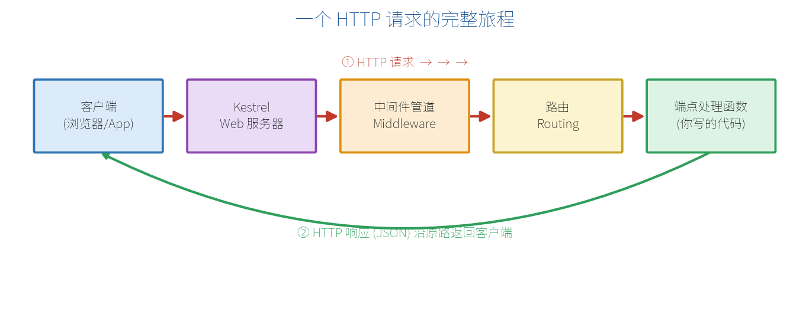
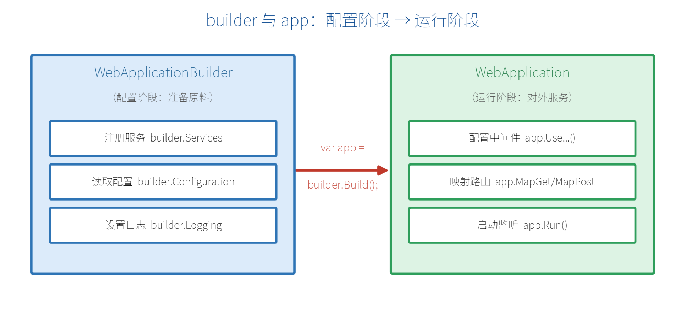
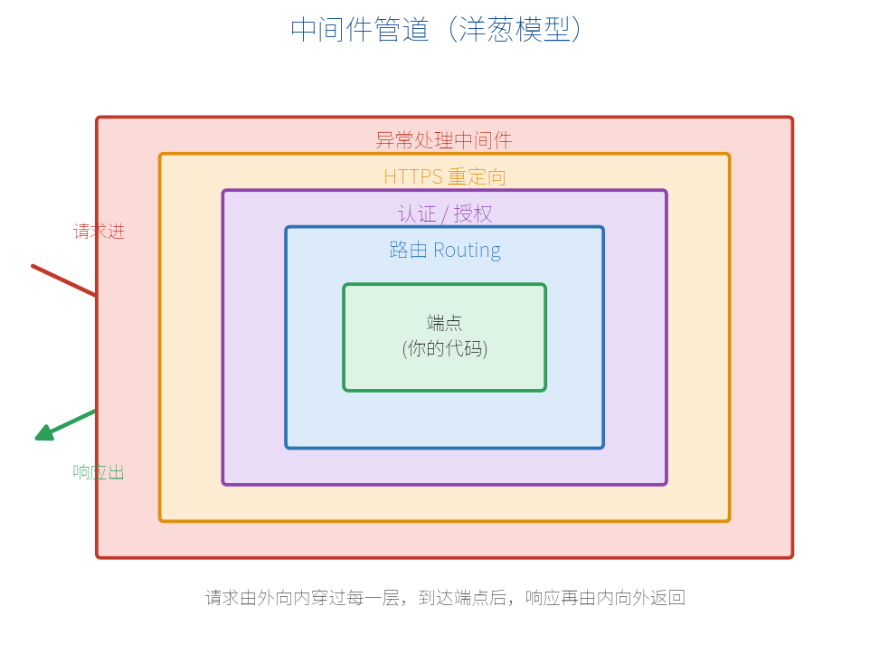
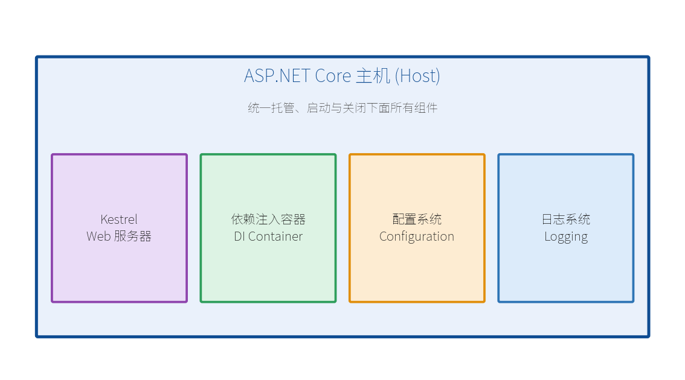

# 第 2 章　运行原理与请求处理管线

上一章我们知道了最小 API 能用几行代码建出接口。但这几行代码背后，程序究竟是怎么跑起来、又是怎么处理一个请求的？这一章我们"掀开引擎盖"，把运行原理讲清楚。**理解了原理，后面遇到任何问题都能心中有数、不再靠猜。**

## 2.1 一个 HTTP 请求在 ASP.NET Core 中的旅程

当浏览器向你的接口发出一个请求，这个请求并不是"直接"跳到你写的那行 `MapGet` 代码里，而是要依次经过好几站，像坐地铁一样。看下图：



我们顺着箭头，看请求经过的每一站：

1. **客户端发起请求**：浏览器 / App / Postman 向服务器地址发出 HTTP 请求。
2. **Kestrel Web 服务器**：ASP.NET Core 内置的高性能 Web 服务器，它是请求进入程序的"大门"，负责接收原始的网络数据并解析成 HTTP 请求对象。
3. **中间件管道**：请求依次穿过一系列"中间件"，比如异常处理、HTTPS 重定向、认证授权等（下面 2.3 节详讲）。
4. **路由（Routing）**：根据请求的方法和 URL（如 `GET /api/products`），找到与之匹配的那个端点。
5. **端点处理函数**：也就是你写在 `MapGet(...)` 里的那段代码，真正执行业务逻辑，生成结果。

处理完后，**响应会沿着原路"逆向"返回**，再经过中间件、Kestrel，最终回到客户端。整个过程通常在几毫秒内完成。

> **【关键理解】** 你写的代码（端点处理函数）只是这趟旅程的"最后一站"。它前面还有 Kestrel 和一整条中间件管道在默默工作。这就是为什么理解管线很重要。

## 2.2 WebApplication 与 WebApplicationBuilder 的关系

回看第 1 章的代码，开头两行是：

```csharp
var builder = WebApplication.CreateBuilder(args);  // 第 1 行
var app = builder.Build();                          // 第 2 行
```

这两行代表了程序的**两个阶段**：先用 `builder`（建造者）做各种准备工作，再调用 `builder.Build()` 造出正式的应用对象 `app`。可以类比成"先备料、再开张营业"：



### ① 配置阶段：WebApplicationBuilder

这个阶段你通过 `builder` 做三件典型的事——它们都必须在 `Build()` 之前完成：

- **注册服务**：`builder.Services.AddXxx()`，把要用的功能（数据库、CORS、认证等）登记进依赖注入容器。
- **读取配置**：`builder.Configuration`，读取 appsettings.json、环境变量等。
- **设置日志**：`builder.Logging`，配置日志输出方式。

### ② 运行阶段：WebApplication

调用 `Build()` 后得到 `app`，这个阶段你做两件事，最后启动服务器：

- **配置中间件**：`app.UseXxx()`，把中间件按顺序装进管道。
- **映射路由**：`app.MapGet / MapPost ...`，定义具体的接口端点。
- **启动监听**：`app.Run()`，程序开始监听端口、处理请求（这行之后的代码在服务器关闭前不会执行）。

> **【常见错误】** 服务的注册（AddXxx）必须写在 `builder.Build()` 之前，中间件与路由（UseXxx / MapXxx）必须写在 `Build()` 之后。顺序搞反会直接报错。

## 2.3 中间件（Middleware）管道原理

中间件是 ASP.NET Core 最核心的概念之一。一个中间件就是一段"能处理请求的代码"，多个中间件**首尾相连组成一条管道**。请求像水一样从管道一头流入，经过每一节，再从另一头流出。经典的示意是"洋葱模型"：



请求**由外向内**逐层穿过每个中间件，到达最里面的端点（你的代码）；生成响应后，再**由内向外**逐层返回。每一层都可以：①对请求做点事；②决定是否把请求交给下一层；③在响应返回时再做点事。

下面是一段典型的中间件配置，注意——它们的书写顺序，就是请求穿过的顺序：

```csharp
var app = builder.Build();

app.UseExceptionHandler("/error");  // 最外层：捕获后面所有环节的异常
app.UseHttpsRedirection();          // 把 http 请求重定向到 https
app.UseAuthentication();            // 认证：你是谁
app.UseAuthorization();             // 授权：你能不能访问

app.MapGet("/api/products", () => new[] { "苹果", "香蕉" });  // 端点

app.Run();
```

你也可以用 `app.Use(...)` 写一个自定义中间件。参数里的 `next` 代表"管道的下一节"，调用它请求才会继续往里走：

```csharp
app.Use(async (context, next) =>
{
    // ① 请求进入时（由外向内）
    Console.WriteLine($"收到请求：{context.Request.Path}");

    await next();  // 把请求交给下一节中间件 / 端点

    // ② 响应返回时（由内向外）
    Console.WriteLine($"返回状态码：{context.Response.StatusCode}");
});
```

> **【重点】** 中间件的顺序至关重要。例如 `UseAuthentication` 必须在 `UseAuthorization` 之前，否则"还没搞清你是谁，就先判断你能不能进"，逻辑就错了。第 12 章会深入讲中间件与端点过滤器。

## 2.4 主机、Kestrel、依赖注入容器三者关系

初学时经常听到几个词：主机（Host）、Kestrel、依赖注入容器（DI）。它们到底是什么关系？一张图看懂：



- **主机（Host）**：最外层的"大管家"，负责统一启动、托管和优雅关闭下面的所有组件。你调用的 `app.Run()` 本质就是启动主机。
- **Kestrel**：内置的跨平台 Web 服务器，真正负责监听端口、收发 HTTP 数据。
- **依赖注入容器（DI Container）**：管理程序里所有"服务"的仓库，需要用哪个服务，它就自动"送货上门"（第 7 章详讲）。
- **配置系统与日志系统**：分别负责读取参数配置、输出运行日志。

简单说：主机把这些组件"装在一起、统一管理"，你写的最小 API 就运行在这套地基之上。

## 2.5 Program.cs 顶级语句逐行拆解

你可能注意到，最小 API 的 `Program.cs` 里**没有 class，也没有 Main 方法**，代码直接"裸写"在文件里。这用到了 C# 的"顶级语句（Top-level statements）"特性——编译器会自动帮你把这些代码包进一个隐藏的 Main 方法里。下面把一个稍完整的 Program.cs 逐行拆开讲：

```csharp
// ① 创建建造者，args 是命令行参数
var builder = WebApplication.CreateBuilder(args);

// ② 【配置阶段】注册服务：这里注册了 CORS 支持
builder.Services.AddCors();

// ③ 造出应用对象
var app = builder.Build();

// ④ 【运行阶段】配置中间件
app.UseCors();

// ⑤ 映射一个 GET 端点，返回当前时间（自动序列化为 JSON）
app.MapGet("/api/time", () => new { now = DateTime.Now });

// ⑥ 启动服务器，开始监听（阻塞在此，直到程序关闭）
app.Run();
```

1. `CreateBuilder(args)`：创建建造者，读取默认配置、日志等。
2. `AddCors()`：把 CORS 服务登记到 DI 容器（属于配置阶段）。
3. `Build()`：结束配置，生成 app。
4. `UseCors()`：启用 CORS 中间件（属于运行阶段）。
5. `MapGet(...)`：定义接口。返回的匿名对象会被自动转成 JSON。
6. `app.Run()`：启动并阻塞，服务器开始对外服务。

> **【本章小结】** 一个请求要经过 Kestrel → 中间件管道 → 路由 → 端点，再原路返回；程序分"配置阶段（builder）"和"运行阶段（app）"两步；中间件像洋葱一样层层包裹，顺序很关键；主机作为大管家托管 Kestrel、DI、配置、日志。搞懂这套原理，下一章我们就动手把开发环境搭起来，亲手跑通第一个程序。
