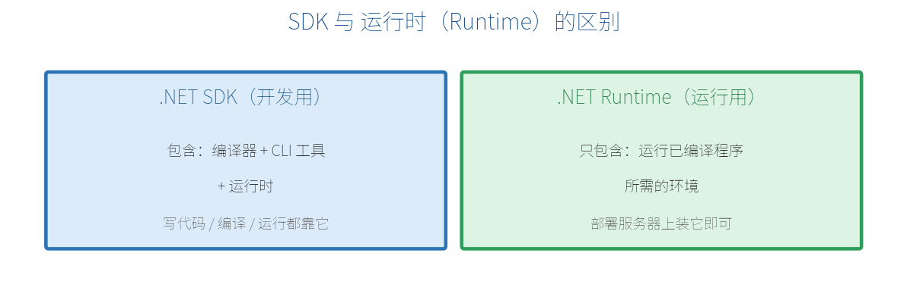
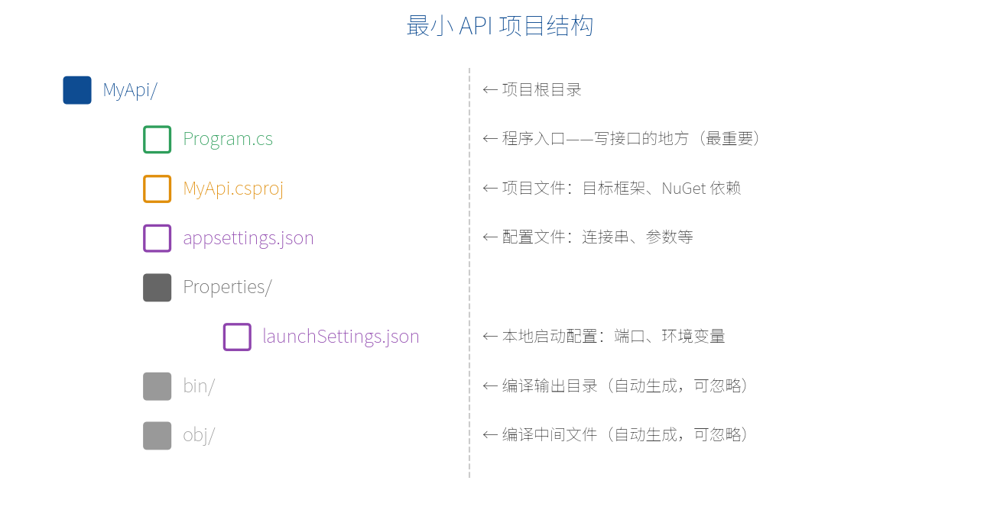
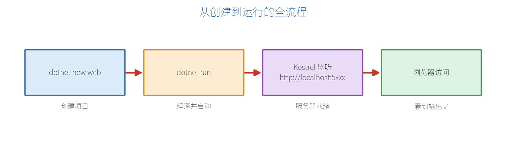

# 第 3 章　环境搭建与第一个程序

原理讲完，该动手了。这一章带你从零把环境搭好，并**亲手跑通第一个最小 API 程序**。所有命令都基于跨平台通用的 `.NET CLI`（命令行工具），无论你用 Visual Studio 2026 还是 VS Code 都适用。

## 3.1 安装 .NET 10 SDK

开发最小 API，你需要安装 **.NET 10 SDK**。注意区分 SDK 和运行时（Runtime）：



- **SDK（Software Development Kit）**：开发工具包，包含编译器、CLI 命令行工具，还内含运行时。**开发阶段装它。**
- **Runtime（运行时）**：只负责运行已经编译好的程序。**部署到服务器时装它即可。**

到微软官网 `https://dotnet.microsoft.com/download` 下载对应操作系统（Windows / macOS / Linux）的 .NET 10 SDK 安装即可。装好后，打开终端验证：

```bash
dotnet --version
```

如果输出类似 `10.0.100` 这样的版本号，说明安装成功。再用下面这条命令可以看到已安装的所有 SDK：

```bash
dotnet --list-sdks
```

> **【提示】** Windows 用户如果安装了 Visual Studio 2026，勾选"ASP.NET 和 Web 开发"工作负载时，.NET 10 SDK 会一并装好，无需单独下载。

## 3.2 用 CLI 创建项目 dotnet new web

在终端里，进入你想放代码的目录，执行下面这条命令，创建一个名为 `MyApi` 的最小 API 项目：

```bash
dotnet new web -n MyApi
```

这条命令拆开看：

- `dotnet new`：创建新项目。
- `web`：使用"空的 ASP.NET Core（最小 API）"模板。这正是我们要的最精简模板。
- `-n MyApi`：指定项目名为 MyApi（会创建同名文件夹）。

创建完成后，进入项目文件夹：

```bash
cd MyApi
```

> **【小知识】** 还有一个常见模板叫 webapi（`dotnet new webapi`），它会额外生成一个天气预报示例和 OpenAPI 配置。本教程为了从最简开始，先用最精简的 web 模板。

## 3.3 项目结构详解

用 web 模板创建的项目非常精简，主要就下面这几个文件。先认识它们，后面才知道该改哪里：



- **Program.cs**：程序入口，也是你**写接口的主战场**，本教程绝大部分代码都写在这里。
- **MyApi.csproj**：项目文件，声明目标框架（如 `net10.0`）和引用的 NuGet 包。
- **appsettings.json**：配置文件，存放数据库连接串、自定义参数等（第 14 章详讲）。
- **Properties/launchSettings.json**：本地启动配置，比如监听哪个端口、用什么环境。
- **bin/ 和 obj/**：编译时自动生成的目录，不用手动管，通常也不提交到 Git。

打开 `MyApi.csproj`，内容大致如下：

```xml
<Project Sdk="Microsoft.NET.Sdk.Web">
  <PropertyGroup>
    <TargetFramework>net10.0</TargetFramework>
    <Nullable>enable</Nullable>
    <ImplicitUsings>enable</ImplicitUsings>
  </PropertyGroup>
</Project>
```

- `TargetFramework` 为 `net10.0` 表示使用 .NET 10。
- `ImplicitUsings` 开启后，常用的 using 会自动引入，所以 Program.cs 顶部看不到一堆 using 也能正常编译。

## 3.4 运行与热重载 dotnet watch

在项目目录下，用下面这条命令运行程序：

```bash
dotnet run
```

终端会输出类似这样的日志，告诉你服务器在哪个地址监听：

```text
Now listening on: http://localhost:5000
Application started. Press Ctrl+C to shut down.
```

这时打开浏览器访问那个地址即可。要停止服务器，按 `Ctrl + C`。

开发时更推荐用**热重载**命令——改完代码保存后自动重新编译运行，不用手动重启：

```bash
dotnet watch
```



## 3.5 Hello World 全流程示例

现在把前面所有步骤串起来，完整走一遍。目标：做一个能返回文字和 JSON 的接口。

### 第 1 步：打开 Program.cs，替换为以下内容

```csharp
var builder = WebApplication.CreateBuilder(args);
var app = builder.Build();

// 接口1：返回一段纯文本
app.MapGet("/", () => "Hello World! 我的第一个最小 API 跑起来了！");

// 接口2：返回 JSON（匿名对象会被自动序列化）
app.MapGet("/api/hello", (string? name) =>
    new { message = $"你好，{name ?? "陌生人"}！", time = DateTime.Now });

app.Run();
```

### 第 2 步：运行

```bash
dotnet watch
```

### 第 3 步：在浏览器里测试

假设服务器监听在 5000 端口，分别访问下面两个地址：

- 访问 `http://localhost:5000/` → 页面显示：Hello World! 我的第一个最小 API 跑起来了！
- 访问 `http://localhost:5000/api/hello?name=小明` → 返回一段 JSON：

```json
{
  "message": "你好，小明！",
  "time": "2026-07-17T14:30:00.123456+08:00"
}
```

看到 JSON 正常返回，恭喜你——**你已经独立完成了一个真正的最小 API 接口**！其中 `(string? name)` 是从查询字符串自动接收的参数，这种"参数绑定"的魔法我们会在第 5 章专门讲。

> **【本章小结】** 开发装 SDK、部署装 Runtime；用 `dotnet new web` 建项目、`dotnet watch` 热重载运行；项目里最重要的文件是 Program.cs。你现在已经能创建、运行、测试一个最小 API 了。从下一章（第 4 章）开始，我们逐个攻克路由、参数、返回值等核心功能。在继续之前，如果对"前端怎么调用这些接口"还没概念，强烈建议先读一遍书末的**附录 A**。
