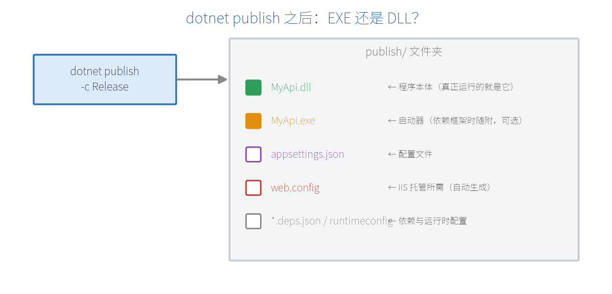
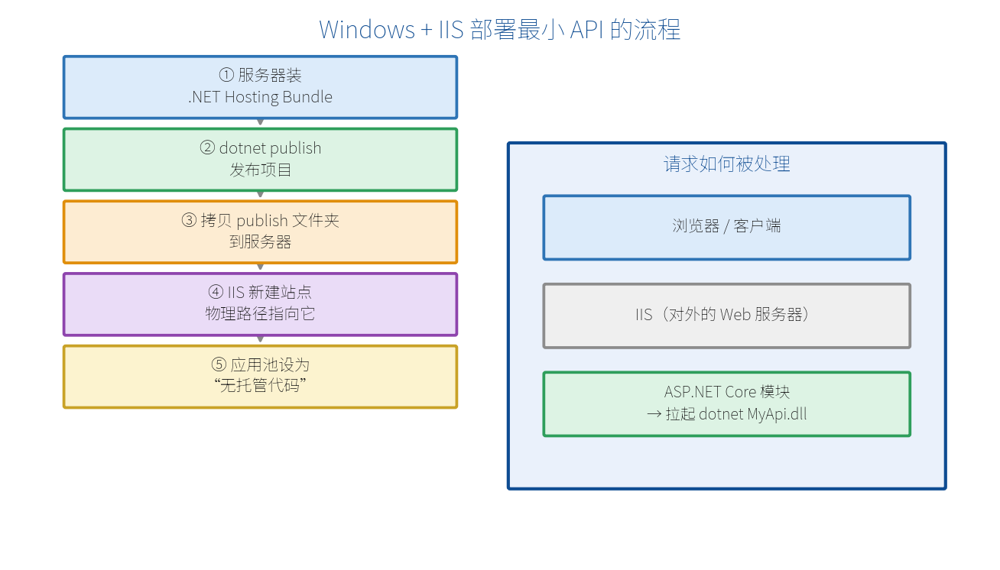
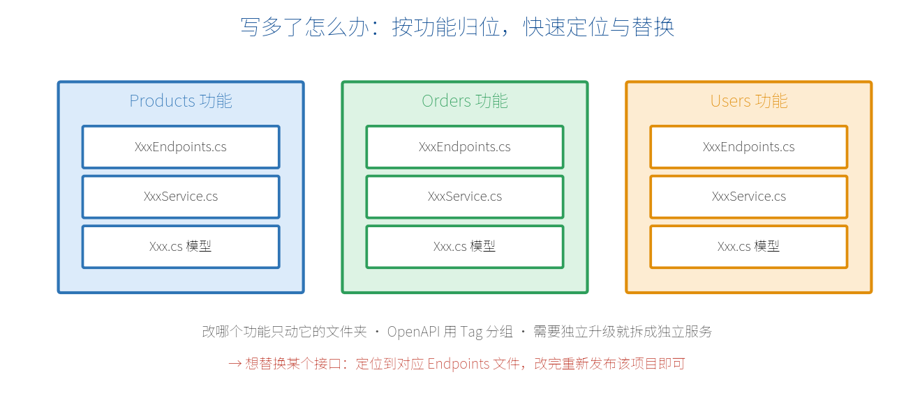

# 第 4 章　在 Windows 服务器上部署、运行与管理最小 API

上一章你已经在本地把程序跑起来了。但"在自己电脑上 `dotnet run`"和"部署到一台服务器上、让别人也能访问"是两回事。这一章就把这条链路走完：**编译后到底得到什么、怎么放到 Windows + IIS 服务器上跑起来、以及接口写多了怎么不乱、怎么快速定位和替换某个接口。** 全程以 Windows 平台为例，手把手来。

> **【说明】** 本章讲的是最基础、最常见的 Windows + IIS 用法，让你先能"上线可用"。更进阶的部署（Linux、Docker、原生 AoT、性能优化）放在第 20 章。

## 4.1 编译后是 EXE 还是 DLL？

这是新手最常见的疑问。答案是：**主要是 DLL，同时也会有一个 EXE**，取决于你的发布方式。

先用发布命令把项目打包（在项目目录执行）：

```bash
dotnet publish -c Release -o .\publish
```

`-c Release` 表示以"发布配置"编译（比 Debug 更优化），`-o .\publish` 把产物输出到 `publish` 文件夹。打开这个文件夹，你会看到：



| 产物 | 是什么 |
| --- | --- |
| **MyApi.dll** | **程序本体**，你写的代码编译成的就是它，真正运行的是它 |
| **MyApi.exe** | 一个**启动器**（依赖框架发布时随附），双击它 = 执行 `dotnet MyApi.dll` |
| MyApi.runtimeconfig.json | 运行时配置（用哪个版本的 .NET 等） |
| MyApi.deps.json | 依赖清单 |
| appsettings.json | 你的配置文件 |
| web.config | **给 IIS 用的**托管配置（发布时自动生成） |

所以：

- **命令行手动运行**：`dotnet MyApi.dll`（推荐、通用），或直接运行 `MyApi.exe`。
- **依赖框架发布**（默认）：DLL 是本体，服务器需要装 .NET 运行时。
- **自包含 / 原生 AoT 发布**：会生成一个**独立的 `MyApi.exe`**，把运行时一起打包，目标机无需装 .NET（详见第 20 章）。

> **【重点】** 记住一句话：**.dll 才是你的程序本体**；那个 .exe 只是帮你"一键启动"的壳。在 IIS 里部署时，你两个都不用去双击——IIS 会自动帮你拉起进程（见 4.3）。

## 4.2 发布：dotnet publish 要点

```bash
# 依赖框架发布（体积小，服务器需装 .NET 10 运行时）
dotnet publish -c Release -o .\publish

# 自包含发布（带上运行时，服务器无需装 .NET；体积大）
dotnet publish -c Release -r win-x64 --self-contained -o .\publish
```

- `-r win-x64`：目标运行平台为 64 位 Windows。
- 发布完成后，**整个 `publish` 文件夹**就是你要拷到服务器上的东西。

## 4.3 在 Windows + IIS 上部署运行（手把手）

IIS（Internet Information Services）是 Windows 自带的 Web 服务器，是国内 Windows 服务器上托管 .NET 应用最常见的方式。整体流程如下：



### 第 1 步：服务器安装 .NET Hosting Bundle

在服务器上安装 **.NET 10 Hosting Bundle**（注意不是普通运行时）。它一次性装好三样东西：.NET 运行时、ASP.NET Core 运行时、以及关键的 **ASP.NET Core 模块（ANCM）**——正是这个模块让 IIS 能托管你的应用。

到微软官网下载 "ASP.NET Core Runtime 10.x — Hosting Bundle" 安装即可。装完在命令行执行一次让 IIS 重新加载：

```bash
net stop was /y
net start w3svc
```

### 第 2 步：确认 IIS 已启用

在"启用或关闭 Windows 功能"里勾选 **Internet Information Services**（服务器系统用"服务器管理器 → 添加角色 → Web 服务器 (IIS)"）。

### 第 3 步：发布并拷贝到服务器

把 4.2 里发布好的 `publish` 文件夹整个拷到服务器，比如放到 `C:\inetpub\MyApi`。

### 第 4 步：在 IIS 里新建站点

打开 **IIS 管理器**：

1. 右键"网站" → **添加网站**。
2. 网站名称：`MyApi`。
3. 物理路径：指向你拷贝的文件夹 `C:\inetpub\MyApi`。
4. 绑定：类型 http，端口填 `80`（或你想要的端口，如 `8080`）。

### 第 5 步：把应用程序池设为"无托管代码"

这是最容易踩错的一步。IIS 里"应用程序池"默认是 ".NET CLR v4.0"，但 ASP.NET Core 应用**不经过 IIS 的 .NET 运行时**，而是自己跑一个 dotnet 进程。所以：

1. 打开 IIS 的 **应用程序池**，找到 `MyApi`。
2. 右键 → **基本设置** → ".NET CLR 版本" 选 **"无托管代码（No Managed Code）"**。

### 第 6 步：访问

浏览器打开 `http://服务器IP` 或 `http://服务器IP:端口`，就能访问你的接口了。

### 它是怎么跑起来的？

- IIS 收到请求 → **ASP.NET Core 模块**在后台自动执行 `dotnet MyApi.dll`，拉起一个 Kestrel 进程（这叫"进程内/进程外托管"）。
- 你**不需要手动去运行那个 exe/dll**，IIS 会负责启动、崩溃后重启、随 IIS 一起管理。
- 之前发布时自动生成的 `web.config` 就是告诉 IIS "该怎么启动这个应用"的。

> **【常见坑】**
> ① 访问报 **500.19 / 500.31 / 502.5**：多半是没装 Hosting Bundle，或版本不匹配——重装对应版本的 Hosting Bundle。
> ② 应用池忘了设"无托管代码"——会各种报错。
> ③ 装完 Hosting Bundle 一定要**重启 IIS**（`net stop was /y && net start w3svc`），否则模块不生效。
> ④ 站点文件夹需要给 IIS 账户（`IIS_IUSRS`）读取权限。

### 不想用 IIS？也可以直接跑或装成 Windows 服务

- **直接命令行运行**（简单场景/内网）：在 publish 文件夹里执行

```bash
dotnet MyApi.dll --urls "http://0.0.0.0:8080"
```

  `--urls` 里用 `0.0.0.0` 才能被外部机器访问（`localhost` 只能本机访问）。缺点是 SSH/远程桌面一关，进程可能就停了。

- **装成 Windows 服务**（推荐，能开机自启、后台常驻）：用 `sc.exe` 把它注册成服务

```bash
sc.exe create MyApiSvc binPath= "C:\inetpub\MyApi\MyApi.exe --urls http://0.0.0.0:8080" start= auto
sc.exe start MyApiSvc
```

  这样它就像其它 Windows 服务一样后台运行、开机自动启动、崩溃可配置重启。

## 4.4 设置生产环境与配置

部署到服务器后，通常要把环境切成 **Production**，并覆盖一些配置（如数据库连接串）。在 Windows 上设环境变量：

```bash
# 该应用运行时使用生产环境配置（会加载 appsettings.Production.json）
setx ASPNETCORE_ENVIRONMENT "Production"
```

- 程序会按第 15 章讲的优先级合并配置：`appsettings.json` < `appsettings.Production.json` < 环境变量。
- 敏感信息（密码、密钥）建议放环境变量，不要写死在文件里、更不要提交到 Git。
- 生产环境的 HTTPS 证书通常配在 IIS 的站点绑定里（或交给前置的 Nginx / 负载均衡）。

## 4.5 最小 API 写多了怎么办：防混乱、快速定位与替换

用最小 API 爽在"几行一个接口"，但接口一多，全堆在 `Program.cs` 里就会变成一团乱麻。下面是几条让项目**始终清爽、改起来快**的实用原则（更系统的组织方式见第 19 章）。



### 原则 1：按功能分文件，别都堆在 Program.cs

把每一类功能的端点抽到独立文件里，用扩展方法挂载。`Program.cs` 只负责"组装"：

```csharp
// Features/Products/ProductEndpoints.cs
public static class ProductEndpoints
{
    public static IEndpointRouteBuilder MapProductEndpoints(
        this IEndpointRouteBuilder app)
    {
        var g = app.MapGroup("/api/products").WithTags("商品");
        g.MapGet("/", GetAll);
        g.MapGet("/{id:int}", GetById);
        g.MapPost("/", Create);
        return app;
    }
    // ...GetAll / GetById / Create 命名方法...
}
```

```csharp
// Program.cs —— 一目了然
app.MapProductEndpoints();
app.MapOrderEndpoints();
app.MapUserEndpoints();
```

### 原则 2：一个功能一个文件夹（按功能归位）

```text
Features/
├── Products/   ← 商品相关的端点、服务、模型都在这
├── Orders/     ← 订单相关的都在这
└── Users/      ← 用户相关的都在这
```

**改哪个功能，就只进哪个文件夹**，不会牵动无关代码。新人接手也能按功能一眼定位。

### 原则 3：统一命名与路由前缀

- 路由用"名词 + 版本前缀"：`/api/products`、`/api/v1/orders`。
- 端点分组用 `MapGroup`，并 `.WithTags("商品")` 打标签——这样在接口文档（第 11 章 OpenAPI）里会**自动按功能分类**，几十个接口也能快速找到。

### 原则 4：怎么快速"替换"某个接口

- **改逻辑**：定位到该功能的 `XxxEndpoints.cs`（或对应的服务类），改完**重新 `dotnet publish` 覆盖部署**即可。因为端点按功能分了文件，改动范围很小、不易误伤。
- **整块功能要独立升级/替换**：把它拆成**独立的最小 API 项目（独立服务）**单独部署。各服务通过 HTTP 互相调用（附录 A 讲过的服务间调用），这就是微服务思路——某个服务想换实现、单独重启，都不影响其它服务。

### 原则 5：加健康检查，方便运维定位

给每个服务加一个 `/health` 端点（第 16 章），运维和监控系统就能快速判断"哪个服务挂了"，定位问题更快。

> **【本章小结】** 编译后 **.dll 是程序本体**、.exe 是启动器；Windows 上最常用 **IIS + Hosting Bundle** 托管：发布 → 拷贝 → 建站点 → 应用池设"无托管代码" → IIS 通过 ASP.NET Core 模块自动拉起你的应用；也可用 `--urls 0.0.0.0` 直接跑或注册成 Windows 服务常驻。接口写多了，靠"按功能分文件夹 + 分组打标签 + 必要时拆独立服务"来防乱、快速定位和替换。至此第一部分（入门与原理）就全部结束了——你已经能从零开发、本地运行、部署上线并管理一个最小 API。从下一章（第 5 章）开始，我们进入第二部分，逐个深入路由、参数、返回值等核心功能。
