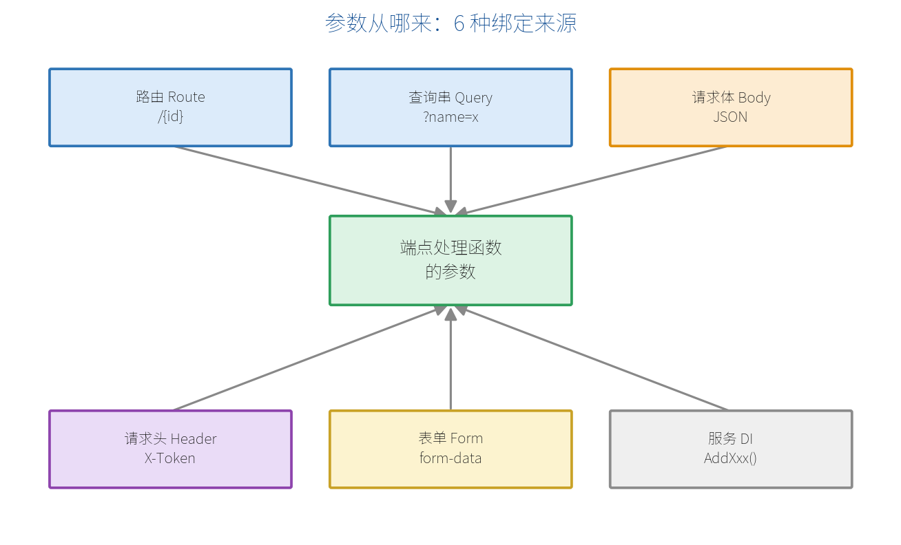

# 第 5 章　参数绑定（Parameter Binding）

上一章我们写了 `(int id)`、`(Product p)` 这样的参数，请求里的数据就"自动"变成了它们。这个"自动"的过程就叫**参数绑定**。这一章把它彻底讲清楚。

## 5.1 绑定来源全景图

最小 API 会根据参数的类型和位置，从不同的地方取值。一共有 6 大来源：



- **路由（Route）**：来自 URL 路径里的 `{参数}`。
- **查询串（Query）**：来自 `?key=value`。
- **请求体（Body）**：来自 POST/PUT 提交的 JSON。
- **请求头（Header）**：来自 HTTP 头。
- **表单（Form）**：来自表单提交。
- **服务（DI）**：来自依赖注入容器（第 7 章）。

## 5.2 默认绑定规则（不加特性时）

大多数情况下你**不用写任何特性**，框架按下面的规则自动判断：

| 参数类型 | 默认从哪绑定 |
| --- | --- |
| 名字与路由参数一致（如 `{id}` 对 `int id`） | 路由 |
| 简单类型（int、string、bool…）且不在路由中 | 查询串 |
| 复杂类型（自定义类 / record） | 请求体（JSON） |
| 已在 DI 注册的服务类型 | 依赖注入 |
| `HttpContext`、`HttpRequest` 等特殊类型 | 框架直接提供 |

```csharp
// id 来自路由，keyword 来自查询串，两者都自动识别
app.MapGet("/search/{id:int}", (int id, string? keyword) =>
    $"分类 {id}，关键字：{keyword ?? "无"}");
// 访问 /search/3?keyword=手机
```

## 5.3 用特性显式指定来源

当默认规则不满足需求时，用特性明确指定：

```csharp
using Microsoft.AspNetCore.Mvc;

app.MapPost("/demo/{id}", (
    [FromRoute] int id,             // 来自路由
    [FromQuery] string? tag,        // 来自查询串
    [FromHeader(Name = "X-Token")] string? token, // 来自请求头
    [FromBody] Product product) =>  // 来自请求体 JSON
{
    return new { id, tag, token, product };
});
```

| 特性 | 来源 |
| --- | --- |
| `[FromRoute]` | 路由参数 |
| `[FromQuery]` | 查询字符串 |
| `[FromHeader]` | 请求头 |
| `[FromBody]` | 请求体（JSON） |
| `[FromForm]` | 表单数据 |
| `[FromServices]` | 依赖注入（.NET 10 中通常可省略） |

## 5.4 绑定复杂对象与集合

复杂对象默认从请求体读取 JSON：

```csharp
// 前端 POST 一段 JSON：{ "id": 3, "name": "西瓜", "price": 12 }
app.MapPost("/products", (Product p) => $"收到：{p.Name}");

record Product(int Id, string Name, decimal Price);
```

查询串也能绑定数组：

```csharp
// 访问 /tags?t=a&t=b&t=c  →  tags = ["a","b","c"]
app.MapGet("/tags", ([FromQuery(Name = "t")] string[] tags) => tags);
```

## 5.5 用 AsParameters 聚合参数

当参数很多时，可以用一个类 + `[AsParameters]` 把它们打包，让签名更整洁：

```csharp
app.MapGet("/products", ([AsParameters] ProductQuery query) =>
    $"页码 {query.Page}，每页 {query.Size}，关键字 {query.Keyword}");

struct ProductQuery
{
    public int Page { get; set; }
    public int Size { get; set; }
    public string? Keyword { get; set; }
}
// 访问 /products?page=2&size=10&keyword=水果
```

## 5.6 自定义绑定：TryParse 与 BindAsync

对于自定义类型，有两种方式让它能直接作为参数绑定。

**方式一：实现 `TryParse`**（适合从字符串解析，如查询串/路由）：

```csharp
app.MapGet("/point/{p}", (Point p) => $"坐标 ({p.X},{p.Y})");
// 访问 /point/3,4

public record Point(int X, int Y)
{
    // 框架会自动调用它把 "3,4" 变成 Point
    public static bool TryParse(string? value, out Point result)
    {
        result = new Point(0, 0);
        var parts = value?.Split(',');
        if (parts is { Length: 2 }
            && int.TryParse(parts[0], out var x)
            && int.TryParse(parts[1], out var y))
        {
            result = new Point(x, y);
            return true;
        }
        return false;
    }
}
```

**方式二：实现 `BindAsync`**（适合需要读取整个 `HttpContext` 的复杂场景）：

```csharp
public record CurrentUser(string Name)
{
    public static ValueTask<CurrentUser?> BindAsync(HttpContext context)
    {
        var name = context.Request.Headers["X-User"].ToString();
        return ValueTask.FromResult<CurrentUser?>(new CurrentUser(name));
    }
}

app.MapGet("/me", (CurrentUser user) => $"你好，{user.Name}");
```

## 5.7 可选参数与默认值

- 类型加 `?` 表示可选（可为 null）。
- 直接给参数默认值，缺省时使用默认值。

```csharp
// keyword 可选；page 默认为 1
app.MapGet("/list", (string? keyword, int page = 1) =>
    $"关键字 {keyword ?? "无"}，第 {page} 页");
```

> **【注意】** 请求体（`[FromBody]`）默认是**必需**的，且一个端点只能有一个请求体参数。如果允许请求体为空，把参数设为可空并妥善处理 null。

> **【本章小结】** 参数绑定让"请求数据 → 函数参数"自动完成：简单类型多来自路由/查询串，复杂类型来自请求体，服务来自 DI。默认规则不够时用 `[FromXxx]` 特性显式指定，用 `[AsParameters]` 聚合，用 `TryParse`/`BindAsync` 支持自定义类型。下一章我们看处理完之后——怎么把结果返回给前端。
