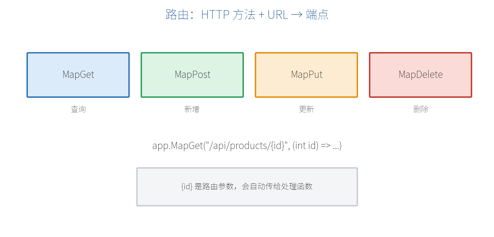

# 第二部分　核心功能

# 第 5 章　路由（Routing）

从这一章开始，我们进入最小 API 的核心功能。第一个要掌握的就是**路由**——它决定了"哪个网址、哪种请求，交给哪段代码处理"。

## 5.1 路由的本质：方法 + 路径 → 端点

一个路由由两部分组成：**HTTP 方法**（GET/POST…）和 **URL 路径**（如 `/api/products`）。两者一起，唯一确定一个**端点（Endpoint）**。



最小 API 用一系列 `MapXxx` 方法来注册路由：

```csharp
app.MapGet("/products", () => "查询所有商品");     // GET
app.MapPost("/products", () => "新增商品");         // POST
app.MapPut("/products/1", () => "更新 1 号商品");   // PUT
app.MapDelete("/products/1", () => "删除 1 号商品");// DELETE
app.MapPatch("/products/1", () => "局部更新");      // PATCH
```

## 5.2 五个常用的 Map 方法

| 方法 | 对应操作 | 典型用途 |
| --- | --- | --- |
| `MapGet` | 查 | 获取列表、获取详情 |
| `MapPost` | 增 | 新建资源 |
| `MapPut` | 改（整体替换） | 更新整个对象 |
| `MapDelete` | 删 | 删除资源 |
| `MapPatch` | 改（局部） | 只改某几个字段 |

> **【提示】** 同一个路径 `/products`，配上不同的 HTTP 方法，就是不同的端点。这正是 REST 风格 API 的基础：用"名词做路径、动词做方法"。

## 5.3 路由参数 {id}

路径中用大括号 `{}` 定义**路由参数**，它会自动作为同名参数传给处理函数：

```csharp
// 访问 /products/5 时，id 自动等于 5
app.MapGet("/products/{id}", (int id) =>
    $"你要查的是 {id} 号商品");
```

这里参数类型写成 `int`，框架会自动把路径里的 `5` 转成整数。如果传的不是数字（如 `/products/abc`），会返回 404（见下一节约束）。

也可以有多个路由参数：

```csharp
app.MapGet("/users/{userId}/orders/{orderId}", (int userId, int orderId) =>
    $"用户 {userId} 的订单 {orderId}");
```

## 5.4 路由约束

路由约束用来限制参数的格式，写法是 `{参数:约束}`。常用约束如下：

| 约束 | 含义 | 示例 |
| --- | --- | --- |
| `int` | 必须是整数 | `{id:int}` |
| `guid` | 必须是 GUID | `{id:guid}` |
| `alpha` | 只能是字母 | `{name:alpha}` |
| `min(n)` / `max(n)` | 最小 / 最大值 | `{age:min(18)}` |
| `length(n)` | 固定长度 | `{code:length(6)}` |
| 正则 | 自定义正则 | `{sku:regex(^[A-Z]+$)}` |

```csharp
// id 必须是整数，否则不匹配此端点（返回 404）
app.MapGet("/products/{id:int}", (int id) => $"商品 {id}");

// 只匹配 6 位数字的验证码
app.MapGet("/verify/{code:length(6)}", (string code) => $"验证码 {code}");
```

> **【重点】** 约束不匹配时，请求不会进入这个端点，而是继续找其它匹配的路由；都不匹配才返回 404。所以约束既是校验，也是"路由分流"的手段。

## 5.5 路由分组 MapGroup

当很多接口共享同一段前缀（如都以 `/api/products` 开头）时，用 `MapGroup` 把它们归为一组，避免重复书写，也方便统一加认证、过滤器等：

```csharp
var products = app.MapGroup("/api/products");

products.MapGet("/", () => "商品列表");           // GET  /api/products
products.MapGet("/{id:int}", (int id) => $"商品 {id}"); // GET  /api/products/{id}
products.MapPost("/", (Product p) => "已新增");    // POST /api/products
products.MapDelete("/{id:int}", (int id) => "已删除");  // DELETE /api/products/{id}
```

分组还能嵌套，也能整组加上认证（第 13 章）：

```csharp
var admin = app.MapGroup("/admin").RequireAuthorization();
admin.MapGet("/stats", () => "仅管理员可见的统计");
```

## 5.6 完整 CRUD 路由示例

把上面所学串起来，做一个内存版商品的完整增删改查：

```csharp
var builder = WebApplication.CreateBuilder(args);
var app = builder.Build();

var products = new List<Product>
{
    new(1, "苹果", 5.5m),
    new(2, "香蕉", 3.0m)
};

var group = app.MapGroup("/api/products");

// 查询全部
group.MapGet("/", () => products);

// 查询单个
group.MapGet("/{id:int}", (int id) =>
{
    var p = products.FirstOrDefault(x => x.Id == id);
    return p is null ? Results.NotFound() : Results.Ok(p);
});

// 新增
group.MapPost("/", (Product p) =>
{
    products.Add(p);
    return Results.Created($"/api/products/{p.Id}", p);
});

// 更新
group.MapPut("/{id:int}", (int id, Product input) =>
{
    var index = products.FindIndex(x => x.Id == id);
    if (index == -1) return Results.NotFound();
    products[index] = input;
    return Results.NoContent();
});

// 删除
group.MapDelete("/{id:int}", (int id) =>
{
    products.RemoveAll(x => x.Id == id);
    return Results.NoContent();
});

app.Run();

record Product(int Id, string Name, decimal Price);
```

这段代码已经是一个可运行的、结构清晰的 REST API。其中 `Results.NotFound()`、`Results.Created(...)` 等返回值，是第 7 章的内容；`Product p` 参数怎么自动从请求体解析出来，是第 6 章的内容。

> **【本章小结】** 路由 = HTTP 方法 + 路径。用 `MapGet/MapPost/MapPut/MapDelete/MapPatch` 注册端点；用 `{id}` 定义路由参数、`{id:int}` 加约束；用 `MapGroup` 归并共享前缀并统一配置。下一章讲清楚：请求里的各种数据，是怎么"自动变成"处理函数参数的。
