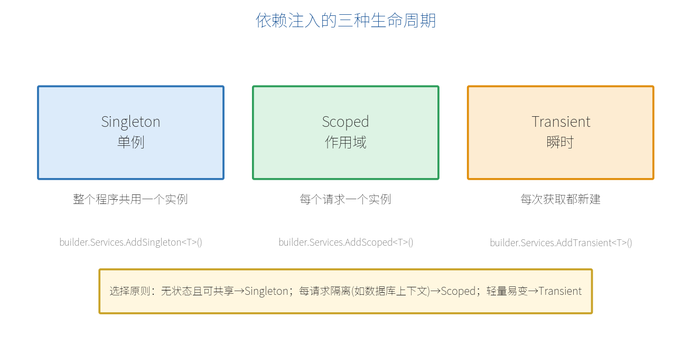

# 第 7 章　依赖注入（DI）

真实项目里，端点不会把所有逻辑都写在 lambda 里，而是调用各种"服务"——数据库访问、业务逻辑、发邮件等。这些服务怎么送到端点里？答案是**依赖注入（Dependency Injection，DI）**。

## 7.1 什么是依赖注入

一句话：**你要用什么，不自己 new，而是"声明需要它"，由框架自动创建并送进来。** 这个负责创建和管理服务的角色，就是 **DI 容器**。

好处是：解耦、易测试、生命周期统一管理。最小 API 从第 2 章讲的 `builder.Services` 就是在往这个容器里登记服务。

## 7.2 三种生命周期

注册服务时要指定它的"生命周期"，即容器多久创建一个新实例：



| 生命周期 | 注册方法 | 何时创建新实例 |
| --- | --- | --- |
| **Singleton（单例）** | `AddSingleton` | 整个程序只创建一个，全程序共用 |
| **Scoped（作用域）** | `AddScoped` | 每个 HTTP 请求创建一个 |
| **Transient（瞬时）** | `AddTransient` | 每次获取都新建一个 |

> **【选择原则】** 无状态、可安全共享的服务用 Singleton；与单次请求相关（如数据库上下文 DbContext）用 Scoped；轻量、用完即弃的用 Transient。

## 7.3 注册与解析服务

先定义一个服务接口和实现：

```csharp
public interface IGreeter
{
    string Greet(string name);
}

public class Greeter : IGreeter
{
    public string Greet(string name) => $"你好，{name}！";
}
```

在 `builder` 阶段注册（注意：一定在 `Build()` 之前）：

```csharp
var builder = WebApplication.CreateBuilder(args);

builder.Services.AddSingleton<IGreeter, Greeter>();  // 注册为单例

var app = builder.Build();
```

## 7.4 在端点中注入服务

端点处理函数直接把服务类型写成参数，框架会自动从容器解析并传入：

```csharp
// IGreeter 会被自动注入
app.MapGet("/greet/{name}", (string name, IGreeter greeter) =>
    greeter.Greet(name));
```

对比一下：`name` 来自路由，`greeter` 来自 DI 容器——框架能自动区分（第 5 章讲过的绑定规则）。在 .NET 10 里，服务参数通常**无需**再写 `[FromServices]`。

## 7.5 配置选项模式 IOptions&lt;T&gt;

把一组配置封装成强类型对象，是推荐做法。先定义配置类：

```csharp
public class MailOptions
{
    public string Host { get; set; } = "";
    public int Port { get; set; }
}
```

在 `appsettings.json` 里配置：

```json
{
  "Mail": {
    "Host": "smtp.example.com",
    "Port": 465
  }
}
```

绑定并在端点中使用：

```csharp
builder.Services.Configure<MailOptions>(
    builder.Configuration.GetSection("Mail"));

// 端点注入 IOptions<MailOptions>
app.MapGet("/mail-config", (IOptions<MailOptions> options) =>
{
    var mail = options.Value;
    return new { mail.Host, mail.Port };
});
```

## 7.6 一个更真实的分层示例

把业务逻辑放进服务，端点只负责"接请求、调服务、返结果"：

```csharp
var builder = WebApplication.CreateBuilder(args);
builder.Services.AddScoped<IProductService, ProductService>();
var app = builder.Build();

app.MapGet("/api/products", (IProductService svc) => svc.GetAll());
app.MapGet("/api/products/{id:int}", (int id, IProductService svc) =>
    svc.Find(id) is { } p ? Results.Ok(p) : Results.NotFound());

app.Run();

public interface IProductService
{
    IEnumerable<Product> GetAll();
    Product? Find(int id);
}

public class ProductService : IProductService
{
    private readonly List<Product> _items =
        [ new(1, "苹果", 5.5m), new(2, "香蕉", 3.0m) ];

    public IEnumerable<Product> GetAll() => _items;
    public Product? Find(int id) => _items.FirstOrDefault(x => x.Id == id);
}

public record Product(int Id, string Name, decimal Price);
```

这样端点保持"薄"，业务逻辑集中在服务里，既清晰又好测试。

## 7.7 常见误区

> **【注意】** 不要在 **Singleton** 服务里注入 **Scoped** 服务。单例只创建一次，会把某一次请求的 Scoped 实例"焊死"在自己身上，导致后续请求拿到过期对象。框架在启动时通常会直接报错提醒你。

- 数据库上下文 `DbContext`（第 9 章）应注册为 **Scoped**。
- 无状态工具类（如纯计算、格式化）适合 **Singleton**。
- 若不确定，**Scoped 是最安全的默认选择**。

> **【本章小结】** DI 让你"声明即可得到"服务；三种生命周期 Singleton/Scoped/Transient 分别对应"全程序 / 每请求 / 每次"创建；在 `builder.Services` 注册、在端点参数里解析；配置用 `IOptions<T>` 强类型化。核心功能部分到此结束，下一部分我们进入"数据与校验"，先讲 .NET 10 重磅的内置校验。
