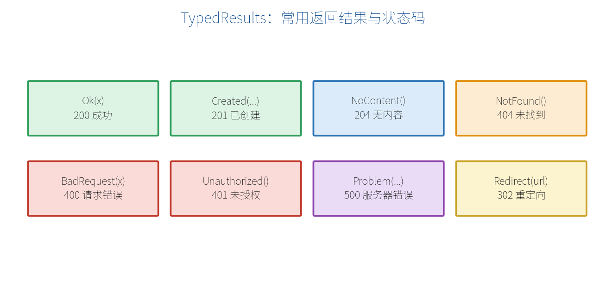

# 第 7 章　返回结果（Results）

请求处理完，要把结果返回给前端。返回什么、用什么状态码，直接影响前端如何解析。这一章讲清楚最小 API 的返回值机制。

## 7.1 三种返回风格

最小 API 的处理函数可以返回三类东西：

1. **直接返回数据**（string、对象、集合）——框架自动序列化，状态码默认 200。
2. **返回 `Results.Xxx(...)`**——精确控制状态码和内容。
3. **返回 `TypedResults.Xxx(...)`**——与上者类似，但类型明确，对 OpenAPI 文档和测试更友好（**推荐**）。

```csharp
// 风格1：直接返回，自动转 JSON，状态码 200
app.MapGet("/a", () => new { name = "苹果", price = 5.5 });

// 风格2：Results
app.MapGet("/b", () => Results.Ok(new { ok = true }));

// 风格3：TypedResults（推荐）
app.MapGet("/c", () => TypedResults.Ok(new { ok = true }));
```

> **【重点】** 优先用 `TypedResults`。它返回的类型是明确的（如 `Ok<T>`），能让 OpenAPI 自动推断出响应结构，也便于单元测试直接断言返回类型。

## 7.2 常用结果与状态码



| 方法 | 状态码 | 用途 |
| --- | --- | --- |
| `TypedResults.Ok(x)` | 200 | 成功并返回数据 |
| `TypedResults.Created(uri, x)` | 201 | 新建成功，返回新资源位置 |
| `TypedResults.NoContent()` | 204 | 成功但无返回内容（如删除、更新） |
| `TypedResults.NotFound()` | 404 | 资源不存在 |
| `TypedResults.BadRequest(x)` | 400 | 请求参数有误 |
| `TypedResults.Unauthorized()` | 401 | 未认证 |
| `TypedResults.Forbid()` | 403 | 已认证但无权限 |
| `TypedResults.Conflict(x)` | 409 | 资源冲突 |
| `TypedResults.Problem(...)` | 500 等 | 标准化错误响应 |

## 7.3 一个端点返回多种结果

现实中一个端点常有多种结局：找到了返回 200，没找到返回 404。用 `Results<T1, T2>` 声明所有可能的返回类型，既清晰又能被 OpenAPI 识别：

```csharp
using Microsoft.AspNetCore.Http.HttpResults;

app.MapGet("/products/{id:int}",
    Results<Ok<Product>, NotFound> (int id) =>
    {
        var p = Find(id);
        return p is null
            ? TypedResults.NotFound()
            : TypedResults.Ok(p);
    });
```

## 7.4 返回 JSON、文件、流、重定向

```csharp
// JSON（可指定状态码）
app.MapGet("/json", () => TypedResults.Json(new { hi = "there" }, statusCode: 200));

// 纯文本
app.MapGet("/text", () => TypedResults.Text("纯文本内容"));

// 文件下载
app.MapGet("/download", () =>
    TypedResults.File("/data/report.pdf", "application/pdf", "报告.pdf"));

// 字节流
app.MapGet("/bytes", () =>
    TypedResults.Bytes(new byte[] { 1, 2, 3 }, "application/octet-stream"));

// 重定向
app.MapGet("/go", () => TypedResults.Redirect("https://example.com"));
```

## 7.5 标准化错误：ProblemDetails

返回错误时，推荐用 `Problem`/`ValidationProblem`，它们遵循 RFC 9457（Problem Details）标准格式，前端能统一解析：

```csharp
app.MapGet("/risky", () =>
    TypedResults.Problem(
        title: "库存不足",
        detail: "商品 5 的库存为 0",
        statusCode: 409));
```

返回的 JSON 大致如下：

```json
{
  "type": "https://tools.ietf.org/html/rfc9457",
  "title": "库存不足",
  "status": 409,
  "detail": "商品 5 的库存为 0"
}
```

## 7.6 自定义 IResult

需要完全掌控响应时，可实现 `IResult` 接口：

```csharp
public class HtmlResult(string html) : IResult
{
    public async Task ExecuteAsync(HttpContext context)
    {
        context.Response.ContentType = "text/html; charset=utf-8";
        await context.Response.WriteAsync(html);
    }
}

app.MapGet("/hello-html", () => new HtmlResult("<h1>你好</h1>"));
```

> **【本章小结】** 直接返回数据最省事（自动 200 + JSON）；要控制状态码用 `TypedResults`（优先，利于文档和测试）；一个端点多种结局用 `Results<...>` 声明；错误用 `Problem` 输出标准格式。下一章讲依赖注入——业务逻辑、数据库等"服务"是怎么送到端点里的。
