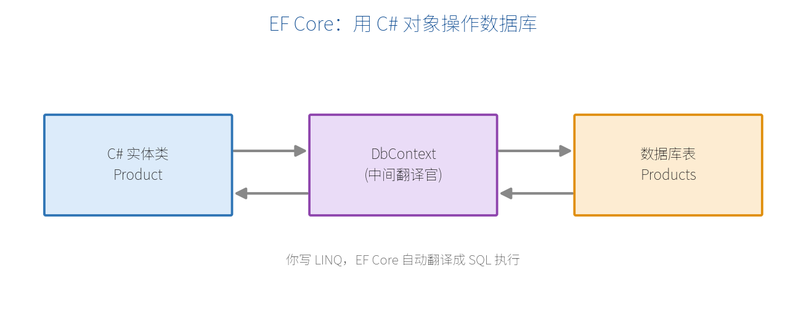

# 第 9 章　数据持久化与 EF Core

前面的数据都存在内存里，程序一重启就没了。真实应用要把数据存进**数据库**。.NET 里最主流的数据库访问技术是 **EF Core（Entity Framework Core）**。这一章用它做一个能落库的 TodoList。

## 9.1 EF Core 简介

EF Core 是一个 **ORM（对象关系映射）**框架。它让你用 C# 对象和 LINQ 操作数据库，自动帮你翻译成 SQL，不用手写 SQL 语句。



核心三样东西：

- **实体类**：一个 C# 类对应数据库里的一张表。
- **DbContext**：数据库会话，负责查询、跟踪变更、保存。
- **DbSet&lt;T&gt;**：对应一张表的集合，通过它增删改查。

## 9.2 安装

以 SQLite（轻量、免安装，适合学习）为例，安装 NuGet 包：

```bash
dotnet add package Microsoft.EntityFrameworkCore.Sqlite
dotnet add package Microsoft.EntityFrameworkCore.Design
```

生产中常用 SQL Server（`Microsoft.EntityFrameworkCore.SqlServer`）或 PostgreSQL（`Npgsql.EntityFrameworkCore.PostgreSQL`），用法几乎一致，只是连接串和 `UseXxx` 不同。

## 9.3 定义模型与 DbContext

定义实体类：

```csharp
public class Todo
{
    public int Id { get; set; }              // 主键（约定：Id 自动成为主键）
    public string Title { get; set; } = "";
    public bool IsDone { get; set; }
    public DateTime CreatedAt { get; set; } = DateTime.Now;
}
```

定义 DbContext：

```csharp
using Microsoft.EntityFrameworkCore;

public class AppDbContext(DbContextOptions<AppDbContext> options)
    : DbContext(options)
{
    public DbSet<Todo> Todos => Set<Todo>();   // 对应 Todos 表
}
```

在 `Program.cs` 注册（注册为 **Scoped**，这是 EF Core 的推荐生命周期）：

```csharp
var builder = WebApplication.CreateBuilder(args);

builder.Services.AddDbContext<AppDbContext>(options =>
    options.UseSqlite("Data Source=todos.db"));

var app = builder.Build();
```

## 9.4 迁移与数据库初始化

**迁移（Migration）**把你的模型变化同步到数据库结构。先安装 CLI 工具（一次即可）：

```bash
dotnet tool install --global dotnet-ef
```

创建首个迁移并应用到数据库：

```bash
dotnet ef migrations add InitialCreate   # 生成迁移代码
dotnet ef database update                # 在数据库里建表
```

执行后会生成 `todos.db` 文件，里面有了 `Todos` 表。以后每次改模型（加字段等），重复 `migrations add` + `database update` 即可。

## 9.5 用最小 API 实现完整 TodoList CRUD

把 EF Core 和前面所学串起来，做一个真正落库的 TodoList：

```csharp
using Microsoft.EntityFrameworkCore;

var builder = WebApplication.CreateBuilder(args);
builder.Services.AddDbContext<AppDbContext>(o =>
    o.UseSqlite("Data Source=todos.db"));
var app = builder.Build();

var todos = app.MapGroup("/api/todos");

// 查询全部
todos.MapGet("/", async (AppDbContext db) =>
    await db.Todos.ToListAsync());

// 查询单个
todos.MapGet("/{id:int}", async (int id, AppDbContext db) =>
    await db.Todos.FindAsync(id) is { } t
        ? Results.Ok(t) : Results.NotFound());

// 新增
todos.MapPost("/", async (Todo todo, AppDbContext db) =>
{
    db.Todos.Add(todo);
    await db.SaveChangesAsync();
    return Results.Created($"/api/todos/{todo.Id}", todo);
});

// 更新
todos.MapPut("/{id:int}", async (int id, Todo input, AppDbContext db) =>
{
    var todo = await db.Todos.FindAsync(id);
    if (todo is null) return Results.NotFound();
    todo.Title = input.Title;
    todo.IsDone = input.IsDone;
    await db.SaveChangesAsync();
    return Results.NoContent();
});

// 删除
todos.MapDelete("/{id:int}", async (int id, AppDbContext db) =>
{
    var todo = await db.Todos.FindAsync(id);
    if (todo is null) return Results.NotFound();
    db.Todos.Remove(todo);
    await db.SaveChangesAsync();
    return Results.NoContent();
});

app.Run();
```

注意几点：

- `AppDbContext db` 通过 **DI 自动注入**（第 7 章）。
- 数据库操作用 **异步**方法（`ToListAsync`、`SaveChangesAsync` 等），配合 `async/await`，不阻塞线程。
- 改完对象后要调 `SaveChangesAsync()` 才会真正写库。

## 9.6 异步查询与分页

列表数据多时要分页，用 `Skip` + `Take`；还可以用 LINQ 过滤、排序：

```csharp
todos.MapGet("/paged", async (AppDbContext db, int page = 1, int size = 10) =>
{
    var query = db.Todos
        .Where(t => !t.IsDone)              // 只看未完成
        .OrderByDescending(t => t.CreatedAt); // 按时间倒序

    var total = await query.CountAsync();
    var items = await query
        .Skip((page - 1) * size)
        .Take(size)
        .ToListAsync();

    return new { total, page, size, items };
});
```

EF Core 会把这些 LINQ 翻译成高效的 SQL（带 `WHERE`、`ORDER BY`、`LIMIT/OFFSET`），只从数据库取当前页的数据。

> **【注意】** 查询大表时避免先 `ToListAsync()` 再在内存里 `Where`——那会把整表拉进内存。应尽量在 `IQueryable` 上完成过滤/排序/分页，让数据库来干活。

> **【本章小结】** EF Core 用实体类 + DbContext + DbSet 让你以对象和 LINQ 操作数据库；`AddDbContext` 注册（Scoped）、迁移建表、异步方法读写、`SaveChangesAsync` 落库。至此你已能写出真正持久化数据的最小 API。第四部分我们进入文档、安全与实时通信，先讲 .NET 10 内置的 OpenAPI。
