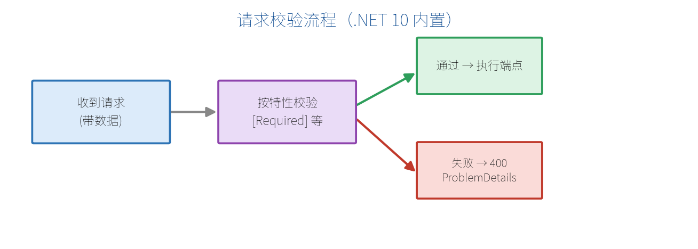

# 第三部分　数据与校验

# 第 9 章　请求校验（.NET 10 新特性重点）

前端传来的数据不能全信——邮箱格式对不对？价格是不是负数？名字空不空？这就需要**校验**。这一章是 .NET 10 的重点：过去要自己写校验代码，现在**内置支持**了。

## 9.1 .NET 10 内置校验：Data Annotations 原生支持

在 .NET 10 之前，最小 API 没有开箱即用的模型校验，开发者往往得手写一堆 `if` 判断。**.NET 10 起，最小 API 原生支持用 Data Annotations 特性（`[Required]` 等）自动校验**，而且兼容原生 AoT 编译。

开启只需一行：

```csharp
var builder = WebApplication.CreateBuilder(args);

builder.Services.AddValidation();   // 开启内置校验

var app = builder.Build();
```

之后，只要参数类型上带了校验特性，框架会在进入端点**之前**自动校验，不通过就直接返回 400。



## 9.2 常用校验特性

在模型的属性上加特性即可：

```csharp
using System.ComponentModel.DataAnnotations;

public class CreateProductDto
{
    [Required(ErrorMessage = "商品名不能为空")]
    [StringLength(50, MinimumLength = 2, ErrorMessage = "名称长度 2~50")]
    public string Name { get; set; } = "";

    [Range(0.01, 100000, ErrorMessage = "价格必须在 0.01~100000")]
    public decimal Price { get; set; }

    [EmailAddress(ErrorMessage = "邮箱格式不正确")]
    public string? ContactEmail { get; set; }

    [Range(0, 99999)]
    public int Stock { get; set; }
}
```

| 特性 | 作用 |
| --- | --- |
| `[Required]` | 不能为 null/空 |
| `[StringLength]` / `[MinLength]` / `[MaxLength]` | 字符串长度 |
| `[Range]` | 数值范围 |
| `[EmailAddress]` | 邮箱格式 |
| `[Url]` | URL 格式 |
| `[RegularExpression]` | 正则匹配 |
| `[Compare]` | 与另一属性相等（如确认密码） |

端点照常写，校验自动生效：

```csharp
app.MapPost("/products", (CreateProductDto dto) =>
{
    // 能走到这里，说明 dto 已通过校验
    return TypedResults.Created($"/products/{dto.Name}", dto);
});
```

## 9.3 校验失败返回什么

校验不通过时，框架自动返回 **400** 和标准的 `ValidationProblemDetails`，前端可统一解析：

```json
{
  "type": "https://tools.ietf.org/html/rfc9457",
  "title": "One or more validation errors occurred.",
  "status": 400,
  "errors": {
    "Name": [ "商品名不能为空" ],
    "Price": [ "价格必须在 0.01~100000" ]
  }
}
```

`errors` 里的键是字段名，值是该字段的所有错误消息数组，前端可精准地把错误提示显示到对应输入框。

## 9.4 自定义校验特性

内置特性不够用时，继承 `ValidationAttribute` 写自己的规则。例如"价格必须是 0.5 的整数倍"：

```csharp
public class MultipleOfAttribute(double step) : ValidationAttribute
{
    protected override ValidationResult? IsValid(
        object? value, ValidationContext ctx)
    {
        if (value is decimal d && d % (decimal)step != 0)
            return new ValidationResult(
                $"{ctx.MemberName} 必须是 {step} 的整数倍");
        return ValidationResult.Success;
    }
}

public class PriceDto
{
    [MultipleOf(0.5)]
    public decimal Price { get; set; }
}
```

对于跨字段的复杂校验，可让模型实现 `IValidatableObject`：

```csharp
public class DateRangeDto : IValidatableObject
{
    public DateTime Start { get; set; }
    public DateTime End { get; set; }

    public IEnumerable<ValidationResult> Validate(ValidationContext ctx)
    {
        if (End < Start)
            yield return new ValidationResult(
                "结束时间不能早于开始时间", [nameof(End)]);
    }
}
```

## 9.5 集成 FluentValidation（进阶方案对比）

Data Annotations 简单直观，但规则复杂时会显得笨重。业界常用的替代方案是 **FluentValidation**：把校验规则写在独立的类里，用链式语法表达，逻辑与模型解耦。

```csharp
// 需安装 NuGet 包 FluentValidation
using FluentValidation;

public class CreateProductValidator : AbstractValidator<CreateProductDto>
{
    public CreateProductValidator()
    {
        RuleFor(x => x.Name).NotEmpty().Length(2, 50);
        RuleFor(x => x.Price).InclusiveBetween(0.01m, 100000m);
        RuleFor(x => x.ContactEmail).EmailAddress()
            .When(x => x.ContactEmail is not null);
    }
}
```

在最小 API 中，通常配合端点过滤器（第 13 章）调用校验器。两种方案对比：

| 维度 | Data Annotations（内置） | FluentValidation |
| --- | --- | --- |
| 是否内置 | 是（.NET 10） | 否，需装包 |
| 简单规则 | 很方便 | 稍繁琐 |
| 复杂/跨字段规则 | 较吃力 | 强大灵活 |
| 规则与模型 | 耦合在模型上 | 完全分离 |

> **【建议】** 新手和简单项目：直接用 .NET 10 内置的 Data Annotations。规则复杂、追求可维护性：上 FluentValidation。

> **【本章小结】** .NET 10 让最小 API 原生支持模型校验：`AddValidation()` 开启，属性上加 `[Required]`/`[Range]` 等特性即可，失败自动返回 400 + 标准错误格式。复杂规则可自定义特性、`IValidatableObject` 或改用 FluentValidation。下一章我们把数据真正存进数据库——EF Core 上场。
