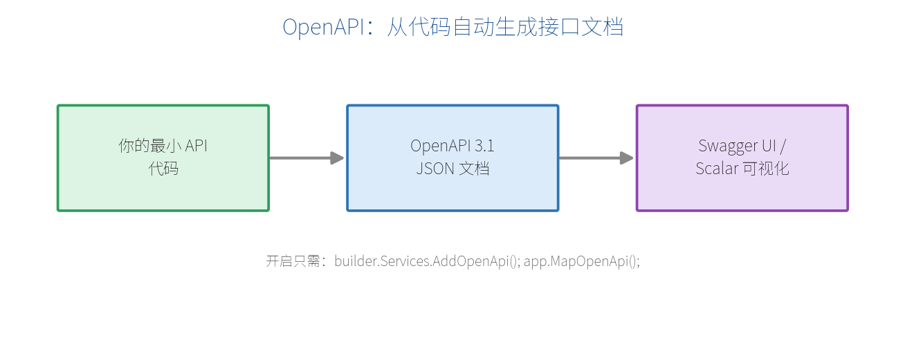

# 第四部分　文档、安全与实时通信

# 第 11 章　OpenAPI 与接口文档（.NET 10 新特性）

接口写好了，前端同事怎么知道有哪些接口、参数是什么、返回什么？靠**接口文档**。手写文档又累又容易过期。好在最小 API 能**自动生成**——这就是 OpenAPI。

## 11.1 什么是 OpenAPI

OpenAPI 是一套描述 HTTP 接口的**标准规范**（前身叫 Swagger）。符合规范的接口描述是一份 JSON/YAML 文件，各种工具（Swagger UI、Postman、代码生成器）都能读懂它。

.NET 10 内置支持生成 **OpenAPI 3.1** 文档，无需第三方库即可产出标准描述。



## 11.2 开启 OpenAPI

两步即可：

```csharp
var builder = WebApplication.CreateBuilder(args);

builder.Services.AddOpenApi();     // ① 注册 OpenAPI 服务

var app = builder.Build();

app.MapOpenApi();                  // ② 暴露文档端点

app.MapGet("/api/hello", () => "hi");

app.Run();
```

运行后访问 `http://localhost:5000/openapi/v1.json`，就能看到自动生成的 OpenAPI 文档（JSON）。

## 11.3 集成可视化界面：Swagger UI / Scalar

原始 JSON 不便阅读，配一个可视化界面就能"点着测接口"。两个常用选择：

**Scalar**（现代、美观，.NET 社区新宠）：

```bash
dotnet add package Scalar.AspNetCore
```

```csharp
using Scalar.AspNetCore;

app.MapOpenApi();
app.MapScalarApiReference();   // 访问 /scalar/v1
```

**Swagger UI**（经典）：

```bash
dotnet add package Swashbuckle.AspNetCore.SwaggerUI
```

```csharp
app.MapOpenApi();
app.UseSwaggerUI(o => o.SwaggerEndpoint("/openapi/v1.json", "v1"));
```

打开对应页面，你能看到所有接口列表，直接填参数、点"发送"就能测试，非常适合调试和交接。

## 11.4 用元数据丰富文档

给端点加描述信息，文档会更清晰。常用链式方法：

```csharp
app.MapGet("/api/products/{id:int}", (int id) => new { id, name = "苹果" })
   .WithName("GetProduct")                 // 操作的唯一名字
   .WithSummary("按 ID 获取商品")           // 一句话摘要
   .WithDescription("根据商品 ID 返回商品详情，找不到返回 404")
   .WithTags("商品")                        // 分组标签
   .Produces<Product>(200)                 // 声明 200 返回类型
   .Produces(404);                         // 声明 404
```

| 方法 | 作用 |
| --- | --- |
| `WithName` | 端点唯一名（也用于生成链接） |
| `WithSummary` | 简短摘要 |
| `WithDescription` | 详细说明 |
| `WithTags` | 分组，界面里按标签归类 |
| `Produces<T>(code)` | 声明某状态码的返回类型 |

> **【提示】** 前面第 7 章推荐的 `TypedResults` 和 `Results<Ok<T>, NotFound>` 写法，能让 OpenAPI **自动推断**出各状态码的返回类型，很多时候连 `Produces` 都不用手写。

## 11.5 从 XML 注释生成文档

还能让文档直接来自代码里的 XML 注释。先在项目文件开启：

```xml
<PropertyGroup>
  <GenerateDocumentationFile>true</GenerateDocumentationFile>
</PropertyGroup>
```

然后在方法/类型上写标准 XML 注释，.NET 10 的 OpenAPI 能把它们纳入文档。这样"注释即文档"，维护成本更低。

## 11.6 接口分组与标签

结合第 5 章的 `MapGroup`，可以给整组接口统一打标签：

```csharp
var products = app.MapGroup("/api/products").WithTags("商品管理");
products.MapGet("/", () => "列表");
products.MapPost("/", (Product p) => "新增");

var orders = app.MapGroup("/api/orders").WithTags("订单管理");
orders.MapGet("/", () => "订单列表");
```

在 Swagger UI / Scalar 里，接口就会按"商品管理""订单管理"分门别类，一目了然。

> **【本章小结】** .NET 10 内置 OpenAPI 3.1：`AddOpenApi()` + `MapOpenApi()` 即生成标准文档，再配 Scalar 或 Swagger UI 得到可视化测试界面；用 `WithSummary`/`WithTags`/`Produces` 或 XML 注释丰富文档；`TypedResults` 能自动推断响应类型。下一章讲安全——认证与授权。
