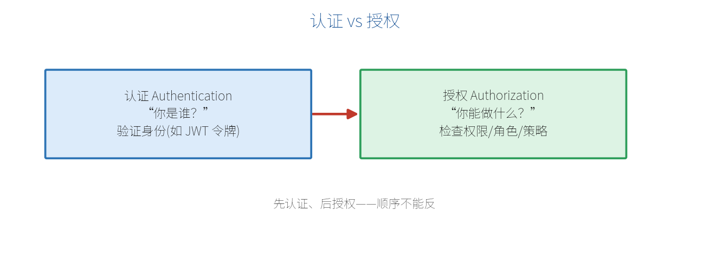

# 第 11 章　认证与授权

不是所有接口都能随便访问。"你是谁"和"你能干什么"是两个问题，分别对应**认证**和**授权**。这一章讲怎么保护你的最小 API。

## 11.1 认证 vs 授权

这是最容易混淆的一对概念：



- **认证（Authentication）**：确认"你是谁"。比如检查你带的令牌是否有效、能不能证明你是某个用户。
- **授权（Authorization）**：在知道你是谁之后，判断"你能不能做这件事"。比如普通用户不能访问管理后台。

顺序永远是：**先认证，后授权**。

## 11.2 JWT Bearer 令牌认证实战

Web API 最常用的认证方式是 **JWT（JSON Web Token）**：用户登录后，服务器发一个签名令牌，之后每次请求都在请求头带上 `Authorization: Bearer <token>`，服务器验签即可确认身份。

安装包并配置：

```bash
dotnet add package Microsoft.AspNetCore.Authentication.JwtBearer
```

```csharp
var builder = WebApplication.CreateBuilder(args);

builder.Services.AddAuthentication("Bearer")
    .AddJwtBearer(options =>
    {
        options.Authority = "https://your-identity-server"; // 令牌颁发方
        options.Audience = "your-api";                       // 受众
        // 学习/自签场景可自定义 TokenValidationParameters 校验签名密钥
    });

builder.Services.AddAuthorization();   // 注册授权服务

var app = builder.Build();

app.UseAuthentication();   // ① 认证中间件（在前）
app.UseAuthorization();    // ② 授权中间件（在后）

app.MapGet("/public", () => "任何人都能看");
app.MapGet("/secret", () => "登录后才能看")
   .RequireAuthorization();   // 需要已认证

app.Run();
```

> **【重点】** `UseAuthentication()` 必须在 `UseAuthorization()` **之前**（呼应第 2 章的中间件顺序）。否则"还没确认你是谁"就去"判断你能不能进"，逻辑错乱。

## 11.3 RequireAuthorization：保护端点

`RequireAuthorization()` 是保护端点最简单的方式：

```csharp
// 保护单个端点
app.MapGet("/profile", () => "我的资料").RequireAuthorization();

// 保护整组端点（结合第 4 章的分组）
var admin = app.MapGroup("/admin").RequireAuthorization();
admin.MapGet("/dashboard", () => "后台首页");
admin.MapGet("/users", () => "用户管理");
```

未带有效令牌访问受保护端点，会自动返回 **401 Unauthorized**。

## 11.4 基于角色与策略的授权

更细粒度的控制：按**角色**或**策略**限制。

**按角色：**

```csharp
// 只有 Admin 角色能访问
app.MapDelete("/api/products/{id:int}", (int id) => "已删除")
   .RequireAuthorization(policy => policy.RequireRole("Admin"));
```

**按策略（更灵活）：** 先定义策略，再引用：

```csharp
builder.Services.AddAuthorization(options =>
{
    options.AddPolicy("成年人", policy =>
        policy.RequireClaim("age") // 必须有 age 声明
              .RequireAssertion(ctx =>
              {
                  var age = ctx.User.FindFirst("age")?.Value;
                  return int.TryParse(age, out var a) && a >= 18;
              }));
});

app.MapGet("/adult-only", () => "18+ 内容")
   .RequireAuthorization("成年人");
```

## 11.5 读取当前用户信息

认证通过后，可以在端点里拿到当前用户（`ClaimsPrincipal`）：

```csharp
using System.Security.Claims;

app.MapGet("/me", (ClaimsPrincipal user) =>
{
    var name = user.Identity?.Name;
    var userId = user.FindFirst(ClaimTypes.NameIdentifier)?.Value;
    var roles = user.FindAll(ClaimTypes.Role).Select(c => c.Value);
    return new { name, userId, roles };
}).RequireAuthorization();
```

`ClaimsPrincipal` 会被自动注入（框架特殊类型，见第 5 章）。里面的**声明（Claims）**就是令牌里携带的一条条身份信息（用户 ID、角色、邮箱等）。

## 11.6 授权失败的状态码

- **401 Unauthorized**：没认证（没登录 / 令牌无效）。
- **403 Forbidden**：认证了，但**没权限**（如普通用户访问管理接口）。

前端可据此区分处理：401 引导去登录，403 提示"无权限"。

> **【本章小结】** 认证解决"你是谁"（常用 JWT Bearer），授权解决"你能干什么"（角色/策略）；中间件顺序是先 `UseAuthentication` 后 `UseAuthorization`；用 `RequireAuthorization()` 保护端点或分组；用注入的 `ClaimsPrincipal` 读取当前用户。下一章讲端点过滤器与中间件——在请求进出时插入横切逻辑。
