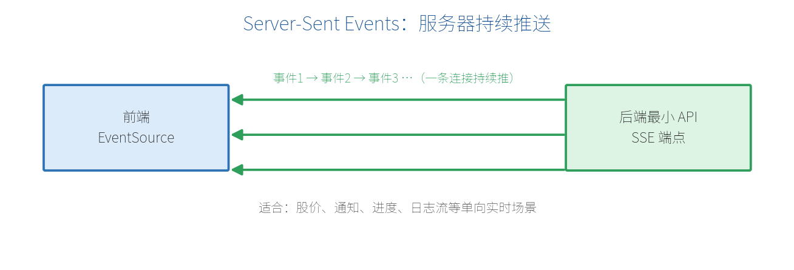

# 第 13 章　实时通信：Server-Sent Events（.NET 10 新特性）

到目前为止，都是"前端问一次、后端答一次"。但有些场景需要**服务器主动、持续地推送**数据：股价跳动、消息通知、任务进度、日志流…….NET 10 为最小 API 内置了 **Server-Sent Events（SSE）**，让这件事变得很简单。

## 13.1 SSE 原理与适用场景

**SSE** 是一种基于 HTTP 的**服务器→客户端单向推送**技术：客户端发起一次请求后，连接保持打开，服务器可以源源不断地把一条条事件推给前端。



SSE vs WebSocket：

| 维度 | SSE | WebSocket |
| --- | --- | --- |
| 方向 | 单向（服务器→客户端） | 双向 |
| 协议 | 普通 HTTP | 独立的 ws 协议 |
| 复杂度 | 简单 | 相对复杂 |
| 适用 | 通知、行情、进度、日志流 | 聊天、协同、游戏 |

一句话：**只需要"服务器往下推"，用 SSE 就够了，且更省事。**

## 13.2 TypedResults.ServerSentEvents 用法

.NET 10 提供了 `TypedResults.ServerSentEvents`，配合 C# 的异步流（`IAsyncEnumerable`）即可推送。下面做一个每秒推送一次当前时间的端点：

```csharp
var builder = WebApplication.CreateBuilder(args);
var app = builder.Build();

app.MapGet("/api/time-stream", (CancellationToken ct) =>
{
    async IAsyncEnumerable<string> Stream(
        [System.Runtime.CompilerServices.EnumeratorCancellation]
        CancellationToken token)
    {
        while (!token.IsCancellationRequested)
        {
            yield return DateTime.Now.ToString("HH:mm:ss");
            await Task.Delay(1000, token);
        }
    }

    return TypedResults.ServerSentEvents(Stream(ct), eventType: "time");
});

app.Run();
```

要点：

- 用 `IAsyncEnumerable<T>` 表达"一个会持续产生数据的流"，`yield return` 推一条。
- `CancellationToken` 在客户端断开时触发，循环随之结束，避免服务器空转。
- `eventType` 给事件命名，前端可按名字监听。

## 13.3 前端接收：EventSource

前端用浏览器内置的 `EventSource` 接收（详见附录 A 方法 10）：

```javascript
const source = new EventSource("http://localhost:5000/api/time-stream");

// 监听指定 eventType="time" 的事件
source.addEventListener("time", (e) => {
  console.log("服务器时间：", e.data);   // 每秒收到一次
});

// 出错或需要停止时关闭
// source.close();
```

## 13.4 实战：推送任务进度

一个更实用的例子——把一个耗时任务的进度实时推给前端：

```csharp
app.MapGet("/api/progress", (CancellationToken ct) =>
{
    async IAsyncEnumerable<object> Run(
        [System.Runtime.CompilerServices.EnumeratorCancellation]
        CancellationToken token)
    {
        for (int i = 0; i <= 100; i += 10)
        {
            yield return new { percent = i, message = $"处理中 {i}%" };
            await Task.Delay(500, token);
        }
        yield return new { percent = 100, message = "完成" };
    }

    return TypedResults.ServerSentEvents(Run(ct), eventType: "progress");
});
```

对象会被自动序列化成 JSON 推送，前端解析 `JSON.parse(e.data)` 即可更新进度条。

> **【提示】** SSE 走的是普通 HTTP，天然兼容现有的反向代理、认证、CORS 配置；浏览器 `EventSource` 还会在断线后**自动重连**，很适合做通知类的长连接。

> **【本章小结】** SSE 是轻量的服务器单向推送，.NET 10 用 `TypedResults.ServerSentEvents` + `IAsyncEnumerable` 让实现变得简单，前端用 `EventSource` 接收；需要双向实时才上 WebSocket。文档、安全、实时三大块讲完，最后一部分进入工程化与进阶。
