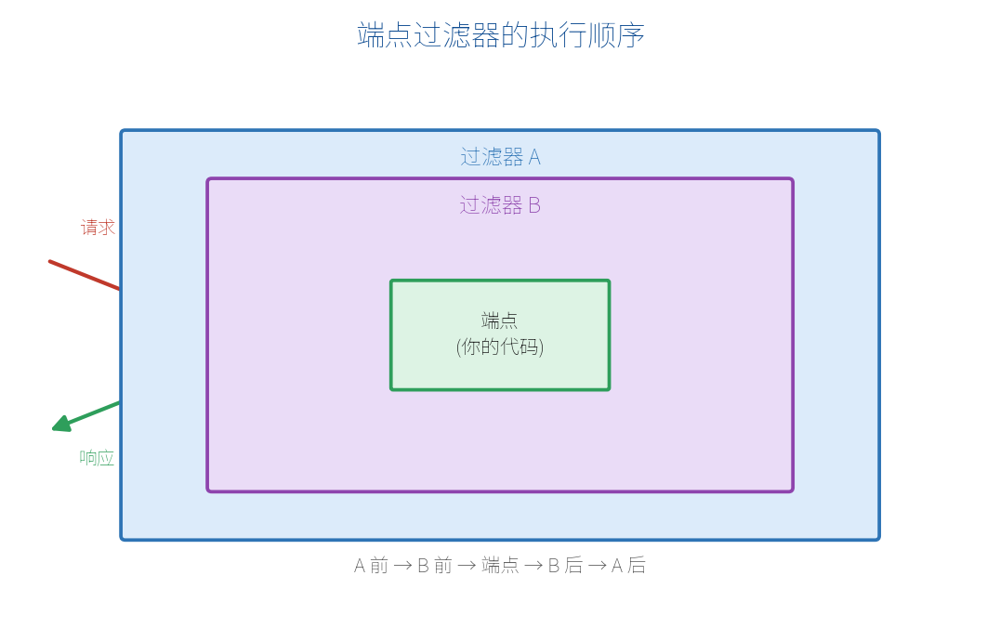

# 第 13 章　端点过滤器与中间件

日志、计时、统一校验、异常处理……这些"每个请求都要做"的横切逻辑，不该塞进每个端点里。最小 API 提供了两个工具：**端点过滤器**和**中间件**。这一章讲清它们的用法与区别。

## 13.1 端点过滤器 AddEndpointFilter

**端点过滤器**在"进入端点前"和"离开端点后"插入逻辑，可以检查/修改参数，也可以拦截并短路返回。

它的执行像洋葱，多个过滤器按注册顺序层层包裹：



一个最简单的过滤器：

```csharp
app.MapGet("/hello/{name}", (string name) => $"你好，{name}")
   .AddEndpointFilter(async (context, next) =>
   {
       // ① 进入端点前
       var name = context.GetArgument<string>(0);
       Console.WriteLine($"即将处理，参数 name={name}");

       var result = await next(context);   // 调用端点（或下一个过滤器）

       // ② 端点返回后
       Console.WriteLine("处理完成");
       return result;
   });
```

## 13.2 编写实用过滤器

**计时过滤器**（统计端点耗时）：

```csharp
async ValueTask<object?> TimingFilter(
    EndpointFilterInvocationContext context,
    EndpointFilterDelegate next)
{
    var sw = System.Diagnostics.Stopwatch.StartNew();
    var result = await next(context);
    sw.Stop();
    Console.WriteLine($"耗时 {sw.ElapsedMilliseconds} ms");
    return result;
}

app.MapGet("/work", () => "done").AddEndpointFilter(TimingFilter);
```

**校验过滤器**（拦截非法参数，直接短路返回 400）：

```csharp
app.MapGet("/items/{id:int}", (int id) => $"item {id}")
   .AddEndpointFilter(async (context, next) =>
   {
       var id = context.GetArgument<int>(0);
       if (id <= 0)
           return Results.BadRequest("id 必须大于 0");  // 短路，不再进入端点
       return await next(context);
   });
```

过滤器也能加在**整组**端点上：

```csharp
var api = app.MapGroup("/api").AddEndpointFilter(TimingFilter);
// api 下所有端点都会被计时
```

## 13.3 端点过滤器 vs 中间件

两者都能插入横切逻辑，但作用范围和时机不同：

| 维度 | 中间件（Middleware） | 端点过滤器（Endpoint Filter） |
| --- | --- | --- |
| 作用范围 | 整个应用的**所有**请求 | 特定端点 / 分组 |
| 执行时机 | 很早，路由匹配前后 | 已匹配到端点、参数已绑定 |
| 能否拿到端点参数 | 不能（只有原始请求） | 能（`GetArgument`） |
| 典型用途 | HTTPS 重定向、CORS、认证、全局异常 | 针对某些端点的校验、计时、日志 |

一句话：**全局的、与具体端点无关的**用中间件；**针对某些端点、需要参数**的用过滤器。

## 13.4 自定义中间件

回顾第 2 章，中间件用 `app.Use` 编写，`next` 决定是否继续：

```csharp
app.Use(async (context, next) =>
{
    var start = DateTime.Now;
    await next();   // 交给管道后续
    var ms = (DateTime.Now - start).TotalMilliseconds;
    context.Response.Headers["X-Response-Time"] = $"{ms}ms";
});
```

复杂逻辑可封装成独立中间件类并用扩展方法挂载，这里不展开。

## 13.5 全局异常处理

端点里难免抛异常，不能把堆栈直接暴露给前端。用内置的异常处理中间件统一兜底，返回标准的 ProblemDetails：

```csharp
var builder = WebApplication.CreateBuilder(args);
builder.Services.AddProblemDetails();   // 启用标准错误格式
var app = builder.Build();

// 生产环境用异常处理器兜底
app.UseExceptionHandler();

app.MapGet("/boom", () =>
{
    throw new InvalidOperationException("出错啦");
});

app.Run();
```

还可以用 `IExceptionHandler` 定制不同异常的响应。这样无论哪个端点抛错，前端拿到的都是统一、干净的错误 JSON，而不是一大段服务器堆栈。

> **【本章小结】** 端点过滤器用 `AddEndpointFilter` 在端点前后插入逻辑（可拿参数、可短路），适合针对性的校验/计时/日志；中间件作用于所有请求，适合全局横切（认证、CORS、异常）；全局异常用 `UseExceptionHandler` + `AddProblemDetails` 统一兜底。下一章讲 .NET 10 的实时推送新特性 SSE。
