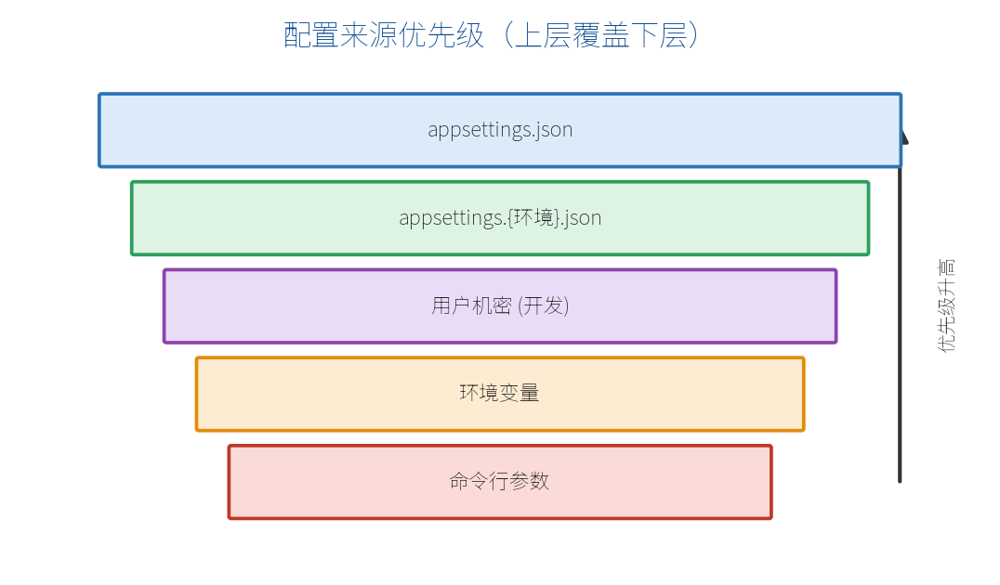

# 第五部分　工程化与进阶

# 第 14 章　配置、日志与错误处理

功能写完，还要让程序"可配置、可观测、出错可控"。这一章讲三件工程化基础：配置系统、日志、错误处理。

## 14.1 配置系统

不要把数据库连接串、密钥等写死在代码里，应放进**配置**。ASP.NET Core 会从多个来源读取配置，并按优先级合并——**上层覆盖下层**：



从低到高：`appsettings.json` < `appsettings.{环境}.json` < 用户机密（开发） < 环境变量 < 命令行参数。这样同一份代码，在不同环境用不同配置，还能被部署时的环境变量安全覆盖。

`appsettings.json` 示例：

```json
{
  "ConnectionStrings": {
    "Default": "Data Source=app.db"
  },
  "AppSettings": {
    "PageSize": 20,
    "SiteName": "我的商城"
  }
}
```

读取配置的几种方式：

```csharp
var builder = WebApplication.CreateBuilder(args);
var config = builder.Configuration;

// 直接按键取
string? conn = config.GetConnectionString("Default");
int pageSize = config.GetValue<int>("AppSettings:PageSize");

var app = builder.Build();

// 在端点里注入 IConfiguration
app.MapGet("/site", (IConfiguration cfg) =>
    cfg["AppSettings:SiteName"]);
```

推荐用第 7 章的**选项模式**把配置绑成强类型对象：

```csharp
builder.Services.Configure<AppSettings>(
    config.GetSection("AppSettings"));

public class AppSettings
{
    public int PageSize { get; set; }
    public string SiteName { get; set; } = "";
}
```

> **【注意】** 密钥、密码等敏感信息**不要**提交到 Git。开发期用"用户机密"（`dotnet user-secrets`），生产用环境变量或密钥管理服务。

## 14.2 结构化日志

ASP.NET Core 内置日志系统，端点里注入 `ILogger<T>` 即可记录：

```csharp
app.MapGet("/orders/{id:int}", (int id, ILogger<Program> logger) =>
{
    // 用占位符而不是字符串拼接——这就是"结构化日志"
    logger.LogInformation("查询订单 {OrderId}", id);
    return $"订单 {id}";
});
```

> **【重点】** 写 `logger.LogInformation("查询订单 {OrderId}", id)` 而不是 `$"查询订单 {id}"`。前者是**结构化日志**：`OrderId` 会作为独立字段被记录，便于日志系统检索、聚合。

日志级别从低到高：`Trace` < `Debug` < `Information` < `Warning` < `Error` < `Critical`。可在配置里控制输出哪一级以上：

```json
{
  "Logging": {
    "LogLevel": {
      "Default": "Information",
      "Microsoft.AspNetCore": "Warning"
    }
  }
}
```

生产环境常接入 Serilog、OpenTelemetry 等，把日志送到文件、ELK、云平台等（此处不展开）。

## 14.3 全局错误处理与 ProblemDetails

呼应第 12 章，工程化项目应有统一的错误出口。推荐组合：

```csharp
var builder = WebApplication.CreateBuilder(args);
builder.Services.AddProblemDetails();     // 标准错误格式
var app = builder.Build();

if (!app.Environment.IsDevelopment())
{
    app.UseExceptionHandler();            // 生产：统一兜底
}

app.MapGet("/boom", void () => throw new Exception("演示错误"));
app.Run();
```

- **开发环境**：默认显示详细异常页，便于排错。
- **生产环境**：`UseExceptionHandler` 把异常转成干净的 ProblemDetails JSON，不泄露堆栈。

还可以用 `IExceptionHandler` 针对不同异常类型返回不同状态码（如把 `KeyNotFoundException` 映射成 404）。

> **【本章小结】** 配置分层且上层覆盖下层，敏感信息走机密/环境变量；日志用注入的 `ILogger<T>` 并采用结构化占位符；错误处理用 `AddProblemDetails` + `UseExceptionHandler` 统一兜底。下一章讲跨域、限流与健康检查。
