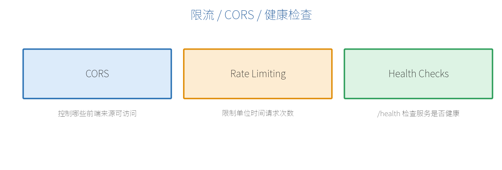

# 第 15 章　跨域（CORS）、限流与健康检查

这一章讲三个上线前几乎都会用到的实用功能：让前端能跨域访问（CORS）、防止接口被刷（限流）、让运维能探活（健康检查）。



## 15.1 CORS：跨域资源共享

附录 A 已经解释过"为什么会跨域"。这里讲**生产级**配置——不要再用 `AllowAnyOrigin()`，而是明确列出允许的前端地址：

```csharp
var builder = WebApplication.CreateBuilder(args);

builder.Services.AddCors(options =>
{
    options.AddPolicy("frontend", policy =>
        policy.WithOrigins(
                  "https://shop.example.com",   // 你的正式前端
                  "http://localhost:3000")      // 本地开发前端
              .AllowAnyHeader()
              .AllowAnyMethod()
              .AllowCredentials());             // 允许带 Cookie/凭证
});

var app = builder.Build();
app.UseCors("frontend");    // 启用指定策略
```

也可以给特定端点/分组单独指定策略：

```csharp
app.MapGet("/open", () => "public data")
   .RequireCors("frontend");
```

> **【注意】** `AllowCredentials()`（允许带凭证）**不能**和 `AllowAnyOrigin()` 同时用——必须明确指定 `WithOrigins`。这是浏览器安全规则。

## 15.2 限流（Rate Limiting）

为防止接口被恶意刷或被单个客户端压垮，用**限流**限制单位时间内的请求次数。ASP.NET Core 内置限流中间件：

```csharp
using System.Threading.RateLimiting;

var builder = WebApplication.CreateBuilder(args);

builder.Services.AddRateLimiter(options =>
{
    // 固定窗口：每 10 秒最多 5 次
    options.AddFixedWindowLimiter("fixed", opt =>
    {
        opt.Window = TimeSpan.FromSeconds(10);
        opt.PermitLimit = 5;
        opt.QueueLimit = 0;
    });
    options.RejectionStatusCode = 429;   // 超限返回 429 Too Many Requests
});

var app = builder.Build();
app.UseRateLimiter();

app.MapGet("/api/data", () => "data")
   .RequireRateLimiting("fixed");   // 对该端点应用限流

app.Run();
```

常见限流算法：

| 算法 | 说明 |
| --- | --- |
| 固定窗口 FixedWindow | 每个时间窗口固定配额，简单 |
| 滑动窗口 SlidingWindow | 更平滑，避免窗口边界突刺 |
| 令牌桶 TokenBucket | 匀速补充令牌，允许一定突发 |
| 并发 Concurrency | 限制同时进行的请求数 |

超出限制的请求会得到 **429 Too Many Requests**。

## 15.3 健康检查（Health Checks）

部署到容器/云平台后，运维系统需要一个地址来判断"这个服务还活着吗"。这就是**健康检查**：

```csharp
var builder = WebApplication.CreateBuilder(args);

builder.Services.AddHealthChecks();
// 可加数据库等依赖检查：.AddDbContextCheck<AppDbContext>();

var app = builder.Build();

app.MapHealthChecks("/health");   // 访问 /health 返回 Healthy/Unhealthy

app.Run();
```

访问 `/health`，健康时返回 200 和 `Healthy`。Kubernetes、负载均衡器等会定期探测这个端点，不健康就把流量从这个实例摘掉或重启它。

可以区分"存活探针"和"就绪探针"：

```csharp
app.MapHealthChecks("/health/live");    // 进程是否活着
app.MapHealthChecks("/health/ready");   // 依赖(数据库等)是否就绪
```

> **【本章小结】** 生产 CORS 要用 `WithOrigins` 明确白名单；限流用 `AddRateLimiter` + `RequireRateLimiting` 防刷，超限返回 429；健康检查用 `MapHealthChecks` 暴露探活端点供运维/编排系统使用。下一章讲 API 版本控制。
