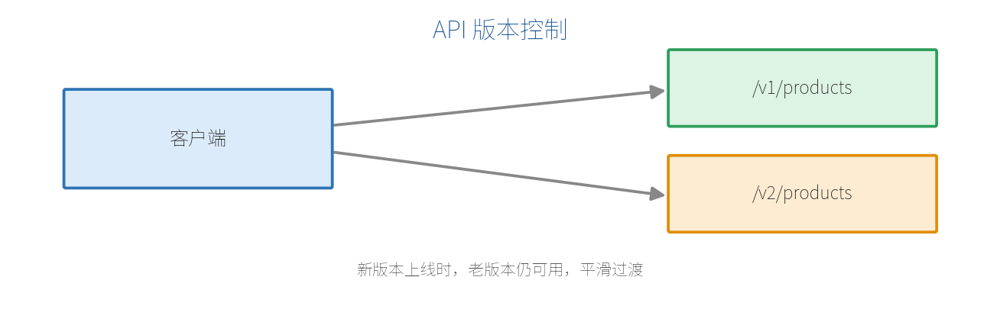

# 第 17 章　API 版本控制

接口上线后会不断演进。如果直接改老接口，可能把正在使用它的客户端弄崩。**API 版本控制**让新旧版本并存、平滑过渡。

## 17.1 为什么需要版本控制

假设 `/api/products` 原来返回 `{ id, name }`，现在业务要改成 `{ id, title, price }`。如果直接改，所有还在用旧字段的前端/App 立刻出错。

正确做法是：保留 `v1`，同时推出 `v2`，让客户端按自己的节奏迁移。



## 17.2 常见的版本表达方式

| 方式 | 示例 | 特点 |
| --- | --- | --- |
| URL 路径 | `/v1/products`、`/v2/products` | 最直观、最常用 |
| 查询字符串 | `/products?api-version=2.0` | URL 干净，但不够显眼 |
| 请求头 | `X-Api-Version: 2.0` | URL 最干净，但不便调试 |

对新手最友好、也最常见的是**URL 路径版本**。

## 17.3 用分组实现最简单的版本控制

结合第 5 章的 `MapGroup`，几行就能实现路径版本：

```csharp
var builder = WebApplication.CreateBuilder(args);
var app = builder.Build();

var v1 = app.MapGroup("/v1/products");
v1.MapGet("/", () => new[]
{
    new { id = 1, name = "苹果" }         // v1 老结构
});

var v2 = app.MapGroup("/v2/products");
v2.MapGet("/", () => new[]
{
    new { id = 1, title = "苹果", price = 5.5 }  // v2 新结构
});

app.Run();
```

老客户端继续用 `/v1/products`，新客户端用 `/v2/products`，互不影响。

## 17.4 结合 OpenAPI 的规范方案

项目变大后，推荐用官方的 `Asp.Versioning` 库做规范化版本管理，它能与第 11 章的 OpenAPI 集成，为每个版本生成独立文档：

```bash
dotnet add package Asp.Versioning.Http
```

```csharp
using Asp.Versioning;

builder.Services.AddApiVersioning(options =>
{
    options.DefaultApiVersion = new ApiVersion(1, 0);
    options.AssumeDefaultVersionWhenUnspecified = true;
    options.ReportApiVersions = true;   // 响应头里回报支持的版本
});

var app = builder.Build();

var versionSet = app.NewApiVersionSet()
    .HasApiVersion(new ApiVersion(1, 0))
    .HasApiVersion(new ApiVersion(2, 0))
    .Build();

app.MapGet("/api/products", () => "v1 数据")
   .WithApiVersionSet(versionSet)
   .MapToApiVersion(1, 0);

app.MapGet("/api/products", () => "v2 数据")
   .WithApiVersionSet(versionSet)
   .MapToApiVersion(2, 0);
```

这样每个版本可分别在 Swagger UI / Scalar 里查看，响应头也会告知客户端当前 API 支持哪些版本。

> **【建议】** 小项目直接用 `MapGroup("/v1")` 路径分组即可；接口多、需要规范文档时再引入 `Asp.Versioning`。无论哪种，核心原则是：**破坏性改动就升版本，老版本保留一段过渡期。**

> **【本章小结】** 版本控制让新旧接口并存、平滑迁移；路径版本最直观（`/v1`、`/v2`），用 `MapGroup` 即可实现；规范场景用 `Asp.Versioning` 并与 OpenAPI 集成。下一章讲如何给最小 API 写测试。
