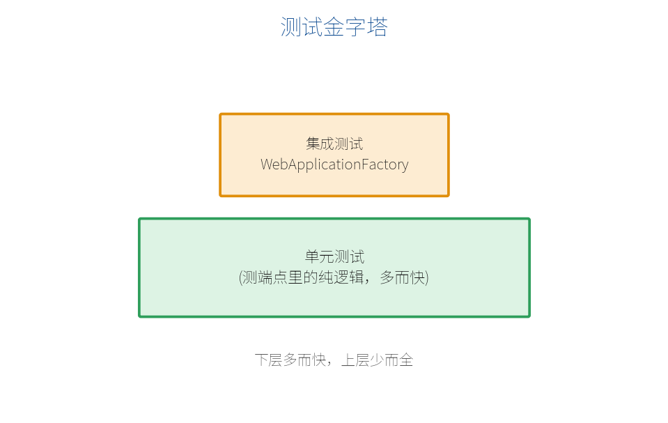

# 第 18 章　测试

代码能跑不等于对。**测试**让你在改动后仍有信心。这一章讲怎么给最小 API 写测试。

## 18.1 测试金字塔

测试分层，越往下越多越快，越往上越少越全：



- **单元测试**：测一小段纯逻辑（如某个服务方法），不启动 Web 服务器，快。
- **集成测试**：把整个应用（含路由、DI、中间件）拉起来，发真实 HTTP 请求，验证端到端行为。

## 18.2 单元测试端点逻辑

要让端点好测，第 8 章讲过：把业务逻辑放进服务，端点保持"薄"。这样直接测服务即可。用 xUnit：

```bash
dotnet new xunit -n MyApi.Tests
dotnet add MyApi.Tests reference MyApi
```

```csharp
public class ProductServiceTests
{
    [Fact]
    public void Find_返回存在的商品()
    {
        var svc = new ProductService();

        var product = svc.Find(1);

        Assert.NotNull(product);
        Assert.Equal("苹果", product!.Name);
    }

    [Fact]
    public void Find_不存在时返回null()
    {
        var svc = new ProductService();
        Assert.Null(svc.Find(999));
    }
}
```

`[Fact]` 标记一个测试方法，`Assert.Xxx` 做断言。运行：

```bash
dotnet test
```

## 18.3 集成测试 WebApplicationFactory

集成测试用官方的 `WebApplicationFactory<T>`：它在内存里启动整个应用，你用 `HttpClient` 发请求，像真实客户端一样验证。

先让 `Program` 可被测试项目引用（最小 API 项目末尾加一行即可）：

```csharp
// Program.cs 末尾
public partial class Program { }
```

安装测试宿主包：

```bash
dotnet add MyApi.Tests package Microsoft.AspNetCore.Mvc.Testing
```

编写集成测试：

```csharp
using Microsoft.AspNetCore.Mvc.Testing;

public class ApiTests(WebApplicationFactory<Program> factory)
    : IClassFixture<WebApplicationFactory<Program>>
{
    [Fact]
    public async Task 获取商品列表_返回200()
    {
        var client = factory.CreateClient();

        var response = await client.GetAsync("/api/products");

        response.EnsureSuccessStatusCode();   // 断言 2xx
        var json = await response.Content.ReadAsStringAsync();
        Assert.Contains("苹果", json);
    }

    [Fact]
    public async Task 获取不存在的商品_返回404()
    {
        var client = factory.CreateClient();
        var response = await client.GetAsync("/api/products/9999");
        Assert.Equal(System.Net.HttpStatusCode.NotFound, response.StatusCode);
    }
}
```

`IClassFixture` 让工厂在测试类内共享，`CreateClient()` 得到一个直连内存应用的 `HttpClient`，无需真的监听端口。

## 18.4 测试中替换依赖

集成测试常需把真实数据库换成内存库或假实现。用 `WithWebHostBuilder` + `ConfigureServices` 覆盖注册：

```csharp
var client = factory.WithWebHostBuilder(builder =>
{
    builder.ConfigureServices(services =>
    {
        // 移除真实 DbContext，换成内存数据库或 Mock
        // services.RemoveAll<DbContextOptions<AppDbContext>>();
        // services.AddDbContext<AppDbContext>(o => o.UseInMemoryDatabase("test"));
    });
}).CreateClient();
```

这样测试不依赖外部数据库，快速且可重复。

> **【建议】** 多写单元测试（快、定位准），关键路径补集成测试（验证真实串联）。测试不是负担——它让你敢于重构和升级。

> **【本章小结】** 单元测试测薄化后的服务逻辑（xUnit + `Assert`）；集成测试用 `WebApplicationFactory<Program>` 在内存里起应用、用 `HttpClient` 发请求验证端到端；测试里可替换依赖以隔离外部资源。下一章讲大型项目的代码组织。
