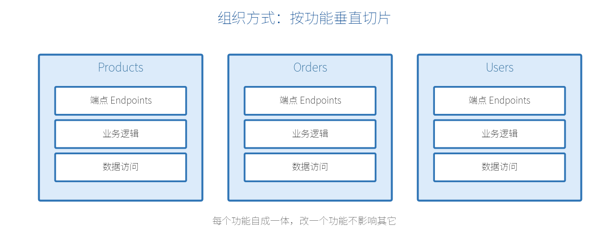

# 第 19 章　组织大型项目

把所有端点都堆在 `Program.cs` 里，几十个接口后就会变成"一坨"。这一章讲怎么把最小 API 项目组织得清晰、可维护。

## 19.1 端点按功能拆分

第一步，把端点从 `Program.cs` 搬出去，按功能分文件。常用手法是写**扩展方法**，把一组端点注册封装起来：

```csharp
// Features/Products/ProductEndpoints.cs
public static class ProductEndpoints
{
    public static IEndpointRouteBuilder MapProductEndpoints(
        this IEndpointRouteBuilder app)
    {
        var group = app.MapGroup("/api/products").WithTags("商品");

        group.MapGet("/", GetAll);
        group.MapGet("/{id:int}", GetById);
        group.MapPost("/", Create);
        return app;
    }

    static IResult GetAll(IProductService svc) => Results.Ok(svc.GetAll());
    static IResult GetById(int id, IProductService svc) =>
        svc.Find(id) is { } p ? Results.Ok(p) : Results.NotFound();
    static IResult Create(Product p, IProductService svc)
    {
        svc.Add(p);
        return Results.Created($"/api/products/{p.Id}", p);
    }
}
```

`Program.cs` 就变得非常干净：

```csharp
var builder = WebApplication.CreateBuilder(args);
builder.Services.AddScoped<IProductService, ProductService>();
var app = builder.Build();

app.MapProductEndpoints();   // 一行挂载一整组
app.MapOrderEndpoints();     // 其它功能同理

app.Run();
```

> **【重点】** 把处理逻辑写成命名方法（`GetAll`、`Create`…）而不是长 lambda，可读性和可测试性都更好——这也呼应第 18 章"薄端点"的思路。

## 19.2 垂直切片架构（Vertical Slice）

传统"分层架构"按技术分（Controllers 层、Services 层、Repositories 层），改一个功能要在多个层之间来回跳。**垂直切片**换个思路：**按功能（业务）组织，每个功能自成一体**。



目录大致长这样：

```text
Features/
├── Products/
│   ├── ProductEndpoints.cs
│   ├── ProductService.cs
│   └── Product.cs
├── Orders/
│   ├── OrderEndpoints.cs
│   ├── OrderService.cs
│   └── Order.cs
└── Users/
    └── ...
```

好处：改"商品"功能只需动 `Products/` 一个文件夹，不会牵动无关代码；新人也容易按功能定位。最小 API 天然契合这种组织方式。

## 19.3 REPR 模式

**REPR**（Request-Endpoint-Response）是最小 API 常用的一种端点组织范式：一个端点就围绕"请求 → 端点处理 → 响应"这条主线，把相关的请求模型、处理逻辑、响应模型放在一起。

```csharp
// Features/Products/CreateProduct.cs —— 一个端点一个文件
public static class CreateProduct
{
    // Request（请求模型）
    public record Request(string Name, decimal Price);

    // Endpoint（注册）
    public static void Map(IEndpointRouteBuilder app) =>
        app.MapPost("/api/products", Handle).WithTags("商品");

    // 处理逻辑
    static IResult Handle(Request req, IProductService svc)
    {
        var product = svc.Add(req.Name, req.Price);
        return Results.Created($"/api/products/{product.Id}", product);
    }
}
```

每个端点独立成文件，职责单一、易于查找和测试。项目越大，这种"一个功能点一个文件"的清晰度优势越明显。

## 19.4 组织建议小结

- **小项目**：`Program.cs` + 几个扩展方法分组即可，别过度设计。
- **中大型**：按功能垂直切片，每个功能一个文件夹，端点用扩展方法挂载。
- **让端点保持薄**：逻辑进服务，端点只做"接—调—返"。
- **共享的东西**（DbContext、通用中间件、错误处理）放公共位置，功能相关的都留在各自切片内。

> **【本章小结】** 用扩展方法（`IEndpointRouteBuilder`）把端点按功能拆分，`Program.cs` 只负责组装；推荐垂直切片 + REPR，让每个功能/端点自成一体、易维护易测试。下一章讲部署与性能，包括 .NET 10 强化的原生 AoT。
