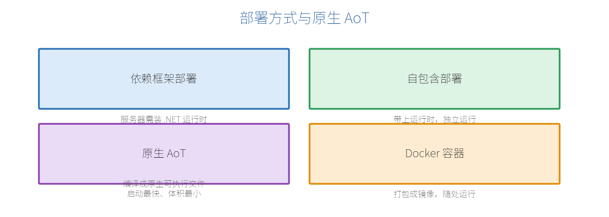

# 第 20 章　部署与性能

写好的服务要跑到服务器上供人访问。这一章讲怎么发布、容器化，以及 .NET 10 强化的原生 AoT 编译和性能优化要点。

## 20.1 发布方式



三种主要发布形态：

| 方式 | 命令 | 特点 |
| --- | --- | --- |
| 依赖框架 | `dotnet publish -c Release` | 体积小，但服务器需装 .NET 运行时 |
| 自包含 | `dotnet publish -c Release --self-contained -r linux-x64` | 带上运行时，服务器无需装 .NET |
| 原生 AoT | 见 20.3 | 编译成原生可执行文件，启动最快、体积最小 |

基本发布命令：

```bash
dotnet publish -c Release -o ./publish
```

产物在 `./publish`，把它拷到服务器，运行 `dotnet MyApi.dll`（或自包含的可执行文件）即可。

## 20.2 Docker 容器化

容器是现代部署的主流。一个典型的多阶段 `Dockerfile`：

```dockerfile
# 构建阶段
FROM mcr.microsoft.com/dotnet/sdk:10.0 AS build
WORKDIR /src
COPY . .
RUN dotnet publish -c Release -o /app

# 运行阶段（只带运行时，镜像更小）
FROM mcr.microsoft.com/dotnet/aspnet:10.0
WORKDIR /app
COPY --from=build /app .
EXPOSE 8080
ENTRYPOINT ["dotnet", "MyApi.dll"]
```

构建并运行：

```bash
docker build -t myapi .
docker run -p 8080:8080 myapi
```

多阶段构建让最终镜像只包含运行所需内容，体积更小、更安全。

## 20.3 原生 AoT 编译（.NET 10 强化）

**原生 AoT（Ahead-Of-Time）**把程序**提前编译成机器码**的独立可执行文件，不再需要 JIT 和完整运行时。优势：

- **启动极快**（毫秒级），非常适合 Serverless、弹性伸缩。
- **内存占用更低**。
- **体积更小**，无需目标机装 .NET。

最小 API 从设计上就对 AoT 友好，.NET 10 进一步强化（内置校验、OpenAPI 等都兼容 AoT）。开启方式，在项目文件里：

```xml
<PropertyGroup>
  <PublishAot>true</PublishAot>
</PropertyGroup>
```

发布：

```bash
dotnet publish -c Release -r linux-x64
```

> **【注意】** AoT 有一些限制：不支持运行时反射密集的场景、部分库不兼容。用 AoT 时建议用 `CreateSlimBuilder`（更精简的启动）并使用源生成的 JSON 序列化。功能以数据接口为主的最小 API 通常能顺利用上 AoT。

## 20.4 性能优化清单

最小 API 本身已经很快，再锦上添花的常见手段：

- **全程异步**：数据库、网络 I/O 用 `async/await`，别阻塞线程（第 10 章）。
- **避免 N+1 查询**：EF Core 里用 `Include` 或投影一次取够，别在循环里查库。
- **合理缓存**：热点只读数据用输出缓存（Output Caching）或内存缓存，减少重复计算/查询。
- **分页**：列表接口一律分页，别一次返回全表（第 10 章）。
- **响应压缩**：启用 `UseResponseCompression` 减小传输体积。
- **连接池**：数据库连接、HttpClient 用池化（`IHttpClientFactory`）。
- **精简中间件**：只用需要的中间件，管道越短越快。
- **考虑 AoT**：对启动速度和内存敏感的服务，评估原生 AoT。

一个开启输出缓存的例子：

```csharp
builder.Services.AddOutputCache();
var app = builder.Build();
app.UseOutputCache();

app.MapGet("/api/hot", () => ExpensiveQuery())
   .CacheOutput(p => p.Expire(TimeSpan.FromSeconds(30)));  // 缓存 30 秒
```

> **【本章小结】** 发布可选依赖框架/自包含/AoT；容器化用多阶段 Dockerfile 减小镜像；.NET 10 强化的原生 AoT 带来极快启动与低内存；性能优化的核心是异步、避免 N+1、分页、缓存。下一章我们把全书知识点串成一个完整项目。
