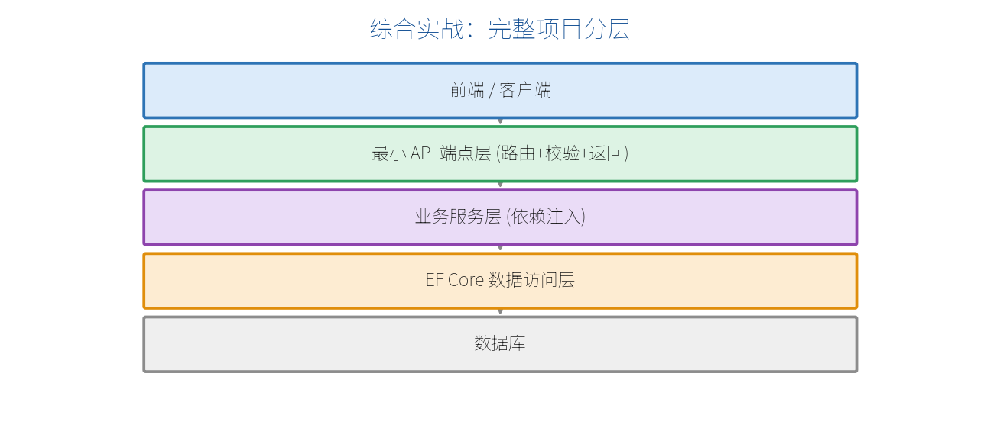

# 第 21 章　综合实战：从零构建一个完整 API

学到这里，你已掌握所有零件。这一章把它们组装起来，做一个**能落库、有校验、带文档、可保护、可测试**的完整"待办事项（Todo）"服务，串联全书知识点。

## 21.1 项目分层总览



请求自上而下穿过各层：前端 → 端点层（路由/校验/返回）→ 业务服务层（DI）→ EF Core 数据访问 → 数据库。这正是我们前面各章的知识点各就各位。

## 21.2 目录结构

采用第 19 章的垂直切片思路：

```text
TodoApi/
├── Program.cs                 # 组装
├── Data/AppDbContext.cs       # EF Core 上下文
├── Features/Todos/
│   ├── Todo.cs                # 实体
│   ├── TodoDtos.cs            # 请求/响应模型 + 校验
│   ├── ITodoService.cs        # 业务接口
│   ├── TodoService.cs         # 业务实现
│   └── TodoEndpoints.cs       # 端点注册
└── appsettings.json
```

## 21.3 实体、DTO 与校验

```csharp
// Features/Todos/Todo.cs
public class Todo
{
    public int Id { get; set; }
    public string Title { get; set; } = "";
    public bool IsDone { get; set; }
    public DateTime CreatedAt { get; set; } = DateTime.Now;
}
```

```csharp
// Features/Todos/TodoDtos.cs
using System.ComponentModel.DataAnnotations;

public class CreateTodoDto
{
    [Required(ErrorMessage = "标题不能为空")]
    [StringLength(100, MinimumLength = 1)]
    public string Title { get; set; } = "";
}

public record TodoDto(int Id, string Title, bool IsDone, DateTime CreatedAt);
```

## 21.4 数据访问与业务服务

```csharp
// Data/AppDbContext.cs
using Microsoft.EntityFrameworkCore;
public class AppDbContext(DbContextOptions<AppDbContext> o) : DbContext(o)
{
    public DbSet<Todo> Todos => Set<Todo>();
}
```

```csharp
// Features/Todos/ITodoService.cs
public interface ITodoService
{
    Task<List<TodoDto>> GetAllAsync();
    Task<TodoDto?> FindAsync(int id);
    Task<TodoDto> CreateAsync(CreateTodoDto dto);
    Task<bool> ToggleAsync(int id);
    Task<bool> DeleteAsync(int id);
}
```

```csharp
// Features/Todos/TodoService.cs
using Microsoft.EntityFrameworkCore;

public class TodoService(AppDbContext db) : ITodoService
{
    public async Task<List<TodoDto>> GetAllAsync() =>
        await db.Todos.OrderByDescending(t => t.CreatedAt)
            .Select(t => new TodoDto(t.Id, t.Title, t.IsDone, t.CreatedAt))
            .ToListAsync();

    public async Task<TodoDto?> FindAsync(int id) =>
        await db.Todos.Where(t => t.Id == id)
            .Select(t => new TodoDto(t.Id, t.Title, t.IsDone, t.CreatedAt))
            .FirstOrDefaultAsync();

    public async Task<TodoDto> CreateAsync(CreateTodoDto dto)
    {
        var todo = new Todo { Title = dto.Title };
        db.Todos.Add(todo);
        await db.SaveChangesAsync();
        return new TodoDto(todo.Id, todo.Title, todo.IsDone, todo.CreatedAt);
    }

    public async Task<bool> ToggleAsync(int id)
    {
        var todo = await db.Todos.FindAsync(id);
        if (todo is null) return false;
        todo.IsDone = !todo.IsDone;
        await db.SaveChangesAsync();
        return true;
    }

    public async Task<bool> DeleteAsync(int id)
    {
        var todo = await db.Todos.FindAsync(id);
        if (todo is null) return false;
        db.Todos.Remove(todo);
        await db.SaveChangesAsync();
        return true;
    }
}
```

## 21.5 端点（薄，只做接—调—返）

```csharp
// Features/Todos/TodoEndpoints.cs
using Microsoft.AspNetCore.Http.HttpResults;

public static class TodoEndpoints
{
    public static IEndpointRouteBuilder MapTodoEndpoints(
        this IEndpointRouteBuilder app)
    {
        var g = app.MapGroup("/api/todos").WithTags("待办事项");

        g.MapGet("/", (ITodoService s) => s.GetAllAsync())
         .WithSummary("获取全部待办");

        g.MapGet("/{id:int}",
            async Task<Results<Ok<TodoDto>, NotFound>> (int id, ITodoService s) =>
                await s.FindAsync(id) is { } t
                    ? TypedResults.Ok(t) : TypedResults.NotFound());

        g.MapPost("/", async (CreateTodoDto dto, ITodoService s) =>
        {
            var created = await s.CreateAsync(dto);   // 校验自动生效
            return TypedResults.Created($"/api/todos/{created.Id}", created);
        });

        g.MapPatch("/{id:int}/toggle", async (int id, ITodoService s) =>
            await s.ToggleAsync(id)
                ? TypedResults.NoContent() : Results.NotFound());

        g.MapDelete("/{id:int}", async (int id, ITodoService s) =>
            await s.DeleteAsync(id)
                ? TypedResults.NoContent() : Results.NotFound());

        return app;
    }
}
```

## 21.6 Program.cs：把所有东西组装起来

```csharp
using Microsoft.EntityFrameworkCore;

var builder = WebApplication.CreateBuilder(args);

// —— 服务注册（配置阶段）——
builder.Services.AddDbContext<AppDbContext>(o =>
    o.UseSqlite(builder.Configuration.GetConnectionString("Default")));
builder.Services.AddScoped<ITodoService, TodoService>();
builder.Services.AddValidation();          // 第 9 章：内置校验
builder.Services.AddProblemDetails();      // 第 13/15 章：标准错误
builder.Services.AddOpenApi();             // 第 11 章：接口文档
builder.Services.AddCors(o => o.AddDefaultPolicy(p =>
    p.WithOrigins("http://localhost:3000").AllowAnyHeader().AllowAnyMethod()));

var app = builder.Build();

// —— 中间件与端点（运行阶段）——
if (!app.Environment.IsDevelopment())
    app.UseExceptionHandler();
app.UseCors();
app.MapOpenApi();                          // /openapi/v1.json

app.MapTodoEndpoints();                     // 挂载功能端点
app.MapHealthChecks("/health");            // 第 16 章：探活

app.Run();

public partial class Program { }           // 第 18 章：便于集成测试
```

## 21.7 跑起来 + 联调

```bash
dotnet ef migrations add Init
dotnet ef database update
dotnet watch
```

- 用浏览器/Scalar 访问文档，测 `GET /api/todos`、`POST /api/todos`。
- 用附录 A 里的任意前端方法（fetch、Vue、React…）接上这个后端，就是一个完整的前后端应用。
- `POST` 一个空标题，会看到第 9 章的校验自动返回 400 及错误信息。

## 21.8 回顾：这个项目用到的知识点

| 章 | 用在哪里 |
| --- | --- |
| 2 | builder/app 两阶段、中间件顺序 |
| 4 | `MapGroup` + 路由参数约束 |
| 5 | DTO 从请求体绑定、`int id` 从路由绑定 |
| 6 | `TypedResults` + `Results<Ok<T>, NotFound>` |
| 7 | `ITodoService` 依赖注入（Scoped） |
| 8 | `[Required]` 校验自动生效 |
| 9 | EF Core + 异步 + 投影查询 |
| 10 | OpenAPI 文档 |
| 12/14 | ProblemDetails 全局错误 |
| 15 | CORS + 健康检查 |
| 17 | `public partial class Program` 便于测试 |
| 18 | 垂直切片 + 端点扩展方法 |

> **【全书结语】** 恭喜你走到这里！你已经从"最小 API 是什么"一路走到"独立构建一个规范的生产级服务"。最小 API 的强大在于：用很少的代码，做很完整的事。接下来最好的学习方式就是——动手把这个 Todo 项目敲一遍、改一改、接上你自己的前端。附录里还有速查表、迁移对照和排错手册，随时备查。祝你用最小 API 写得开心！
