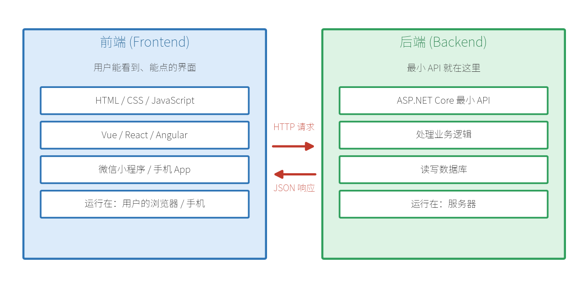
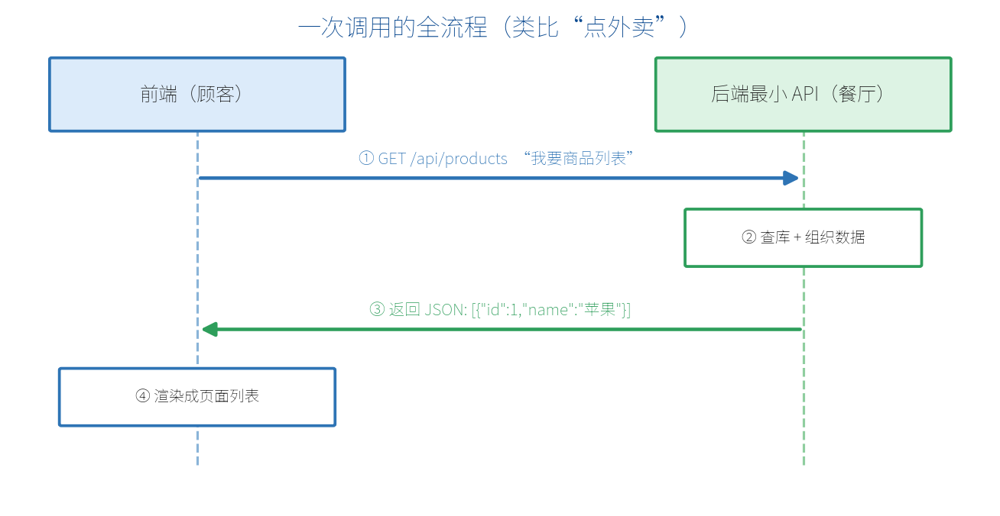
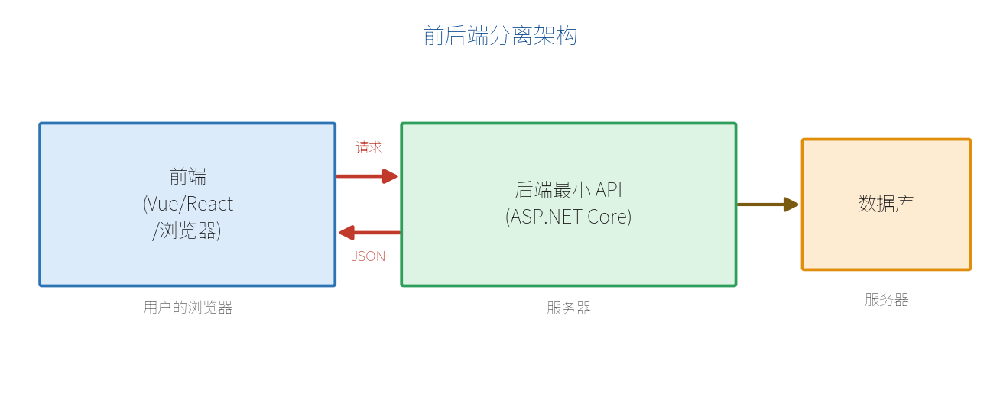
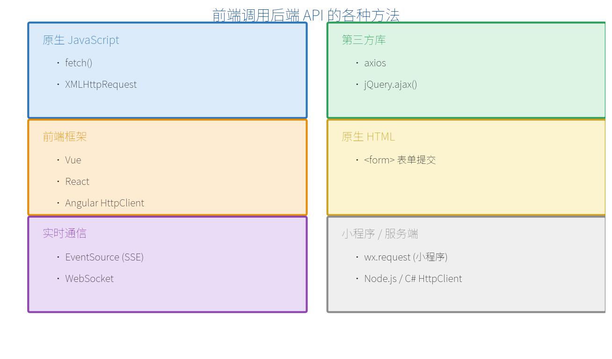
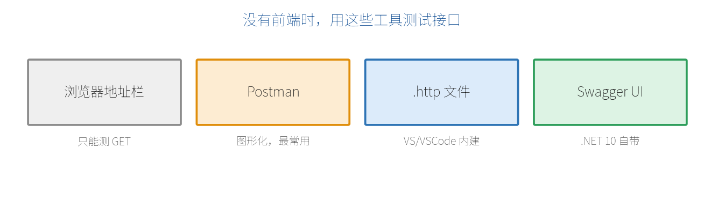

# 附录 A　前端与后端如何协作

很多新手在学最小 API 时会有一个大大的困惑：**我写的接口，页面在哪里？用户怎么看到界面？** 这篇附录就专门解答——把"前端、后端、它们怎么互相调用"彻底讲清楚，并**汇总前端调用后端的所有常见方法，每种都给一个例子**，方便你按需查阅。

## A.1 前端、后端分别是什么

一个完整的网络应用，通常分成**前端（Frontend）**和**后端（Backend）**两大部分，各司其职、运行在不同的地方：



|  | 前端 | 后端（最小 API） |
| --- | --- | --- |
| 职责 | 显示界面、收集用户操作 | 处理数据、业务逻辑、存数据库 |
| 技术 | HTML/CSS/JS、Vue、React… | C# + ASP.NET Core |
| 运行位置 | 用户的浏览器 / 手机 | 服务器 |
| 产出 | 用户看到的页面 | 通常是 JSON 数据 |

## A.2 最小 API 的定位：只提供数据，不管界面

**这是最关键的一句话：** 最小 API 属于**后端**，它**不返回网页**，而是返回**数据（通常是 JSON）**。前端拿到数据后，自己决定怎么显示成界面。例如前端要"商品列表"，接口返回的是这样的数据：

```json
[
  { "id": 1, "name": "苹果", "price": 5.5 },
  { "id": 2, "name": "香蕉", "price": 3.0 }
]
```

> **【什么是 JSON】** JSON 是一种轻量的数据格式，用"键:值"方式组织数据，几乎所有编程语言都能读写，因此成为前后端之间传递数据的通用语言。

## A.3 HTTP 协议入门

前端和后端是两个独立程序，靠 **HTTP 协议**通信。一次"对话"包含几个关键要素：

### ① 请求方法（动词）

| 方法 | 含义 | 对应操作 | 举例 |
| --- | --- | --- | --- |
| GET | 获取数据 | 查 | 获取商品列表 |
| POST | 新增数据 | 增 | 新建一个商品 |
| PUT | 更新数据 | 改 | 修改某个商品 |
| DELETE | 删除数据 | 删 | 删除某个商品 |

### ② URL 地址

```text
https://api.shop.com/api/products/1
└─┬─┘   └────┬─────┘└─────┬──────┘
 协议       服务器地址        路径（定位到具体接口和资源）
```

### ③ 请求头 / 请求体 / 状态码

- **请求头（Headers）**：附带说明信息，如数据格式、身份令牌。
- **请求体（Body）**：新增/修改时提交的数据（通常是 JSON）。
- **状态码（Status Code）**：后端返回的"结果代号"：

| 状态码 | 含义 |
| --- | --- |
| 200 OK | 成功 |
| 201 Created | 创建成功 |
| 400 Bad Request | 请求有误 |
| 401 Unauthorized | 未登录 / 未授权 |
| 404 Not Found | 找不到资源 |
| 500 Internal Server Error | 服务器内部出错 |

## A.4 一次完整调用的全流程

把上面的要素串起来，一次完整调用就像"点外卖"：你（前端）下单，餐厅（后端）接单做菜送回，你收到后开吃。



## A.5 前后端分离 vs 前后端一体

目前最主流的是**前后端分离**：前后端是两个独立项目，甚至由不同的人、不同语言开发，只靠约定好的接口沟通。最小 API 天生适合做这种架构里的后端。



## A.6 前端调用后端的各种方法大全（各举一例）

"前端调用后端"本质上都是**发一个 HTTP 请求**，只是不同技术栈有不同的写法。下面把常见的方法分门别类，每种都给一个调用同一个接口 `GET /api/products` 的最小示例。



### 方法 1：原生 fetch（现代浏览器首选）

`fetch` 是浏览器内置的函数，无需引入任何库，是目前最推荐的方式。

```javascript
// GET 请求
const res = await fetch("https://localhost:5001/api/products");
const data = await res.json();   // 解析 JSON
console.log(data);

// POST 请求（提交数据）
await fetch("https://localhost:5001/api/products", {
  method: "POST",
  headers: { "Content-Type": "application/json" },
  body: JSON.stringify({ id: 3, name: "西瓜", price: 12.0 })
});
```

### 方法 2：XMLHttpRequest（XHR，传统写法）

fetch 出现之前的老方式，代码较啰嗦，现在了解即可。很多老项目仍在用。

```javascript
const xhr = new XMLHttpRequest();
xhr.open("GET", "https://localhost:5001/api/products");
xhr.onload = function () {
  if (xhr.status === 200) {
    const data = JSON.parse(xhr.responseText);
    console.log(data);
  }
};
xhr.send();
```

### 方法 3：axios（最流行的第三方库）

axios 是一个广受欢迎的 HTTP 库，API 简洁、自动转 JSON、错误处理方便，Vue/React 项目里很常见。需先安装：`npm install axios`。

```javascript
import axios from "axios";

// GET
const res = await axios.get("https://localhost:5001/api/products");
console.log(res.data);   // axios 自动解析好了 JSON

// POST
await axios.post("https://localhost:5001/api/products",
  { id: 3, name: "西瓜", price: 12.0 });
```

### 方法 4：jQuery.ajax（老项目常见）

如果项目里还在用 jQuery，通常用 `$.ajax` 或简写的 `$.get / $.post` 调用接口。

```javascript
$.ajax({
  url: "https://localhost:5001/api/products",
  method: "GET",
  success: function (data) { console.log(data); }
});

// 简写
$.get("https://localhost:5001/api/products", function (data) {
  console.log(data);
});
```

### 方法 5：原生 HTML 表单（<form> 提交）

最传统的方式，不写 JavaScript，靠浏览器提交表单。适合简单场景，但会导致**整页刷新/跳转**，体验不如上面的方式。

```html
<form action="https://localhost:5001/api/products" method="POST">
  <input name="name" value="西瓜" />
  <input name="price" value="12.0" />
  <button type="submit">提交</button>
</form>
```

### 方法 6：Vue 框架中调用

Vue 本身不规定用哪个请求库，通常在组件里用 `fetch` 或 `axios`。下面用 Vue 3 组合式 API + fetch：

```html
<script setup>
import { ref, onMounted } from "vue";
const products = ref([]);

onMounted(async () => {
  const res = await fetch("https://localhost:5001/api/products");
  products.value = await res.json();
});
</script>

<template>
  <ul>
    <li v-for="p in products" :key="p.id">{{ p.name }} - ￥{{ p.price }}</li>
  </ul>
</template>
```

### 方法 7：React 框架中调用

React 里常用 `useEffect` 在组件加载时发请求，用 `useState` 保存数据：

```javascript
import { useState, useEffect } from "react";

function ProductList() {
  const [products, setProducts] = useState([]);

  useEffect(() => {
    fetch("https://localhost:5001/api/products")
      .then(res => res.json())
      .then(data => setProducts(data));
  }, []);

  return (
    <ul>
      {products.map(p => <li key={p.id}>{p.name} - ￥{p.price}</li>)}
    </ul>
  );
}
```

### 方法 8：Angular 的 HttpClient

Angular 内置了 `HttpClient` 服务，配合 RxJS 的 Observable 使用：

```typescript
import { HttpClient } from "@angular/common/http";
import { Component, OnInit } from "@angular/core";

@Component({ selector: "app-products", template: `
  <li *ngFor="let p of products">{{ p.name }} - ￥{{ p.price }}</li>` })
export class ProductsComponent implements OnInit {
  products: any[] = [];
  constructor(private http: HttpClient) {}

  ngOnInit() {
    this.http.get<any[]>("https://localhost:5001/api/products")
      .subscribe(data => this.products = data);
  }
}
```

### 方法 9：微信小程序 wx.request

微信小程序不能用 fetch，要用它自己的 `wx.request` API：

```javascript
wx.request({
  url: "https://localhost:5001/api/products",
  method: "GET",
  success(res) {
    console.log(res.data);   // 后端返回的 JSON
  }
});
```

### 方法 10：EventSource（接收 SSE 实时推送）

当后端用 Server-Sent Events（第 13 章）持续推送数据时，前端用浏览器内置的 `EventSource` 来接收，实现"服务器主动推、前端实时收"：

```javascript
const source = new EventSource("https://localhost:5001/api/stream");
source.onmessage = function (event) {
  console.log("收到推送：", event.data);
};
```

### 方法 11：WebSocket（双向实时通信）

需要**双向**实时通信（如聊天、协同）时用 WebSocket，前后端可随时互相发消息：

```javascript
const ws = new WebSocket("wss://localhost:5001/ws");
ws.onopen = () => ws.send("你好，服务器");
ws.onmessage = (event) => console.log("收到：", event.data);
```

### 方法 12：服务端调用（Node.js / C# 等）

"前端"不一定是浏览器——另一个后端服务也可能调用你的接口（服务间调用）。例如 Node.js 用 fetch，C# 用 `HttpClient`：

```javascript
// Node.js（18+ 内置 fetch）
const res = await fetch("https://localhost:5001/api/products");
const data = await res.json();

// C# 服务端 / Blazor
using var http = new HttpClient();
var products = await http.GetFromJsonAsync<Product[]>(
    "https://localhost:5001/api/products");
```

把这些方法横向对比一下，方便你按场景选择：

| 方法 | 适用场景 | 是否需引入库 |
| --- | --- | --- |
| fetch | 现代浏览器，通用首选 | 否（内置） |
| XMLHttpRequest | 维护老项目 | 否（内置） |
| axios | 需要更好用的 API/拦截器 | 是 |
| jQuery.ajax | 已用 jQuery 的老项目 | 是（jQuery） |
| HTML 表单 | 极简单、可接受整页跳转 | 否 |
| Vue / React / Angular | 对应框架的前端项目 | 框架自带或配 axios |
| wx.request | 微信小程序 | 否（小程序内置） |
| EventSource | 接收服务器单向实时推送 | 否（内置） |
| WebSocket | 双向实时通信 | 否（内置） |
| HttpClient / fetch (服务端) | 服务间调用 | 视语言而定 |

## A.7 没有前端时如何测试接口

学习阶段可以先只写后端。验证接口是否正确，有很多趁手的工具：



- **浏览器地址栏**：直接输地址即可测，但只能测 GET。
- **Postman**：最常用的图形化接口测试工具，各种方法、参数都能方便构造。
- **.http 文件**：在 Visual Studio 2026 / VS Code 里新建 `.http` 文件，写几行就能发请求：

```http
GET https://localhost:5001/api/products

###

POST https://localhost:5001/api/products
Content-Type: application/json

{ "id": 3, "name": "西瓜", "price": 12.0 }
```

- **Swagger UI**：.NET 10 内置 OpenAPI 支持，能自动生成可视化测试页面（第 10 章详讲）。

## A.8 跨域（CORS）初识

浏览器有一条安全规则：**从 A 网址打开的页面，默认不允许向 B 网址发请求**。比如前端在 `http://localhost:3000`，后端 API 在 `https://localhost:5001`，地址不同就会被浏览器拦截。

解决办法是后端主动"开门"，声明允许哪些来源访问，这套机制叫 **CORS（跨域资源共享）**。学习阶段可以先这样全部放开：

```csharp
var builder = WebApplication.CreateBuilder(args);
builder.Services.AddCors(options =>
    options.AddDefaultPolicy(p =>
        p.AllowAnyOrigin().AllowAnyMethod().AllowAnyHeader()));

var app = builder.Build();
app.UseCors();   // 启用 CORS
```

> **【注意】** `AllowAnyOrigin()` 只适合本地学习。正式上线时应只允许你自己前端的确切地址，否则有安全风险。CORS 的完整配置见第 15 章。

> **【附录小结】** 记住三句话：①最小 API 是后端，只提供数据（JSON），不管界面；②前端和后端是两个独立程序，通过 HTTP 请求沟通；③无论 fetch、axios、各类框架还是小程序，"调用"的本质都是发一个 HTTP 请求、拿回 JSON、再渲染。理解了这套协作方式，你就能把本教程学到的后端接口，接到任何前端上去了。
