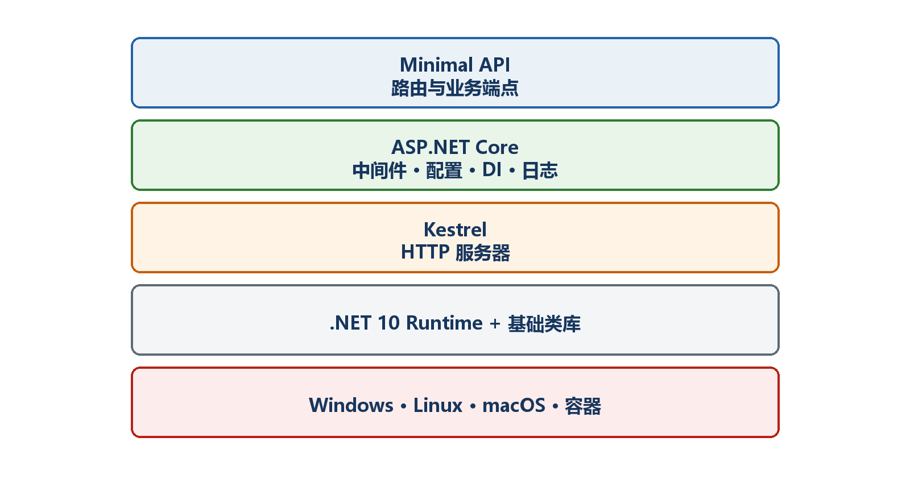
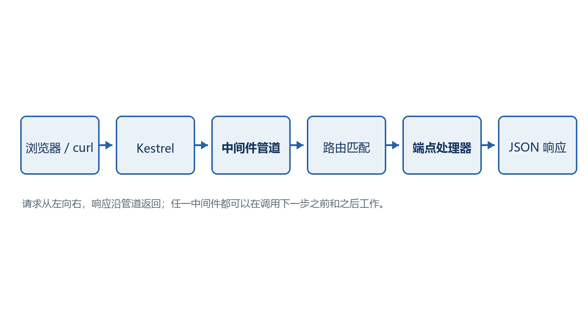

# 第1章　.NET 10、ASP.NET Core 10与Minimal API

第一次接触这些名称时，最容易出现的问题不是代码不会写，而是不知道每一层分别负责什么。本章先建立一张完整地图，再用一个只有几行的API验证这张地图。

  -------------------------------------------------------------------------------------------------------------------------------------------------
  **先把三个问题说清楚　**这是什么：.NET是运行平台，C#是编程语言，ASP.NET Core是Web框架，Minimal API是ASP.NET Core中定义HTTP接口的一种简洁方式。\
  目的是什么：先分清名称和职责，后面遇到SDK、服务器、路由、JSON和依赖注入时才不会混在一起。\
  最后得到什么：能够解释一条浏览器请求怎样到达C#代码，并能读懂最小的Program.cs。
  -------------------------------------------------------------------------------------------------------------------------------------------------

  -------------------------------------------------------------------------------------------------------------------------------------------------

  -------------------------------------------------------------------------------------------------
  **本章阅读顺序　**分清五个名称 → 看最终代码 → 跟踪一次请求 → 逐行解释 → 判断何时使用Minimal API
  -------------------------------------------------------------------------------------------------

  -------------------------------------------------------------------------------------------------

## 1.1 五个名称分别是什么

把开发Web API想象成开一家餐厅：C#是厨师使用的语言；.NET是厨房设备和运行环境；ASP.NET Core是整套餐厅工作流程；Minimal API是用较少样板代码登记菜品和处理订单的方法；Kestrel则是负责在网络端口接收顾客请求的Web服务器。

这些东西不是互相替代的产品，而是从底到顶配合工作的不同层。安装.NET SDK以后，你获得编译器、模板、命令行工具和运行时；创建ASP.NET Core项目后，才开始使用Web框架。

-   .NET 10：平台和运行时，负责执行编译后的.NET程序并提供基础类库。

-   C#：编写业务逻辑的语言。Program.cs、record和lambda表达式都属于C#。

-   ASP.NET Core 10：构建Web应用和HTTP API的框架，提供服务器、路由、中间件、配置、日志和依赖注入。

-   Minimal API：使用MapGet、MapPost等方法直接登记端点的编程模型。它仍然运行在完整的ASP.NET Core上。

-   Kestrel：ASP.NET Core默认Web服务器，监听http://localhost:端口并把请求交给应用。

{width="6.102362204724409in" height="3.2418799212598426in"}

图1-1　从C#到Minimal API的技术层次

## 1.2 先看一个最小但真实的API

下面的程序虽然很短，却具备真实Web API的三个必要条件：创建应用、登记端点、启动服务器。它不是伪代码，保存到.NET Web项目的Program.cs后可以直接运行。

**示例1-1　最小但完整的GET API**

```csharp
var builder = WebApplication.CreateBuilder(args);
var app = builder.Build();

app.MapGet("/api/hello", () =>
Results.Ok(new { message = "Hello, Minimal API!" }));

app.Run();
```

-   输入：浏览器或其他客户端向GET /api/hello发送HTTP请求。

-   处理：路由系统找到MapGet登记的处理函数并执行。

-   输出：匿名对象被自动序列化为JSON，状态码为200。

-   最终效果：如果程序监听https://localhost:7123，访问https://localhost:7123/api/hello会看到JSON。端口必须以自己的终端输出为准。

  ---------------------------------------------------------------------------------------------------------------------
  **Minimal不等于功能残缺　**"最小"指的是定义端点所需的样板代码更少，不是服务器、路由、日志、配置或依赖注入被删除了。
  ---------------------------------------------------------------------------------------------------------------------

  ---------------------------------------------------------------------------------------------------------------------

## 1.3 一次HTTP请求究竟经历什么

理解请求链路的目的，是以后看到404、400、500时知道应该检查哪一层。假设客户端请求GET /api/hello，请求会按下面顺序流动。

1.  第1步：客户端根据URL找到主机和端口，并建立HTTP或HTTPS连接。

2.  第2步：Kestrel接收请求，创建本次请求的HttpContext。

3.  第3步：请求依次经过已经配置的中间件，例如异常处理、HTTPS重定向、认证和日志。

4.  第4步：路由系统比较HTTP方法和路径，找到GET /api/hello。

5.  第5步：参数绑定系统准备处理函数需要的参数。

6.  第6步：处理函数执行C#业务代码并产生返回值。

7.  第7步：ASP.NET Core把返回值转换成状态码、响应头和JSON响应体，再由Kestrel发回客户端。

{width="6.102362204724409in" height="3.2418799212598426in"}

图1-2　一次请求从客户端进入Minimal API再返回的过程

  -----------------------------------------------------------------------------------------------------------------
  **排错时的直接用途　**404通常先看方法和路由；400通常先看参数和JSON；500通常查看处理函数、依赖服务与服务器日志。
  -----------------------------------------------------------------------------------------------------------------

  -----------------------------------------------------------------------------------------------------------------

## 1.4 Program.cs为什么分成Build之前和Build之后

这是阅读所有ASP.NET Core项目最重要的分界。Build之前主要登记应用将来需要的服务；Build之后配置请求怎样经过中间件，以及有哪些URL端点。

**示例1-2　服务注册阶段与请求处理阶段**

```csharp
var builder = WebApplication.CreateBuilder(args);

// Build之前：注册服务、读取配置、设置日志
builder.Services.AddSingleton<ClockService>();

var app = builder.Build();

// Build之后：配置中间件和端点
app.MapGet("/api/time", (ClockService clock) =>
new { utc = clock.UtcNow });

app.Run();

sealed class ClockService
{
public DateTimeOffset UtcNow => DateTimeOffset.UtcNow;
}
```

-   builder.Services.AddSingleton：告诉依赖注入容器如何创建ClockService。

-   builder.Build：结束主要的服务登记阶段并创建WebApplication。

-   app.MapGet：把GET /api/time与一个处理函数关联起来。

-   处理函数参数ClockService：由依赖注入自动提供，不需要手工new。

-   app.Run：启动服务器并持续等待请求，通常放在文件最后。

## 1.5 Minimal API与Controller是什么关系

两者都属于ASP.NET Core，也都可以使用路由、依赖注入、认证授权、模型验证和OpenAPI。区别主要在代码组织方式，而不是谁才是真正的API。

-   Minimal API适合：小型服务、微服务、内部接口、快速原型，以及希望端点定义直接清晰的项目。

-   Controller适合：团队已经采用MVC约定、需要控制器过滤器或喜欢按控制器组织大量相关操作的项目。

-   两者可以在同一个应用中共存，但入门项目最好先选一种主线，避免同时学习两套组织方式。

-   项目变大时，Minimal API也应把处理函数、模型和业务服务拆到独立文件，不能把所有代码长期塞在Program.cs。

## 1.6 本教程怎样从简单走到复杂

前几章先建立能运行、能测试、能发布的最小闭环；随后围绕任务管理API逐层加入前后端交互、路由、参数绑定、返回值、HttpContext、依赖注入和配置。每增加一层，都先说明它解决什么问题，再写代码。

**示例1-3　贯穿教程的任务API目标**

```text
GET /api/tasks 读取任务列表
GET /api/tasks/{id} 读取一条任务
POST /api/tasks 创建任务
PUT /api/tasks/{id} 修改任务
DELETE /api/tasks/{id} 删除任务
```

  -----------------------------------------------------------------------------------------------------------------------------------------
  **阅读原则　**不要只背MapGet、MapPost的写法。每看到一个示例，都问自己：请求从哪里来、参数从哪里来、代码做了什么、返回什么状态码和JSON。
  -----------------------------------------------------------------------------------------------------------------------------------------

  -----------------------------------------------------------------------------------------------------------------------------------------
