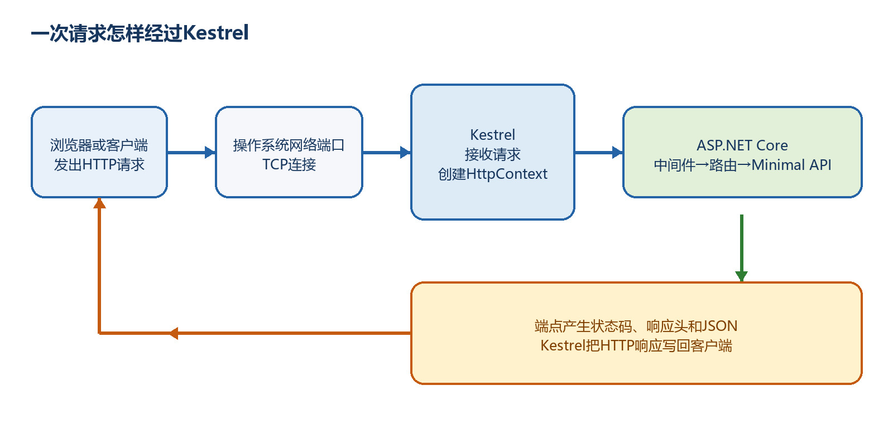
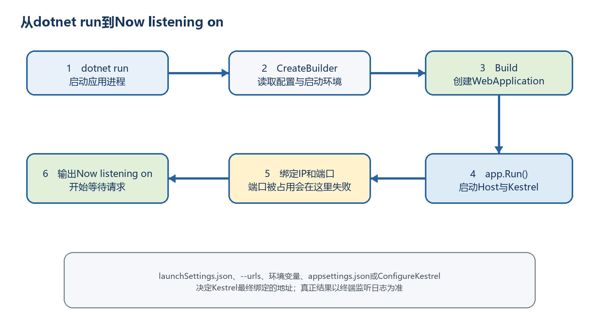
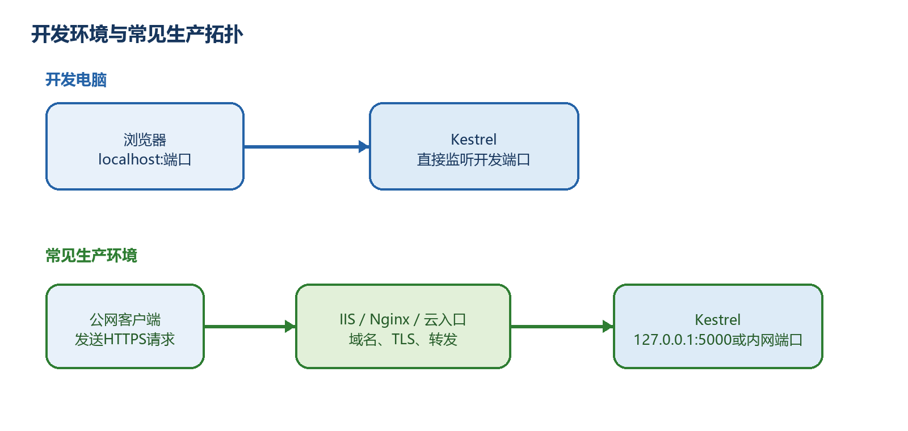

# 第4章　Kestrel：Minimal API真正监听网络的Web服务器

写完MapGet并不等于浏览器已经能够访问程序。必须有一个Web服务器监听网络端口、接收HTTP请求并把响应发回客户端；在普通ASP.NET Core Minimal API项目中，这个默认服务器就是Kestrel。本章把启动、端口、HTTPS、反向代理和排错连成一条完整链路。

  -------------------------------------------------------------------------------------------------------------------------------------------------------------------------------------------------------------------------------------------------------------------------------------------------------
  **先把三个问题说清楚　**这是什么：Kestrel是ASP.NET Core提供的跨平台Web服务器。目的是什么：让应用能够真正监听IP和端口，把网络请求转换为HttpContext，再把应用结果写回网络。最后得到什么：你能解释dotnet run和app.Run()做了什么，能配置监听地址，能判断HTTPS与反向代理的责任边界，并能处理常见连接错误。
  -------------------------------------------------------------------------------------------------------------------------------------------------------------------------------------------------------------------------------------------------------------------------------------------------------

  -------------------------------------------------------------------------------------------------------------------------------------------------------------------------------------------------------------------------------------------------------------------------------------------------------

  ----------------------------------------------------------------------------------------------------------------------------------------------
  **本章操作路线　**先运行最小服务器 → 看懂启动日志 → 跟踪一次请求 → 分清地址与端口来源 → 配置HTTP和HTTPS → 理解IIS/Nginx关系 → 完成故障排查。
  ----------------------------------------------------------------------------------------------------------------------------------------------

  ----------------------------------------------------------------------------------------------------------------------------------------------

## 4.1 先看最终效果：学完本章你能做什么

完成本章后，你会从空目录创建KestrelDemo项目，运行一个能够返回服务器连接信息的Minimal API，然后分别使用launchSettings.json、命令行、环境变量、appsettings.json和代码配置监听地址。

你还会知道浏览器为什么要打开终端显示的完整地址；为什么服务器运行时仍可能出现404；为什么UseHttpsRedirection不能凭空创建HTTPS端口；以及生产环境中的IIS、Nginx和Kestrel分别做什么。

**示例4-1　最终要完成的创建、运行与访问动作**

```bash
dotnet new web -n KestrelDemo -f net10.0
cd KestrelDemo
dotnet run

# 假设终端显示：Now listening on: http://localhost:5187
# 浏览器打开：
http://localhost:5187/api/server-info
```

  ------------------------------------------------------------------------------------------------------------------------
  **端口不能照抄　**5187只是示例。必须复制自己终端中Now listening on后面的协议、主机和端口，再在末尾加/api/server-info。
  ------------------------------------------------------------------------------------------------------------------------

  ------------------------------------------------------------------------------------------------------------------------

## 4.2 Kestrel到底是什么

最直白地说，Kestrel就是守在应用网络入口处的Web服务器。浏览器不会直接执行Program.cs，也不会直接寻找MapGet；浏览器只能向某个IP地址和端口发送HTTP请求。Kestrel监听这个地址，收到请求后把它交给ASP.NET Core请求管道。

Kestrel不是一段需要新手自己编写的业务代码，也不是项目根目录中的Kestrel.cs文件。它由ASP.NET Core共享框架提供，WebApplication.CreateBuilder(args)按默认配置准备它，所以普通Minimal API项目不需要另行安装Kestrel NuGet包。

Kestrel是跨平台的：同一套ASP.NET Core应用可以在Windows、Linux和macOS上使用它。它处理HTTP连接、协议解析、请求和响应读写等服务器工作；路由匹配、参数绑定、认证、数据库操作等则由ASP.NET Core组件和你的业务代码完成。

  -------------------------------------------------------------------------------------------------------
  **组成部分**               **最直白的职责**                           **它不负责什么**
  -------------------------- ------------------------------------------ ---------------------------------
  浏览器、Swagger UI或前端   发出HTTP请求并显示响应                     不在服务器上执行Minimal API代码

  Kestrel                    监听IP和端口，收发HTTP数据                 不决定任务能否创建等业务规则

  ASP.NET Core               建立中间件、路由、参数绑定和依赖注入管道   不替代你设计具体业务

  Minimal API端点            执行MapGet、MapPost等处理程序              不直接管理操作系统网络端口

  IIS、Nginx或云入口         常在公网入口处理域名、TLS和转发            不是Minimal API处理函数
  -------------------------------------------------------------------------------------------------------

## 4.3 浏览器、Kestrel、ASP.NET Core和Minimal API是什么关系

可以把整个过程想成到办公楼办事：IIS或Nginx像大楼总入口，Kestrel像应用自己的接待台，ASP.NET Core中间件和路由像内部办事流程，MapGet或MapPost则是最终办理具体业务的窗口。开发环境通常由浏览器直接访问Kestrel；生产环境经常先经过公网入口，再转给Kestrel。

一次请求的输入是HTTP方法、URL、请求头和可选请求体；Kestrel把这些网络数据呈现为HttpContext。管道处理完成后，状态码、响应头和JSON响应体再由Kestrel写回客户端。

{width="6.299212598425197in" height="3.031496062992126in"}

图4-1　一次HTTP请求经过Kestrel并返回的完整路径

## 4.4 dotnet run、CreateBuilder、Build和app.Run()分别做什么

这四个动作处在不同层次。dotnet run是命令行工具的动作：它构建并启动项目进程。CreateBuilder读取启动参数、环境变量、appsettings文件和日志等配置，并准备Web Host。Build根据已经登记的服务创建WebApplication。app.Run()启动整个Host，其中包括Kestrel、应用生命周期和后台服务，并一直等待请求，直到你按Ctrl+C或进程收到停止信号。

因此，把app.Run()只理解成"执行最后一行"是不够的。它会进入持续运行状态。通常把中间件和MapGet、MapPost写在app.Run()之前；如果没有Run，进程不会保持监听，浏览器就无法连接。

**示例4-2　Kestrel在最小Program.cs中的位置**

```csharp
var builder = WebApplication.CreateBuilder(args); // 读取配置，准备Host和Kestrel
var app = builder.Build(); // 建立应用和请求管道

app.MapGet("/api/hello", () => "Hello"); // 登记业务端点

app.Run(); // 启动Host，Kestrel开始监听
```

{width="6.299212598425197in" height="3.543307086614173in"}

图4-2　从dotnet run到Kestrel开始监听端口的启动过程

## 4.5 第一步：从父目录创建KestrelDemo项目

先打开PowerShell、Windows Terminal或VS Code终端，进入准备存放项目的父目录。下面的-n KestrelDemo同时指定项目名和新文件夹名，-f net10.0明确目标框架。命令执行后，再进入刚生成的项目目录。

**示例4-3　创建并首次编译项目**

```bash
dotnet --version
dotnet new web -n KestrelDemo -f net10.0
cd KestrelDemo
dotnet build
```

**示例4-4　创建项目后的主要目录结构**

```text
KestrelDemo/
├─ KestrelDemo.csproj
├─ Program.cs
├─ appsettings.json
├─ appsettings.Development.json
├─ Properties/
│ └─ launchSettings.json
├─ bin/ # 编译后生成
└─ obj/ # 还原和编译中间文件
```

  ----------------------------------------------------------------------------------------------------------------------------------------------------------------------
  **为什么没有Kestrel文件夹　**Kestrel来自ASP.NET Core共享框架，不是复制到项目根目录中的网页或源文件。项目保存的是使用方式和配置；服务器实现由已安装的.NET运行时提供。
  ----------------------------------------------------------------------------------------------------------------------------------------------------------------------

  ----------------------------------------------------------------------------------------------------------------------------------------------------------------------

## 4.6 第二步：编写能观察连接信息的完整Program.cs

把Program.cs替换为下面的完整代码。这个端点不访问数据库，它的唯一目的，是让新手直接看到Kestrel交给应用的协议、主机、服务器端口和客户端地址。

**示例4-5　用于观察Kestrel连接信息的完整Program.cs**

```csharp
var builder = WebApplication.CreateBuilder(args);

// 在Build之前调整Kestrel选项。
// 这里只关闭Server响应头，并设置读取请求头的最长等待时间；
// 没有在代码中写死端口，所以仍使用启动配置提供的地址。
builder.WebHost.ConfigureKestrel(options =>
{
options.AddServerHeader = false;
options.Limits.RequestHeadersTimeout = TimeSpan.FromSeconds(30);
});

var app = builder.Build();

app.MapGet("/api/server-info", (HttpContext context) =>
{
var connection = context.Connection;

return Results.Ok(new
{
message = "Kestrel is receiving requests",
protocol = context.Request.Protocol,
scheme = context.Request.Scheme,
host = context.Request.Host.Value,
localIp = connection.LocalIpAddress?.ToString(),
localPort = connection.LocalPort,
remoteIp = connection.RemoteIpAddress?.ToString(),
remotePort = connection.RemotePort
});
});

app.Run();
```

-   ConfigureKestrel必须写在builder.Build()之前，因为它属于服务器创建阶段的配置。

-   HttpContext表示当前这一条请求；context.Connection提供本地与远端连接信息。

-   localPort应该与浏览器URL中的服务器端口一致。remotePort通常是客户端临时端口，每次连接都可能变化。

-   AddServerHeader=false只是不发送默认Server响应头，不等于应用已经完成全部安全加固。

-   app.Run()启动整个应用Host，Kestrel是其中负责网络监听的服务器。

## 4.7 第三步：运行项目并打开准确的网址

保存Program.cs，在包含KestrelDemo.csproj的目录执行dotnet run。不要先猜端口，也不要关闭这个终端。看到Now listening on以后，复制其中一个完整基础地址，在末尾加/api/server-info。

**示例4-6　启动Kestrel并使用终端实际地址访问**

```bash
dotnet run

# 典型输出，实际内容以你的终端为准：
# Now listening on: https://localhost:7123
# Now listening on: http://localhost:5187
# Application started. Press Ctrl+C to shut down.

# 浏览器可以打开其中一个：
https://localhost:7123/api/server-info
http://localhost:5187/api/server-info
```

**示例4-7　浏览器可能看到的JSON结构**

```json
{
"message": "Kestrel is receiving requests",
"protocol": "HTTP/2",
"scheme": "https",
"host": "localhost:7123",
"localIp": "::1",
"localPort": 7123,
"remoteIp": "::1",
"remotePort": 53124
}
```

  ----------------------------------------------------------------------------------------------------------------------------------------------------------------------------------------------------------------------
  **最终效果怎样判断　**能看到JSON，说明项目进程已启动、Kestrel已经绑定端口、浏览器建立了连接、路由匹配成功并且端点返回了结果。localIp或protocol与示例不同并不一定是错误；IPv4、IPv6以及HTTP版本会受本机和浏览器影响。
  ----------------------------------------------------------------------------------------------------------------------------------------------------------------------------------------------------------------------

  ----------------------------------------------------------------------------------------------------------------------------------------------------------------------------------------------------------------------

## 4.8 怎样逐行理解Kestrel启动日志

Now listening on表示Kestrel已经成功占用并监听这个地址。只有出现这行以后，浏览器才有服务器可以连接。Application started表示Host启动完成。Hosting environment说明当前环境，一般开发时是Development。Content root是应用读取内容文件时使用的根目录。

终端保持运行不是卡住，而是Web服务器正在等待请求。按Ctrl+C后，Host开始有序停止，Kestrel关闭监听端口；此时刷新浏览器通常会看到连接失败。

  ------------------------------------------------------------------------------------
  **终端信息**                   **说明**               **新手应该做什么**
  ------------------------------ ---------------------- ------------------------------
  Now listening on: 地址         Kestrel成功监听        复制完整地址，不要只复制端口

  Application started            应用启动完成           保持终端开启并开始测试

  Hosting environment            当前环境名称           确认开发时通常为Development

  Content root                   内容根目录             排查配置或静态文件路径时使用

  Application is shutting down   应用正在停止           等待退出，重新运行后才能访问
  ------------------------------------------------------------------------------------

## 4.9 一条URL中的协议、主机、端口和路径

以https://localhost:7123/api/server-info为例：https是协议，localhost是主机，7123是Kestrel监听的端口，/api/server-info是交给ASP.NET Core路由系统匹配的路径。前面三部分决定请求能否到达服务器，最后的路径和HTTP方法决定能否找到端点。

因此，"连接被拒绝"和"404"不是同一种错误。连接被拒绝通常发生在到达Kestrel之前，例如服务器没有运行或端口写错；404说明某个服务器已经作出HTTP响应，但请求方法或路径没有匹配到端点。

  --------------------------------------------------------------------------------
  **现象**                    **请求到达Kestrel了吗**   **优先检查**
  --------------------------- ------------------------- --------------------------
  浏览器显示连接被拒绝        通常没有                  进程、协议、主机、端口

  404 Not Found               已经到达某个Web服务器     路径、HTTP方法、路由

  400 Bad Request             已经到达并进入处理流程    参数、JSON、请求头

  500 Internal Server Error   已经执行到应用内部        异常日志、服务和业务代码
  --------------------------------------------------------------------------------

## 4.10 Kestrel的监听地址究竟从哪里来

Kestrel必须知道监听哪些地址。新项目最常见的来源是Properties/launchSettings.json；部署和临时测试还常使用\--urls、ASPNETCORE_URLS、appsettings.json中的Kestrel端点，以及ConfigureKestrel代码。

不要把这些方式同时堆在一个入门项目中，否则会很难判断谁覆盖了谁。实际排错时先看终端最终输出，再检查当前启动配置。最重要的覆盖规则是：如果代码显式使用Listen、ListenLocalhost或ListenAnyIP配置端点，这些Listen端点会覆盖UseUrls这一类地址。

  ------------------------------------------------------------------------------------------------
  **配置方式**                            **适合场景**                   **是否应写死在源码**
  --------------------------------------- ------------------------------ -------------------------
  launchSettings.json                     本机开发和IDE启动配置          可以提交非敏感开发端口

  \--urls                                 临时启动、发布包验证           不需要

  ASPNETCORE_URLS                         服务器、容器和自动化环境       不需要

  appsettings.json中的Kestrel:Endpoints   声明多个固定端点和证书设置     普通地址可以；秘密不能

  ConfigureKestrel + Listen\...           需要代码控制协议、端点或限制   可以，但降低部署灵活性
  ------------------------------------------------------------------------------------------------

## 4.11 使用launchSettings.json配置本机开发端口

launchSettings.json是开发工具的启动说明书。dotnet run、Visual Studio和VS Code调试配置可以选择其中的profile。applicationUrl通常使用分号保存一个或多个地址；launchBrowser决定工具是否自动打开浏览器；environmentVariables设置当前启动配置的环境变量。

它只用于本机开发，不会因为dotnet publish就自动成为生产服务器配置。修改后要停止并重新运行项目。若想验证没有启动配置时的行为，可执行dotnet run \--no-launch-profile。

**示例4-8　Properties/launchSettings.json的核心结构**

```json
{
"$schema": "http://json.schemastore.org/launchsettings.json",
"profiles": {
"http": {
"commandName": "Project",
"launchBrowser": true,
"applicationUrl": "http://localhost:5200",
"environmentVariables": {
"ASPNETCORE_ENVIRONMENT": "Development"
}
},
"https": {
"commandName": "Project",
"launchBrowser": true,
"applicationUrl": "https://localhost:7200;http://localhost:5200",
"environmentVariables": {
"ASPNETCORE_ENVIRONMENT": "Development"
}
}
}
}
```

**示例4-9　选择或跳过启动配置**

```bash
dotnet run --launch-profile http
dotnet run --launch-profile https
dotnet run --no-launch-profile
```

## 4.12 使用\--urls临时指定端口

命令行方式适合临时验证，因为它不修改项目文件。下面让Kestrel只监听本机5201端口。项目停止后，这个设置不会永久保存。

**示例4-10　使用\--urls启动固定HTTP端口**

```bash
dotnet run --no-launch-profile --urls "http://localhost:5201"

# 如果当前SDK要求把后续参数明确传给应用，可使用：
dotnet run --no-launch-profile -- --urls "http://localhost:5201"

# 浏览器打开：
http://localhost:5201/api/server-info
```

  ----------------------------------------------------------------------------------------------------------------------------------------------------
  **为什么示例先用HTTP　**显式配置HTTPS不仅需要https地址，还需要Kestrel能够取得合适的TLS证书。先用HTTP看清监听规则，再单独学习证书，错误更容易定位。
  ----------------------------------------------------------------------------------------------------------------------------------------------------

  ----------------------------------------------------------------------------------------------------------------------------------------------------

## 4.13 使用ASPNETCORE_URLS环境变量

环境变量适合在不改源码的情况下给不同环境提供不同地址。下面是PowerShell写法：变量只影响当前终端及其启动的子进程；测试结束后删除变量，避免影响后续运行。

**示例4-11　使用环境变量配置监听地址**

```bash
$env:ASPNETCORE_URLS = "http://localhost:5202"
dotnet run --no-launch-profile

# 测试完成后按Ctrl+C停止应用，再删除变量
Remove-Item Env:ASPNETCORE_URLS
```

**示例4-12　让Kestrel监听多个HTTP地址**

```text
# 多个地址用分号分隔
$env:ASPNETCORE_URLS = "http://localhost:5202;http://127.0.0.1:5203
```

## 4.14 使用appsettings.json声明Kestrel端点

Kestrel:Endpoints适合把多个服务器端点集中写在配置中。下面只声明一个本机HTTP端点。为了避免launchSettings.json同时提供另一组地址，测试时使用\--no-launch-profile。

**示例4-13　在appsettings.json中配置HTTP端点**

```json
{
"Kestrel": {
"Endpoints": {
"Http": {
"Url": "http://localhost:5204"
}
}
},
"Logging": {
"LogLevel": {
"Default": "Information",
"Microsoft.AspNetCore": "Warning"
}
},
"AllowedHosts": "*"
}
```

**示例4-14　验证appsettings.json中的端点**

```bash
dotnet run --no-launch-profile

# 看到Now listening on: http://localhost:5204后打开：
http://localhost:5204/api/server-info
```

  ----------------------------------------------------------------------------------------------------------------------------------------------------------
  **配置文件中的秘密　**生产HTTPS证书密码、私钥和其他秘密不要以明文提交到appsettings.json或Git仓库。应使用环境变量、受控密钥存储或部署平台的秘密管理能力。
  ----------------------------------------------------------------------------------------------------------------------------------------------------------

  ----------------------------------------------------------------------------------------------------------------------------------------------------------

## 4.15 使用ConfigureKestrel在代码中监听端口

当应用需要对端点协议、证书或限制进行更细控制时，可以在Build之前调用ConfigureKestrel。ListenLocalhost只监听本机；ListenAnyIP监听所有网络接口。下面两个端点同时存在，运行后终端应显示两个Now listening on地址。

**示例4-15　使用ListenLocalhost和ListenAnyIP配置端点**

```csharp
var builder = WebApplication.CreateBuilder(args);

builder.WebHost.ConfigureKestrel(options =>
{
options.ListenLocalhost(5205); // 只允许本机访问
options.ListenAnyIP(5206); // 监听所有IPv4/IPv6接口
});

var app = builder.Build();
app.MapGet("/api/hello", () => "Hello from Kestrel");
app.Run();
```

  -----------------------------------------------------------------------------------------------------------------------------------------------------------------------------
  **Listen会覆盖哪一类配置　**显式Listen端点与UseUrls、\--urls或ASPNETCORE_URLS同时存在时，Listen端点优先。新手项目最好选择一种主要方式，并通过Now listening on确认最终结果。
  -----------------------------------------------------------------------------------------------------------------------------------------------------------------------------

  -----------------------------------------------------------------------------------------------------------------------------------------------------------------------------

## 4.16 localhost、127.0.0.1、0.0.0.0和局域网访问

localhost表示本机回环名称。Kestrel会尝试绑定IPv4和IPv6回环接口，所以server-info中的localIp可能显示127.0.0.1，也可能显示::1。127.0.0.1明确表示IPv4本机回环。两者通常只能从当前电脑访问。

0.0.0.0是监听所有IPv4网络接口的特殊地址；ListenAnyIP也用于类似目的。但监听所有接口并不等于互联网已经能访问：Windows防火墙、云安全组、路由器、NAT和组织网络策略仍可能阻止连接。

  -----------------------------------------------------------------------------------------
  **地址写法**   **监听范围**        **典型用途**           **安全提醒**
  -------------- ------------------- ---------------------- -------------------------------
  localhost      本机IPv4/IPv6回环   日常开发               其他电脑通常不能访问

  127.0.0.1      本机IPv4回环        只允许本机或本机代理   生产代理转发常见

  0.0.0.0        所有IPv4接口        容器或局域网服务       必须同时检查防火墙和认证

  ListenAnyIP    所有可用IP接口      跨机器或容器监听       不要把测试API无保护暴露到公网
  -----------------------------------------------------------------------------------------

**示例4-16　局域网测试时的地址区别**

```bash
# 监听所有IPv4接口的临时测试
dotnet run --no-launch-profile --urls "http://0.0.0.0:5207"

# 本机浏览器仍可使用：
http://localhost:5207/api/server-info

# 局域网其他电脑需要使用服务器实际IP，例如：
http://192.168.1.20:5207/api/server-info
```

  -------------------------------------------------------------------------------------------------------------------------------------------------------------------
  **0.0.0.0不是浏览器目标地址　**0.0.0.0用于告诉服务器监听所有IPv4接口。客户端通常应访问localhost、127.0.0.1、服务器实际IP或域名，而不是把0.0.0.0当成正式访问地址。
  -------------------------------------------------------------------------------------------------------------------------------------------------------------------

  -------------------------------------------------------------------------------------------------------------------------------------------------------------------

## 4.17 Kestrel怎样提供HTTPS

HTTPS是在HTTP外增加TLS加密和服务器身份验证。Kestrel要监听https地址，必须能够使用TLS证书。本地开发通常使用.NET SDK创建的ASP.NET Core HTTPS开发证书；生产环境必须显式配置由组织或证书机构管理的生产证书。

最容易误解的一点是：app.UseHttpsRedirection()只负责把已经到达HTTP端点的请求重定向到某个HTTPS地址，它不会自动创建HTTPS监听端点，也不会自动生成生产证书。要让重定向成功，HTTPS端点必须真实存在。

**示例4-17　检查并信任本机HTTPS开发证书**

```bash
dotnet dev-certs https --check --trust

# 如果本机开发证书状态混乱，可在确认影响后清理并重新信任：
dotnet dev-certs https --clean
dotnet dev-certs https --trust
```

**示例4-18　在已经配置HTTP与HTTPS端点时启用重定向**

```csharp
var builder = WebApplication.CreateBuilder(args);
var app = builder.Build();

app.UseHttpsRedirection();
app.MapGet("/api/secure", (HttpContext context) => new
{
scheme = context.Request.Scheme,
isHttps = context.Request.IsHttps
});

app.Run();
```

-   先确认终端确实显示https://localhost:某端口，再测试HTTPS地址。

-   浏览器提示证书不可信时，先修复开发证书，不要长期关闭证书验证。

-   开发证书只用于localhost开发，不应复制到生产服务器或容器镜像中。

-   生产环境的证书路径、密码和续期方式必须由部署方案明确管理。

## 4.18 Kestrel、Visual Studio项目配置和IIS Express的区别

在Visual Studio工具栏中，启动目标可能是项目名、https配置或IIS Express。选择项目本身时，应用通常直接启动Kestrel，你可以在控制台看到它的监听日志。选择IIS Express时，请求先经过IIS Express及其ASP.NET Core托管集成，端口和证书也可能由IIS Express配置决定。

为了在本章清楚观察Kestrel，建议选择项目本身或https项目配置，而不是IIS Express。两种方式都能运行ASP.NET Core应用，但网络入口和调试输出不同，排错时必须先确认当前选择的启动目标。

  ------------------------------------------------------------------------------------------------
  **启动方式**            **浏览器首先连接谁**   **端口主要在哪里看**         **适合本章吗**
  ----------------------- ---------------------- ---------------------------- --------------------
  dotnet run / 项目配置   Kestrel                终端和launchSettings.json    最适合观察Kestrel

  IIS Express             IIS Express            Visual Studio启动配置        可用，但入口更复杂

  发布包直接运行          Kestrel或平台入口      命令行、环境变量、平台配置   适合部署验证
  ------------------------------------------------------------------------------------------------

## 4.19 生产环境为什么经常在Kestrel前面放IIS或Nginx

Kestrel可以作为直接面向网络的边缘服务器，并不是技术上必须放在反向代理后面。但是很多生产系统会让IIS、Nginx、Apache、云负载均衡或API网关先接收公网请求，再转发到Kestrel。这样可以集中处理域名、80/443端口、TLS证书、负载均衡和组织级网络策略。

常见Linux部署中，Nginx监听公网443端口，Kestrel只监听127.0.0.1:5000；systemd负责让应用进程常驻和自动重启。IIS/Nginx是网络入口，systemd或Windows Service是进程管理者，Kestrel是ASP.NET Core应用的服务器入口，这三类职责不要混在一起。

{width="6.299212598425197in" height="2.9921259842519685in"}

图4-3　开发环境直接访问Kestrel与生产反向代理拓扑

  --------------------------------------------------------------------------------------------------------------------------------------------------------------------------------------------------------------------------------------------------------------------------
  **反向代理后的协议为什么可能变了　**公网客户端使用HTTPS，而代理转给Kestrel的内部连接可能是HTTP。应用需要在可信代理边界内正确处理X-Forwarded-For和X-Forwarded-Proto，否则生成的链接、客户端IP、认证回调或HTTPS重定向可能出错。第35章会继续讲生产发布与Forwarded Headers。
  --------------------------------------------------------------------------------------------------------------------------------------------------------------------------------------------------------------------------------------------------------------------------

  --------------------------------------------------------------------------------------------------------------------------------------------------------------------------------------------------------------------------------------------------------------------------

## 4.20 Forwarded Headers配置的目的和位置

下面代码只演示原理：告诉ASP.NET Core接收原始客户端IP和协议，并且只信任明确知道的代理地址。UseForwardedHeaders应放在HTTPS重定向、认证以及其他读取Request.Scheme或RemoteIpAddress的组件之前。实际代理IP必须按照部署拓扑填写。

**示例4-19　在已知反向代理后恢复原始协议和客户端IP**

```csharp
using System.Net;
using Microsoft.AspNetCore.HttpOverrides;

var builder = WebApplication.CreateBuilder(args);

builder.Services.Configure<ForwardedHeadersOptions>(options =>
{
options.ForwardedHeaders =
ForwardedHeaders.XForwardedFor |
ForwardedHeaders.XForwardedProto;

// 示例：只有本机反向代理可信。
options.KnownProxies.Add(IPAddress.Parse("127.0.0.1"));
});

var app = builder.Build();

app.UseForwardedHeaders(); // 放在依赖协议和客户端IP的组件之前
app.UseHttpsRedirection();

app.MapGet("/api/request", (HttpContext context) => new
{
scheme = context.Request.Scheme,
clientIp = context.Connection.RemoteIpAddress?.ToString()
});

app.Run();
```

  -----------------------------------------------------------------------------------------------------------------------------------------------------------------
  **不要无条件信任所有转发头　**转发头来自网络输入。清空KnownProxies或KnownNetworks并信任任意来源，可能让客户端伪造协议或IP。应先画清代理拓扑，再只信任实际代理。
  -----------------------------------------------------------------------------------------------------------------------------------------------------------------

  -----------------------------------------------------------------------------------------------------------------------------------------------------------------

## 4.21 Kestrel限制配置解决什么问题

Kestrel需要保护服务器资源，因此提供请求体大小、请求头等待时间、Keep-Alive时间等限制。默认值适合多数应用，新手不要为了"性能更高"随意放大。上传接口确实需要更大请求体时，应同时考虑认证、磁盘空间、反向代理限制和业务级文件校验。

**示例4-20　设置请求体和请求头等待限制**

```csharp
var builder = WebApplication.CreateBuilder(args);

builder.WebHost.ConfigureKestrel(options =>
{
// 全局请求体上限：10 MB
options.Limits.MaxRequestBodySize = 10 * 1024 * 1024;

// 客户端发送请求头最多等待30秒
options.Limits.RequestHeadersTimeout = TimeSpan.FromSeconds(30);
});

var app = builder.Build();
app.MapPost("/api/upload-info", (HttpRequest request) =>
Results.Ok(new { contentLength = request.ContentLength }));
app.Run();
```

  --------------------------------------------------------------------------------------------------------------------------------------------------
  **限制可能存在多层　**如果前面还有IIS、Nginx、云网关或容器平台，它们也可能有请求体和超时限制。最终生效结果通常由链路中最先拒绝请求的那一层决定。
  --------------------------------------------------------------------------------------------------------------------------------------------------

  --------------------------------------------------------------------------------------------------------------------------------------------------

## 4.22 常见错误怎样一步一步排查

排错时不要一次修改多个文件。先保留终端完整日志，再按"进程是否运行→地址是否正确→Kestrel是否监听→HTTP是否到达→路由是否匹配"的顺序检查。

  ------------------------------------------------------------------------------------------------------------------------------------------
  **错误或现象**                            **最常见原因**                          **按顺序处理**
  ----------------------------------------- --------------------------------------- --------------------------------------------------------
  Failed to bind / address already in use   端口已被其他进程占用                    停止旧进程；换端口；重新运行；确认新的Now listening on

  浏览器连接被拒绝                          应用没运行、端口或协议写错              看终端；复制完整监听地址；确认进程未停止

  打开根地址得到404                         代码只映射了/api/server-info            在基础地址后加正确路径；检查HTTP方法

  HTTPS证书警告                             开发证书未信任或已损坏                  运行dev-certs检查；重新信任；关闭并重开浏览器

  本机能访问，其他电脑不能                  只监听localhost或被防火墙阻止           改为明确的AnyIP测试；开放受控端口；使用服务器实际IP

  HTTPS重定向警告或循环                     没有HTTPS端点，或代理后的Scheme不正确   确认HTTPS监听；在可信代理后正确配置Forwarded Headers

  改了配置但端口没变                        选错launch profile或被Listen覆盖        停止进程；确认启动命令；查看所有地址来源和最终日志
  ------------------------------------------------------------------------------------------------------------------------------------------

**示例4-21　把复杂地址问题缩小成一个固定HTTP端口**

```bash
# 1. 先重新编译，排除代码错误
dotnet build

# 2. 跳过launch profile并指定一个明确端口
dotnet run --no-launch-profile --urls "http://localhost:5210"

# 3. 另开终端验证HTTP状态
curl -i http://localhost:5210/api/server-info

# 4. 停止服务器
# 回到运行窗口按Ctrl+C
```

## 4.23 从头到尾完成一次Kestrel配置验收

最后用下面顺序把本章知识连起来。不要只确认代码能编译；每一步都要看到对应结果。

8.  在父目录执行dotnet new web -n KestrelDemo -f net10.0，然后进入项目目录。

9.  写入示例4-5的完整Program.cs并执行dotnet build，确认0个错误。

10. 执行dotnet run，复制Now listening on后的实际地址。

11. 浏览器打开实际地址加/api/server-info，确认得到200和JSON。

12. 按Ctrl+C停止应用，再执行示例4-10，用5201固定端口启动。

13. 使用curl -i验证状态码和Content-Type；然后再次按Ctrl+C。

14. 打开launchSettings.json，指出本机开发端口在哪里；再指出Program.cs中的ConfigureKestrel为什么必须在Build之前。

15. 用自己的话说明：Kestrel是真正监听网络的服务器，ASP.NET Core是请求处理框架，Minimal API端点处理具体接口，Swagger UI或浏览器只是客户端。

  -----------------------------------------------------------------------------------------------------------------------------------------------------------------------------------------------------------------------------------------------------
  **本章最终结果　**到这里，你不但能够启动Minimal API，还能说明它为什么能够被浏览器访问：Host启动Kestrel，Kestrel绑定地址并创建HttpContext，请求经过ASP.NET Core管道到达端点，响应再由Kestrel写回客户端。下一章再进入VS Code和Visual Studio开发流程。
  -----------------------------------------------------------------------------------------------------------------------------------------------------------------------------------------------------------------------------------------------------

  -----------------------------------------------------------------------------------------------------------------------------------------------------------------------------------------------------------------------------------------------------
