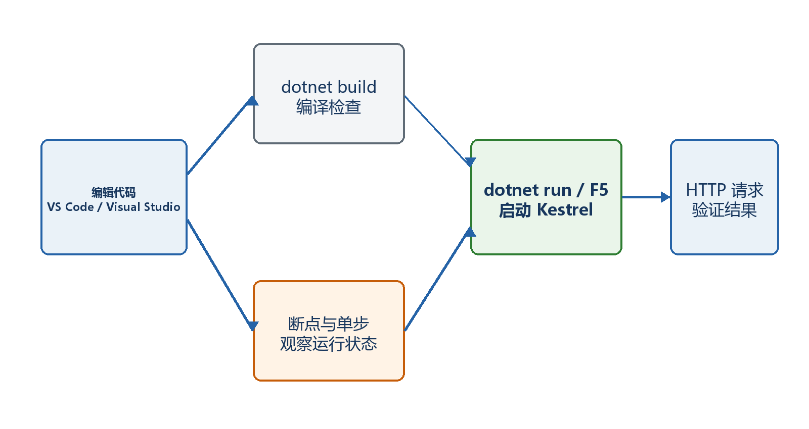
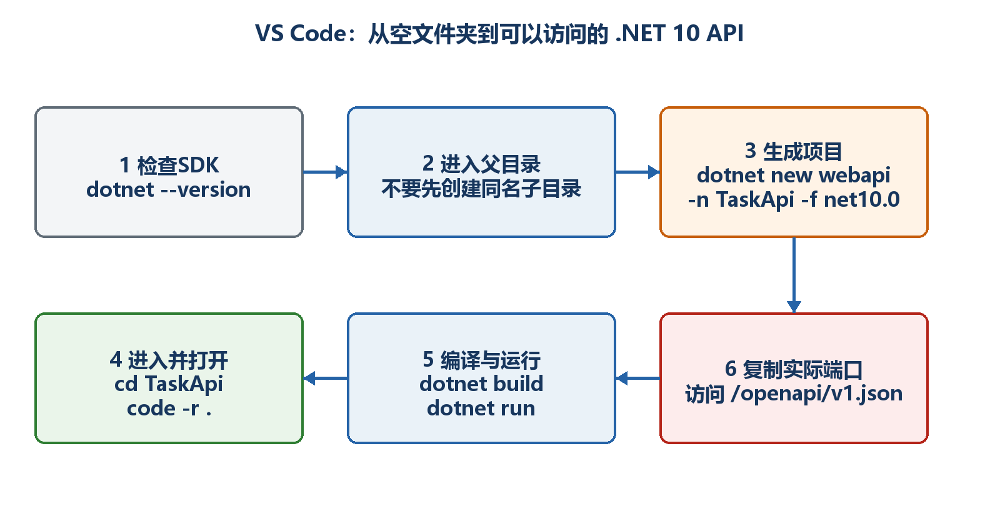
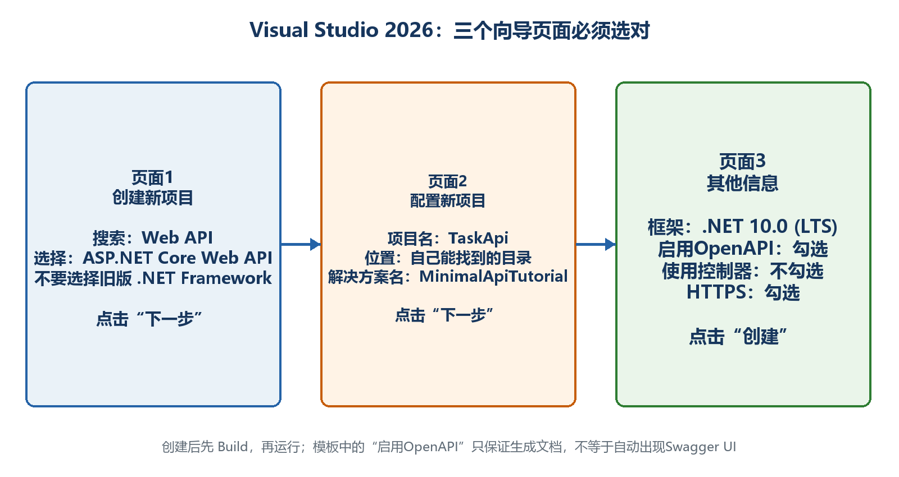

# 第5章　使用VS Code和Visual Studio开发

IDE只是帮助创建、编辑、运行和调试同一个.NET项目。无论使用VS Code还是Visual Studio，最终都在操作csproj、Program.cs和dotnet构建系统。本章分别从零演示两种工具。

  -------------------------------------------------------------------------------------------
  **先把三个问题说清楚　**这是什么：VS Code是轻量编辑器，Visual Studio是完整集成开发环境。\
  目的是什么：让读者能独立创建项目、打开正确文件夹、运行、设置断点并找到错误信息。\
  最后得到什么：使用任一工具创建HelloIdeApi，访问/api/hello得到JSON，并能在断点处查看变量。
  -------------------------------------------------------------------------------------------

  -------------------------------------------------------------------------------------------

  ----------------------------------------------------------------------------------------------------------
  **本章操作路线　**选择工具 → 安装组件 → 创建项目 → 确认目录 → 运行 → 打开实际URL → 设置断点 → 理解热重载
  ----------------------------------------------------------------------------------------------------------

  ----------------------------------------------------------------------------------------------------------

## 5.1 应该选择哪一种工具

如果希望看清命令和项目结构，VS Code非常合适；如果使用Windows并希望通过向导、图形化NuGet和发布工具工作，Visual Studio更方便。两者生成的项目可以互相打开，代码本身没有VS Code版和Visual Studio版之分。

-   选择VS Code：安装快、跨平台、终端工作流清晰。

-   选择Visual Studio：Windows集成完整，创建、调试、测试和发布集中在一个界面。

-   团队已经统一工具时优先跟随团队，减少调试配置差异。

-   本教程的命令行步骤在两种工具的内置终端中都能执行。

{width="6.102362204724409in" height="3.2418799212598426in"}

图5-1　两种开发工具最终使用同一套.NET项目文件

## 5.2 VS Code：先安装什么

先安装VS Code和.NET 10 SDK，再在扩展市场安装微软提供的C#开发扩展。安装SDK以后重新启动VS Code，使内置终端能找到dotnet。

-   打开扩展视图，搜索C# Dev Kit或当前微软C#开发扩展并安装。

-   打开"终端→新建终端"，执行dotnet \--version，确认显示10.x。

-   如果终端仍找不到dotnet，完全关闭并重新打开VS Code；必要时检查系统PATH。

## 5.3 VS Code：从零创建新项目的完整步骤

最稳定、也最容易理解的方法，是先在终端用dotnet new创建项目，再用VS Code打开刚生成的项目文件夹。关键是打开包含csproj的文件夹，不能只打开Program.cs单个文件。

16. 第1步：在资源管理器中创建父目录，例如D:\\dotnet-labs。

17. 第2步：启动VS Code，选择"文件→打开文件夹"，先打开父目录D:\\dotnet-labs。

18. 第3步：选择"终端→新建终端"，确认提示符位于父目录。

19. 第4步：执行dotnet new web -n HelloIdeApi -f net10.0。

20. 第5步：执行cd HelloIdeApi，再执行dir，确认能看到HelloIdeApi.csproj和Program.cs。

21. 第6步：选择"文件→打开文件夹"，改为打开D:\\dotnet-labs\\HelloIdeApi。

22. 第7步：如果工具询问是否信任作者或是否生成调试资产，对自己创建的练习目录可以确认。

{width="6.102362204724409in" height="3.2418799212598426in"}

图5-2　VS Code创建项目时父目录、项目目录和终端位置的关系

  ----------------------------------------------------------------------------------------------------------------------------------
  **最常见的错误　**只打开Program.cs时，编辑器看不到完整项目上下文，补全、构建和调试可能不正常。应打开包含csproj的整个项目文件夹。
  ----------------------------------------------------------------------------------------------------------------------------------

  ----------------------------------------------------------------------------------------------------------------------------------

## 5.4 VS Code：编写、运行并打开结果

把Program.cs替换为下面代码并保存。然后在VS Code内置终端执行build和watch。使用watch的目的是让开发期间的修改能自动应用或提示重启。

示例5-1　VS Code中的HelloIdeApi

```csharp
var builder = WebApplication.CreateBuilder(args);
var app = builder.Build();

app.MapGet("/api/hello", () => Results.Ok(new
{
message = "Hello from VS Code",
time = DateTimeOffset.Now
}));

app.Run();
```

示例5-2　在VS Code终端运行

```bash
dotnet build
dotnet watch
```

-   等待终端出现Now listening on。

-   复制实际基础地址，例如https://localhost:7123。

-   在浏览器地址栏输入https://localhost:7123/api/hello。

-   看到message和time的JSON就是最终结果。

-   修改message并保存；如果热重载成功，刷新浏览器会看到新值，否则按终端提示重启。

## 5.5 VS Code：设置断点看清请求怎样进入代码

调试的目的不是"让程序慢下来"，而是在某一行暂停，检查参数、局部变量、调用堆栈和异常。先把多行处理函数写清楚，断点才容易设置。

示例5-3　适合断点调试的端点

```csharp
app.MapGet("/api/square/{number:int}", (int number) =>
{
var result = number * number; // 在这一行左侧单击设置断点
return Results.Ok(new { number, result });
});
```

23. 单击代码行号左侧，出现红点。

24. 打开"运行和调试"，选择当前.NET项目并启动；如果提示选择配置，选择C#/.NET Web项目。

25. 浏览器访问实际地址/api/square/12。

26. 程序暂停后，把鼠标放在number上，应看到12；单步执行后result应为144。

27. 按继续运行，浏览器收到{\"number\":12,\"result\":144}。

## 5.6 Visual Studio：安装正确的工作负载

打开Visual Studio Installer，修改当前安装，勾选"ASP.NET和Web开发"工作负载，并确认包含.NET 10 SDK或相应目标组件。安装完成后启动Visual Studio。

  -----------------------------------------------------------------------------------------------------------------------------------------------
  **不要只安装编辑器外壳　**能够打开.cs文件不代表已经具备Web项目模板和.NET 10编译工具。创建项目界面中看不到ASP.NET Core模板时，先检查工作负载。
  -----------------------------------------------------------------------------------------------------------------------------------------------

  -----------------------------------------------------------------------------------------------------------------------------------------------

## 5.7 Visual Studio：使用向导创建Minimal API

下面按向导页面顺序创建与VS Code相同的HelloIdeApi。不同小版本的按钮文字可能略有差别，但选择逻辑不变。

28. 第1步：启动Visual Studio，选择"创建新项目"。

29. 第2步：搜索ASP.NET Core Empty并选择空项目模板。空模板最适合观察Minimal API最小结构。

30. 第3步：项目名称填写HelloIdeApi；位置选择准备保存项目的父目录。

31. 第4步：解决方案名称可以同名；如果只做一个练习项目，保持默认即可。

32. 第5步：框架选择.NET 10.0。

33. 第6步：认证类型选择None；HTTPS保持启用；本章不启用容器。

34. 第7步：点击Create，等待还原完成。

35. 第8步：在解决方案资源管理器确认项目下存在Program.cs、appsettings文件和Properties。

{width="6.102362204724409in" height="3.2418799212598426in"}

图5-3　Visual Studio向导中需要确认的关键选择

## 5.8 Visual Studio：运行、选择启动配置和调试

工具栏上的启动目标可能显示项目名、https或IIS Express。初学Minimal API时优先选择项目本身或https配置，便于直接观察Kestrel终端输出。

-   按Ctrl+F5：不附加调试器运行，适合快速验证。

-   按F5：附加调试器运行，断点和异常中断生效。

-   启动后浏览器可能只打开基础地址；本章端点是/api/hello，需要在地址后补上路径。

-   端口以启动控制台、浏览器地址或launchSettings.json中的当前配置为准。

-   停止按钮会结束开发服务器，结束后浏览器再次访问会连接失败。

## 5.9 两种工具中的文件和命令怎样对应

VS Code终端执行dotnet build，与Visual Studio菜单中的生成项目最终都调用.NET SDK/MSBuild。理解对应关系后，即使图形界面出现问题，也可以回到命令行检查。

-   创建项目：dotnet new，对应Visual Studio创建项目向导。

-   还原包：dotnet restore，对应IDE自动NuGet还原。

-   编译：dotnet build，对应"生成解决方案/项目"。

-   运行：dotnet run或dotnet watch，对应启动项目。

-   调试：IDE启动调试器并使用launchSettings中的配置。

-   发布：dotnet publish，对应Visual Studio发布配置文件；第7章详细介绍。

## 5.10 热重载为什么有时成功、有时要求重启

热重载会尝试把部分代码修改应用到正在运行的进程。修改字符串、方法体等通常容易应用；改变类型结构、顶级启动流程或服务注册时可能需要重启。终端或IDE会明确提示。

-   先保存文件，再观察终端是否显示已应用更改。

-   页面没变化时先刷新浏览器，仍不变化再重启应用。

-   新增或修改依赖注入注册后，重启可以确保服务容器重新构建。

-   不要把热重载失败误认为业务代码一定错误；先看工具给出的具体提示。

  -------------------------------------------------------------------------------------------------------------------------------------------
  **本章验收　**无论使用哪种工具，都应能独立完成：打开包含csproj的项目目录、编译、运行、复制实际URL、访问/api/hello、设置断点、停止服务器。
  -------------------------------------------------------------------------------------------------------------------------------------------

  -------------------------------------------------------------------------------------------------------------------------------------------
