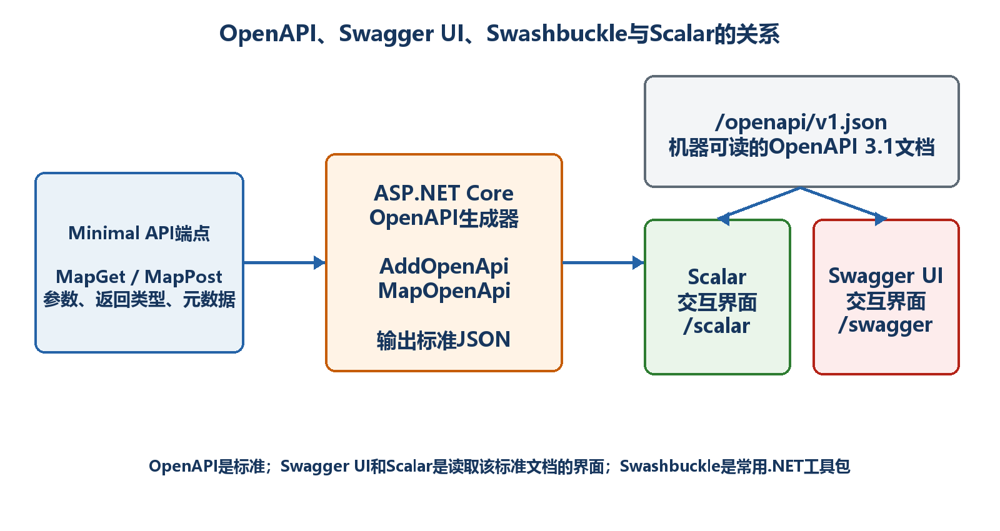
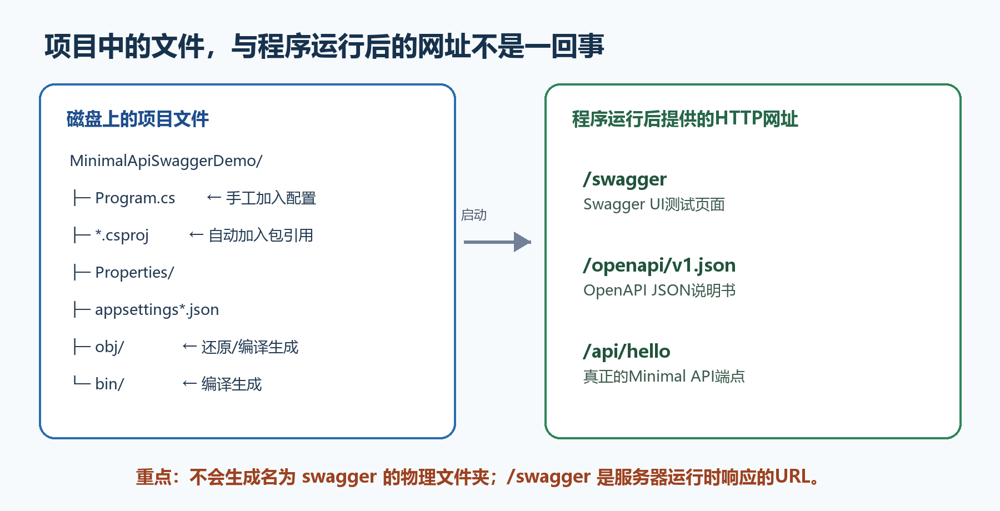
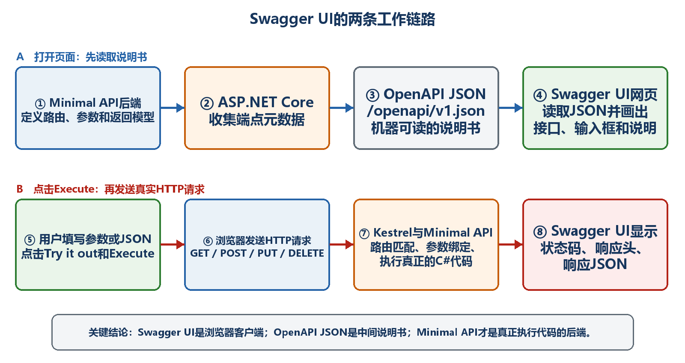
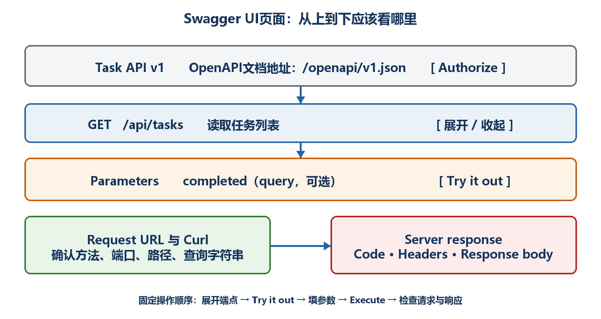
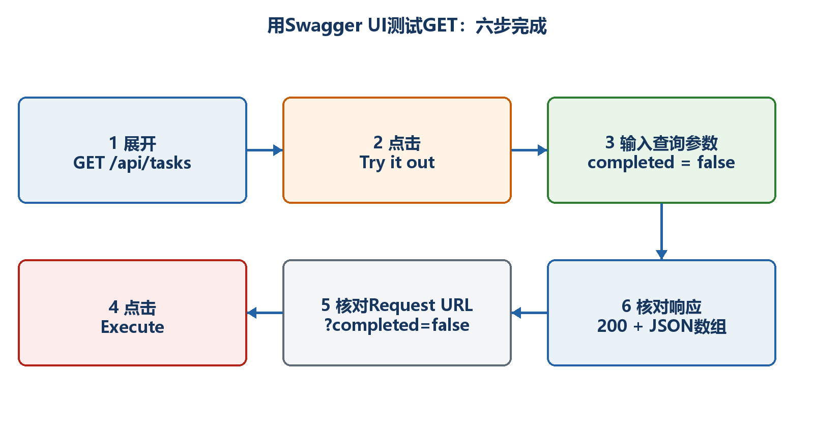
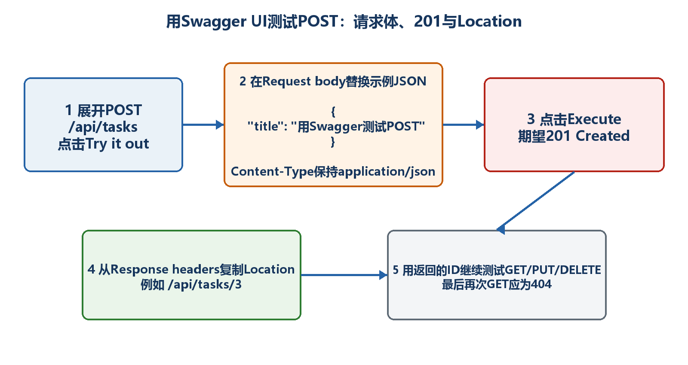

# 第6章　OpenAPI 3.1、Swagger与接口文档：先会用，再懂原理

本章不先堆术语。我们先创建一个只有GET /api/hello的Minimal API，运行它，在浏览器地址栏中打开实际的/swagger地址，点击Try it out和Execute，看到200与JSON。完成第一次成功以后，再解释OpenAPI、Swagger UI、Swashbuckle以及完整任务API。

  -----------------------------------------------------------------------------------------------------------------------------
  **本章学习路线　**先看最终效果 → 创建项目 → 写最少代码 → 打开具体网址 → 完成第一次GET测试 → 解释内部原理 → 再测试完整CRUD。
  -----------------------------------------------------------------------------------------------------------------------------

  -----------------------------------------------------------------------------------------------------------------------------

## 6.1 先看最终效果：学完本章你能做什么

假设运行项目后，终端显示Now listening on: https://localhost:7123，那么你会在浏览器地址栏中输入https://localhost:7123/swagger。注意：7123只是示例端口，你必须使用自己终端显示的实际端口。

页面打开后，会出现GET /api/hello。你展开这一行，点击Try it out，再点击Execute。页面下方应显示Request URL、Curl、200状态码和JSON响应。到这里，就完成了第一次Swagger UI测试。

-   真正的API地址：https://localhost:7123/api/hello。这个地址由Minimal API处理请求。

-   OpenAPI说明书地址：https://localhost:7123/openapi/v1.json。这个地址返回机器可读的JSON。

-   Swagger UI页面地址：https://localhost:7123/swagger。这个地址供人查看和手工测试API。

  ----------------------------------------------------------------------------------------------------------------------------------------------------
  **端口必须替换　**如果终端显示https://localhost:7288，就打开https://localhost:7288/swagger，不要照抄书中的7123。协议、主机和端口都以终端输出为准。
  ----------------------------------------------------------------------------------------------------------------------------------------------------

  ----------------------------------------------------------------------------------------------------------------------------------------------------

## 6.2 Swagger到底是做什么用的

用最直白的话说：Swagger UI是一个在浏览器里查看API、填写参数并发送测试请求的网页。它让原本需要手写curl命令或使用Postman完成的简单人工测试，可以直接通过网页按钮完成。

Swagger UI不是API本身，也不负责保存数据。把Swagger UI删除以后，Minimal API照样能够接收前端、手机App、curl和其他服务发来的请求。Swagger UI只是在开发阶段多提供了一个方便人操作的客户端。

-   查看接口：知道有哪些URL，以及每个接口使用GET、POST、PUT还是DELETE。

-   查看输入：知道参数应该写在路径、查询字符串还是JSON请求体中。

-   查看输出：知道成功和失败可能返回哪些状态码，以及JSON是什么结构。

-   手工测试：填写参数，点击Execute，向正在运行的后端发送一次真实HTTP请求。

-   辅助协作：前端、测试人员和其他开发者可以依据同一份说明书理解接口。

-   辅助排错：检查实际Request URL、请求体、状态码、响应头和响应体。

  ----------------------------------------------------------------------------------------------------------------------------------------------------------------
  **不要夸大Swagger　**Swagger UI适合学习、探索和人工验证，但不能代替自动化回归测试、压力测试、安全测试和正式业务验收。点击一次得到200，只能证明这一次请求成功。
  ----------------------------------------------------------------------------------------------------------------------------------------------------------------

  ----------------------------------------------------------------------------------------------------------------------------------------------------------------

## 6.3 OpenAPI是什么，它与Swagger是什么关系

OpenAPI是一套公开的API说明书格式。它规定一份HTTP API说明书应该怎样写：路径写在哪里、HTTP方法怎样表示、参数来自哪里、JSON有哪些字段、可能返回哪些状态码。

按照OpenAPI格式生成的具体JSON或YAML文件叫OpenAPI文档。本章默认使用/openapi/v1.json。OpenAPI是规则；/openapi/v1.json是当前项目按照规则生成的具体说明书。

Swagger UI读取这份OpenAPI文档，然后自动生成可视化网页。日常交流中，人们常把OpenAPI文档、Swagger UI页面或Swashbuckle工具包都简称为Swagger，但初学阶段最好把名称分开。

-   Minimal API：真正接收请求、执行C#代码和返回结果的后端。

-   OpenAPI：规定API说明书格式的标准。

-   OpenAPI文档：符合标准的具体JSON或YAML，例如/openapi/v1.json。

-   Swagger UI：读取OpenAPI文档并生成操作页面的浏览器前端。

-   Swashbuckle：.NET中常用的Swagger/OpenAPI工具包，可以提供文档生成器、Swagger UI或两者。

-   Scalar：另一种读取OpenAPI文档的交互页面，不是Swagger UI。

{width="6.102362204724409in" height="3.2418799212598426in"}

图6-1　Minimal API、OpenAPI文档与Swagger UI之间的关系

  ------------------------------------------------------------------------------------------------------------------------------------------------------------------------------------------------------------
  **生活化比喻　**Minimal API像真正做菜的厨房；OpenAPI标准像菜单的统一写法；/openapi/v1.json像这家餐厅的具体菜单；Swagger UI像读取菜单后生成的电子点餐屏。点餐屏不会做菜，它只负责展示选择并把订单送到厨房。
  ------------------------------------------------------------------------------------------------------------------------------------------------------------------------------------------------------------

  ------------------------------------------------------------------------------------------------------------------------------------------------------------------------------------------------------------

## 6.4 .NET 10应该选择哪种实现方案

.NET 10的新项目推荐把"生成文档"和"显示页面"分开理解。本章主线使用Microsoft.AspNetCore.OpenApi生成/openapi/v1.json，只安装Swashbuckle.AspNetCore.SwaggerUI来提供/swagger页面。

旧项目经常使用完整Swashbuckle方案：AddSwaggerGen生成文档，UseSwagger公开/swagger/v1/swagger.json，UseSwaggerUI显示页面。两种方案都能工作，但不要把两套生成器不加区分地混在同一个入门示例中。

-   本章主线：AddOpenApi + MapOpenApi生成/openapi/v1.json；UseSwaggerUI读取它。

-   经典方案：AddSwaggerGen + UseSwagger生成/swagger/v1/swagger.json；UseSwaggerUI读取它。

-   两条路线最明显的区别是JSON地址和文档生成器不同；点击Try it out后的HTTP请求原理相同。

## 6.5 从零创建项目：命令要在哪里执行

下面从一个普通父目录开始。先进入准备存放项目的目录，再让dotnet new创建MinimalApiSwaggerDemo子目录。不要在已经有同名项目的目录中反复执行命令。

示例6-1　从父目录创建并进入.NET 10项目

```bash
# 示例：进入准备存放练习项目的父目录
cd D:\dotnet-labs

# 创建.NET 10空Web项目，同时创建MinimalApiSwaggerDemo子目录
dotnet new web -n MinimalApiSwaggerDemo -f net10.0

# 进入刚创建的项目目录
cd MinimalApiSwaggerDemo

# 确认当前目录中确实存在csproj
dir
```

执行dir以后，应看到MinimalApiSwaggerDemo.csproj、Program.cs、appsettings.json和Properties目录。如果看不到csproj，说明当前终端不在项目目录，后面的dotnet add package会加到错误位置或直接失败。

## 6.6 安装两个包：一个生成说明书，一个提供页面

保持终端位于包含MinimalApiSwaggerDemo.csproj的目录，依次执行下面两条命令。第一条提供.NET 10内置OpenAPI文档生成能力；第二条只提供Swagger UI页面资源。

示例6-2　安装OpenAPI生成器和Swagger UI

```bash
dotnet add package Microsoft.AspNetCore.OpenApi
dotnet add package Swashbuckle.AspNetCore.SwaggerUI
```

-   Microsoft.AspNetCore.OpenApi：负责根据端点元数据生成/openapi/v1.json。

-   Swashbuckle.AspNetCore.SwaggerUI：负责提供/swagger网页，并读取指定的OpenAPI JSON。

-   安装完成后打开csproj，可以看到两个PackageReference。

### 6.6.1 安装Swagger后，项目中到底改变了什么

先说结论：执行dotnet add package以后，命令主要修改项目文件（.csproj），并把依赖还原到计算机的NuGet全局缓存中。它不会自动替你修改Program.cs，也不会在项目中创建一个swagger文件夹。Program.cs中的Swagger/OpenAPI配置仍然需要开发者自己加入。

为了避免把"磁盘上的文件"和"程序运行后的网址"混在一起，下面分别查看安装前、安装后以及编译后的项目结构。

#### 6.6.1.1 刚执行dotnet new web以后

示例6-2A　尚未安装Swagger相关包时的主要目录

MinimalApiSwaggerDemo/\
├─ Properties/\
│ └─ launchSettings.json\
├─ appsettings.json\
├─ appsettings.Development.json\
├─ MinimalApiSwaggerDemo.csproj\
└─ Program.cs

-   MinimalApiSwaggerDemo.csproj：项目说明文件，记录目标框架、编译选项和NuGet包引用。

-   Program.cs：应用程序入口，也是本章要加入OpenAPI和Swagger UI代码的地方。

-   Properties/launchSettings.json：保存本地启动配置和开发端口；它不负责生成Swagger页面。

-   appsettings.json与appsettings.Development.json：保存应用配置；本章的最小示例暂时不需要修改它们。

#### 6.6.1.2 安装包后，.csproj增加了什么

安装前，最简单的项目文件大致如下。不同模板可能还有其他属性，但核心结构相同。

示例6-2B　安装包之前的csproj核心内容

\<Project Sdk=\"Microsoft.NET.Sdk.Web\"\>\
\<PropertyGroup\>\
\<TargetFramework\>net10.0\</TargetFramework\>\
\<Nullable\>enable\</Nullable\>\
\<ImplicitUsings\>enable\</ImplicitUsings\>\
\</PropertyGroup\>\
\</Project\>

执行两条dotnet add package命令后，命令会在项目文件中加入PackageReference。下面的版本号只是结构示意；请保留命令在你的csproj中实际写入的版本号，不要为了和书中一致而手工改版本。

示例6-2C　安装后新增的两个PackageReference（结构示意）

\<Project Sdk=\"Microsoft.NET.Sdk.Web\"\>\
\<PropertyGroup\>\
\<TargetFramework\>net10.0\</TargetFramework\>\
\<Nullable\>enable\</Nullable\>\
\<ImplicitUsings\>enable\</ImplicitUsings\>\
\</PropertyGroup\>\
\
\<ItemGroup\>\
\<PackageReference Include=\"Microsoft.AspNetCore.OpenApi\"\
Version=\"命令写入的实际版本号\" /\>\
\<PackageReference Include=\"Swashbuckle.AspNetCore.SwaggerUI\"\
Version=\"命令写入的实际版本号\" /\>\
\</ItemGroup\>\
\</Project\>

  --------------------------------------------------------------------------------------------------------------------------------------------------------------------------
  **谁修改了什么　**dotnet add package自动修改csproj；你随后手工修改Program.cs。不要把两个动作误认为同一件事。只安装包而不写Program.cs配置，通常不会自动出现/swagger页面。
  --------------------------------------------------------------------------------------------------------------------------------------------------------------------------

  --------------------------------------------------------------------------------------------------------------------------------------------------------------------------

#### 6.6.1.3 restore和build以后，最终目录是什么样

示例6-2D　完成配置并编译后的主要目录

MinimalApiSwaggerDemo/\
├─ Properties/\
│ └─ launchSettings.json\
├─ appsettings.json\
├─ appsettings.Development.json\
├─ MinimalApiSwaggerDemo.csproj ← 已有两个PackageReference\
├─ Program.cs ← 已加入OpenAPI和Swagger UI配置\
├─ obj/ ← restore或build自动生成\
└─ bin/ ← build后自动生成

-   obj/：保存还原、编译和生成过程使用的中间文件，例如project.assets.json。它由工具自动维护，不要在里面编写业务代码。

-   bin/：保存编译后的DLL、配置文件和其他运行输出。执行dotnet build以后通常会出现。

-   NuGet包本体：一般保存在当前用户的全局NuGet缓存中，例如Windows上的%USERPROFILE%\\.nuget\\packages，而不是复制成项目根目录中的一个新文件夹。

-   .vscode/或.vs/：可能由VS Code或Visual Studio创建，但它们属于编辑器配置，不是Swagger运行所必需的目录。

#### 6.6.1.4 为什么目录中没有swagger文件夹

因为/swagger不是本地文件夹，而是应用程序运行时提供的HTTP路由。浏览器访问这个网址时，UseSwaggerUI中间件会从已安装包所带的页面资源中生成响应。类似地，/openapi/v1.json也不是你手工保存的JSON文件，而是MapOpenApi在收到请求时根据当前端点元数据生成的文档响应。

-   https://localhost:7123/swagger：运行时网址，返回Swagger UI页面。

-   https://localhost:7123/openapi/v1.json：运行时网址，返回OpenAPI JSON说明书。

-   https://localhost:7123/api/hello：运行时网址，调用真正的业务API。

-   7123只是示例端口，必须替换为dotnet run终端显示的实际端口。

  ----------------------------------------------------------------------------------------------------------------------------------------------------------------------------------------------------------
  **本例不需要wwwroot　**Swagger UI页面资源由NuGet包和中间件提供，因此本章的配置不需要自己创建wwwroot/swagger/index.html。如果将来要托管自己编写的HTML、CSS和JavaScript，才需要按静态文件章节创建wwwroot。
  ----------------------------------------------------------------------------------------------------------------------------------------------------------------------------------------------------------

  ----------------------------------------------------------------------------------------------------------------------------------------------------------------------------------------------------------

{width="6.102362204724409in" height="3.1189851268591426in"}

图6-2A　项目文件与运行时网址的区别

## 6.7 编写第一个Program.cs：每一段只做一件事

打开Program.cs，先删除模板原有内容，再按照下面六个小步骤逐段输入。每输入一段，都先理解它解决什么问题。

### 6.7.1 第1步：创建Builder

示例6-3　创建应用构建器

```text
var builder = WebApplication.CreateBuilder(args);
```

目的：准备配置、日志和依赖注入容器。此时服务器尚未启动，也还没有app变量。

### 6.7.2 第2步：注册OpenAPI服务

示例6-4　注册OpenAPI文档生成服务

```csharp
builder.Services.AddOpenApi();
```

目的：把生成OpenAPI文档需要的服务放进依赖注入容器。它必须写在builder.Build()之前。这里只是准备生成说明书的能力，还没有创建/swagger页面。

### 6.7.3 第3步：创建app

示例6-5　构建Web应用

```csharp
var app = builder.Build();
```

目的：结束服务注册阶段，得到真正用于配置端点和请求管道的WebApplication对象。后面的MapOpenApi、UseSwaggerUI、MapGet和Run都针对app调用。

### 6.7.4 第4步：公开OpenAPI JSON并提供Swagger UI

示例6-6　让/swagger读取/openapi/v1.json

```csharp
if (app.Environment.IsDevelopment())
{
app.MapOpenApi();

app.UseSwaggerUI(options =>
{
options.SwaggerEndpoint(
"/openapi/v1.json",
"Hello API v1");
});
}
```

-   IsDevelopment：只在开发环境开放文档和测试页面，避免默认暴露到生产环境。

-   MapOpenApi：增加/openapi/v1.json端点。打开这个地址时会得到OpenAPI JSON。

-   UseSwaggerUI：提供/swagger页面。

-   SwaggerEndpoint第一个参数：页面要读取的说明书地址，必须与MapOpenApi生成的地址一致。

-   SwaggerEndpoint第二个参数：显示在页面上的文档名称，可以自定义。

### 6.7.5 第5步：添加真正要测试的API

示例6-7　添加GET /api/hello

```csharp
app.MapGet("/api/hello", () =>
new
{
message = "Hello Swagger",
serverTime = DateTimeOffset.Now
})
.WithSummary("返回一条问候消息")
.WithTags("Hello");
```

-   MapGet表示只处理HTTP GET请求。

-   /api/hello是真正的业务API路径，它会出现在Swagger UI中。

-   处理程序没有参数，所以第一次测试不需要填写任何内容。

-   返回匿名对象后，ASP.NET Core自动把对象序列化为JSON。

-   WithSummary提供页面摘要，WithTags把接口放到Hello分组。

### 6.7.6 第6步：启动服务器

示例6-8　启动Kestrel服务器

```text
app.Run();
```

目的：启动服务器并持续等待HTTP请求。没有app.Run()，程序会很快结束，浏览器无法连接。

### 6.7.7 合并后的完整Program.cs

示例6-16A　第一次学习Swagger UI使用的最小完整Program.cs

var builder = WebApplication.CreateBuilder(args);\
\
// 1. 注册OpenAPI文档生成服务\
builder.Services.AddOpenApi();\
\
var app = builder.Build();\
\
// 2. 开发环境中提供OpenAPI JSON和Swagger UI\
if (app.Environment.IsDevelopment())\
{\
app.MapOpenApi();\
\
app.UseSwaggerUI(options =\>\
{\
options.SwaggerEndpoint(\
\"/openapi/v1.json\",\
\"Hello API v1\");\
});\
}\
\
// 3. 真正的Minimal API端点\
app.MapGet(\"/api/hello\", () =\>\
new\
{\
message = \"Hello Swagger\",\
serverTime = DateTimeOffset.Now\
})\
.WithSummary(\"返回一条问候消息\")\
.WithTags(\"Hello\");\
\
// 4. 启动Web服务器\
app.Run();

### 6.7.8 在已有Minimal API中，Swagger代码究竟插在哪里

如果你不是从空文件开始，而是已经有一个可以运行的Minimal API，不要把整份Program.cs盲目覆盖。只需要找到下面三个位置：builder.Build()之前、builder.Build()之后，以及app.Run()之前。

示例6-16B　在已有Program.cs中插入Swagger配置的位置模板

var builder = WebApplication.CreateBuilder(args);\
\
// 【位置1：必须在builder.Build()之前】\
// 注册生成OpenAPI文档所需的服务。\
builder.Services.AddOpenApi();\
\
var app = builder.Build();\
\
// 【位置2：必须在builder.Build()之后、app.Run()之前】\
// 开发环境中提供OpenAPI JSON和Swagger UI。\
if (app.Environment.IsDevelopment())\
{\
app.MapOpenApi();\
\
app.UseSwaggerUI(options =\>\
{\
options.SwaggerEndpoint(\
\"/openapi/v1.json\",\
\"My API v1\");\
});\
}\
\
// 【位置3：保留原有中间件和业务端点】\
// 例如app.UseHttpsRedirection();\
// 例如app.MapGet(\...)、app.MapPost(\...)。\
app.MapGet(\"/api/hello\", () =\> \"Hello Swagger\");\
\
// 【最后一行附近：启动服务器】\
app.Run();

-   位置1为什么在Build之前：AddOpenApi是在依赖注入容器中注册服务；调用builder.Build()以后，服务注册阶段已经结束。

-   位置2为什么在Build之后：MapOpenApi和UseSwaggerUI都是对app进行配置，只有创建app以后才能调用。

-   为什么放在app.Run()之前：app.Run()会启动服务器并持续等待请求，通常把它作为Program.cs最后一句；写在它后面的配置不会按正常顺序执行。

-   SwaggerEndpoint为什么写/openapi/v1.json：Swagger UI启动后需要先下载这份说明书；这里必须和MapOpenApi公开的文档地址相匹配。

-   业务端点放在哪里：为了让新手容易阅读，本教程统一放在Swagger配置块后、app.Run()前。每个MapGet、MapPost等端点都会贡献自己的路由和元数据。

#### 6.7.8.1 从原有代码到完成配置：按这六步操作

36. 在终端进入包含csproj的项目目录，执行两条dotnet add package命令。

37. 打开Program.cs，找到var builder = WebApplication.CreateBuilder(args);。在builder.Build()之前加入builder.Services.AddOpenApi();。

38. 找到var app = builder.Build();。在它之后加入if (app.Environment.IsDevelopment())代码块。

39. 在代码块中先写app.MapOpenApi();，再写app.UseSwaggerUI(\...)，并让SwaggerEndpoint指向/openapi/v1.json。

40. 保留原来的MapGet、MapPost、MapPut、MapDelete和其他中间件；确认app.Run();仍在最后。

41. 保存文件，执行dotnet build和dotnet run，然后把终端实际地址与/swagger拼接。例如终端显示https://localhost:7123，就打开https://localhost:7123/swagger。

#### 6.7.8.2 每一项新增内容的作用速查

-   Microsoft.AspNetCore.OpenApi包：提供.NET的OpenAPI文档生成能力。

-   Swashbuckle.AspNetCore.SwaggerUI包：提供浏览器中的Swagger UI页面资源。

-   builder.Services.AddOpenApi()：把文档生成服务注册到依赖注入容器。

-   app.MapOpenApi()：公开OpenAPI JSON端点，本章默认是/openapi/v1.json。

-   app.UseSwaggerUI()：提供Swagger UI网页，本章默认通过/swagger访问。

-   options.SwaggerEndpoint(\...)：告诉Swagger UI到哪里下载OpenAPI JSON说明书。

-   app.MapGet/MapPost等：真正处理HTTP请求的Minimal API业务端点。

-   app.Run()：启动Kestrel，使上述网址真正可以被浏览器访问。

  --------------------------------------------------------------------------------------------------------------------------------------------------------------------------------------------
  **最终检查　**项目能编译只是第一关。运行后还要分别打开"实际基础地址/openapi/v1.json"和"实际基础地址/swagger"：前者能看到JSON，后者能看到可交互页面，才说明文档生成与页面显示两层都已接通。
  --------------------------------------------------------------------------------------------------------------------------------------------------------------------------------------------

  --------------------------------------------------------------------------------------------------------------------------------------------------------------------------------------------

## 6.8 运行项目：先复制终端地址，再打开浏览器

保存Program.cs，在包含csproj的项目目录执行dotnet build。看到0个错误后，再执行dotnet run。终端出现Now listening on以后不要关闭，因为Swagger UI发送的请求需要这个后端进程处理。

示例6-9　编译、运行并读取实际监听地址

```bash
dotnet build
dotnet run

# 典型输出，实际端口可能不同：
# Now listening on: https://localhost:7123
# Now listening on: http://localhost:5187
# Application started. Press Ctrl+C to shut down.
```

-   如果终端显示https://localhost:7123，就把https://localhost:7123作为基础地址。

-   如果只显示http://localhost:5187，就使用http://localhost:5187，不要自行改成https。

-   保持运行项目的终端窗口不关闭。要停止程序时再按Ctrl+C。

## 6.9 第一次打开Swagger UI并测试GET

下面假设终端显示Now listening on: https://localhost:7123。请把7123替换成自己的端口。

42. 打开Chrome、Edge或Firefox，在地址栏输入https://localhost:7123/openapi/v1.json，然后按Enter。能看到JSON，说明OpenAPI文档端点已经工作。

43. 新开一个浏览器标签页，在地址栏输入https://localhost:7123/swagger，然后按Enter。不要输入本地文件路径，也不要只输入/swagger。

44. 如果浏览器自动跳转到https://localhost:7123/swagger/index.html，这是正常现象。

45. 页面中找到Hello分组，再找到GET /api/hello。点击这一整行把它展开。

46. 点击右侧Try it out。因为接口没有参数，所以不需要填写输入框。

47. 点击Execute。Swagger UI会立即向https://localhost:7123/api/hello发送真实GET请求。

48. 向下查看Request URL，确认它以/api/hello结尾。

49. 查看Server response，确认Code为200，Response body包含message和serverTime。

示例6-10　第一次点击Execute后应看到的JSON结构

```json
{
"message": "Hello Swagger",
"serverTime": "2026-07-18T16:30:00+08:00"
}
```

  ----------------------------------------------------------------------------------------------------------------------------------------------------------------------------------------------------------
  **到这里先停一下　**只要你能打开自己的https://localhost:\<实际端口\>/swagger，找到GET /api/hello，并通过Execute得到200和JSON，就已经完成了Swagger UI最小闭环。后面出现问题时，可以随时回到这个最小示例。
  ----------------------------------------------------------------------------------------------------------------------------------------------------------------------------------------------------------

  ----------------------------------------------------------------------------------------------------------------------------------------------------------------------------------------------------------

## 6.10 为什么页面会自动出现接口

第一次操作成功以后，再理解内部原理会容易很多。Swagger UI没有直接阅读全部C#源代码，也不会直接调用Program.cs中的Lambda。中间必须经过OpenAPI文档和真实HTTP请求。

### 6.10.1 Swagger UI从启动到显示结果的完整工作原理

-   第1步：MapGet、MapPost等方法向ASP.NET Core注册真正的API端点，并附带路由、参数、返回类型、Summary和Tags等元数据。

-   第2步：AddOpenApi注册文档生成服务。它告诉ASP.NET Core应当怎样把端点元数据整理成OpenAPI文档。

-   第3步：MapOpenApi增加/openapi/v1.json端点。浏览器或Swagger UI请求该地址时，ASP.NET Core根据端点元数据生成并返回OpenAPI JSON。

-   第4步：UseSwaggerUI提供Swagger UI的HTML、CSS和JavaScript，并把/openapi/v1.json设置为数据源。

-   第5步：浏览器打开/swagger，先取得Swagger UI页面文件；页面中的JavaScript随后再请求/openapi/v1.json。

-   第6步：Swagger UI解析JSON中的paths、parameters、requestBody、responses和schemas，再画出接口列表、输入框、示例JSON和响应说明。

-   第7步：用户点击Execute后，Swagger UI根据端点说明和输入内容组装一条真实HTTP请求，并由浏览器发送给Kestrel。

-   第8步：Kestrel与ASP.NET Core完成中间件处理、路由匹配和参数绑定，然后执行真正的Minimal API处理程序。

-   第9步：后端返回状态码、响应头和JSON；Swagger UI收到响应后，把这些内容显示在Server response区域。

{width="6.299212598425197in" height="3.3464566929133857in"}

图6-2　Swagger UI从读取OpenAPI说明书到显示真实API响应的完整链路

  ---------------------------------------------------------------------------------------------------------------
  **最关键的一句话　**Swagger UI是浏览器客户端；OpenAPI JSON是中间说明书；Minimal API才是真正执行C#代码的后端。
  ---------------------------------------------------------------------------------------------------------------

  ---------------------------------------------------------------------------------------------------------------

### 6.10.2 缺少一环时会发生什么

-   没有AddOpenApi或MapOpenApi：/openapi/v1.json通常返回404，Swagger UI没有说明书可读。

-   有/openapi/v1.json但没有UseSwaggerUI：JSON可以打开，/swagger却返回404。

-   SwaggerEndpoint地址写错：/swagger页面外壳可能出现，但接口列表加载失败。

-   后端进程已经关闭：页面可能还留在浏览器中，但点击Execute会出现Failed to fetch。

-   端点返回类型或元数据不明确：API可能能运行，但Swagger UI显示的Schema或状态码不完整。

## 6.11 从一个GET扩展到完整任务API

下面的代码比Hello示例长，不是因为Swagger本身复杂，而是因为要同时练习查询参数、路径参数、JSON请求体、GET、POST、PUT、DELETE以及200、201、204、404等状态码。先理解A至G七段，再看合并后的完整代码。

-   A段：启动应用并配置OpenAPI与Swagger UI。

-   B段：创建两条内存任务数据，供第一次GET立即看到结果。

-   C段：两个GET分别练习查询参数和路径参数。

-   D段：POST接收JSON，创建新任务并返回201与Location。

-   E段：PUT同时接收路径id和JSON请求体，更新任务。

-   F段：DELETE按id删除，成功返回204，不存在返回404。

-   G段：三个record定义响应模型以及POST、PUT各自接收的JSON结构。

示例6-17　供Swagger UI逐步测试的完整任务API（按A至G段注释）

```csharp
var builder = WebApplication.CreateBuilder(args);
builder.Services.AddOpenApi();

var app = builder.Build();

// A段：OpenAPI JSON和Swagger UI
if (app.Environment.IsDevelopment())
{
app.MapOpenApi();
app.UseSwaggerUI(options =>
options.SwaggerEndpoint(
"/openapi/v1.json",
"Task API v1"));
}

// B段：内存数据。程序重启后会恢复为这两条
var tasks = new List<TaskItem>
{
new(1, "学习Swagger UI", false),
new(2, "完成接口测试", true)
};

// C段：GET列表；completed是可选查询参数
app.MapGet("/api/tasks", (bool? completed) =>
completed is null
? tasks
: tasks.Where(x => x.Completed == completed).ToList())
.WithSummary("读取任务列表")
.WithTags("Tasks");

// C段：GET单项；id来自路径，找不到时返回404
app.MapGet("/api/tasks/{id:int}", (int id) =>
tasks.FirstOrDefault(x => x.Id == id) is { } task
? Results.Ok(task)
: Results.NotFound())
.WithSummary("按编号读取任务")
.WithTags("Tasks");

// D段：POST；request来自JSON请求体
app.MapPost("/api/tasks", (CreateTaskRequest request) =>
{
var id = tasks.Count == 0
? 1
: tasks.Max(x => x.Id) + 1;

var task = new TaskItem(id, request.Title, false);
tasks.Add(task);

return Results.Created($"/api/tasks/{id}", task);
})
.WithSummary("创建任务")
.WithTags("Tasks");

// E段：PUT；id来自路径，request来自JSON请求体
app.MapPut("/api/tasks/{id:int}",
(int id, UpdateTaskRequest request) =>
{
var index = tasks.FindIndex(x => x.Id == id);
if (index < 0)
return Results.NotFound();

tasks[index] = new TaskItem(
id,
request.Title,
request.Completed);

return Results.Ok(tasks[index]);
})
.WithSummary("更新任务")
.WithTags("Tasks");

// F段：DELETE；成功为204，不存在为404
app.MapDelete("/api/tasks/{id:int}", (int id) =>
{
var removed = tasks.RemoveAll(x => x.Id == id);
return removed == 0
? Results.NotFound()
: Results.NoContent();
})
.WithSummary("删除任务")
.WithTags("Tasks");

app.Run();

// G段：请求和响应模型
record TaskItem(int Id, string Title, bool Completed);
record CreateTaskRequest(string Title);
record UpdateTaskRequest(string Title, bool Completed);
```

## 6.12 用Swagger UI完成一轮连续CRUD测试

把Program.cs替换为示例6-17，保存后执行dotnet build和dotnet run。假设终端显示https://localhost:7123，就打开https://localhost:7123/swagger。端口仍然以你的终端为准。

{width="6.102362204724409in" height="3.2418799212598426in"}

图6-3　Swagger UI页面从上到下的查看顺序

### 6.12.1 测试GET /api/tasks

50. 展开GET /api/tasks，点击Try it out。

51. 第一次让completed保持空白，点击Execute。

52. 确认Request URL以/api/tasks结尾，Code为200，Response body是包含两条任务的JSON数组。

53. 把completed设置为false再次Execute，确认Request URL出现?completed=false，并且只返回未完成任务。

54. 把completed改成true再执行，确认返回结果随筛选条件变化。

{width="6.102362204724409in" height="3.2418799212598426in"}

图6-4　使用Swagger UI测试带查询参数GET请求的六个动作

### 6.12.2 测试GET /api/tasks/{id}和404

55. 展开GET /api/tasks/{id}，点击Try it out。

56. 在id输入框中只填写1，不要填写{id}、/1或引号。

57. 点击Execute，确认Request URL以/api/tasks/1结尾，Code为200。

58. 把id改成999再次执行，确认Code为404。404说明请求已经到达API，但编号999的资源不存在。

### 6.12.3 测试POST /api/tasks

59. 展开POST /api/tasks，点击Try it out。

60. 在Request body编辑框中输入{\"title\":\"用Swagger测试POST\"}。属性名和字符串都必须使用双引号。

61. 确认Media type为application/json，然后点击Execute。

62. 确认Code为201 Created。查看Response headers中的Location，例如/api/tasks/3。

63. 查看Response body并记住新任务id。后面的PUT和DELETE要继续使用这个真实id。

示例6-18　POST请求体实际填写的JSON

```json
{
"title": "用Swagger测试POST"
}
```

{width="6.102362204724409in" height="3.2418799212598426in"}

图6-5　创建资源并继续使用POST返回的任务编号

### 6.12.4 用新id测试PUT

64. 展开PUT /api/tasks/{id}并点击Try it out。

65. id填写刚才POST返回的3；如果你的id不是3，就填写自己的实际id。

66. Request body填写{\"title\":\"Swagger测试已完成\",\"completed\":true}。

67. 点击Execute，确认Code为200，响应体中的completed已经变成true。

68. 再次执行GET /api/tasks/3，确认修改后的内容能够重新读取。

### 6.12.5 测试DELETE并确认真的删除

69. 展开DELETE /api/tasks/{id}，点击Try it out。

70. 填写刚才创建的id并点击Execute。成功时应得到204 No Content，Response body为空是正确结果。

71. 再次执行GET /api/tasks/{id}查询同一个id，应得到404。

72. 再次DELETE同一个id，也应得到404。这样才证明资源确实不存在。

### 6.12.6 每次Execute后应该看哪五项

-   Curl：Swagger UI根据当前输入生成的命令，可复制到终端复现。

-   Request URL：实际请求地址，重点检查协议、端口、路径和查询字符串。

-   Response code：200、201、204、400、404、500分别代表不同结果，不能只看响应体。

-   Response headers：检查Content-Type、Location以及认证或缓存相关响应头。

-   Response body：检查JSON字段、值、数组或错误对象是否符合预期。

## 6.13 直接阅读/openapi/v1.json

Swagger UI显示的内容来自OpenAPI文档。假设基础地址是https://localhost:7123，就在浏览器新标签页输入https://localhost:7123/openapi/v1.json。你会看到JSON，而不是可点击页面。

文档根部常见openapi、info、paths和components。paths列出URL以及GET、POST等操作；parameters描述参数；requestBody描述JSON请求体；responses描述状态码；components.schemas描述可复用的数据模型。

示例6-19　精简后的OpenAPI 3.1文档结构

```json
{
"openapi": "3.1.0",
"paths": {
"/api/tasks/{id}": {
"get": {
"parameters": [
{ "name": "id", "in": "path", "required": true }
],
"responses": {
"200": { "description": "OK" },
"404": { "description": "Not Found" }
}
}
}
}
}
```

## 6.14 怎样让Swagger文档更准确

Swagger UI只能显示OpenAPI文档中已有的信息。端点名称、摘要、分组、返回类型和状态码越明确，生成的文档越准确。文档不准确时，不要先责怪页面，应先检查Minimal API端点的类型和元数据。

示例6-20　使用TypedResults和端点元数据改善文档

```csharp
app.MapGet("/api/tasks/{id:int}",
Results<Ok<TaskItem>, NotFound> (int id) =>
{
var task = tasks.FirstOrDefault(x => x.Id == id);
return task is null
? TypedResults.NotFound()
: TypedResults.Ok(task);
})
.WithName("GetTaskById")
.WithSummary("按编号读取任务")
.WithDescription("编号不存在时返回404。")
.WithTags("Tasks");
```

-   WithName：提供稳定Operation ID，也可用于链接生成。

-   WithSummary和WithDescription：给阅读者清楚的业务说明。

-   WithTags：把相关端点归入同一分组。

-   TypedResults和Results\<T1,T2\>：把可能的返回结果写进类型签名，帮助生成器识别200与404。

-   Produces与ProducesProblem：复杂场景下显式补充响应类型和状态码。

## 6.15 Scalar：另一种交互页面

Scalar和Swagger UI都可以读取同一份/openapi/v1.json。它们是不同的页面产品，但后端Minimal API和OpenAPI文档不需要因此改写。一个教学项目通常选择一个UI即可。

示例6-21　安装Scalar

```bash
dotnet add package Scalar.AspNetCore
```

示例6-22　让Scalar读取内置OpenAPI文档

```csharp
using Scalar.AspNetCore;

if (app.Environment.IsDevelopment())
{
app.MapOpenApi();
app.MapScalarApiReference();
}

// 运行后按照终端端口打开：
// https://localhost:<实际端口>/scalar
```

## 6.16 经典Swashbuckle完整方案

如果维护的是使用AddSwaggerGen、UseSwagger和UseSwaggerUI的既有项目，可以继续使用完整Swashbuckle方案。它与本章主线的区别是：SwaggerGen负责生成文档，默认文档地址通常是/swagger/v1/swagger.json。

下面的代码与AddOpenApi、MapOpenApi主线二选一，不要把两套文档生成器机械复制到同一个初学项目。

示例6-23　安装完整Swashbuckle工具包

```bash
dotnet add package Swashbuckle.AspNetCore
```

示例6-24　经典Swashbuckle完整配置

```csharp
var builder = WebApplication.CreateBuilder(args);

builder.Services.AddEndpointsApiExplorer();
builder.Services.AddSwaggerGen(options =>
{
options.SwaggerDoc("v1", new()
{
Title = "我的最小API",
Version = "v1"
});
});

var app = builder.Build();

if (app.Environment.IsDevelopment())
{
app.UseSwagger();
app.UseSwaggerUI(options =>
{
options.SwaggerEndpoint(
"/swagger/v1/swagger.json",
"我的最小API v1");
});
}

app.MapGet("/api/hello", () => "Hello World!");
app.Run();
```

运行以后，仍然先复制终端基础地址。例如终端显示https://localhost:7123，就打开https://localhost:7123/swagger；经典方案的JSON地址则是https://localhost:7123/swagger/v1/swagger.json。

## 6.17 带身份认证的接口怎样测试

只有OpenAPI文档声明了Bearer安全方案时，Swagger UI顶部才会出现Authorize按钮。RequireAuthorization负责保护后端端点，但并不等于页面已经知道令牌格式。完整认证配置将在后续认证章讲解。

73. 点击页面右上角Authorize。

74. 在bearer输入框粘贴访问令牌。若scheme配置正确，通常只粘贴令牌本身。

75. 点击Authorize，再点击Close。

76. 执行受保护端点，在Curl或浏览器Network中确认存在Authorization: Bearer \...。

77. 401表示没有通过身份认证；403表示身份已识别但权限不足。

78. 测试结束后点击Logout，不要在共享电脑保留令牌。

## 6.18 OpenAPI 3.1、Transformer与多文档

.NET 10内置OpenAPI可以生成OpenAPI 3.1文档。3.1与JSON Schema的语义更加一致；如果还有代码生成器、网关或旧版文档工具，应先确认它们是否支持3.1。

Document Transformer适合统一修改标题、版本、服务器和全局安全定义；Operation Transformer适合按端点修改操作；Schema Transformer适合统一修改模型Schema。大型项目还可以按内部接口、外部接口或版本生成多份文档。

示例6-25　使用Document Transformer统一设置文档信息

```csharp
builder.Services.AddOpenApi(options =>
{
options.AddDocumentTransformer(
(document, context, cancellationToken) =>
{
document.Info.Title = "Task API";
document.Info.Version = "v1";
document.Info.Description = "任务服务HTTP接口";
return Task.CompletedTask;
});
});
```

## 6.19 开发环境与生产环境的安全边界

本章把MapOpenApi和UseSwaggerUI放在IsDevelopment中，是为了避免默认向生产环境暴露内部接口结构和人工测试入口。生产环境是否开放接口文档，应由团队根据受众、网络边界和认证要求明确决定。

-   内部管理接口、调试字段和错误模型可能泄露系统结构。

-   Swagger UI能够发送真实写操作，若生产环境开放，必须认真配置身份认证和授权。

-   不要把真实生产令牌写进代码、教程、截图或Git仓库。

-   即使关闭Swagger UI，真正的API仍需具备认证、授权、验证、限流和日志。

## 6.20 常见问题：按现象一步一步检查

遇到问题时，先检查终端中的实际基础地址，再分别测试OpenAPI JSON、Swagger UI页面和业务API，不要只盯着页面上的一句错误提示。

-   /swagger返回404：先确认安装了Swagger UI包并调用UseSwaggerUI；只有AddOpenApi和MapOpenApi不会自动出现/swagger。

-   /openapi/v1.json返回404：检查AddOpenApi、MapOpenApi以及当前环境是否为Development。

-   页面打开但没有接口：直接打开/openapi/v1.json，检查paths是否为空，并确认SwaggerEndpoint地址正确。

-   没有Try it out：先点击端点行将其展开；还要确认配置没有关闭提交功能。

-   没有Execute：先点击Try it out，并填写所有必填路径参数。

-   Failed to fetch：确认后端终端仍在运行，协议和端口正确，HTTPS开发证书可信；再查看浏览器Network。

-   返回404：检查HTTP方法、路径拼写、路由前缀和id。/api/task与/api/tasks不是同一路径。

-   返回400：检查参数类型、JSON引号、逗号、括号和必填字段。

-   返回415：JSON请求应使用Content-Type: application/json。

-   返回500：查看运行API的终端日志和异常堆栈。Swagger UI只显示结果，不会修复服务器错误。

## 本章小结

-   Swagger UI是浏览器中的API查看与手工测试页面，不是真正的后端。

-   OpenAPI是说明书标准；/openapi/v1.json是具体说明书；Swagger UI读取说明书生成页面。

-   .NET 10主线方案使用AddOpenApi和MapOpenApi生成文档，再单独添加Swagger UI。

-   运行项目后必须复制终端实际基础地址，再在浏览器地址栏追加/openapi/v1.json或/swagger。

-   固定测试顺序是：展开端点 → Try it out → 填参数或JSON → Execute → 检查Request URL、状态码、响应头和响应体。

-   Swagger UI适合人工探索，自动化回归仍应使用.http、集成测试和契约测试。

## 动手练习

79. 从dotnet new web开始创建MinimalApiSwaggerDemo，运行后记录自己的基础地址、OpenAPI JSON地址和Swagger UI地址。

80. 完成GET /api/hello测试，并解释为什么打开/swagger前必须保持dotnet run终端运行。

81. 使用示例6-17连续完成GET、POST、PUT、DELETE，并记录200、201、204和404分别出现在什么步骤。

82. 故意删除UseSwaggerUI，只保留MapOpenApi，观察/openapi/v1.json与/swagger分别发生什么变化。

83. 给一个端点添加WithSummary、WithTags和明确返回类型，对比修改前后的OpenAPI JSON与Swagger UI。
