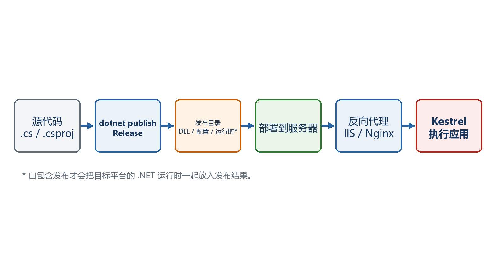

# 第7章　第一次发布和部署Minimal API

开发电脑上能够dotnet run，只能说明源代码在开发环境可运行。要让其他用户长期访问，还要发布文件、复制到服务器、配置运行方式，并在部署后验证。

  -----------------------------------------------------------------------------------------------------------------------
  **先把三个问题说清楚　**这是什么：发布是把项目变成可交付文件；部署是让这些文件在目标服务器上持续运行并可被网络访问。\
  目的是什么：把开发完成的API可靠地交给Windows或Linux服务器运行。\
  最后得到什么：得到Release发布目录，能从发布目录启动程序，并理解IIS或Nginx怎样把公网请求转给Kestrel。
  -----------------------------------------------------------------------------------------------------------------------

  -----------------------------------------------------------------------------------------------------------------------

  -----------------------------------------------------------------------------------------------------------------------------------------------
  **本章操作路线　**加入健康端点 → Release发布到文件夹 → 从发布目录启动 → 选择依赖框架或自包含 → 复制到服务器 → 配置进程与反向代理 → 部署后验证
  -----------------------------------------------------------------------------------------------------------------------------------------------

  -----------------------------------------------------------------------------------------------------------------------------------------------

{width="6.102362204724409in" height="3.2418799212598426in"}

图7-1　从源代码、发布目录到生产请求的链路

## 7.1 Build、Publish和Deploy不是一回事

Build的目的主要是编译和发现代码错误；Publish在Build基础上整理运行所需文件；Deploy则包括复制文件、设置配置和权限、启动进程、接入域名与HTTPS以及准备回滚。

-   dotnet build：输出通常位于bin/Debug或bin/Release，用于开发和编译验证。

-   dotnet publish：生成结构更适合交付的publish目录。

-   部署：发生在目标机器或托管平台，目标是让进程可靠、可观测、可访问。

-   发布成功不等于部署成功；部署成功也不等于业务功能全部正确，因此必须做验证。

## 7.2 发布前先增加一个健康检查端点

健康端点提供一个简单、稳定的验证入口。部署完成后先请求它，可以快速判断进程是否启动、反向代理是否通、当前版本和环境是否符合预期。

示例7-1　教学用健康端点

```csharp
app.MapGet("/health", (IHostEnvironment environment) =>
Results.Ok(new
{
status = "Healthy",
environment = environment.EnvironmentName,
utcTime = DateTimeOffset.UtcNow,
version = typeof(Program).Assembly
.GetName().Version?.ToString()
}));
```

-   目的：不用依赖复杂业务数据，也能验证HTTP链路。

-   结果：访问/health应得到200和JSON。

-   注意：真实项目可以使用ASP.NET Core健康检查组件检查数据库等依赖，但公开内容不要泄露密钥和内部结构。

## 7.3 第一次发布：先发布到本机文件夹

先在开发机完成最简单的文件夹发布和本地启动，确认发布产物独立于源代码目录可以工作，再复制到服务器。这样能把"发布问题"和"服务器配置问题"分开。

示例7-2　发布到明确的本地目录

```bash
# 在包含csproj的项目目录执行
dotnet build -c Release
dotnet publish -c Release -o .\publish

# 查看发布结果
dir .\publish
```

-   -c Release：使用发布用的Release配置。

-   -o .\\publish：把交付文件集中到项目下的publish目录，便于第一次观察。

-   发布目录通常包含应用DLL、deps.json、runtimeconfig.json、配置文件和依赖程序集。

-   不要把obj目录或整个源代码目录当成正式发布目录。

## 7.4 必须从发布目录实际启动一次

只看到"发布成功"不够。下一步故意从publish中的DLL启动，验证运行时、配置和文件是否齐全。启动前先停止仍在运行的开发实例，避免端口冲突。

示例7-3　从发布目录启动并验证

```bash
dotnet .\publish\HelloMinimalApi.dll

# 假设输出为http://localhost:5000，再开一个终端测试
curl -i http://localhost:5000/health
```

-   终端出现Now listening on说明发布程序已启动。

-   curl得到200和Healthy JSON，说明本机发布闭环完成。

-   如果找不到DLL，先用dir确认实际程序集名称。

-   如果端口冲突，可以停止旧进程，或用ASPNETCORE_URLS指定临时监听地址。

## 7.5 依赖框架发布和自包含发布怎样选择

依赖框架发布（framework-dependent）需要目标机器已经安装兼容的.NET运行时，目录较小；自包含发布（self-contained）把指定平台的.NET运行时一起带上，目录较大，但目标机器不必预装该运行时。

示例7-4　两种发布模式

```bash
# 依赖框架发布：服务器需要.NET 10运行时
dotnet publish -c Release -o publish/framework-dependent

# Windows x64自包含
dotnet publish -c Release -r win-x64 --self-contained true -o publish/win-x64

# Linux x64自包含
dotnet publish -c Release -r linux-x64 --self-contained true -o publish/linux-x64
```

-   RID是Runtime Identifier，例如win-x64、linux-x64、linux-arm64。

-   自包含发布仍然针对具体平台，不能把win-x64目录直接复制到Linux运行。

-   依赖框架模式便于统一更新服务器运行时；自包含模式便于锁定应用携带的运行时版本。

-   第一次部署优先选择团队能维护的模式，不要只根据目录大小决定。

## 7.6 生产配置从哪里来

开发时的launchSettings.json不会自动成为服务器生产配置。生产环境通常通过appsettings.Production.json、环境变量、命令行或托管平台配置注入监听地址、日志级别和连接字符串。

示例7-5　appsettings.Production.json示意

```json
{
"Logging": {
"LogLevel": {
"Default": "Information",
"Microsoft.AspNetCore": "Warning"
}
},
"AllowedHosts": "api.example.com"
}
```

示例7-6　用环境变量启动生产配置

```bash
# PowerShell：仅影响当前终端及其子进程
$env:ASPNETCORE_ENVIRONMENT = "Production"
$env:ASPNETCORE_URLS = "http://127.0.0.1:5000"
dotnet .\publish\HelloMinimalApi.dll
```

  --------------------------------------------------------------------------------------------------------------------------------
  密钥不能写进发布脚本或仓库　生产数据库密码、令牌和证书密码应由服务器密钥存储、云平台配置或受控环境变量提供。第14章会系统讲解。
  --------------------------------------------------------------------------------------------------------------------------------

  --------------------------------------------------------------------------------------------------------------------------------

## 7.7 Windows部署：先直接运行，再接IIS

分两阶段的原因是便于定位错误。先在服务器终端直接运行发布程序，证明应用和运行时正常；再配置IIS。如果直接运行都失败，问题通常不在IIS。

84. 第1步：把发布目录复制到固定位置，例如C:\\Apps\\HelloMinimalApi。不要直接覆盖正在运行的目录，先保留旧版本。

85. 第2步：依赖框架部署时安装匹配的.NET 10 ASP.NET Core Runtime；使用IIS通常安装Hosting Bundle。

86. 第3步：在服务器终端进入发布目录，直接执行dotnet HelloMinimalApi.dll。

87. 第4步：在服务器本机请求http://127.0.0.1:端口/health，确认200。

88. 第5步：在IIS中新建站点或应用，物理路径指向发布目录，应用程序池使用"无托管代码"。

89. 第6步：为应用程序池身份授予必要的读取权限；日志、上传等写入目录单独授予写权限。

90. 第7步：配置域名绑定和HTTPS证书，再从外部请求/health。

91. 第8步：失败时查看Windows事件日志、IIS日志和应用日志。

  ------------------------------------------------------------------------------------------------------------------------------------------------------------------------------------------
  **web.config的作用　**IIS发布通常会生成web.config，ASP.NET Core Module依据它启动或转发到应用。初学阶段不要随意删除。出现500.30或500.31时优先检查运行时、Hosting Bundle、权限和启动日志。
  ------------------------------------------------------------------------------------------------------------------------------------------------------------------------------------------

  ------------------------------------------------------------------------------------------------------------------------------------------------------------------------------------------

## 7.8 Linux部署：systemd负责进程，Nginx负责入口

Kestrel可以直接监听端口，但生产环境常让它只监听127.0.0.1，由systemd保证进程常驻和自动重启，再由Nginx处理域名、80/443端口、TLS和反向代理。

示例7-7　/etc/systemd/system/hello-minimal-api.service

```text
[Unit]
Description=Hello Minimal API
After=network.target

[Service]
WorkingDirectory=/opt/hello-minimal-api
ExecStart=/usr/bin/dotnet /opt/hello-minimal-api/HelloMinimalApi.dll
Environment=ASPNETCORE_ENVIRONMENT=Production
Environment=ASPNETCORE_URLS=http://127.0.0.1:5000
Restart=always
RestartSec=5
User=www-data

[Install]
WantedBy=multi-user.target
```

示例7-8　启动服务并查看日志

```bash
sudo systemctl daemon-reload
sudo systemctl enable --now hello-minimal-api
sudo systemctl status hello-minimal-api
sudo journalctl -u hello-minimal-api -f

curl -i http://127.0.0.1:5000/health
```

示例7-9　Nginx反向代理核心配置

```text
server {
listen 80;
server_name api.example.com;

location / {
proxy_pass http://127.0.0.1:5000;
proxy_http_version 1.1;
proxy_set_header Host $host;
proxy_set_header X-Forwarded-For $proxy_add_x_forwarded_for;
proxy_set_header X-Forwarded-Proto $scheme;
}
}
```

-   修改systemd文件后必须daemon-reload。

-   先测试127.0.0.1:5000，再测试Nginx域名，才能确定问题在哪一层。

-   应用读取原始客户端协议和IP时，需要正确配置Forwarded Headers及可信代理边界。

-   真实环境还要配置HTTPS证书续期、超时、请求体限制、日志轮转和防火墙。

## 7.9 部署完成后按固定顺序验收

验证顺序应该从应用内部向外进行，每一步只增加一层变量。这样某一步失败时，上一层已被证明正常。

92. 发布目录中的程序能在服务器直接启动。

93. 服务器本机请求Kestrel地址/health得到200。

94. IIS或Nginx转发后的本地域名请求得到200。

95. 外部网络通过正式域名和HTTPS请求得到200。

96. Production环境、连接字符串和日志级别正确。

97. 写操作使用测试数据验证，不能只验证GET。

98. 应用异常退出后，IIS或systemd能够重新启动。

99. 已经记录旧版本目录和回滚步骤。

  ---------------------------------------------------------------------------------------------------------------------------------------------------------------
  **最终结果　**用户访问正式域名时，请求先到IIS或Nginx，再转给Kestrel；应用以Production环境运行，/health返回200，日志能定位启动和请求问题，并且旧版本可以恢复。
  ---------------------------------------------------------------------------------------------------------------------------------------------------------------

  ---------------------------------------------------------------------------------------------------------------------------------------------------------------
