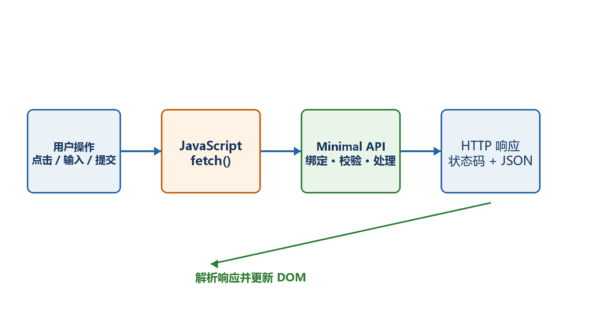
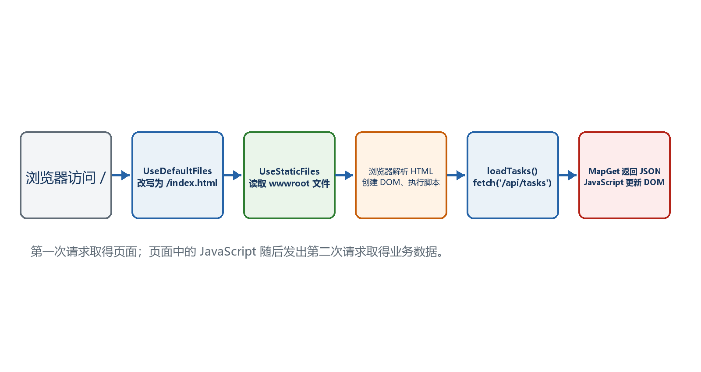
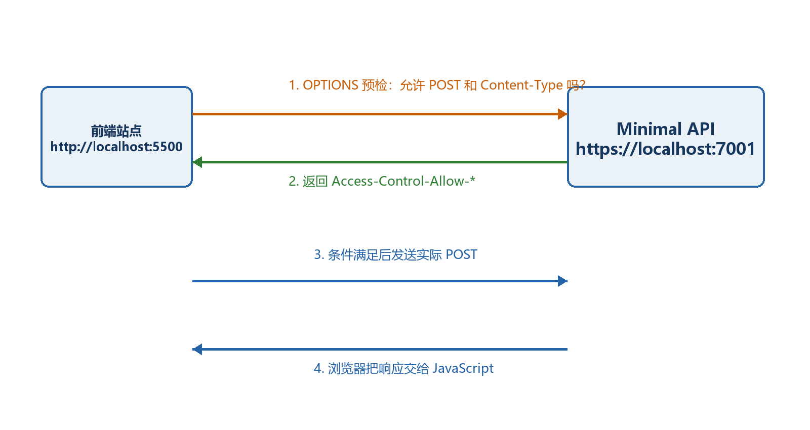

# 第8章　前端与后端最常用的交互操作

本章采用最容易观察的同源方案：Minimal API同时提供/api/tasks和wwwroot/index.html。前端不用React或Vue，先用浏览器原生HTML、CSS和JavaScript把GET、POST、PUT、DELETE完整走通。

  -----------------------------------------------------------------------------------------------------------------------------------------------------
  **先把三个问题说清楚　**这是什么：前端是运行在浏览器中的HTML、CSS和JavaScript；后端是运行在服务器上的Minimal API。两者通过HTTP请求和JSON响应交互。\
  目的是什么：让新手真正看见按钮点击后，JavaScript怎样发请求、后端怎样处理、结果怎样重新显示到页面。\
  最后得到什么：打开根地址看到任务页面，可以加载、新增、完成和删除任务，并能在浏览器Network面板看到每个HTTP请求。
  -----------------------------------------------------------------------------------------------------------------------------------------------------

  -----------------------------------------------------------------------------------------------------------------------------------------------------

  --------------------------------------------------------------------------------------------------------------------------------------------------------------
  **本章操作路线　**创建项目和wwwroot → 先写GET后端 → 写最小HTML → fetch读取 → POST新增 → PUT修改 → DELETE删除 → 统一错误处理 → 用Network排错 → 理解同源与CORS
  --------------------------------------------------------------------------------------------------------------------------------------------------------------

  --------------------------------------------------------------------------------------------------------------------------------------------------------------

{width="6.102362204724409in" height="3.2418799212598426in"}

图8-1　浏览器前端通过HTTP调用Minimal API后端

## 8.1 index.html属于哪种前端

wwwroot/index.html属于传统的静态Web前端，也可以称为原生JavaScript前端或无框架前端。HTML定义页面结构，CSS负责样式，JavaScript通过fetch调用后端。它不是Razor Pages、Blazor、React、Vue或Angular。

选择它的原因是把干扰降到最低：不需要Node.js、打包器和组件框架，新手可以直接看到浏览器原生API怎样工作。以后换成React或Vue，HTTP、JSON、状态码和CORS原理仍然相同。

-   前端文件位置：wwwroot/index.html。

-   前端运行位置：用户的浏览器。

-   后端代码位置：Program.cs以及以后拆分出的C#文件。

-   后端运行位置：Kestrel服务器进程。

-   交互协议：HTTP；主要数据格式：JSON。

## 8.2 创建项目和最终目录

先创建空Web项目，再手工增加wwwroot和index.html。wwwroot是ASP.NET Core约定的Web根目录，但只有调用UseDefaultFiles和UseStaticFiles后，服务器才会把里面的文件提供给浏览器。

示例8-1　创建同源前后端项目

```bash
cd D:\dotnet-labs
dotnet new web -n TaskInteractionApi -f net10.0
cd TaskInteractionApi

# 在编辑器中创建wwwroot目录和index.html
```

示例8-2　本章最终主要目录

```text
TaskInteractionApi/
├─ Properties/
├─ wwwroot/
│ └─ index.html ← 浏览器前端
├─ appsettings.json
├─ TaskInteractionApi.csproj
└─ Program.cs ← Minimal API后端
```

## 8.3 先写后端数据模型和GET接口

先只实现读取，确认API能返回JSON后再写页面。内存List用于教学，程序重启后数据会恢复，不适合生产持久化。

示例8-3　第一版后端：只提供任务列表

```csharp
var builder = WebApplication.CreateBuilder(args);
var app = builder.Build();

var tasks = new List<TaskItem>
{
new(1, "学习Minimal API", false),
new(2, "完成前后端交互", true)
};

app.MapGet("/api/tasks", () => Results.Ok(tasks));

app.Run();

record TaskItem(int Id, string Title, bool Completed);
```

-   List\<TaskItem\>是服务器内存中的数据。

-   GET /api/tasks返回200和JSON数组。

-   先执行dotnet run，再直接访问实际地址/api/tasks。

-   看到两条任务JSON后，才继续接前端；否则应先修复后端。

## 8.4 让Minimal API同时提供index.html

UseDefaultFiles把根路径/映射到默认文件，例如index.html；UseStaticFiles把wwwroot中的静态文件作为HTTP响应提供。两句都要写在app.Run之前。

示例8-4　启用默认文件和静态文件

```csharp
var app = builder.Build();

app.UseDefaultFiles();
app.UseStaticFiles();

// /api/tasks等业务端点写在这里

app.Run();
```

-   浏览器访问/时，UseDefaultFiles查找wwwroot/index.html。

-   找到后，UseStaticFiles读取文件内容并返回text/html。

-   index.html不是C#代码，不在服务器中直接执行；浏览器收到它以后才解析和执行其中的JavaScript。

{width="6.102362204724409in" height="3.2418799212598426in"}

图8-2　先加载index.html，再由JavaScript请求/api/tasks

## 8.5 第一个前端：点击按钮执行GET

先写最小页面，只放一个按钮和一个结果区域。fetch(\'/api/tasks\')使用相对地址，浏览器会自动使用当前页面的协议、主机和端口，因此前后端同源。

示例8-5　wwwroot/index.html的第一个版本

```xml
<!doctype html>
<html lang="zh-CN">
<head>
<meta charset="utf-8">
<title>任务管理</title>
</head>
<body>
<h1>任务管理</h1>
<button id="loadButton">加载任务</button>
<pre id="output">尚未加载</pre>

<script>
const output = document.querySelector('#output');

document.querySelector('#loadButton').addEventListener('click', async () => {
const response = await fetch('/api/tasks');
const tasks = await response.json();
output.textContent = JSON.stringify(tasks, null, 2);
});
</script>
</body>
</html>
```

-   addEventListener等待用户点击。

-   fetch发出GET /api/tasks，因为GET是默认方法。

-   await等待HTTP响应；response.json()把JSON解析为JavaScript对象。

-   textContent安全地显示文本，不会把任务标题当成HTML执行。

-   最终效果：访问实际基础地址/，点击"加载任务"，页面显示两条任务。

## 8.6 POST：把表单数据变成JSON发送给后端

新增操作需要两部分同时完成：后端MapPost接收JSON并返回201；前端读取输入框，使用JSON.stringify生成请求体，并设置Content-Type。

示例8-6　后端POST /api/tasks

```csharp
record CreateTaskRequest(string Title);

app.MapPost("/api/tasks", (CreateTaskRequest request) =>
{
if (string.IsNullOrWhiteSpace(request.Title))
{
return Results.BadRequest(new { message = "任务标题不能为空" });
}

var nextId = tasks.Count == 0 ? 1 : tasks.Max(x => x.Id) + 1;
var task = new TaskItem(nextId, request.Title.Trim(), false);
tasks.Add(task);

return Results.Created($"/api/tasks/{task.Id}", task);
});
```

示例8-7　前端发送POST JSON

```csharp
async function createTask(title) {
const response = await fetch('/api/tasks', {
method: 'POST',
headers: { 'Content-Type': 'application/json' },
body: JSON.stringify({ title })
});

if (!response.ok) {
const error = await response.json();
throw new Error(error.message ?? `创建失败：${response.status}`);
}

return await response.json();
}
```

-   前端对象{title}变成{\"title\":\"\...\"}。

-   Content-Type告诉后端请求体是JSON。

-   后端参数绑定创建CreateTaskRequest。

-   成功时返回201 Created、Location响应头和新任务JSON。

-   失败时response.ok为false，前端读取错误JSON并显示。

## 8.7 PUT：修改任务完成状态

PUT请求同时把任务id放在路径中，把新数据放在JSON请求体中。后端先查找资源，不存在返回404；存在则更新并返回200。

示例8-8　后端PUT /api/tasks/{id}

```csharp
record UpdateTaskRequest(string Title, bool Completed);

app.MapPut("/api/tasks/{id:int}",
(int id, UpdateTaskRequest request) =>
{
var index = tasks.FindIndex(x => x.Id == id);
if (index < 0)
{
return Results.NotFound(new { message = $"任务{id}不存在" });
}

var updated = new TaskItem(id, request.Title.Trim(), request.Completed);
tasks[index] = updated;
return Results.Ok(updated);
});
```

示例8-9　前端发送PUT

```csharp
async function updateTask(task) {
const response = await fetch(`/api/tasks/${task.id}`, {
method: 'PUT',
headers: { 'Content-Type': 'application/json' },
body: JSON.stringify({
title: task.title,
completed: !task.completed
})
});

if (!response.ok) throw new Error(`更新失败：${response.status}`);
return await response.json();
}
```

## 8.8 DELETE：删除后为什么可能没有响应体

删除成功常用204 No Content，表示操作成功但没有JSON响应体。前端不能对204直接调用response.json()，否则会因为空内容解析失败。

示例8-10　后端DELETE

```csharp
app.MapDelete("/api/tasks/{id:int}", (int id) =>
{
var removed = tasks.RemoveAll(x => x.Id == id);
return removed == 0
? Results.NotFound(new { message = $"任务{id}不存在" })
: Results.NoContent();
});
```

示例8-11　前端处理204

```csharp
async function deleteTask(id) {
const response = await fetch(`/api/tasks/${id}`, {
method: 'DELETE'
});

if (!response.ok) {
throw new Error(`删除失败：${response.status}`);
}

// 204没有JSON，不调用response.json()
}
```

## 8.9 把重复的fetch代码统一起来

统一请求函数的目的，是让所有操作都用同一套状态码检查、错误读取和空响应处理。这样业务函数只描述URL、method和body。

示例8-12　统一HTTP请求函数

```csharp
async function requestJson(url, options = {}) {
const response = await fetch(url, options);

if (!response.ok) {
let message = `请求失败：${response.status}`;
try {
const error = await response.json();
message = error.message ?? message;
} catch {
// 错误响应不是JSON时保留默认消息
}
throw new Error(message);
}

if (response.status === 204) return null;
return await response.json();
}
```

-   fetch只有网络层失败时才自动抛异常；404和500仍会返回Response，所以必须检查response.ok。

-   只在确认响应有JSON时调用response.json()。

-   按钮操作使用try/catch，把错误显示给用户，并在finally中恢复按钮状态。

-   对写操作禁用按钮可以减少重复提交，但后端仍需考虑幂等和并发。

## 8.10 浏览器开发者工具怎样看一次完整交互

按F12打开开发者工具，切到Network，执行页面操作。每一条记录都是浏览器真正发出的HTTP请求；它比只看页面提示更接近问题本身。

100. Name/URL：是否请求了正确的/api/tasks路径。

101. Method：GET、POST、PUT或DELETE是否正确。

102. Status：200、201、204、400、404或500分别说明什么。

103. Request Headers：POST/PUT是否包含Content-Type: application/json。

104. Payload/Request：实际发送的JSON字段和值。

105. Response：后端实际返回的JSON或错误内容。

106. Console：JavaScript语法错误和未处理异常。

## 8.11 同源为什么不需要CORS，分离部署为什么需要

同源要求协议、主机和端口都相同。本章页面和API来自同一个Minimal API地址，因此fetch(\'/api/tasks\')同源，不需要CORS。若前端在http://localhost:5173而API在https://localhost:7123，端口和协议不同，就属于跨源。

{width="6.102362204724409in" height="3.2418799212598426in"}

图8-3　跨源写请求可能先发送OPTIONS预检

示例8-13　前后端分离时的明确CORS策略

```csharp
builder.Services.AddCors(options =>
{
options.AddPolicy("Frontend", policy =>
policy.WithOrigins("http://localhost:5173")
.AllowAnyHeader()
.AllowAnyMethod());
});

var app = builder.Build();

app.UseCors("Frontend");
```

-   WithOrigins填写允许的前端源，不带路径。

-   CORS是浏览器安全策略，不是后端认证授权。

-   生产环境不要为了省事无条件AllowAnyOrigin，尤其是涉及凭据时。

-   本章同源版本不需要复制这段CORS配置。

  -------------------------------------------------------------------------------------------------------------------------------------------------------------------------------------
  **最终效果　**访问应用根地址加载index.html；点击按钮后JavaScript发出真实HTTP请求；Minimal API修改内存数据并返回状态码/JSON；前端根据结果刷新页面；Network面板能完整看到请求和响应。
  -------------------------------------------------------------------------------------------------------------------------------------------------------------------------------------

  -------------------------------------------------------------------------------------------------------------------------------------------------------------------------------------
