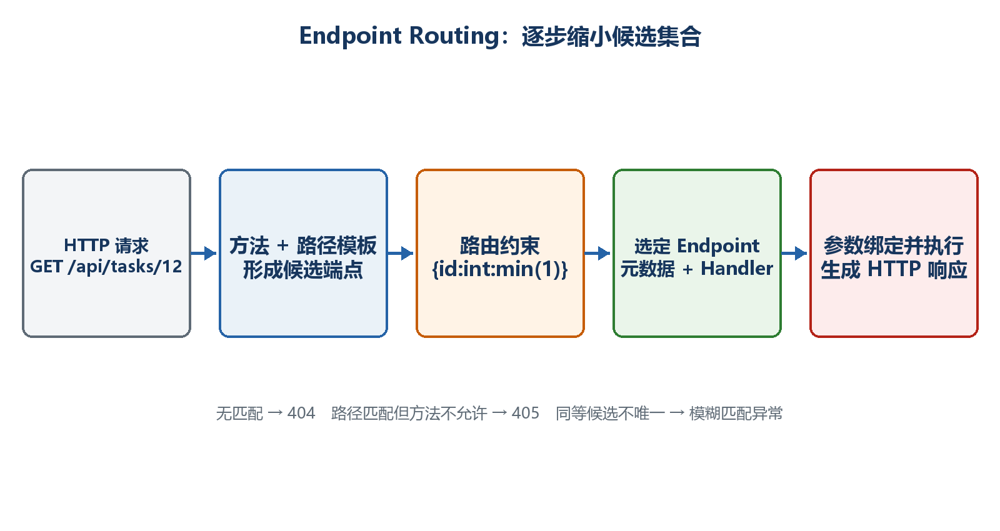

# 第9章　路由与HTTP方法

路由决定"一条请求应该交给哪段代码"。本章从最简单的固定路径开始，再加入参数、约束、分组和端点名称。重点不是背语法，而是理解匹配条件。

  -----------------------------------------------------------------------------
  **先把三个问题说清楚　**这是什么：路由由HTTP方法、路径模板和约束共同构成。\
  目的是什么：让不同URL和操作准确进入对应处理函数，并避免冲突。\
  最后得到什么：得到按/api/tasks分组的任务路由，能解释200、404和405的来源。
  -----------------------------------------------------------------------------

  -----------------------------------------------------------------------------

  -----------------------------------------------------------------------------------------------------
  **本章操作路线　**固定路径 → HTTP方法 → 路由参数 → 约束 → 可选和通配 → 冲突 → MapGroup → 命名与链接
  -----------------------------------------------------------------------------------------------------

  -----------------------------------------------------------------------------------------------------

{width="6.102362204724409in" height="3.2418799212598426in"}

图9-1　HTTP方法和路径共同参与端点匹配

## 9.1 路由、端点和处理函数分别是什么

路由模板描述可接受的路径；处理函数是匹配后执行的C#代码；端点则是路由模板、HTTP方法、处理函数和元数据组合后的整体。

示例9-1　最简单的固定路由

```csharp
app.MapGet("/api/tasks", () => Results.Ok(tasks));
```

-   MapGet规定HTTP方法必须是GET。

-   /api/tasks规定路径必须匹配。

-   lambda是处理函数。

-   请求GET /api/tasks能匹配；POST /api/tasks不会进入它。

## 9.2 为什么同一路径可以有GET和POST

HTTP方法表达操作意图，因此GET读取集合和POST创建资源可以共享/api/tasks路径。路由匹配时同时考虑方法和路径。

示例9-2　同一路径的不同HTTP方法

```csharp
app.MapGet("/api/tasks", () => Results.Ok(tasks));

app.MapPost("/api/tasks", (CreateTaskRequest request) =>
{
// 创建任务
return Results.Created("/api/tasks/3", new { id = 3, request.Title });
});
```

-   路径存在但方法不允许时，服务器通常返回405 Method Not Allowed。

-   路径和方法都没有匹配端点时通常返回404。

-   不要把所有操作都写成GET；写操作应使用POST、PUT、PATCH或DELETE表达语义。

## 9.3 路由参数怎样进入处理函数

花括号表示可变路径段。模板中的参数名与处理函数参数名一致时，参数绑定会把URL文本转换成目标类型。

示例9-3　读取路径中的id

```csharp
app.MapGet("/api/tasks/{id}", (int id) =>
{
var task = tasks.FirstOrDefault(x => x.Id == id);
return task is null ? Results.NotFound() : Results.Ok(task);
});
```

-   GET /api/tasks/12把字符串"12"转换为int 12。

-   GET /api/tasks/abc不能转换为int，可能产生绑定失败响应。

-   路径参数适合资源标识，不适合大量可选筛选条件。

## 9.4 路由约束为什么写在模板中

约束让路由系统在执行处理函数之前排除不符合形状的路径，也能区分看起来相近的端点。它不是完整业务验证，只负责帮助匹配。

示例9-4　常见路由约束

```csharp
app.MapGet("/api/tasks/{id:int}", (int id) => $"按编号：{id}");
app.MapGet("/api/tasks/{slug:alpha}", (string slug) => $"按别名：{slug}");
app.MapGet("/reports/{year:int:min(2000):max(2100)}", (int year) => year);
```

-   int要求整数形状；alpha要求字母形状。

-   min和max限制数值范围，适合明显的路由形状约束。

-   任务是否属于当前用户、编号是否存在等仍需业务代码检查。

## 9.5 可选参数、默认值和通配符

可选路由段用?表示；默认值在缺省时使用；通配符捕获剩余路径。它们会增加匹配范围，使用前要确认不会让路由难以理解。

示例9-5　可选段和捕获剩余路径

```csharp
app.MapGet("/api/archive/{year:int}/{month:int?}",
(int year, int? month) => new { year, month });

app.MapGet("/files/{**path}",
(string path) => new { requestedPath = path });
```

  ----------------------------------------------------------------------------------------------------------------------
  **注意安全　**通配符只是获取路径文本，不能把它直接拼成磁盘路径读取文件。必须规范化并限制在允许目录内，防止路径穿越。
  ----------------------------------------------------------------------------------------------------------------------

  ----------------------------------------------------------------------------------------------------------------------

## 9.6 路由冲突应该怎样排查

两个端点如果对同一请求具有同等匹配条件，运行时可能报告模糊匹配。正确做法是让模板或HTTP方法明显不同，而不是依赖登记顺序碰运气。

示例9-6　消除模糊路由

```csharp
// 容易冲突：两个可变段形状相同
app.MapGet("/api/items/{value}", (string value) => value);
app.MapGet("/api/items/{name}", (string name) => name);

// 更清楚：使用固定前缀或约束
app.MapGet("/api/items/by-id/{id:int}", (int id) => id);
app.MapGet("/api/items/by-name/{name}", (string name) => name);
```

## 9.7 用MapGroup组织共同前缀和元数据

当多个端点都以/api/tasks开头时，MapGroup把前缀写一次，并能统一设置标签、认证和过滤器。它不仅减少重复，也让端点属于同一个业务区域。

示例9-7　任务路由分组

```csharp
var taskApi = app.MapGroup("/api/tasks")
.WithTags("Tasks");

taskApi.MapGet("/", () => Results.Ok(tasks));
taskApi.MapGet("/{id:int}", (int id) =>
{
var task = tasks.FirstOrDefault(x => x.Id == id);
return task is null ? Results.NotFound() : Results.Ok(task);
});
taskApi.MapPost("/", (CreateTaskRequest request) => Results.Ok(request));
```

-   组内的/最终对应/api/tasks/。

-   组内/{id:int}最终对应/api/tasks/{id:int}。

-   WithTags会影响OpenAPI/Swagger UI中的分组显示。

-   以后可在taskApi上统一RequireAuthorization。

## 9.8 端点名称和链接生成

硬编码Location路径容易在路由修改后失效。给端点稳定命名后，可以根据名称和路由值生成链接。

示例9-8　使用端点名称生成Location

```text
taskApi.MapGet("/{id:int}", (int id) => Results.Ok(new { id }))
.WithName("GetTaskById");

taskApi.MapPost("/", (CreateTaskRequest request, LinkGenerator links) =>
{
var created = new TaskItem(3, request.Title, false);
var location = links.GetPathByName(
"GetTaskById",
new { id = created.Id });

return Results.Created(location!, created);
});
```

  --------------------------------------------------------------------------------------------------------------------------------------
  **最终判断顺序　**请求没有得到预期结果时依次检查：HTTP方法 → 完整路径 → 路由前缀 → 参数形状/约束 → 是否存在冲突 → 处理函数内部逻辑。
  --------------------------------------------------------------------------------------------------------------------------------------

  --------------------------------------------------------------------------------------------------------------------------------------
