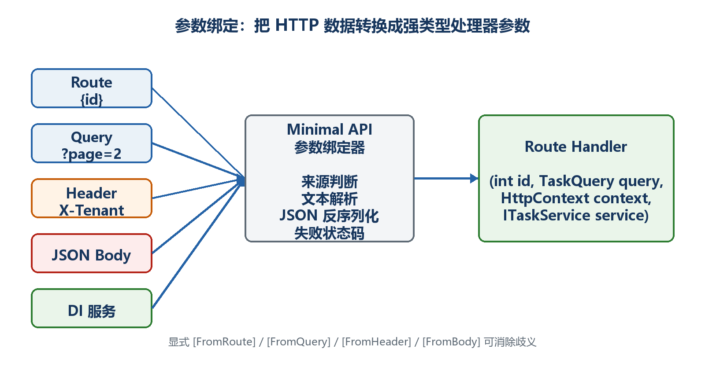

# 第10章　参数绑定机制

路由找到端点后，ASP.NET Core还要把路径、查询字符串、请求头、JSON、表单和依赖服务转换成C#参数。这个过程叫参数绑定。理解来源，才能解释为什么有时得到400而处理函数根本没有执行。

  ---------------------------------------------------------------------------------------------------
  **先把三个问题说清楚　**这是什么：参数绑定是在调用处理函数之前准备参数的过程。\
  目的是什么：让HTTP中的文本和JSON安全、明确地进入强类型C#代码。\
  最后得到什么：能为每个参数判断来源，处理必填/可空、JSON、表单、文件和自定义类型，并定位绑定失败。
  ---------------------------------------------------------------------------------------------------

  ---------------------------------------------------------------------------------------------------

  ---------------------------------------------------------------------------------------------------------------------------------
  **本章操作路线　**自动来源 → 显式From → JSON请求体 → 可空与默认值 → AsParameters → 表单和文件 → TryParse → BindAsync → 绑定失败
  ---------------------------------------------------------------------------------------------------------------------------------

  ---------------------------------------------------------------------------------------------------------------------------------

{width="6.102362204724409in" height="3.2418799212598426in"}

图10-1　HTTP请求中的不同位置怎样绑定到C#参数

## 10.1 绑定发生在处理函数执行之前

请求先匹配路由，然后框架查看处理函数签名，为每个参数寻找来源并尝试转换。只有所有必需参数准备成功，处理函数才会执行。

示例10-1　三种不同来源的参数

```csharp
app.MapGet("/api/tasks/{id:int}",
(int id, bool? includeDetails, HttpContext context) =>
{
return Results.Ok(new
{
id,
includeDetails,
traceId = context.TraceIdentifier
});
});
```

-   id与路由模板同名，来自路径。

-   includeDetails不在路径中，简单类型通常从查询字符串读取。

-   HttpContext由框架提供。

-   访问/api/tasks/5?includeDetails=true，三个参数都会在进入lambda前准备好。

## 10.2 自动推断的常见规则

Minimal API会根据路由模板、参数类型、已注册服务和请求体推断来源。自动推断能减少代码，但来源不明显时应显式标注。

-   名称出现在路由模板中的简单类型：来自Route。

-   未出现在路由中的简单类型：通常来自Query。

-   HttpContext、HttpRequest、HttpResponse、ClaimsPrincipal、CancellationToken：框架特殊类型。

-   已经注册到依赖注入容器的服务类型：来自Services。

-   复杂业务对象：通常从JSON请求体绑定；一个端点不能随意读取多个JSON对象请求体。

## 10.3 用From特性明确告诉读者来源

显式特性的目的不是让框架更"聪明"，而是消除歧义，让接口契约和代码审查更清楚。需要先using Microsoft.AspNetCore.Mvc。

示例10-2　显式Route、Query和Header

```csharp
using Microsoft.AspNetCore.Mvc;

app.MapGet("/api/tasks/{id:int}",
([FromRoute] int id,
[FromQuery(Name = "details")] bool includeDetails,
[FromHeader(Name = "X-Correlation-Id")] string? correlationId) =>
{
return Results.Ok(new { id, includeDetails, correlationId });
});
```

-   请求示例：GET /api/tasks/8?details=true。

-   请求头示例：X-Correlation-Id: demo-001。

-   Name允许HTTP名称和C#参数名不同。

-   请求头来自客户端，不应未经验证就作为安全身份。

## 10.4 JSON请求体怎样变成record

POST和PUT通常把结构化数据放在请求体。客户端必须发送合法JSON和正确Content-Type；服务器把JSON属性反序列化为C#对象。

示例10-3　绑定JSON请求体

```csharp
app.MapPost("/api/tasks", ([FromBody] CreateTaskRequest request) =>
{
if (string.IsNullOrWhiteSpace(request.Title))
{
return Results.BadRequest(new { message = "标题不能为空" });
}

return Results.Ok(new
{
title = request.Title.Trim(),
completed = request.Completed ?? false
});
});

record CreateTaskRequest(string Title, bool? Completed);
```

示例10-4　匹配的HTTP请求

```text
POST /api/tasks HTTP/1.1
Content-Type: application/json

{
"title": "学习参数绑定",
"completed": false
}
```

-   缺少Content-Type可能导致415 Unsupported Media Type。

-   JSON语法错误或类型不匹配通常导致400，处理函数可能不执行。

-   成功反序列化不等于业务有效；空标题仍需验证。

## 10.5 必填、可空和默认值

参数类型本身就是契约的一部分。非可空参数表示调用者应提供值；可空类型表示可以省略；默认值表示省略时使用给定值。

示例10-5　可空查询参数和默认值

```csharp
app.MapGet("/api/tasks", (
string? search,
int page = 1,
int pageSize = 20) =>
{
if (page < 1 || pageSize is < 1 or > 100)
{
return Results.BadRequest(new
{
message = "page至少为1，pageSize必须在1到100之间"
});
}

return Results.Ok(new { search, page, pageSize });
});
```

-   不传search时为null。

-   不传page和pageSize时使用1和20。

-   类型转换只保证文本能变成整数，范围仍需业务验证。

## 10.6 用AsParameters收拢大量查询条件

当查询参数增多时，把它们聚合到一个类型中可以保持处理函数签名可读。AsParameters仍然是多个参数来源的组合，不是把GET改成JSON请求体。

示例10-6　聚合查询参数

```csharp
using Microsoft.AspNetCore.Http.HttpResults;

app.MapGet("/api/tasks", ([AsParameters] TaskQuery query) =>
{
return TypedResults.Ok(new
{
query.Search,
query.Completed,
query.Page,
query.PageSize
});
});

sealed record TaskQuery(
string? Search,
bool? Completed,
int Page = 1,
int PageSize = 20);
```

## 10.7 表单和文件上传

浏览器表单和文件通常使用multipart/form-data，不是application/json。IFormFile表示上传文件；服务器必须限制大小、检查类型并使用安全文件名。

示例10-7　最小文件上传示例

```csharp
app.MapPost("/api/attachments", async (IFormFile file) =>
{
if (file.Length == 0)
return Results.BadRequest(new { message = "文件为空" });

if (file.Length > 5 * 1024 * 1024)
return Results.BadRequest(new { message = "文件不能超过5 MB" });

var safeName = $"{Guid.NewGuid():N}{Path.GetExtension(file.FileName)}";
var target = Path.Combine("uploads", safeName);
Directory.CreateDirectory("uploads");

await using var stream = File.Create(target);
await file.CopyToAsync(stream);

return Results.Ok(new { fileName = safeName, file.Length });
});
```

  ----------------------------------------------------------------------------------------------------------------------------------------------
  **上传安全　**不要直接使用客户端file.FileName作为服务器路径；还应配置请求大小、扩展名/内容检查、恶意文件扫描和访问权限。示例只解释绑定流程。
  ----------------------------------------------------------------------------------------------------------------------------------------------

  ----------------------------------------------------------------------------------------------------------------------------------------------

## 10.8 自定义值对象：使用TryParse

如果某种简单文本在多个接口中都有固定格式，可以把解析规则放到值对象的TryParse中。绑定成功后，处理函数直接拿到强类型值。

示例10-8　使用TryParse绑定强类型代码

```csharp
readonly record struct TaskCode(string Value)
{
public static bool TryParse(string? text, out TaskCode code)
{
if (!string.IsNullOrWhiteSpace(text) && text.StartsWith("TASK-"))
{
code = new TaskCode(text.ToUpperInvariant());
return true;
}

code = default;
return false;
}
}

app.MapGet("/api/by-code/{code}",
(TaskCode code) => Results.Ok(new { code = code.Value }));
```

## 10.9 绑定失败时按什么顺序检查

看到400或415时，不要立即怀疑业务逻辑。先确认请求是否在绑定阶段就失败。服务器日志和Swagger/.http中的实际请求非常重要。

107. 路径和HTTP方法是否匹配正确端点。

108. 路由参数和查询参数名称是否正确。

109. abc是否被绑定到int等不兼容类型。

110. 必填参数是否缺失，可选参数是否声明为可空或有默认值。

111. POST/PUT是否设置Content-Type: application/json。

112. JSON引号、逗号和括号是否正确，字段类型是否匹配。

113. 表单上传是否使用multipart/form-data。

114. 处理函数入口断点没有触发时，优先查看绑定日志和响应。

  ------------------------------------------------------------------------------------------------------------------
  **最终理解　**路由负责选择端点，参数绑定负责准备C#参数，业务验证负责判断值是否符合业务规则。这三层不要混在一起。
  ------------------------------------------------------------------------------------------------------------------

  ------------------------------------------------------------------------------------------------------------------
