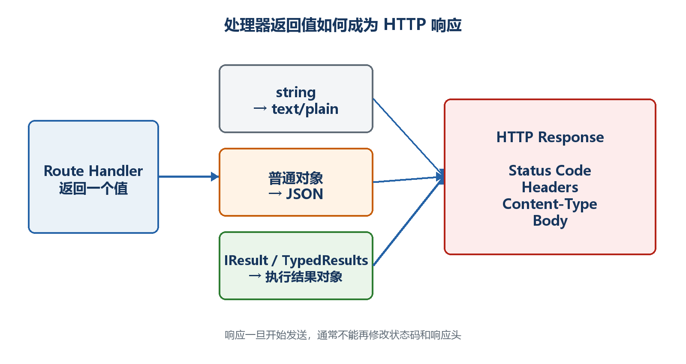

# 第11章　返回值与HTTP响应生成

处理函数执行完以后，ASP.NET Core要把C#返回值转换成HTTP状态码、响应头、Content-Type和响应体。本章从最常见的JSON响应开始，再解释TypedResults、Problem Details、文件和流式响应。

  -------------------------------------------------------------------------------------
  **先把三个问题说清楚　**这是什么：返回值是Minimal API生成HTTP响应的输入。\
  目的是什么：让API用正确状态码和数据结构清楚表达成功、创建、无内容和错误。\
  最后得到什么：能为GET、POST、PUT、DELETE选择合适结果，并让OpenAPI文档识别响应类型。
  -------------------------------------------------------------------------------------

  -------------------------------------------------------------------------------------

  --------------------------------------------------------------------------------------------------------------------
  **本章操作路线　**普通对象 → Results → TypedResults → 201与Location → 204 → Problem Details → 文件 → 流 → JSON配置
  --------------------------------------------------------------------------------------------------------------------

  --------------------------------------------------------------------------------------------------------------------

{width="6.102362204724409in" height="3.2418799212598426in"}

图11-1　C#返回值怎样变成HTTP响应

## 11.1 一个HTTP响应由哪几部分组成

客户端收到的不只是JSON。状态码表示结果类别，响应头描述内容类型、缓存和位置，响应体才承载JSON、文本或文件。选择返回值时要同时考虑这三部分。

示例11-1　完整HTTP响应的核心结构

```text
HTTP/1.1 200 OK
Content-Type: application/json; charset=utf-8

{
"id": 1,
"title": "学习响应"
}
```

## 11.2 直接返回对象：什么时候够用

如果端点永远成功并返回200，直接返回对象最简洁。ASP.NET Core自动序列化为JSON。缺点是当需要404、201或自定义响应头时，表达能力不足。

示例11-2　直接返回对象

```csharp
app.MapGet("/api/version", () => new
{
name = "Task API",
version = "1.0"
});
```

  ---------------------------------------------------------------------------------------------------------------------
  **不要手工拼JSON　**返回\$\"{{\\\"id\\\":{id}}}\"容易产生转义、格式和安全问题。返回C#对象，让序列化器生成合法JSON。
  ---------------------------------------------------------------------------------------------------------------------

  ---------------------------------------------------------------------------------------------------------------------

## 11.3 Results常用结果分别表达什么

Results提供一组工厂方法，把状态码和响应体写得明确。根据业务结果选择方法，客户端才知道请求是否成功以及下一步怎么做。

示例11-3　200与404

```csharp
app.MapGet("/api/tasks/{id:int}", (int id) =>
{
var task = tasks.FirstOrDefault(x => x.Id == id);

return task is null
? Results.NotFound(new { message = $"任务{id}不存在" })
: Results.Ok(task);
});
```

-   Results.Ok(value)：200并返回JSON。

-   Results.Created(location, value)：201、Location响应头和新资源JSON。

-   Results.NoContent()：204且没有响应体。

-   Results.BadRequest(value)：400，表示客户端输入不符合要求。

-   Results.NotFound(value)：404，表示目标资源不存在。

-   Results.Unauthorized()与Results.Forbid()：分别表达未认证和无权限。

## 11.4 TypedResults为什么能让文档更准确

Results方法返回通用IResult，代码运行没有问题，但编译器和OpenAPI生成器较难从签名看出所有可能结果。TypedResults返回具体结果类型，再配合Results\<T1,T2\>联合类型，契约更明确。

示例11-4　显式表达两种响应类型

```csharp
using Microsoft.AspNetCore.Http.HttpResults;
using Microsoft.AspNetCore.Mvc;

app.MapGet("/api/tasks/{id:int}",
Results<Ok<TaskItem>, NotFound<ProblemDetails>> (int id) =>
{
var task = tasks.FirstOrDefault(x => x.Id == id);

return task is null
? TypedResults.NotFound(new ProblemDetails
{
Title = "任务不存在",
Status = StatusCodes.Status404NotFound,
Detail = $"没有找到编号为{id}的任务"
})
: TypedResults.Ok(task);
});
```

-   运行结果仍然是200或404。

-   方法签名直接告诉读者可能返回Ok\<TaskItem\>或NotFound\<ProblemDetails\>。

-   Swagger UI更容易显示成功和错误模型。

-   简单教学代码可以先用Results；公共接口和文档要求高的端点优先考虑TypedResults。

## 11.5 创建资源为什么返回201和Location

POST创建成功后，201 Created比200更准确；Location响应头告诉客户端新资源在哪里。路径不要手工重复拼写，已有命名路由时可以生成。

示例11-5　返回201和Location

```csharp
app.MapPost("/api/tasks", (CreateTaskRequest request) =>
{
var task = new TaskItem(
tasks.Count == 0 ? 1 : tasks.Max(x => x.Id) + 1,
request.Title.Trim(),
false);

tasks.Add(task);
return Results.Created($"/api/tasks/{task.Id}", task);
});
```

示例11-6　客户端看到的创建响应

```text
HTTP/1.1 201 Created
Location: /api/tasks/3
Content-Type: application/json

{
"id": 3,
"title": "学习201",
"completed": false
}
```

## 11.6 更新和删除为什么经常使用200或204

更新后如果客户端需要最新资源，可返回200和JSON；不需要响应体时可返回204。删除成功也常返回204。无论选择哪种，都应保持整个API一致。

示例11-7　删除成功返回204

```csharp
app.MapDelete("/api/tasks/{id:int}", (int id) =>
{
var removed = tasks.RemoveAll(x => x.Id == id);
return removed == 0
? Results.NotFound()
: Results.NoContent();
});
```

  -------------------------------------------------------------------------------------------------
  **前端注意　**204没有响应体，前端成功后不能无条件调用response.json()。应先检查status是否为204。
  -------------------------------------------------------------------------------------------------

  -------------------------------------------------------------------------------------------------

## 11.7 用Problem Details统一错误结构

如果每个端点随意返回不同错误字段，前端很难统一处理。Problem Details是一种标准错误对象，常见字段包括type、title、status、detail和instance。

示例11-8　注册并返回Problem Details

```csharp
builder.Services.AddProblemDetails();

var app = builder.Build();
app.UseExceptionHandler();

app.MapGet("/api/tasks/{id:int}", (int id) =>
{
var task = tasks.FirstOrDefault(x => x.Id == id);
return task is null
? Results.Problem(
statusCode: StatusCodes.Status404NotFound,
title: "任务不存在",
detail: $"没有找到编号为{id}的任务")
: Results.Ok(task);
});
```

-   AddProblemDetails注册生成错误详情所需服务。

-   UseExceptionHandler为未处理异常提供统一入口，生产环境不要把堆栈直接返回给客户端。

-   业务可预期错误仍应在端点中明确返回400、404等。

-   日志保存开发者需要的异常详情，响应只给客户端安全且可理解的信息。

## 11.8 返回文件时要同时考虑类型和文件名

文件响应通常需要正确Content-Type和下载文件名。不要把用户提供的路径直接传给Results.File；应从受控目录读取并验证授权。

示例11-9　生成CSV下载

```csharp
app.MapGet("/api/reports/sample", () =>
{
var bytes = System.Text.Encoding.UTF8.GetBytes("id,title
1,学习Minimal API");
return Results.File(
bytes,
contentType: "text/csv; charset=utf-8",
fileDownloadName: "tasks.csv");
});
```

## 11.9 流式响应解决什么问题

当数据很多或会逐步产生时，一次把全部内容放进内存会增加等待和内存压力。IAsyncEnumerable可以边产生边序列化；Server-Sent Events适合服务器持续向浏览器推送单向事件。

示例11-10　异步流式数据

```csharp
app.MapGet("/api/numbers", () => GetNumbers());

static async IAsyncEnumerable<int> GetNumbers()
{
for (var i = 1; i <= 5; i++)
{
await Task.Delay(300);
yield return i;
}
}
```

-   流式不代表客户端一定逐项显示，代理、压缩和客户端读取方式都会影响缓冲。

-   开始写响应后就不能随意修改状态码和响应头。

-   客户端取消请求时应响应CancellationToken，避免服务器继续无用工作。

## 11.10 统一JSON序列化设置

全局JSON设置应写在builder.Build之前。统一规则的目的，是让所有端点对字段命名、枚举和忽略null保持一致。修改后要同步检查前端和OpenAPI。

示例11-11　Minimal API的全局JSON设置

```csharp
using System.Text.Json.Serialization;

builder.Services.ConfigureHttpJsonOptions(options =>
{
options.SerializerOptions.WriteIndented = true;
options.SerializerOptions.DefaultIgnoreCondition =
JsonIgnoreCondition.WhenWritingNull;
options.SerializerOptions.Converters.Add(
new JsonStringEnumConverter());
});
```

  -----------------------------------------------------------------------------------------------------------------------------------------------------------------
  **最终选择方法　**先判断业务结果，再选状态码；再决定是否需要响应体、Location或文件头；最后用明确的C#返回类型表达契约。不要先随手返回200，再让前端猜发生了什么。
  -----------------------------------------------------------------------------------------------------------------------------------------------------------------

  -----------------------------------------------------------------------------------------------------------------------------------------------------------------
