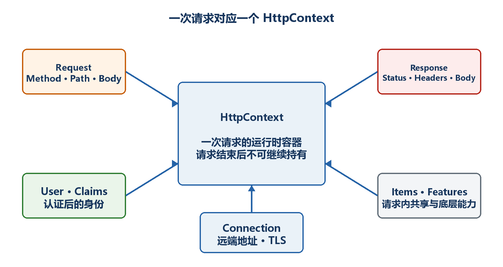

# 第12章　HTTP请求与HttpContext

普通端点参数已经能覆盖大多数业务。需要读取请求头、Cookie、用户身份、连接信息、请求取消或在一次请求内共享数据时，就要理解HttpContext。

  -----------------------------------------------------------------------------------------------------
  **先把三个问题说清楚　**这是什么：HttpContext是当前这一次HTTP请求的上下文对象。\
  目的是什么：提供Request、Response、User、Items、Connection和RequestAborted等底层信息。\
  最后得到什么：能安全读取请求信息、响应取消、传递关联ID，并知道什么时候不应把HttpContext传入业务层。
  -----------------------------------------------------------------------------------------------------

  -----------------------------------------------------------------------------------------------------

  ------------------------------------------------------------------------------------------------------------------------------------
  **本章操作路线　**一个请求一个Context → Request → Response → Headers → Cookie → 请求体 → 取消 → User → Items → 代理 → Accessor边界
  ------------------------------------------------------------------------------------------------------------------------------------

  ------------------------------------------------------------------------------------------------------------------------------------

{width="6.102362204724409in" height="3.2418799212598426in"}

图12-1　HttpContext汇集一次请求的主要信息

## 12.1 为什么说一个请求对应一个HttpContext

Kestrel收到请求后创建HttpContext，并在请求完成后回收相关资源。它不是全局单例，也不应该保存到静态字段供以后使用。并发请求各有自己的Context。

示例12-1　读取当前请求上下文

```csharp
app.MapGet("/api/context", (HttpContext context) =>
Results.Ok(new
{
context.TraceIdentifier,
method = context.Request.Method,
path = context.Request.Path,
context.Response.StatusCode
}));
```

## 12.2 HttpRequest里有什么

Request表示客户端发来的内容，包括Method、Scheme、Host、Path、Query、Headers、Cookies和Body。能通过普通参数绑定获得的值，优先使用参数绑定；需要动态读取时再直接访问Request。

示例12-2　读取请求基本信息

```csharp
app.MapGet("/api/request-info", (HttpRequest request) =>
{
var userAgent = request.Headers.UserAgent.ToString();
return Results.Ok(new
{
request.Method,
request.Scheme,
host = request.Host.Value,
path = request.Path.Value,
query = request.QueryString.Value,
userAgent
});
});
```

  -------------------------------------------------------------------------------------------------------------------------------------------
  **不要信任客户端请求头　**User-Agent、X-Forwarded-For和自定义头都可能被伪造。它们可以用于诊断和协议，但不能未经认证就作为身份或权限依据。
  -------------------------------------------------------------------------------------------------------------------------------------------

  -------------------------------------------------------------------------------------------------------------------------------------------

## 12.3 HttpResponse怎样设置响应头

响应头必须在响应体开始发送之前设置。常见用途包括关联ID、缓存控制和文件信息。正常JSON响应仍建议使用Results或TypedResults。

示例12-3　设置自定义响应头

```csharp
app.MapGet("/api/ping", (HttpContext context) =>
{
context.Response.Headers["X-Correlation-Id"] =
context.TraceIdentifier;
context.Response.Headers.CacheControl = "no-store";

return Results.Ok(new { message = "pong" });
});
```

## 12.4 内容协商和Content-Type

Content-Type说明响应体的实际格式；Accept表示客户端希望接收的格式。Minimal API的JSON结果默认返回application/json。若端点只支持JSON，不必假装支持所有Accept值。

示例12-4　明确返回文本或JSON

```csharp
app.MapGet("/api/plain", () =>
Results.Text("纯文本结果", "text/plain; charset=utf-8"));

app.MapGet("/api/data", () =>
Results.Json(new { value = 123 }));
```

## 12.5 Cookie是什么，怎样安全设置

Cookie由服务器通过Set-Cookie响应头写入，浏览器在后续匹配请求中自动带回。它适合会话标识或偏好设置，但敏感值需要安全属性并避免直接保存秘密。

示例12-5　写入和读取Cookie

```csharp
app.MapPost("/api/preferences/theme/{theme}",
(string theme, HttpResponse response) =>
{
response.Cookies.Append("theme", theme, new CookieOptions
{
HttpOnly = true,
Secure = true,
SameSite = SameSiteMode.Lax,
MaxAge = TimeSpan.FromDays(30)
});

return Results.NoContent();
});

app.MapGet("/api/preferences/theme", (HttpRequest request) =>
Results.Ok(new
{
theme = request.Cookies["theme"] ?? "default"
}));
```

-   HttpOnly阻止普通JavaScript读取Cookie，可降低部分攻击风险。

-   Secure要求HTTPS传输。

-   SameSite控制跨站请求是否携带Cookie。

-   Cookie身份认证还需要完整认证方案，不能只靠一个自定义值。

## 12.6 请求体为什么通常只能读取一次

请求体是向前读取的流。参数绑定或某个中间件读完后，后续代码可能无法再次读取。需要重复读取时必须有明确理由，并在读取前启用缓冲，同时控制大小。

示例12-6　启用缓冲后重置请求体位置

```csharp
app.Use(async (context, next) =>
{
context.Request.EnableBuffering();

using var reader = new StreamReader(
context.Request.Body,
leaveOpen: true);

var body = await reader.ReadToEndAsync();
context.Request.Body.Position = 0;

// 示例只说明机制：生产日志不要记录密码或完整敏感请求体
await next(context);
});
```

  ----------------------------------------------------------------------------------------------------------------------------
  **性能和隐私　**读取完整请求体会占用内存并可能泄露个人信息、令牌或密码。日志通常记录结构化摘要，而不是无条件记录所有正文。
  ----------------------------------------------------------------------------------------------------------------------------

  ----------------------------------------------------------------------------------------------------------------------------

## 12.7 客户端取消请求时服务器应该停止工作

用户关闭页面、取消fetch或网络断开时，RequestAborted会被取消。耗时数据库、HTTP或循环操作应传递CancellationToken，避免结果已经没人需要却继续消耗资源。

示例12-7　响应请求取消

```csharp
app.MapGet("/api/slow", async (CancellationToken cancellationToken) =>
{
await Task.Delay(TimeSpan.FromSeconds(10), cancellationToken);
return Results.Ok(new { completed = true });
});
```

-   Minimal API可直接注入CancellationToken，它对应当前请求取消信号。

-   把它继续传给数据库和HttpClient异步方法。

-   OperationCanceledException在请求取消场景不一定表示服务器故障，日志级别要合理。

## 12.8 User和Claims从哪里来

认证中间件验证令牌或Cookie后，会把身份和声明放到HttpContext.User。没有配置认证时，User通常是未认证身份。读取一个声明不等于已经完成授权。

示例12-8　读取当前用户声明

```csharp
using System.Security.Claims;

app.MapGet("/api/me", (ClaimsPrincipal user) =>
{
if (user.Identity?.IsAuthenticated != true)
return Results.Unauthorized();

return Results.Ok(new
{
name = user.Identity.Name,
claims = user.Claims.Select(c => new { c.Type, c.Value })
});
}).RequireAuthorization();
```

  --------------------------------------------------------------------------------------------------------------------------------------
  **认证与授权　**认证回答"你是谁"，授权回答"你能做什么"。RequireAuthorization保护端点；不要只在处理函数中相信客户端自己传来的userId。
  --------------------------------------------------------------------------------------------------------------------------------------

  --------------------------------------------------------------------------------------------------------------------------------------

## 12.9 Items怎样在一次请求内共享数据

Items是当前请求生命周期中的键值集合。中间件可以写入关联ID或计时信息，后续端点读取。请求结束后数据消失。

示例12-9　在一次请求内传递关联ID

```csharp
const string CorrelationKey = "CorrelationId";

app.Use(async (context, next) =>
{
var correlationId = context.Request.Headers["X-Correlation-Id"]
.FirstOrDefault() ?? Guid.NewGuid().ToString("N");

context.Items[CorrelationKey] = correlationId;
context.Response.Headers["X-Correlation-Id"] = correlationId;
await next(context);
});

app.MapGet("/api/work", (HttpContext context) =>
Results.Ok(new
{
correlationId = context.Items[CorrelationKey]
}));
```

## 12.10 反向代理后Connection信息为什么可能变化

经过IIS、Nginx或负载均衡后，Kestrel直接看到的远端地址可能是代理地址，Scheme可能是http。应用需要正确处理Forwarded Headers，并只信任明确的代理。

-   开发机直连时，Connection.RemoteIpAddress通常是浏览器地址。

-   代理部署时，应由托管配置和Forwarded Headers还原原始协议/IP。

-   盲目信任任意X-Forwarded-\*会让客户端伪造来源信息。

-   生成绝对URL、HTTPS重定向和审计日志都可能受代理配置影响。

## 12.11 IHttpContextAccessor什么时候使用

普通端点直接接收HttpContext最清楚。只有某个基础设施服务无法通过方法参数获得Context时，才考虑AddHttpContextAccessor和IHttpContextAccessor。业务服务应尽量接收已经提取的用户ID、关联ID等普通值。

示例12-10　受控使用IHttpContextAccessor

```csharp
builder.Services.AddHttpContextAccessor();
builder.Services.AddScoped<CurrentRequest>();

sealed class CurrentRequest(IHttpContextAccessor accessor)
{
public string? UserName =>
accessor.HttpContext?.User.Identity?.Name;
}
```

  -----------------------------------------------------------------------------------------------------------------------------
  **边界原则　**HttpContext属于Web层且只在当前请求中有效。不要缓存、跨线程长期保存，也不要让核心业务对象依赖整个HttpContext。
  -----------------------------------------------------------------------------------------------------------------------------

  -----------------------------------------------------------------------------------------------------------------------------
