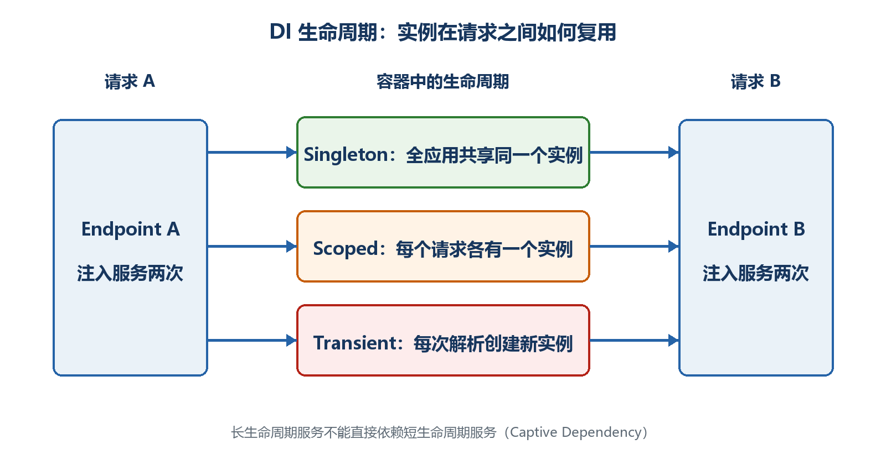

# 第13章　依赖注入

当端点开始访问仓储、时间、邮件或外部HTTP服务时，如果每个处理函数都自己new对象，代码会难以替换、测试和管理生命周期。依赖注入把"需要什么"与"怎样创建"分开。

  -----------------------------------------------------------------------------------------------------------
  **先把三个问题说清楚　**这是什么：依赖注入容器负责根据注册规则创建对象并提供给端点。\
  目的是什么：降低端点与具体实现的耦合，并统一管理对象生命周期和释放。\
  最后得到什么：把任务数据访问从Program.cs拆成ITaskRepository服务，理解Transient、Scoped和Singleton的差异。
  -----------------------------------------------------------------------------------------------------------

  -----------------------------------------------------------------------------------------------------------

  -------------------------------------------------------------------------------------------------------------------------------------
  **本章操作路线　**发现直接new的问题 → 定义接口 → 注册实现 → 端点注入 → 三个生命周期 → 多实现/Keyed → 避免生命周期陷阱 → 重构任务API
  -------------------------------------------------------------------------------------------------------------------------------------

  -------------------------------------------------------------------------------------------------------------------------------------

{width="6.102362204724409in" height="3.2418799212598426in"}

图13-1　Transient、Scoped和Singleton的生命周期差异

## 13.1 为什么不在端点里到处new

直接new把端点固定到某个实现，也让连接、释放和测试替身难以统一管理。依赖注入先注册创建规则，端点只声明自己需要的抽象。

示例13-1　端点直接创建依赖的问题

```csharp
// 耦合较强：端点自己决定具体实现
app.MapGet("/api/tasks", () =>
{
var repository = new FileTaskRepository("tasks.json");
return repository.GetAll();
});
```

-   文件路径散落在业务代码中。

-   测试时难以换成内存仓储。

-   每次请求是否应新建对象不清楚。

-   实现需要释放资源时容易遗漏。

## 13.2 先定义端点真正需要的能力

接口描述能力，不描述对象怎样创建。第一版只提供读取和新增，后面可以有内存、数据库或远程服务实现。

示例13-2　任务仓储抽象和内存实现

```csharp
interface ITaskRepository
{
IReadOnlyList<TaskItem> GetAll();
TaskItem? GetById(int id);
TaskItem Add(string title);
}

sealed class InMemoryTaskRepository : ITaskRepository
{
private readonly List<TaskItem> _tasks =
[
new(1, "学习依赖注入", false)
];

public IReadOnlyList<TaskItem> GetAll() => _tasks;

public TaskItem? GetById(int id) =>
_tasks.FirstOrDefault(x => x.Id == id);

public TaskItem Add(string title)
{
var id = _tasks.Count == 0 ? 1 : _tasks.Max(x => x.Id) + 1;
var task = new TaskItem(id, title.Trim(), false);
_tasks.Add(task);
return task;
}
}

record TaskItem(int Id, string Title, bool Completed);
```

## 13.3 在Build之前注册，在端点参数中使用

注册回答"请求ITaskRepository时提供哪个实现"；端点参数只声明需要ITaskRepository。容器在请求执行前解析依赖。

示例13-3　注册和注入仓储

```csharp
var builder = WebApplication.CreateBuilder(args);

builder.Services.AddSingleton<ITaskRepository, InMemoryTaskRepository>();

var app = builder.Build();

app.MapGet("/api/tasks", (ITaskRepository repository) =>
Results.Ok(repository.GetAll()));

app.MapGet("/api/tasks/{id:int}",
(int id, ITaskRepository repository) =>
{
var task = repository.GetById(id);
return task is null ? Results.NotFound() : Results.Ok(task);
});

app.Run();
```

-   AddSingleton必须在builder.Build之前。

-   端点没有new InMemoryTaskRepository。

-   将来把注册改成数据库实现，端点签名可以保持不变。

-   本例Singleton保存内存列表，因此要考虑并发；真实数据库仓储通常使用Scoped。

## 13.4 三个生命周期怎样选择

生命周期决定同一个注册创建多少实例以及复用多久。选择依据是对象是否保存可变状态、是否与一次请求绑定，以及底层依赖的生命周期。

-   Transient：每次解析通常创建新实例。适合轻量、无状态、创建成本低的服务。

-   Scoped：同一次HTTP请求内复用一个实例，不同请求使用不同实例。数据库DbContext常用Scoped。

-   Singleton：整个应用进程通常只有一个实例。适合线程安全、可长期共享的服务或不可变缓存。

示例13-4　观察生命周期实例ID

```csharp
builder.Services.AddTransient<TransientProbe>();
builder.Services.AddScoped<ScopedProbe>();
builder.Services.AddSingleton<SingletonProbe>();

app.MapGet("/api/lifetimes",
(TransientProbe transient,
ScopedProbe scoped,
SingletonProbe singleton) => new
{
transient.Id,
scoped.Id,
singleton.Id
});

sealed class TransientProbe { public Guid Id { get; } = Guid.NewGuid(); }
sealed class ScopedProbe { public Guid Id { get; } = Guid.NewGuid(); }
sealed class SingletonProbe { public Guid Id { get; } = Guid.NewGuid(); }
```

## 13.5 常见注册形式分别有什么用

除了接口到实现的映射，还可以注册具体类型、现成实例和工厂。工厂适合创建时需要配置或其他服务的情况。

示例13-5　常见服务注册形式

```csharp
builder.Services.AddScoped<TaskService>();
builder.Services.AddScoped<ITaskRepository, DatabaseTaskRepository>();

builder.Services.AddSingleton<SystemClock>();

builder.Services.AddSingleton<ITaskIdGenerator>(provider =>
{
var environment = provider.GetRequiredService<IHostEnvironment>();
return new TaskIdGenerator(prefix: environment.EnvironmentName);
});
```

  -------------------------------------------------------------------------------------------------------------------------------------------------------------------
  **现成Singleton实例　**如果把new出来的实例直接传给AddSingleton，容器对它的释放所有权与工厂创建方式可能不同。涉及IDisposable时应明确所有权，优先让容器创建和管理。
  -------------------------------------------------------------------------------------------------------------------------------------------------------------------

  -------------------------------------------------------------------------------------------------------------------------------------------------------------------

## 13.6 多个实现和IEnumerable

同一个接口可以注册多个实现。注入IEnumerable\<T\>会按注册顺序得到全部实现；直接注入单个T通常得到最后一个注册。业务逻辑应明确到底需要一个还是全部。

示例13-6　依次调用多个通知实现

```csharp
builder.Services.AddSingleton<INotifier, EmailNotifier>();
builder.Services.AddSingleton<INotifier, LogNotifier>();

app.MapPost("/api/notify", async (IEnumerable<INotifier> notifiers) =>
{
foreach (var notifier in notifiers)
await notifier.SendAsync("任务已创建");

return Results.NoContent();
});
```

## 13.7 Keyed Services解决什么问题

当多个实现都有明确名称，例如短信和邮件通知，可以使用Keyed Services按键选择，而不是依赖"最后一个注册"。键名应集中管理，避免拼写错误。

示例13-7　按键选择服务

```csharp
builder.Services.AddKeyedSingleton<INotifier, EmailNotifier>("email");
builder.Services.AddKeyedSingleton<INotifier, SmsNotifier>("sms");

app.MapPost("/api/notify/email",
([FromKeyedServices("email")] INotifier notifier) =>
notifier.SendAsync("邮件通知"));
```

## 13.8 Captive Dependency为什么危险

如果Singleton在构造函数中直接依赖Scoped服务，Scoped实例可能被单例长期持有，失去按请求创建和释放的意义。这叫生命周期捕获。

示例13-8　生命周期捕获示意

```csharp
// 错误方向：Singleton依赖Scoped
builder.Services.AddScoped<RequestTaskContext>();
builder.Services.AddSingleton<TaskCache>();

sealed class TaskCache(RequestTaskContext context)
{
// context可能被长期持有
}
```

-   长生命周期服务可以依赖相同或更长生命周期的服务。

-   Singleton需要使用Scoped服务时，通常重新设计边界；基础设施场景可通过IServiceScopeFactory显式创建短作用域并及时释放。

-   不要为了消除报错把所有服务都改成Singleton。

-   开发环境启用作用域验证可以更早发现部分问题。

## 13.9 为什么不应该到处注入IServiceProvider

如果业务代码拿到IServiceProvider后随时GetService，它隐藏了真正依赖，使构造函数和端点签名无法说明需要什么，也让测试更困难。这通常被称为Service Locator反模式。

示例13-9　显式依赖优于Service Locator

```csharp
// 不清楚真正依赖什么
app.MapGet("/api/tasks", (IServiceProvider provider) =>
{
var repository = provider.GetRequiredService<ITaskRepository>();
return repository.GetAll();
});

// 更清楚
app.MapGet("/api/tasks", (ITaskRepository repository) =>
repository.GetAll());
```

  -----------------------------------------------------------------------------------------------------------------------------------
  **最终结果　**Program.cs只负责组合和登记；端点声明需要ITaskRepository；容器提供实现并管理生命周期；业务代码不再关心对象怎样创建。
  -----------------------------------------------------------------------------------------------------------------------------------

  -----------------------------------------------------------------------------------------------------------------------------------
