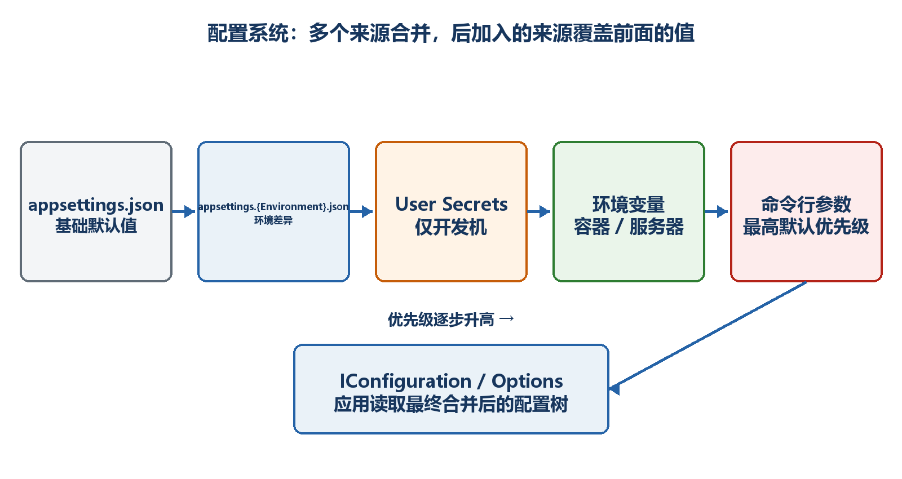

# 第14章　配置、环境与密钥

端口、日志级别、外部服务地址和功能开关不应硬编码在业务代码里。配置系统把这些值从文件、环境变量、命令行和密钥存储组合起来，并允许不同环境覆盖。

  -----------------------------------------------------------------------------------------------------------------------------------------------
  **先把三个问题说清楚　**这是什么：配置是应用运行时读取的外部设置；环境用于区分Development、Staging和Production；密钥是需要受保护的敏感配置。\
  目的是什么：让同一份代码在不同环境使用不同设置，同时避免把生产密码写进仓库。\
  最后得到什么：建立TaskOptions强类型配置，启动时验证，并分别用appsettings、User Secrets和环境变量提供值。
  -----------------------------------------------------------------------------------------------------------------------------------------------

  -----------------------------------------------------------------------------------------------------------------------------------------------

  ---------------------------------------------------------------------------------------------------------------------------------------
  **本章操作路线　**认识默认配置源 → 读取层级Key → 建立Options → 启动验证 → 区分环境 → User Secrets → 环境变量 → 生产密钥 → TaskHub配置
  ---------------------------------------------------------------------------------------------------------------------------------------

  ---------------------------------------------------------------------------------------------------------------------------------------

{width="6.102362204724409in" height="3.2418799212598426in"}

图14-1　多个配置源按优先级合并成最终配置

## 14.1 默认配置管线做了什么

WebApplication.CreateBuilder会建立默认配置。常见来源包括appsettings.json、appsettings.{Environment}.json、开发环境User Secrets、环境变量和命令行参数。后加入或优先级更高的来源可以覆盖前面的同名键。

-   appsettings.json：所有环境共享的非敏感默认值。

-   appsettings.Development.json：本地开发覆盖值。

-   User Secrets：开发机上的敏感值，不写入项目文件。

-   环境变量：部署平台常用，适合容器和服务器覆盖。

-   命令行：启动时临时覆盖，通常优先级较高。

## 14.2 IConfiguration怎样读取层级Key

JSON对象会被展开成冒号分隔的层级键。例如TaskSettings:DefaultPageSize。直接读取适合少量一次性值；大量相关设置应使用强类型Options。

示例14-1　appsettings.json中的任务配置

```json
{
"TaskSettings": {
"DefaultPageSize": 20,
"MaxPageSize": 100,
"AllowDelete": true
}
}
```

示例14-2　按层级Key读取

```csharp
app.MapGet("/api/config/raw", (IConfiguration configuration) =>
{
var pageSize = configuration.GetValue<int>(
"TaskSettings:DefaultPageSize");

return Results.Ok(new { pageSize });
});
```

  -----------------------------------------------------------------------------------------------------------------------------------
  **字符串Key的缺点　**Key拼写错误通常要到运行时才发现；同一组设置散落在多个位置也难以验证。因此核心业务配置应绑定到强类型Options。
  -----------------------------------------------------------------------------------------------------------------------------------

  -----------------------------------------------------------------------------------------------------------------------------------

## 14.3 把配置绑定到TaskOptions

强类型Options把配置结构变成C#类型，获得补全、类型检查和集中验证。配置类应保持简单，只承载设置，不执行数据库或网络操作。

示例14-3　强类型配置类

```csharp
sealed class TaskOptions
{
public const string SectionName = "TaskSettings";

public int DefaultPageSize { get; set; } = 20;
public int MaxPageSize { get; set; } = 100;
public bool AllowDelete { get; set; }
}
```

示例14-4　Build之前绑定配置节

```csharp
builder.Services.Configure<TaskOptions>(
builder.Configuration.GetSection(TaskOptions.SectionName));
```

示例14-5　在端点中读取Options

```csharp
using Microsoft.Extensions.Options;

app.MapGet("/api/config", (IOptions<TaskOptions> options) =>
Results.Ok(options.Value));
```

## 14.4 IOptions、IOptionsSnapshot和IOptionsMonitor怎样选

三者都读取强类型配置，但更新时间和适用生命周期不同。选择前要问：配置是否需要运行时变化，以及服务是Scoped还是Singleton。

-   IOptions\<T\>：通常读取启动后固定值，简单且适合Singleton使用。

-   IOptionsSnapshot\<T\>：Scoped，每个请求作用域重新获得快照，不能注入Singleton。

-   IOptionsMonitor\<T\>：Singleton友好，可读取CurrentValue并订阅变化。

-   配置文件是否自动重载还取决于配置提供程序和部署方式，不应把动态重载当成所有平台都保证的控制系统。

示例14-6　Singleton服务使用IOptionsMonitor

```csharp
sealed class SettingsReporter(IOptionsMonitor<TaskOptions> monitor)
{
public int CurrentMaxPageSize => monitor.CurrentValue.MaxPageSize;
}
```

## 14.5 为什么要在启动时验证

如果MaxPageSize错误，却等到第一个真实请求才暴露，部署可能已经完成。ValidateOnStart让应用启动时检查配置，失败就阻止错误版本进入服务状态。

示例14-7　绑定并在启动时验证

```csharp
builder.Services
.AddOptions<TaskOptions>()
.Bind(builder.Configuration.GetSection(TaskOptions.SectionName))
.Validate(options => options.DefaultPageSize > 0,
"DefaultPageSize必须大于0")
.Validate(options => options.MaxPageSize >= options.DefaultPageSize,
"MaxPageSize不能小于DefaultPageSize")
.Validate(options => options.MaxPageSize <= 500,
"MaxPageSize不能超过500")
.ValidateOnStart();
```

-   把这段代码写在builder.Build之前。

-   配置错误时dotnet run会在启动阶段给出验证错误。

-   修正appsettings或环境变量后重新启动。

-   验证错误信息要明确，方便部署人员知道哪个值不合法。

## 14.6 Development、Staging和Production是什么

环境名称让应用选择不同配置和中间件。Development适合详细错误和开发文档；Production应减少敏感信息并使用正式依赖。环境名称不是安全边界，不能只靠一个字符串保护接口。

示例14-8　根据环境配置中间件

```csharp
var app = builder.Build();

if (app.Environment.IsDevelopment())
{
// 只在开发环境开放的工具，例如Swagger UI
}
else
{
app.UseExceptionHandler();
}

app.MapGet("/api/environment", (IHostEnvironment environment) =>
Results.Ok(new { environment.EnvironmentName }));
```

-   本地launchSettings.json通常设置Development。

-   服务器使用ASPNETCORE_ENVIRONMENT或DOTNET_ENVIRONMENT设置环境。

-   环境改变后通常需要重启应用。

-   不要在Production响应中返回连接字符串、密钥或完整异常堆栈。

## 14.7 User Secrets解决本地开发的什么问题

开发时可能需要真实测试密钥，但不能提交到Git。User Secrets把值保存在用户目录，并通过项目的UserSecretsId关联。它适合开发，不是生产密钥保险箱。

示例14-9　设置开发密钥

```bash
dotnet user-secrets init
dotnet user-secrets set "ExternalApi:ApiKey" "development-key"
dotnet user-secrets list

# 不再需要时删除
dotnet user-secrets remove "ExternalApi:ApiKey"
```

示例14-10　读取并检查密钥是否存在

```text
var apiKey = builder.Configuration["ExternalApi:ApiKey"];

if (string.IsNullOrWhiteSpace(apiKey))
{
throw new InvalidOperationException(
"缺少ExternalApi:ApiKey配置");
}
```

  -------------------------------------------------------------------------------------------------------------------------
  **密钥显示　**不要创建一个API端点把apiKey返回给浏览器，也不要在日志中完整输出。配置读取成功只需记录"已配置"，不记录值。
  -------------------------------------------------------------------------------------------------------------------------

  -------------------------------------------------------------------------------------------------------------------------

## 14.8 环境变量怎样表示层级配置

很多Shell和托管平台用双下划线表示配置层级，因为冒号在环境变量名称中不方便。TaskSettings\_\_MaxPageSize会映射到TaskSettings:MaxPageSize。

示例14-11　环境变量覆盖JSON配置

```bash
# PowerShell：当前终端有效
$env:TaskSettings__MaxPageSize = "200"
$env:TaskSettings__AllowDelete = "false"
dotnet run

# Linux shell
TaskSettings__MaxPageSize=200 TaskSettings__AllowDelete=false dotnet TaskApi.dll
```

-   环境变量通常覆盖appsettings中的同名键。

-   所有环境变量本质上是文本，绑定时再转换成int或bool。

-   拼写错误会产生一个无人读取的新键，因此仍需ValidateOnStart。

-   容器编排平台通常把Secret或Config映射为环境变量或文件。

## 14.9 生产密钥应该放在哪里

生产环境使用组织批准的密钥管理系统，例如云密钥保管库、容器Secret、受控配置服务或操作系统安全存储。关键目标是访问控制、审计、轮换和避免进入源代码/发布包。

-   不要把生产密码写进appsettings.Production.json后提交仓库。

-   不要把密钥写进Dockerfile、发布脚本或教程截图。

-   应用身份只授予读取所需密钥的最小权限。

-   制定轮换流程，确保更换密钥时应用能够平滑更新或重启。

-   日志、异常和健康端点必须过滤敏感值。

## 14.10 把TaskOptions真正用于任务API

最后把配置用于分页和删除开关，让读者看到配置不是单独展示，而是改变业务行为。

示例14-12　配置控制分页和删除行为

```csharp
using Microsoft.Extensions.Options;

app.MapGet("/api/tasks", (
int? page,
int? pageSize,
IOptions<TaskOptions> options) =>
{
var settings = options.Value;
var actualPage = Math.Max(page ?? 1, 1);
var actualPageSize = Math.Clamp(
pageSize ?? settings.DefaultPageSize,
1,
settings.MaxPageSize);

var result = tasks
.Skip((actualPage - 1) * actualPageSize)
.Take(actualPageSize)
.ToList();

return Results.Ok(new
{
page = actualPage,
pageSize = actualPageSize,
items = result
});
});

app.MapDelete("/api/tasks/{id:int}",
(int id, IOptions<TaskOptions> options) =>
{
if (!options.Value.AllowDelete)
{
return Results.Problem(
statusCode: StatusCodes.Status403Forbidden,
title: "当前环境禁止删除任务");
}

var removed = tasks.RemoveAll(x => x.Id == id);
return removed == 0
? Results.NotFound()
: Results.NoContent();
});
```

  ------------------------------------------------------------------------------------------------------------------------------------------------------------------------------------------------
  **最终结果　**同一份代码在Development和Production读取不同配置；核心设置绑定到TaskOptions并在启动时验证；本地秘密使用User Secrets；服务器通过受控环境变量或密钥系统提供；响应和日志不泄露密钥。
  ------------------------------------------------------------------------------------------------------------------------------------------------------------------------------------------------

  ------------------------------------------------------------------------------------------------------------------------------------------------------------------------------------------------
