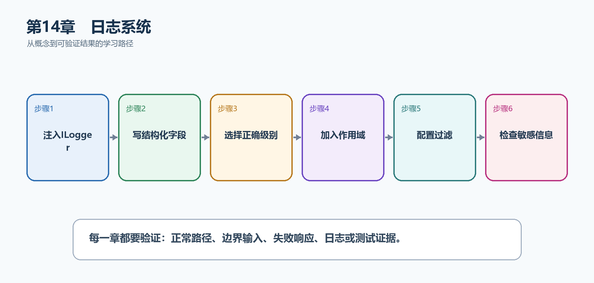

# 第15章　日志系统

程序能够返回正确结果还不够；出现失败、性能下降或用户投诉时，开发者必须知道哪次请求、哪个任务、在哪一步发生了什么。本章从ILogger开始，建立可检索、可关联且不泄密的日志。

  ----------------------------------------------------------------------------------------------------------------------------
  **先把三个问题说清楚　**这是什么：日志是应用在运行过程中写出的结构化事件记录，包含级别、类别、消息模板和命名字段。\
  目的是什么：让开发、测试和运维人员能够根据TaskId、UserId和TraceId还原一次操作，而不是靠猜测。\
  最后得到什么：任务查询和创建操作会写出结构化日志；同一次请求的日志带有关联字段；生产配置可以过滤噪声且不会记录令牌或密码。
  ----------------------------------------------------------------------------------------------------------------------------

  ----------------------------------------------------------------------------------------------------------------------------

  ----------------------------------------------------------------------------------------------------
  **本章操作路线　**注入ILogger → 写结构化字段 → 选择正确级别 → 加入作用域 → 配置过滤 → 检查敏感信息
  ----------------------------------------------------------------------------------------------------

  ----------------------------------------------------------------------------------------------------

{width="6.102362204724409in" height="2.915573053368329in"}

图15-1　日志系统从概念到结果的实现路线

## 15.1 先看最终效果

任务查询和创建操作会写出结构化日志；同一次请求的日志带有关联字段；生产配置可以过滤噪声且不会记录令牌或密码。

本章仍然使用TaskHub任务协作API作为落点。请先完成最小成功路径，再故意制造一次失败；只有能解释状态码、日志或测试结果，才算真正掌握。

115. 运行API并请求/api/tasks/42，确认控制台出现TaskId=42的结构化字段。

116. 请求不存在的任务，确认使用Warning而不是Information或Error掩盖结果。

117. 制造未处理异常，确认日志包含TraceId，但响应不泄露堆栈。

118. 检查日志中没有Authorization、Cookie、密码或完整敏感请求体。

## 15.2 本章核心示例：在Minimal API端点中写结构化日志

本节先展示本章核心写法。若代码定义了所用的全部类型，它可以独立运行；若引用TaskDbContext、TaskEntity、GetTasks等本节没有定义的名称，它就是加入前文TaskHub项目的增量代码，不能直接粘贴到空项目。附录A和附录B提供从空目录开始、能够完整复制运行的项目。

示例15-2　在Minimal API端点中写结构化日志

```csharp
var builder = WebApplication.CreateBuilder(args);
var app = builder.Build();

app.MapGet("/api/tasks/{id:int}",
(int id, ILogger<Program> logger) =>
{
logger.LogInformation(
"开始读取任务 {TaskId}", id);

if (id != 1)
{
logger.LogWarning(
"任务 {TaskId} 不存在", id);
return Results.NotFound(new { message = "任务不存在" });
}

logger.LogInformation(
"成功读取任务 {TaskId}", id);
return Results.Ok(new { id, title = "学习日志" });
});

app.Run();
```

-   消息模板中的{TaskId}会成为命名字段，日志平台可以直接筛选。

-   读取开始和成功使用Information；资源不存在属于可预期结果，使用Warning。

-   ILogger\<Program\>的类别是Program，过滤规则可以按类别设置。

  -------------------------------------------------------------------------------------------------------------------------------
  **运行后应该看到什么　**访问/api/tasks/1得到200并出现开始、成功两条日志；访问/api/tasks/42得到404并出现带TaskId=42的Warning。
  -------------------------------------------------------------------------------------------------------------------------------

  -------------------------------------------------------------------------------------------------------------------------------

## 15.3 为什么要这样做

Console.WriteLine只是一段文本，缺少类别、级别和结构化字段，也难以接入日志平台。ILogger把业务事件与具体输出位置分开，开发环境可写控制台，生产环境可接集中日志系统。

在TaskHub中，本章把它应用到"记录任务的读取、创建、状态变化和失败原因"。实现时要明确输入来自哪里、状态在哪里改变、失败怎样返回，以及运维或测试人员从哪里获得证据。

## 15.4 日志级别

这是什么：Trace到Critical表达事件严重程度而不是开发者心情，生产过滤规则应放在配置中并按类别逐步收紧。

## 15.5 结构化日志

这是什么：使用固定消息模板和命名字段，让日志平台能够按TaskId、UserId和TraceId检索；不要先用字符串插值破坏字段结构。

## 15.6 日志过滤

这是什么：过滤规则按Provider、Category和Level共同决定是否写出，规则越具体优先级通常越高。

怎样做：先加入下面的最小配置或处理代码，保存并重新启动应用，再按示例给出的地址或命令验证。

示例15-3　通过配置控制不同类别的最低级别

```json
{
"Logging": {
"LogLevel": {
"Default": "Information",
"Microsoft.AspNetCore": "Warning",
"TaskHub": "Debug"
}
}
}
```

-   Default是没有更具体规则时的最低级别。

-   Microsoft.AspNetCore提高到Warning，可减少框架噪声。

-   只在需要诊断时为自己的TaskHub类别启用Debug。

  ------------------------------------------------------------------------------------
  **预期结果　**重新启动后，低于各类别最低级别的日志不再输出；业务日志仍按配置保留。
  ------------------------------------------------------------------------------------

  ------------------------------------------------------------------------------------

## 15.7 日志作用域

这是什么：BeginScope把同一业务操作的关联字段附加到范围内全部日志，适合租户、任务和批处理编号。

怎样做：先加入下面的最小配置或处理代码，保存并重新启动应用，再按示例给出的地址或命令验证。

示例15-4　用BeginScope关联同一次业务操作

```csharp
app.MapPost("/api/tasks/{id:int}/complete",
(int id, ILogger<Program> logger) =>
{
using var scope = logger.BeginScope(new Dictionary<string, object>
{
["TaskId"] = id,
["Operation"] = "CompleteTask"
});

logger.LogInformation("开始完成任务");
logger.LogInformation("任务状态已经更新");
return Results.NoContent();
});
```

-   作用域内的多条日志自动携带TaskId和Operation。

-   using结束后作用域被释放，不会污染其他请求。

  -----------------------------------------------------------------------
  **预期结果　**执行端点后，两条日志都能按同一个TaskId和Operation检索。
  -----------------------------------------------------------------------

  -----------------------------------------------------------------------

## 15.8 请求日志

这是什么：请求日志记录方法、路径、状态码、耗时和TraceId等公共信息。适合在中间件中统一记录；默认不要记录Authorization、Cookie和完整请求体。

## 15.9 敏感信息

这是什么：密码、令牌、Cookie、身份证号和完整请求体默认不应记录；需要时先白名单选择字段并脱敏。

## 15.10 异常日志

这是什么：异常日志要保留异常对象、TraceId和必要业务标识。预期的404或冲突通常记Warning，真正未预期的系统故障才记Error。

## 15.11 高性能日志

这是什么：高频路径应避免无意义分配，可使用LoggerMessage源生成器，并在昂贵计算前判断日志级别。

## 15.12 日志提供程序

这是什么：Provider决定日志最终写到控制台、Windows事件、OpenTelemetry或集中平台。业务代码只依赖ILogger，输出位置通过启动配置和Provider决定。

## 15.13 日志与可观测性

这是什么：日志说明发生了什么，指标说明发生了多少，Trace说明一次请求经过哪里。三者应共享TraceId，排障时才能从告警追到具体请求。

## 15.14 最终结果与注意事项

完成本章后，不要只确认项目能够编译。请按下面清单检查运行结果，并保留能够复现的请求、日志或测试。

119. 运行API并请求/api/tasks/42，确认控制台出现TaskId=42的结构化字段。

120. 请求不存在的任务，确认使用Warning而不是Information或Error掩盖结果。

121. 制造未处理异常，确认日志包含TraceId，但响应不泄露堆栈。

122. 检查日志中没有Authorization、Cookie、密码或完整敏感请求体。

  -------------------------------------------------------------------------------------------------------------------------------------------
  **特别注意　**不要用字符串插值破坏结构化字段；不要把可预期的404全部记成Error；不要记录令牌、Cookie和密码；高频Debug日志必须能通过配置关闭
  -------------------------------------------------------------------------------------------------------------------------------------------

  -------------------------------------------------------------------------------------------------------------------------------------------
