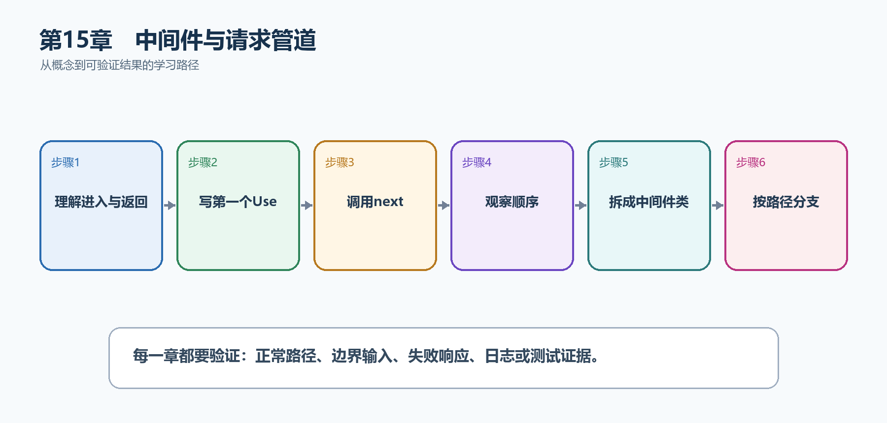

# 第16章　中间件与请求管道

中间件处理的是所有请求都可能需要的横切逻辑，例如异常边界、HTTPS、CORS、认证和计时。它们按注册顺序进入，再按相反顺序返回，因此顺序本身就是程序行为。

  ------------------------------------------------------------------------------------------------------------------------
  **先把三个问题说清楚　**这是什么：中间件是位于Kestrel和端点之间的请求处理组件，可以在调用后续组件之前和之后执行代码。\
  目的是什么：把请求级公共逻辑集中在管道中，避免每个MapGet和MapPost重复实现。\
  最后得到什么：应用会为/api请求生成关联ID和耗时响应头；能够解释Use、Run、Map、UseWhen以及异常、认证、授权的正确顺序。
  ------------------------------------------------------------------------------------------------------------------------

  ------------------------------------------------------------------------------------------------------------------------

  --------------------------------------------------------------------------------------------------
  **本章操作路线　**理解进入与返回 → 写第一个Use → 调用next → 观察顺序 → 拆成中间件类 → 按路径分支
  --------------------------------------------------------------------------------------------------

  --------------------------------------------------------------------------------------------------

{width="6.102362204724409in" height="2.915573053368329in"}

图16-1　中间件与请求管道从概念到结果的实现路线

## 16.1 先看最终效果

应用会为/api请求生成关联ID和耗时响应头；能够解释Use、Run、Map、UseWhen以及异常、认证、授权的正确顺序。

本章仍然使用TaskHub任务协作API作为落点。请先完成最小成功路径，再故意制造一次失败；只有能解释状态码、日志或测试结果，才算真正掌握。

123. 请求/api/ping，确认响应头包含X-Elapsed-Milliseconds和X-Correlation-Id。

124. 查看日志，确认进入顺序与注册顺序相同，返回顺序相反。

125. 故意在端点抛异常，确认异常处理组件位于可能抛错组件之前。

126. 请求非/api路径，确认UseWhen分支不会误处理静态页面。

## 16.2 本章核心示例：内联请求计时中间件

本节先展示本章核心写法。若代码定义了所用的全部类型，它可以独立运行；若引用TaskDbContext、TaskEntity、GetTasks等本节没有定义的名称，它就是加入前文TaskHub项目的增量代码，不能直接粘贴到空项目。附录A和附录B提供从空目录开始、能够完整复制运行的项目。

示例16-2　内联请求计时中间件

```csharp
var builder = WebApplication.CreateBuilder(args);
var app = builder.Build();

app.Use(async (context, next) =>
{
var started = Stopwatch.GetTimestamp();
var correlationId = context.TraceIdentifier;

context.Response.Headers["X-Correlation-Id"] = correlationId;
await next(context);

var elapsed = Stopwatch.GetElapsedTime(started);
context.Response.Headers["X-Elapsed-Milliseconds"] =
elapsed.TotalMilliseconds.ToString("F1");
});

app.MapGet("/api/ping", () => Results.Ok(new { message = "pong" }));
app.Run();
```

-   await next之前是请求进入阶段，之后是响应返回阶段。

-   TraceIdentifier用于关联本次请求。

-   计时结果写入响应头，便于浏览器和测试查看。

  -------------------------------------------------------------------------------------------
  **运行后应该看到什么　**访问/api/ping得到200；开发者工具或curl -i能看到两个X-开头响应头。
  -------------------------------------------------------------------------------------------

  -------------------------------------------------------------------------------------------

## 16.3 为什么要这样做

如果在每个端点里复制计时、异常处理或关联ID代码，规则容易不一致。中间件以请求为边界统一处理，但配置错误的顺序也会导致静态文件、认证和异常行为失效。

在TaskHub中，本章把它应用到"为全部API请求记录耗时并返回关联ID"。实现时要明确输入来自哪里、状态在哪里改变、失败怎样返回，以及运维或测试人员从哪里获得证据。

## 16.4 Run

这是什么：Run注册终止中间件，它不调用next，因此请求到这里就结束。通常只用作管道末端或明确的短路响应。

## 16.5 Map

这是什么：Map按路径前缀建立独立分支，例如把/admin交给另一组中间件。分支结束后不会自动回到主管道，使用前要先画清请求路线。

## 16.6 UseWhen

这是什么：按请求条件创建分支但在分支结束后回到主管道，适合只对API路径启用诊断或限流。

怎样做：先加入下面的最小配置或处理代码，保存并重新启动应用，再按示例给出的地址或命令验证。

示例16-3　只为/api路径启用诊断分支

```csharp
app.UseWhen(
context => context.Request.Path.StartsWithSegments("/api"),
branch =>
{
branch.Use(async (context, next) =>
{
context.Response.Headers["X-Api-Request"] = "true";
await next(context);
});
});
```

-   条件为true时进入分支，分支完成后仍回到主管道。

-   适合只针对API的诊断、限流或附加响应头。

  -------------------------------------------------------------------------
  **预期结果　**/api请求包含X-Api-Request响应头，根页面和静态文件不包含。
  -------------------------------------------------------------------------

  -------------------------------------------------------------------------

## 16.7 中间件顺序

这是什么：中间件按注册顺序进入、按相反顺序返回；异常处理必须包住可能抛错的组件，认证必须先于授权。

## 16.8 Minimal API自动加入的中间件

这是什么：Minimal API会根据已注册服务自动补充部分路由、认证和授权行为，但不要依赖猜测。需要严格控制顺序时应显式调用UseAuthentication、UseAuthorization等中间件。

## 16.9 自定义中间件类

这是什么：可复用的请求级横切逻辑封装为InvokeAsync类，并通过RequestDelegate调用后续管道。

怎样做：先加入下面的最小配置或处理代码，保存并重新启动应用，再按示例给出的地址或命令验证。

示例16-4　把可复用逻辑拆成中间件类

```csharp
sealed class CorrelationMiddleware(RequestDelegate next)
{
public async Task InvokeAsync(HttpContext context)
{
var id = context.Request.Headers["X-Correlation-Id"]
.FirstOrDefault() ?? Guid.NewGuid().ToString("N");

context.Items["CorrelationId"] = id;
context.Response.Headers["X-Correlation-Id"] = id;
await next(context);
}
}

// 写在端点映射之前
app.UseMiddleware<CorrelationMiddleware>();
```

-   RequestDelegate代表管道中的下一个组件。

-   InvokeAsync在每次请求中执行。

-   Items只在当前请求内共享关联ID。

  ------------------------------------------------------------------------------------
  **预期结果　**客户端不提供关联ID时服务器生成；客户端提供时沿用，并在响应头中返回。
  ------------------------------------------------------------------------------------

  ------------------------------------------------------------------------------------

## 16.10 IMiddleware

这是什么：IMiddleware由依赖注入容器创建，适合需要Scoped依赖的中间件。先注册实现，再用UseMiddleware\<T\>加入管道。

## 16.11 异常处理中间件

这是什么：异常处理必须位于可能抛错的组件之前，才能包住后续管道。开发环境可以显示详细页面，生产环境只返回安全的Problem Details。

## 16.12 请求计时中间件

这是什么：计时中间件在调用next前启动计时，在next返回后记录状态码和耗时。不要把响应时间头写得过晚，否则响应可能已经开始发送。

## 16.13 静态文件中间件回顾

这是什么：UseStaticFiles把wwwroot中的文件直接作为HTTP响应返回，通常不会进入Minimal API端点。敏感文件绝不能放进wwwroot。

## 16.14 请求体日志中间件风险

这是什么：请求体可能很大、只能读取一次并含密码或个人数据。只有明确诊断需求时才启用缓冲、大小限制和字段白名单，并在生产中默认关闭。

## 16.15 中间件测试

这是什么：中间件测试至少要验证是否调用next、短路时的状态码、响应头以及异常路径。可用TestServer或WebApplicationFactory发送真实HTTP请求。

## 16.16 最终结果与注意事项

完成本章后，不要只确认项目能够编译。请按下面清单检查运行结果，并保留能够复现的请求、日志或测试。

127. 请求/api/ping，确认响应头包含X-Elapsed-Milliseconds和X-Correlation-Id。

128. 查看日志，确认进入顺序与注册顺序相同，返回顺序相反。

129. 故意在端点抛异常，确认异常处理组件位于可能抛错组件之前。

130. 请求非/api路径，确认UseWhen分支不会误处理静态页面。

  ------------------------------------------------------------------------------------------------------------------------------
  **特别注意　**忘记await next会短路后续管道；异常处理必须包住可能抛错的组件；认证必须先于授权；不要无条件读取和记录完整请求体
  ------------------------------------------------------------------------------------------------------------------------------

  ------------------------------------------------------------------------------------------------------------------------------
