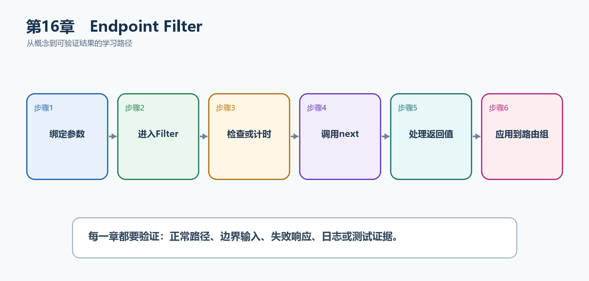

# 第17章　Endpoint Filter

Endpoint Filter位于参数绑定完成之后、处理函数执行之前，适合端点级验证、计时和资源检查。它比中间件更靠近端点参数，但仍不应代替真正的业务服务。

  -----------------------------------------------------------------------------------------------------------------------------------------
  **先把三个问题说清楚　**这是什么：Endpoint Filter是围绕Minimal API处理函数执行的端点级拦截器，可以读取已绑定参数、短路返回或包装结果。\
  目的是什么：复用多个相关端点共有、且需要访问处理函数参数的横切规则。\
  最后得到什么：任务路由组能够统一拒绝空标题并记录端点耗时；读者能区分Middleware、Filter和业务服务。
  -----------------------------------------------------------------------------------------------------------------------------------------

  -----------------------------------------------------------------------------------------------------------------------------------------

  ---------------------------------------------------------------------------------------------
  **本章操作路线　**绑定参数 → 进入Filter → 检查或计时 → 调用next → 处理返回值 → 应用到路由组
  ---------------------------------------------------------------------------------------------

  ---------------------------------------------------------------------------------------------

{width="6.102362204724409in" height="2.915573053368329in"}

图17-1　Endpoint Filter从概念到结果的实现路线

## 17.1 先看最终效果

任务路由组能够统一拒绝空标题并记录端点耗时；读者能区分Middleware、Filter和业务服务。

本章仍然使用TaskHub任务协作API作为落点。请先完成最小成功路径，再故意制造一次失败；只有能解释状态码、日志或测试结果，才算真正掌握。

131. POST空标题，确认Filter直接返回400且处理函数断点不触发。

132. POST合法标题，确认Filter调用next并得到201或200。

133. 为路由组加入计时Filter，确认组内所有端点生效。

134. 交换两个Filter的注册顺序，观察进入和退出顺序。

## 17.2 本章核心示例：用Filter拒绝空任务标题

本节先展示本章核心写法。若代码定义了所用的全部类型，它可以独立运行；若引用TaskDbContext、TaskEntity、GetTasks等本节没有定义的名称，它就是加入前文TaskHub项目的增量代码，不能直接粘贴到空项目。附录A和附录B提供从空目录开始、能够完整复制运行的项目。

示例17-2　用Filter拒绝空任务标题

```csharp
var taskApi = app.MapGroup("/api/tasks");

taskApi.MapPost("/", (CreateTaskRequest request) =>
Results.Ok(new { request.Title }))
.AddEndpointFilter(async (context, next) =>
{
var request = context.GetArgument<CreateTaskRequest>(0);
if (string.IsNullOrWhiteSpace(request.Title))
{
return Results.BadRequest(new
{
message = "任务标题不能为空"
});
}

return await next(context);
});

record CreateTaskRequest(string Title);
```

-   参数绑定先创建CreateTaskRequest，Filter再读取第0个参数。

-   无效时不调用next，端点处理函数不会执行。

-   有效时await next继续执行并返回端点结果。

  ----------------------------------------------------------------------------
  **运行后应该看到什么　**发送{\"title\":\"\"}得到400；发送非空标题得到200。
  ----------------------------------------------------------------------------

  ----------------------------------------------------------------------------

## 17.3 为什么要这样做

中间件看到的是原始HttpContext，业务服务负责核心规则；Filter处于两者之间，能够使用已经绑定的DTO和端点元数据，特别适合轻量端点规则。

在TaskHub中，本章把它应用到"统一验证CreateTaskRequest并测量任务端点耗时"。实现时要明确输入来自哪里、状态在哪里改变、失败怎样返回，以及运维或测试人员从哪里获得证据。

## 17.4 Filter执行顺序

这是什么：多个Filter按注册顺序进入、逆序退出，最外层应承担计时或异常边界，避免依赖偶然顺序。

## 17.5 读取处理器参数

这是什么：Filter通过EndpointFilterInvocationContext.Arguments读取已绑定参数。索引与处理器签名绑定，参数较多时优先使用命名DTO并检查类型。

## 17.6 验证Filter

这是什么：验证Filter适合在多个端点复用同一输入检查，并在无效时直接返回ValidationProblem。复杂业务规则仍应放在应用服务中。

## 17.7 日志Filter

这是什么：日志Filter靠近端点，能记录端点名称、绑定后的关键参数和处理结果。不要在这里记录完整DTO或秘密字段。

## 17.8 权限和资源检查

这是什么：Filter可以做轻量资源检查，但正式权限应使用认证、Policy和IAuthorizationService。否则很容易漏掉401、403和资源级规则。

## 17.9 幂等Filter

这是什么：为可能重试的创建或支付操作接收幂等键，持久化请求指纹与结果，避免网络重试产生重复副作用。

## 17.10 Filter类

这是什么：当Filter逻辑超过几行或需要注入服务时，创建实现IEndpointFilter的类。这样可单独测试，也避免Program.cs出现长匿名函数。

怎样做：先加入下面的最小配置或处理代码，保存并重新启动应用，再按示例给出的地址或命令验证。

示例17-3　把计时逻辑写成IEndpointFilter

```csharp
sealed class TimingFilter(ILogger<TimingFilter> logger)
: IEndpointFilter
{
public async ValueTask<object?> InvokeAsync(
EndpointFilterInvocationContext context,
EndpointFilterDelegate next)
{
var started = Stopwatch.GetTimestamp();
try
{
return await next(context);
}
finally
{
var elapsed = Stopwatch.GetElapsedTime(started);
logger.LogInformation(
"端点 {Endpoint} 耗时 {ElapsedMs} ms",
context.HttpContext.GetEndpoint()?.DisplayName,
elapsed.TotalMilliseconds);
}
}
}

taskApi.AddEndpointFilter<TimingFilter>();
```

-   类Filter可以依赖注入ILogger等服务。

-   finally保证成功或失败都会记录耗时。

-   加在RouteGroupBuilder上会作用于组内端点。

  -----------------------------------------------------------------------
  **预期结果　**调用任意任务端点后，日志包含端点显示名和ElapsedMs字段。
  -----------------------------------------------------------------------

  -----------------------------------------------------------------------

## 17.11 Filter Factory

这是什么：工厂在启动阶段读取MethodInfo和参数元数据，返回运行期Filter，可减少每次请求的反射成本。

## 17.12 路由组Filter

这是什么：把Filter加到MapGroup后，组内端点都会执行它。适合共同验证、计时或幂等处理，但要确认子端点是否需要例外。

## 17.13 Middleware、Filter与业务服务对比

这是什么：Middleware面向所有请求，Filter面向一个端点或路由组，业务服务负责业务规则与状态变化。先按作用范围选择位置，不要只按写起来方便选择。

## 17.14 哪些逻辑不应放入Filter

这是什么：数据库事务、复杂权限模型、跨聚合业务流程和外部系统编排不应塞进Filter。Filter保持短小，业务失败由服务返回或抛出明确领域异常。

## 17.15 Filter的测试

这是什么：分别测试Filter短路和调用next两条路径，并验证多个Filter的进入、退出顺序。不要只测试最终状态码而忽略处理器是否被执行。

## 17.16 最终结果与注意事项

完成本章后，不要只确认项目能够编译。请按下面清单检查运行结果，并保留能够复现的请求、日志或测试。

135. POST空标题，确认Filter直接返回400且处理函数断点不触发。

136. POST合法标题，确认Filter调用next并得到201或200。

137. 为路由组加入计时Filter，确认组内所有端点生效。

138. 交换两个Filter的注册顺序，观察进入和退出顺序。

  --------------------------------------------------------------------------------------------------------------------------------------------------
  **特别注意　**Filter执行时参数绑定已经完成；不要在Filter中堆积复杂业务流程；多个Filter按注册顺序进入、逆序退出；权限检查仍应建立在认证授权系统上
  --------------------------------------------------------------------------------------------------------------------------------------------------

  --------------------------------------------------------------------------------------------------------------------------------------------------
