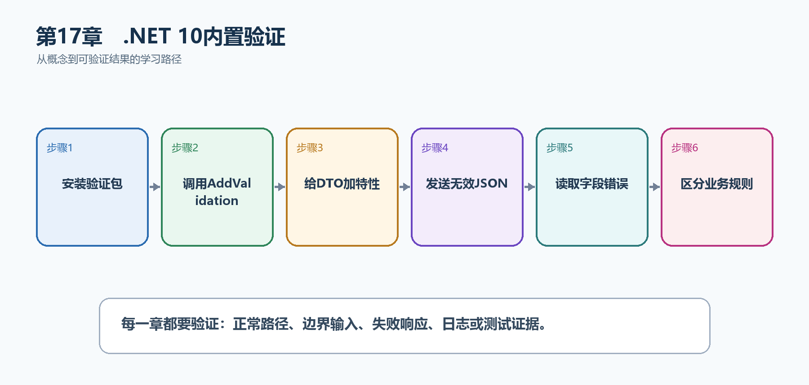

# 第18章　.NET 10内置验证

参数绑定只能把JSON变成C#对象，不能保证标题长度、日期范围或字段组合符合要求。.NET 10内置验证可以在处理函数执行前应用DataAnnotations，并生成统一验证错误。

  ---------------------------------------------------------------------------------------------------------------------------------
  **先把三个问题说清楚　**这是什么：内置验证根据DTO上的验证元数据检查输入，在端点执行前阻止无效请求。\
  目的是什么：把输入形状规则集中在请求模型中，使所有调用者得到稳定的400字段错误。\
  最后得到什么：CreateTaskRequest的必填、长度和日期规则会自动执行；无效请求得到ValidationProblemDetails，合法请求才进入处理函数。
  ---------------------------------------------------------------------------------------------------------------------------------

  ---------------------------------------------------------------------------------------------------------------------------------

  ----------------------------------------------------------------------------------------------------------------
  本章操作路线　确认目标为net10.0 → 调用AddValidation → 给DTO加特性 → 发送无效JSON → 读取字段错误 → 区分业务规则
  ----------------------------------------------------------------------------------------------------------------

  ----------------------------------------------------------------------------------------------------------------

{width="6.102362204724409in" height="2.915573053368329in"}

图18-1　.NET 10内置验证从概念到结果的实现路线

## 18.1 先看最终效果

CreateTaskRequest的必填、长度和日期规则会自动执行；无效请求得到ValidationProblemDetails，合法请求才进入处理函数。

本章仍然使用TaskHub任务协作API作为落点。请先完成最小成功路径，再故意制造一次失败；只有能解释状态码、日志或测试结果，才算真正掌握。

139. 不发送title，确认得到400和title字段错误。

140. 发送超过100字符标题，确认处理函数不执行。

141. 发送合法DTO，确认端点正常创建任务。

142. 测试数据库唯一性等业务规则仍由应用服务返回明确冲突结果。

## 18.2 本章核心示例：启用.NET 10验证并验证请求DTO

本节先展示本章核心写法。若代码定义了所用的全部类型，它可以独立运行；若引用TaskDbContext、TaskEntity、GetTasks等本节没有定义的名称，它就是加入前文TaskHub项目的增量代码，不能直接粘贴到空项目。附录A和附录B提供从空目录开始、能够完整复制运行的项目。

示例18-1　确认项目使用.NET 10 Web共享框架

```bash
dotnet --version
# ASP.NET Core 10 Web项目由共享框架提供AddValidation
```

示例18-2　启用.NET 10验证并验证请求DTO

```csharp
using System.ComponentModel.DataAnnotations;

var builder = WebApplication.CreateBuilder(args);
builder.Services.AddValidation();

var app = builder.Build();

app.MapPost("/api/tasks", (CreateTaskRequest request) =>
Results.Ok(new { request.Title, request.Priority }));

app.Run();

sealed record CreateTaskRequest(
[property: Required(ErrorMessage = "标题不能为空")]
[property: StringLength(100, MinimumLength = 2)]
string Title,

[property: Range(1, 5)]
int Priority);
```

-   ASP.NET Core 10 Web项目由共享框架提供AddValidation；在builder.Build之前调用它即可。只有在非ASP.NET Core场景显式使用验证基础设施时，才需要单独研究Microsoft.Extensions.Validation包。

-   Record主构造参数的特性使用property:应用到生成的属性。

-   无效输入在端点执行前被拒绝。

  ----------------------------------------------------------------------------------
  **运行后应该看到什么　**空标题或Priority=9得到400和字段级错误；合法JSON得到200。
  ----------------------------------------------------------------------------------

  ----------------------------------------------------------------------------------

## 18.3 为什么要这样做

前端验证改善用户体验，但可以被绕过；后端必须再次验证。DataAnnotations适合单对象格式规则，唯一性、权限和状态流转等仍需要业务服务和数据库参与。

在TaskHub中，本章把它应用到"验证任务标题、优先级和截止日期"。实现时要明确输入来自哪里、状态在哪里改变、失败怎样返回，以及运维或测试人员从哪里获得证据。

## 18.4 DataAnnotations

这是什么：Required、Range、StringLength等声明输入形状约束；它们适合格式规则，不代替需要数据库参与的业务规则。

## 18.5 Record类型验证

这是什么：主构造record用于请求DTO时，验证特性通常写成\[property: Required\]作用于生成属性。若写在错误目标上，源生成验证可能读取不到预期元数据。

## 18.6 参数、类型和属性验证

这是什么：.NET 10先验证端点参数，再验证类型和属性；某层发现错误后会停止继续深入。理解顺序有助于解释为什么一次响应只出现部分错误。

## 18.7 嵌套对象与集合

这是什么：验证源生成器会沿可确定的对象图检查嵌套对象与集合元素。对象图无法在编译期发现时，要使用ValidatableType强制生成元数据。

## 18.8 IValidatableObject

这是什么：当规则涉及同一对象多个属性时集中实现Validate，并返回指向具体成员的ValidationResult。

怎样做：先加入下面的最小配置或处理代码，保存并重新启动应用，再按示例给出的地址或命令验证。

示例18-3　验证多个字段之间的关系

```csharp
sealed class TaskScheduleRequest : IValidatableObject
{
public DateTimeOffset? StartAt { get; init; }
public DateTimeOffset? DueAt { get; init; }

public IEnumerable<ValidationResult> Validate(
ValidationContext validationContext)
{
if (StartAt is not null && DueAt is not null && DueAt <= StartAt)
{
yield return new ValidationResult(
"截止时间必须晚于开始时间",
[nameof(DueAt)]);
}
}
}
```

-   IValidatableObject适合同一对象多个属性之间的规则。

-   ValidationResult指定成员名，前端可以把错误显示到DueAt控件。

  -----------------------------------------------------------------------
  **预期结果　**DueAt早于StartAt时得到400，并在DueAt字段下看到错误。
  -----------------------------------------------------------------------

  -----------------------------------------------------------------------

## 18.9 自定义验证特性

这是什么：自定义ValidationAttribute适合纯同步、无数据库依赖的格式规则。需要查询数据库、当前用户或远程服务的规则应留在应用服务中。

## 18.10 SkipValidation

这是什么：SkipValidation用于明确跳过某个参数、类型或属性的自动验证。它是少数例外工具，不应用来掩盖DTO设计或性能问题。

## 18.11 ValidatableType

这是什么：ValidatableType告诉源生成器额外生成某个类型的验证信息，适用于对象图无法从端点签名直接推断的情况。加上后重新编译并用无效输入确认它确实生效。

## 18.12 禁用端点验证

这是什么：个别端点若接收原始载荷或自行验证，可显式关闭自动验证。关闭后必须说明替代验证在哪里完成以及错误格式是什么。

## 18.13 验证错误响应

这是什么：验证失败应稳定返回400与字段级Problem Details，使前端能把错误准确显示到对应控件。

## 18.14 验证与业务规则

这是什么：格式验证先于处理器，唯一性、权限、库存和状态流转等业务规则仍由应用服务判断。

## 18.15 最终结果与注意事项

完成本章后，不要只确认项目能够编译。请按下面清单检查运行结果，并保留能够复现的请求、日志或测试。

143. 不发送title，确认得到400和title字段错误。

144. 发送超过100字符标题，确认处理函数不执行。

145. 发送合法DTO，确认端点正常创建任务。

146. 测试数据库唯一性等业务规则仍由应用服务返回明确冲突结果。

  --------------------------------------------------------------------------------------------------------------------------------------
  **特别注意　**前端验证不能代替后端验证；格式验证不能代替唯一性和权限判断；错误响应字段名必须稳定；DTO可空性、验证和OpenAPI应保持一致
  --------------------------------------------------------------------------------------------------------------------------------------

  --------------------------------------------------------------------------------------------------------------------------------------
