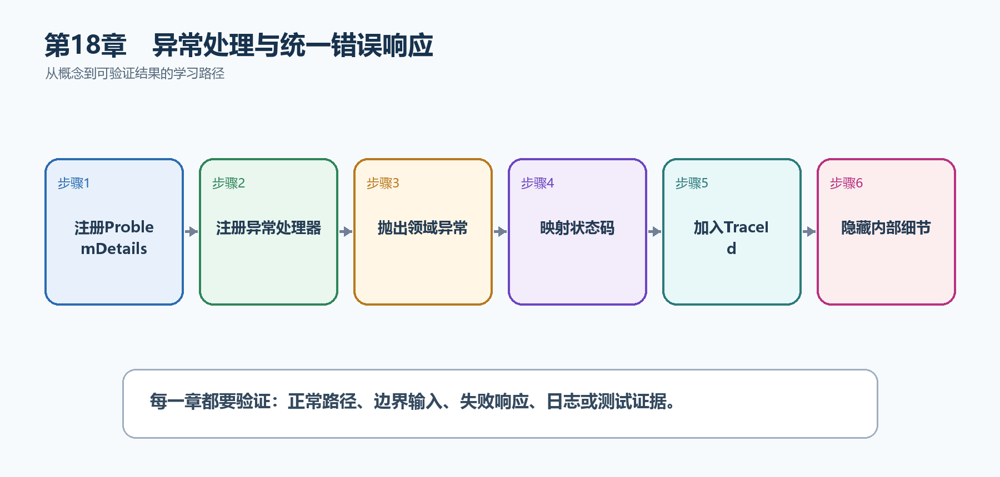

# 第19章　异常处理与统一错误响应

异常表示当前代码不能按正常路径继续。生产API不能把堆栈和数据库细节返回给客户端，而应记录完整异常，再返回稳定的Problem Details和Trace ID。

  -------------------------------------------------------------------------------------------------------------------------------
  **先把三个问题说清楚　**这是什么：异常处理管道捕获未处理异常，把内部失败映射为安全、统一、可关联的HTTP错误响应。\
  目的是什么：避免每个端点重复try/catch，同时让客户端得到稳定错误格式，让日志保留真正诊断信息。\
  最后得到什么：TaskNotFoundException映射为404，其他未预期异常映射为500；响应包含Problem Details和traceId，日志可按同一ID检索。
  -------------------------------------------------------------------------------------------------------------------------------

  -------------------------------------------------------------------------------------------------------------------------------

  ----------------------------------------------------------------------------------------------------------------
  **本章操作路线　**注册ProblemDetails → 注册异常处理器 → 抛出领域异常 → 映射状态码 → 加入TraceId → 隐藏内部细节
  ----------------------------------------------------------------------------------------------------------------

  ----------------------------------------------------------------------------------------------------------------

{width="6.102362204724409in" height="2.915573053368329in"}

图19-1　异常处理与统一错误响应从概念到结果的实现路线

## 19.1 先看最终效果

TaskNotFoundException映射为404，其他未预期异常映射为500；响应包含Problem Details和traceId，日志可按同一ID检索。

本章仍然使用TaskHub任务协作API作为落点。请先完成最小成功路径，再故意制造一次失败；只有能解释状态码、日志或测试结果，才算真正掌握。

147. 请求不存在任务，确认得到404 Problem Details。

148. 制造普通Exception，确认生产响应为500且没有堆栈。

149. 从响应extensions.traceId复制ID，在日志中找到同一次异常。

150. 确认验证失败等正常业务结果没有被记成未处理异常。

## 19.2 本章核心示例：用IExceptionHandler生成统一Problem Details

本节先展示本章核心写法。若代码定义了所用的全部类型，它可以独立运行；若引用TaskDbContext、TaskEntity、GetTasks等本节没有定义的名称，它就是加入前文TaskHub项目的增量代码，不能直接粘贴到空项目。附录A和附录B提供从空目录开始、能够完整复制运行的项目。

示例19-2　用IExceptionHandler生成统一Problem Details

```csharp
using Microsoft.AspNetCore.Diagnostics;

var builder = WebApplication.CreateBuilder(args);
builder.Services.AddProblemDetails();
builder.Services.AddExceptionHandler<ApiExceptionHandler>();

var app = builder.Build();
app.UseExceptionHandler();

app.MapGet("/api/tasks/{id:int}", (int id) =>
{
if (id != 1)
throw new TaskNotFoundException(id);

return Results.Ok(new { id, title = "异常处理" });
});

app.Run();

sealed class TaskNotFoundException(int id)
: Exception($"任务{id}不存在")
{
}

sealed class ApiExceptionHandler(
IProblemDetailsService problemDetails,
ILogger<ApiExceptionHandler> logger) : IExceptionHandler
{
public async ValueTask<bool> TryHandleAsync(
HttpContext context,
Exception exception,
CancellationToken cancellationToken)
{
var status = exception is TaskNotFoundException
? StatusCodes.Status404NotFound
: StatusCodes.Status500InternalServerError;

if (status == StatusCodes.Status500InternalServerError)
{
logger.LogError(exception,
"未预期异常，TraceId={TraceId}", context.TraceIdentifier);
}
else
{
logger.LogWarning(
"请求未完成：{Reason}，TraceId={TraceId}",
exception.Message,
context.TraceIdentifier);
}

context.Response.StatusCode = status;
return await problemDetails.TryWriteAsync(new ProblemDetailsContext
{
HttpContext = context,
ProblemDetails = new()
{
Status = status,
Title = status == 404 ? "任务不存在" : "服务器内部错误",
Extensions = { ["traceId"] = context.TraceIdentifier }
},
Exception = exception
});
}
}
```

-   AddProblemDetails和AddExceptionHandler都在Build之前注册。

-   UseExceptionHandler在端点之前建立异常边界。

-   500未预期异常记录完整异常对象；404等预期业务失败记录Warning和必要字段，避免把正常分支全部伪装成系统故障。

-   客户端只收到安全标题和traceId。

  ---------------------------------------------------------------------------------------------------------
  **运行后应该看到什么　**/api/tasks/99得到404 Problem Details；响应有traceId，日志包含同一ID和完整异常。
  ---------------------------------------------------------------------------------------------------------

  ---------------------------------------------------------------------------------------------------------

## 19.3 为什么要这样做

如果每个端点各自捕获Exception，错误格式、日志和状态码会逐渐不一致。IExceptionHandler集中处理异常类型；可预期输入错误则应直接返回400/404，而不是滥用异常控制普通流程。

在TaskHub中，本章把它应用到"把任务不存在和服务器故障转换为统一Problem Details"。实现时要明确输入来自哪里、状态在哪里改变、失败怎样返回，以及运维或测试人员从哪里获得证据。

## 19.4 开发异常页

这是什么：Developer Exception Page只应在Development启用，它显示堆栈和请求细节帮助本地排错。生产环境必须改用安全的异常处理和Problem Details。

## 19.5 .NET 10异常诊断行为

这是什么：在.NET 10中IExceptionHandler返回true后默认抑制框架异常诊断；若仍需遥测要显式配置SuppressDiagnosticsCallback。

怎样做：先加入下面的最小配置或处理代码，保存并重新启动应用，再按示例给出的地址或命令验证。

示例19-3　按需要保留已处理异常的诊断事件

```text
app.UseExceptionHandler(new ExceptionHandlerOptions
{
SuppressDiagnosticsCallback = context => false
});
```

-   .NET 10中异常被处理后，框架诊断可能默认受到抑制。

-   如果监控系统仍需要异常指标或事件，可显式决定不抑制。

-   是否开启应结合日志重复和遥测成本评估。

  --------------------------------------------------------------------------------------------------
  **预期结果　**异常仍返回统一响应，同时诊断监听器能够收到相应事件；注意避免与自定义日志重复计数。
  --------------------------------------------------------------------------------------------------

  --------------------------------------------------------------------------------------------------

## 19.6 Problem Details

这是什么：以type、title、status、detail、instance和扩展字段表达机器可读错误，生产环境不要泄露堆栈和数据库细节。

## 19.7 异常到状态码的映射

这是什么：映射应显式体现字段含义和权限；简单模型优先手写，自动映射库也要用测试锁定契约。

## 19.8 领域异常

这是什么：领域异常表达'当前业务状态不允许继续'，例如项目已归档。应建立稳定的异常到400、404或409映射，未预期异常才返回500。

## 19.9 什么时候不应该抛异常

这是什么：普通分支、验证失败和高频查无结果通常可直接返回结果类型。异常适合真正打断正常流程的情况，不能代替if判断。

## 19.10 统一错误编号

这是什么：错误编号是客户端和运维可长期依赖的机器可读标识，例如task_not_found。编号应稳定，显示文字可以本地化或调整。

## 19.11 Trace ID

这是什么：把TraceIdentifier或Activity TraceId放入错误响应和日志，用户报错时即可贯通客户端、网关和服务端记录。

## 19.12 最终结果与注意事项

完成本章后，不要只确认项目能够编译。请按下面清单检查运行结果，并保留能够复现的请求、日志或测试。

151. 请求不存在任务，确认得到404 Problem Details。

152. 制造普通Exception，确认生产响应为500且没有堆栈。

153. 从响应extensions.traceId复制ID，在日志中找到同一次异常。

154. 确认验证失败等正常业务结果没有被记成未处理异常。

  --------------------------------------------------------------------------------------------------------------------------------------------------------
  **特别注意　**生产环境不要返回堆栈和SQL细节；不要用异常代替普通分支；异常处理器必须位于可能抛错的管道外层；.NET 10处理后诊断抑制行为需要按监控要求配置
  --------------------------------------------------------------------------------------------------------------------------------------------------------

  --------------------------------------------------------------------------------------------------------------------------------------------------------
