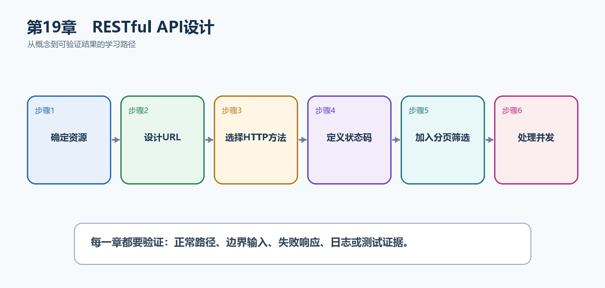

# 第20章　RESTful API设计

REST设计的核心不是把URL写得像名词，而是让资源、HTTP方法、状态码、并发和分页形成稳定契约。客户端看到接口就能判断怎样调用、能否重试以及失败后如何处理。

  -----------------------------------------------------------------------------------------------------------------------------------
  **先把三个问题说清楚　**这是什么：RESTful API是围绕资源设计URL，并使用HTTP方法、状态码、请求头和表示格式表达操作语义的接口风格。\
  目的是什么：让前端、移动端和其他服务用一致规则理解任务资源，减少为每个接口单独猜测。\
  最后得到什么：Task API具有清楚的CRUD路径、201/204/404/409等状态码、受限分页和ETag并发控制。
  -----------------------------------------------------------------------------------------------------------------------------------

  -----------------------------------------------------------------------------------------------------------------------------------

  --------------------------------------------------------------------------------------------
  **本章操作路线　**确定资源 → 设计URL → 选择HTTP方法 → 定义状态码 → 加入分页筛选 → 处理并发
  --------------------------------------------------------------------------------------------

  --------------------------------------------------------------------------------------------

{width="6.102362204724409in" height="2.915573053368329in"}

图20-1　RESTful API设计从概念到结果的实现路线

## 20.1 先看最终效果

Task API具有清楚的CRUD路径、201/204/404/409等状态码、受限分页和ETag并发控制。

本章仍然使用TaskHub任务协作API作为落点。请先完成最小成功路径，再故意制造一次失败；只有能解释状态码、日志或测试结果，才算真正掌握。

155. GET只读取数据，不产生状态变化。

156. POST创建返回201和Location；DELETE成功返回204。

157. pageSize超过上限时返回400或被明确限制。

158. 使用过期ETag更新任务时返回412，避免覆盖他人修改。

## 20.2 本章核心示例：建立一致的任务资源CRUD

本节先展示本章核心写法。若代码定义了所用的全部类型，它可以独立运行；若引用TaskDbContext、TaskEntity、GetTasks等本节没有定义的名称，它就是加入前文TaskHub项目的增量代码，不能直接粘贴到空项目。附录A和附录B提供从空目录开始、能够完整复制运行的项目。

示例20-2　建立一致的任务资源CRUD

```csharp
var taskApi = app.MapGroup("/api/tasks");

taskApi.MapGet("/", () => Results.Ok(tasks));

taskApi.MapGet("/{id:int}", (int id) =>
{
var task = tasks.FirstOrDefault(x => x.Id == id);
return task is null ? Results.NotFound() : Results.Ok(task);
});

taskApi.MapPost("/", (CreateTaskRequest request) =>
{
var task = new TaskItem(3, request.Title, false, 1);
tasks.Add(task);
return Results.Created($"/api/tasks/{task.Id}", task);
});

taskApi.MapDelete("/{id:int}", (int id) =>
tasks.RemoveAll(x => x.Id == id) == 0
? Results.NotFound()
: Results.NoContent());
```

-   集合路径/api/tasks用于读取集合和创建资源。

-   单资源路径/api/tasks/{id}用于读取、修改和删除。

-   状态码由资源结果决定，不把不存在伪装成200。

  ----------------------------------------------------------------------------------------------------------------------
  **运行后应该看到什么　**Swagger或.http中能按GET、POST、DELETE操作同一资源；创建得到201，删除得到204，不存在得到404。
  ----------------------------------------------------------------------------------------------------------------------

  ----------------------------------------------------------------------------------------------------------------------

## 20.3 为什么要这样做

把创建写成/getCreateTask或所有结果都返回200会破坏HTTP语义，也让缓存、重试、文档和客户端生成失去依据。先确定资源和状态变化，再选择方法和状态码。

在TaskHub中，本章把它应用到"为任务集合和单个任务建立稳定HTTP契约"。实现时要明确输入来自哪里、状态在哪里改变、失败怎样返回，以及运维或测试人员从哪里获得证据。

## 20.4 状态码设计

这是什么：用2xx表达成功类别、4xx表达客户端可修正问题、5xx表达服务端失败，并保持同类端点一致。

## 20.5 DTO设计

这是什么：请求DTO、响应DTO与实体承担不同契约，分离后可独立验证、版本化和隐藏内部字段。

## 20.6 分页

这是什么：使用稳定排序并限制pageSize；深分页可改用游标，响应中应返回继续查询所需的信息。

怎样做：先加入下面的最小配置或处理代码，保存并重新启动应用，再按示例给出的地址或命令验证。

示例20-3　使用稳定排序和受限pageSize

```text
taskApi.MapGet("/", (int page = 1, int pageSize = 20) =>
{
if (page < 1 || pageSize is < 1 or > 100)
return Results.BadRequest(new { message = "分页参数无效" });

var items = tasks
.OrderBy(x => x.Id)
.Skip((page - 1) * pageSize)
.Take(pageSize)
.ToList();

return Results.Ok(new
{
page,
pageSize,
total = tasks.Count,
items
});
});
```

-   先按稳定字段排序，再Skip/Take。

-   限制pageSize防止一次请求读取过多数据。

-   响应返回total和当前页信息，前端可生成分页控件。

  ---------------------------------------------------------------------------------
  **预期结果　**/api/tasks?page=1&pageSize=10返回分页对象；pageSize=1000得到400。
  ---------------------------------------------------------------------------------

  ---------------------------------------------------------------------------------

## 20.7 筛选、搜索与排序

这是什么：查询参数表达可组合的筛选、搜索和排序，服务端必须白名单允许字段，避免把数据库表达式直接暴露给客户端。

## 20.8 PUT与PATCH

这是什么：PUT表示用完整表示替换资源，PATCH表示只修改部分字段。若不实现标准JSON Patch，可定义明确的UpdateTaskRequest并在文档中说明它是部分更新。

## 20.9 幂等性

这是什么：为可能重试的创建或支付操作接收幂等键，持久化请求指纹与结果，避免网络重试产生重复副作用。

## 20.10 乐观并发与ETag

这是什么：把资源版本编码为ETag，更新时校验If-Match；版本不一致返回412，从而防止后写覆盖先写。

怎样做：先加入下面的最小配置或处理代码，保存并重新启动应用，再按示例给出的地址或命令验证。

示例20-4　用If-Match防止丢失更新

```text
taskApi.MapPut("/{id:int}",
(int id, UpdateTaskRequest request, HttpRequest httpRequest) =>
{
var index = tasks.FindIndex(x => x.Id == id);
if (index < 0) return Results.NotFound();

var current = tasks[index];
var expected = $""{current.Version}"";
if (httpRequest.Headers.IfMatch != expected)
return Results.StatusCode(StatusCodes.Status412PreconditionFailed);

var updated = current with
{
Title = request.Title,
Version = current.Version + 1
};
tasks[index] = updated;
return Results.Ok(updated);
});
```

-   客户端先读取资源及其ETag，再把值放进If-Match。

-   版本不一致返回412，提示客户端重新读取。

-   数据库实现应使用rowversion或并发令牌，而不是只用内存整数。

  --------------------------------------------------------------------------------------
  **预期结果　**携带当前版本更新成功并递增Version；继续使用旧If-Match再次更新得到412。
  --------------------------------------------------------------------------------------

  --------------------------------------------------------------------------------------

## 20.11 批量操作

这是什么：批量接口要先规定全成功还是允许部分成功，并限制单次项目数。逐项结果应包含索引、资源ID和错误，不要只返回一个模糊的400。

## 20.12 API版本

这是什么：版本只在存在真实不兼容变化时引入，可放在路径、查询或请求头中。先制定弃用期和兼容策略，再选择版本库或路由写法。

## 20.13 HATEOAS是否必要

这是什么：HATEOAS在客户端需要动态发现下一步操作时有价值，但多数内部API用稳定OpenAPI已足够。不要为了REST形式增加客户端并不使用的链接。

## 20.14 最终结果与注意事项

完成本章后，不要只确认项目能够编译。请按下面清单检查运行结果，并保留能够复现的请求、日志或测试。

159. GET只读取数据，不产生状态变化。

160. POST创建返回201和Location；DELETE成功返回204。

161. pageSize超过上限时返回400或被明确限制。

162. 使用过期ETag更新任务时返回412，避免覆盖他人修改。

  ---------------------------------------------------------------------------------------------------------------------------------------
  **特别注意　**URL使用资源名而不是随意动作名；POST通常非幂等，自动重试要谨慎；分页必须稳定排序并限制pageSize；ETag要与真实资源版本绑定
  ---------------------------------------------------------------------------------------------------------------------------------------

  ---------------------------------------------------------------------------------------------------------------------------------------
