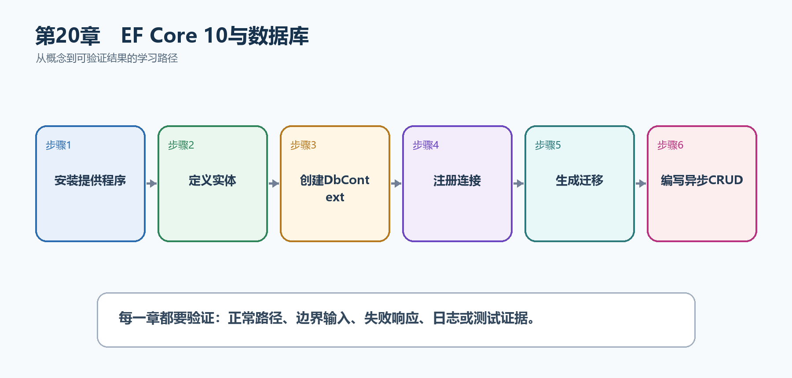

# 第21章　EF Core 10与数据库

内存List会在进程重启后丢失数据，也无法可靠处理并发。EF Core把C#实体、LINQ查询、变更跟踪和数据库迁移连接起来，让任务数据真正持久化。

  -------------------------------------------------------------------------------------------------------------------------------------
  **先把三个问题说清楚　**这是什么：Entity Framework Core是.NET的对象关系映射器，通过DbContext和实体把数据库操作表示为C#代码和LINQ。\
  目的是什么：持久保存任务，使用迁移管理结构变化，并让查询、事务和并发控制处于可测试边界。\
  最后得到什么：TaskHub使用SQLite完成数据库CRUD；迁移可重复创建；读取使用投影和AsNoTracking；DbContext保持Scoped。
  -------------------------------------------------------------------------------------------------------------------------------------

  -------------------------------------------------------------------------------------------------------------------------------------

  ------------------------------------------------------------------------------------------------
  **本章操作路线　**安装提供程序 → 定义实体 → 创建DbContext → 注册连接 → 生成迁移 → 编写异步CRUD
  ------------------------------------------------------------------------------------------------

  ------------------------------------------------------------------------------------------------

{width="6.102362204724409in" height="2.915573053368329in"}

图21-1　EF Core 10与数据库从概念到结果的实现路线

## 21.1 先看最终效果

TaskHub使用SQLite完成数据库CRUD；迁移可重复创建；读取使用投影和AsNoTracking；DbContext保持Scoped。

本章仍然使用TaskHub任务协作API作为落点。请先完成最小成功路径，再故意制造一次失败；只有能解释状态码、日志或测试结果，才算真正掌握。

163. 执行迁移后数据库文件和Tasks表存在。

164. POST创建任务，重启应用后仍能GET读取。

165. 只读列表生成SELECT需要的列，并使用AsNoTracking。

166. 并发和数据库错误被转换为明确响应，不直接泄露SQL。

## 21.2 本章核心示例：使用SQLite保存任务

本节先展示本章核心写法。若代码定义了所用的全部类型，它可以独立运行；若引用TaskDbContext、TaskEntity、GetTasks等本节没有定义的名称，它就是加入前文TaskHub项目的增量代码，不能直接粘贴到空项目。附录A和附录B提供从空目录开始、能够完整复制运行的项目。

示例21-1　准备项目或安装依赖

```bash
dotnet add package Microsoft.EntityFrameworkCore.Sqlite
dotnet add package Microsoft.EntityFrameworkCore.Design
dotnet tool install --global dotnet-ef
```

示例21-2　使用SQLite保存任务

```csharp
using Microsoft.EntityFrameworkCore;

var builder = WebApplication.CreateBuilder(args);
builder.Services.AddDbContext<TaskDbContext>(options =>
options.UseSqlite(
builder.Configuration.GetConnectionString("TaskDb")));

var app = builder.Build();

app.MapGet("/api/tasks", async (TaskDbContext db, CancellationToken ct) =>
await db.Tasks
.AsNoTracking()
.OrderBy(x => x.Id)
.Select(x => new { x.Id, x.Title, x.Completed })
.ToListAsync(ct));

app.MapPost("/api/tasks", async (
CreateTaskRequest request,
TaskDbContext db,
CancellationToken ct) =>
{
var task = new TaskEntity { Title = request.Title.Trim() };
db.Tasks.Add(task);
await db.SaveChangesAsync(ct);
return Results.Created($"/api/tasks/{task.Id}", task);
});

app.Run();

sealed class TaskDbContext(DbContextOptions<TaskDbContext> options)
: DbContext(options)
{
public DbSet<TaskEntity> Tasks => Set<TaskEntity>();
}

sealed class TaskEntity
{
public int Id { get; set; }
public required string Title { get; set; }
public bool Completed { get; set; }
}

record CreateTaskRequest(string Title);
```

-   AddDbContext默认把TaskDbContext注册为Scoped。

-   UseSqlite从配置读取连接字符串。

-   读取端点使用AsNoTracking、稳定排序和投影。

-   SaveChangesAsync把新增实体写入数据库并回填Id。

  --------------------------------------------------------------------------------------
  **运行后应该看到什么　**完成迁移并运行后，POST返回201；重启程序再次GET，任务仍存在。
  --------------------------------------------------------------------------------------

  --------------------------------------------------------------------------------------

## 21.3 为什么要这样做

EF Core减少重复数据访问代码，但不会自动替你设计索引、事务和查询边界。DbContext代表工作单元且不是线程安全对象，默认按请求使用最容易管理。

在TaskHub中，本章把它应用到"把任务从内存List迁移到SQLite数据库"。实现时要明确输入来自哪里、状态在哪里改变、失败怎样返回，以及运维或测试人员从哪里获得证据。

## 21.4 Code First迁移

这是什么：迁移记录模型到数据库的演进，生产应在发布阶段审查并应用，不要让所有应用实例争抢执行结构变更。

怎样做：先加入下面的最小配置或处理代码，保存并重新启动应用，再按示例给出的地址或命令验证。

示例21-3　准备依赖或执行命令

```bash
dotnet ef migrations add InitialCreate
dotnet ef database update
dotnet ef migrations list
```

示例21-4　创建并应用第一次迁移

```json
{
"ConnectionStrings": {
"TaskDb": "Data Source=taskhub.db"
}
}
```

-   migrations add根据当前模型生成结构变更代码。

-   database update把尚未应用的迁移执行到数据库。

-   迁移文件应进入版本控制并经过审查。

  -----------------------------------------------------------------------------------------
  **预期结果　**项目出现Migrations目录，根目录出现taskhub.db，迁移列表包含InitialCreate。
  -----------------------------------------------------------------------------------------

  -----------------------------------------------------------------------------------------

## 21.5 CRUD

这是什么：CRUD分别对应创建、读取、更新和删除，但每个操作仍要遵守业务规则、状态码和并发控制。端点不是把DbSet直接暴露给外部。

## 21.6 查询与LINQ

这是什么：EF Core会把可翻译的LINQ转换成SQL。先筛选、排序和投影，再执行ToListAsync；不要过早调用ToList把全部数据拉到内存。

## 21.7 跟踪与AsNoTracking

这是什么：只读查询使用AsNoTracking可减少跟踪开销；需要更新的实体保持跟踪或显式Attach。

## 21.8 投影查询

这是什么：在数据库端Select成DTO，只读取响应需要的列；不要先加载完整实体图再在内存裁剪。

## 21.9 关系映射

这是什么：映射应显式体现字段含义和权限；简单模型优先手写，自动映射库也要用测试锁定契约。

## 21.10 加载关联数据

这是什么：Include适合确实需要完整关联实体的场景；只做API响应时通常直接Select投影更高效。要警惕循环导航和一次加载过多数据。

## 21.11 事务

这是什么：一个SaveChanges本身通常是事务；跨多个保存或外部操作时明确原子边界，并避免在数据库事务中等待远程服务。

## 21.12 并发控制

这是什么：使用rowversion或并发令牌检测丢失更新，捕获DbUpdateConcurrencyException后返回冲突或重试读取。

怎样做：先加入下面的最小配置或处理代码，保存并重新启动应用，再按示例给出的地址或命令验证。

示例21-5　声明并发令牌并处理冲突

```csharp
sealed class TaskEntity
{
public int Id { get; set; }
public required string Title { get; set; }
public bool Completed { get; set; }

[Timestamp]
public byte[] RowVersion { get; set; } = [];
}

try
{
await db.SaveChangesAsync(cancellationToken);
}
catch (DbUpdateConcurrencyException)
{
return Results.Conflict(new
{
message = "任务已被其他用户修改，请重新读取"
});
}
```

-   并发令牌让UPDATE包含原版本条件。

-   版本已变化时SaveChanges抛出DbUpdateConcurrencyException。

-   API返回409并提示重新读取，避免静默覆盖。

  -------------------------------------------------------------------------
  **预期结果　**两个客户端基于同一旧版本更新时，一个成功，另一个得到409。
  -------------------------------------------------------------------------

  -------------------------------------------------------------------------

## 21.13 性能与诊断

这是什么：查看生成SQL、数据库执行计划、查询次数和耗时后再优化。常见问题是缺索引、N+1查询、未分页和读取不需要的列。

## 21.14 最终结果与注意事项

完成本章后，不要只确认项目能够编译。请按下面清单检查运行结果，并保留能够复现的请求、日志或测试。

167. 执行迁移后数据库文件和Tasks表存在。

168. POST创建任务，重启应用后仍能GET读取。

169. 只读列表生成SELECT需要的列，并使用AsNoTracking。

170. 并发和数据库错误被转换为明确响应，不直接泄露SQL。

  -----------------------------------------------------------------------------------------------------------------------------------------
  **特别注意　**DbContext不是线程安全对象；生产迁移应由受控发布步骤执行；不要先加载全部实体再在内存筛选；连接字符串属于配置且可能包含密钥
  -----------------------------------------------------------------------------------------------------------------------------------------

  -----------------------------------------------------------------------------------------------------------------------------------------
