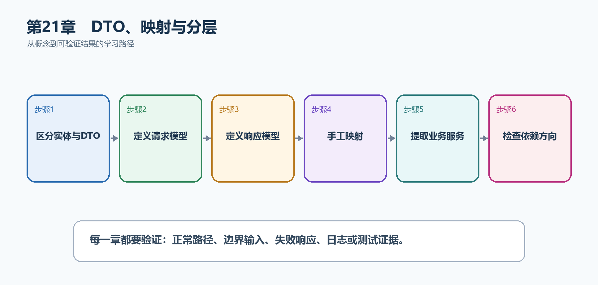

# 第22章　DTO、映射与分层

数据库实体描述持久化结构，HTTP DTO描述公开契约，业务服务描述用例。把三者混成一个类型，会让数据库字段意外暴露，也会让一次接口变化牵动所有层。

  --------------------------------------------------------------------------------------------------------------------------------------
  **先把三个问题说清楚　**这是什么：DTO是API边界传输的数据结构；映射把DTO、领域模型和数据库实体之间的字段明确转换；分层规定依赖方向。\
  目的是什么：保护内部字段、独立验证请求、稳定响应契约，并让业务规则不依赖HttpContext或EF细节。\
  最后得到什么：TaskEntity不会直接返回；CreateTaskRequest、TaskResponse和TaskService各自承担单一职责，端点只负责HTTP转换。
  --------------------------------------------------------------------------------------------------------------------------------------

  --------------------------------------------------------------------------------------------------------------------------------------

  --------------------------------------------------------------------------------------------------------
  **本章操作路线　**区分实体与DTO → 定义请求模型 → 定义响应模型 → 手工映射 → 提取业务服务 → 检查依赖方向
  --------------------------------------------------------------------------------------------------------

  --------------------------------------------------------------------------------------------------------

{width="6.102362204724409in" height="2.915573053368329in"}

图22-1　DTO、映射与分层从概念到结果的实现路线

## 22.1 先看最终效果

TaskEntity不会直接返回；CreateTaskRequest、TaskResponse和TaskService各自承担单一职责，端点只负责HTTP转换。

本章仍然使用TaskHub任务协作API作为落点。请先完成最小成功路径，再故意制造一次失败；只有能解释状态码、日志或测试结果，才算真正掌握。

171. OpenAPI中只出现请求和响应DTO，不暴露InternalNote。

172. 端点只调用TaskService，不直接拼接数据库流程。

173. 映射测试确认Title、Completed和Version含义正确。

174. 更换存储实现时HTTP契约不需要跟随变化。

## 22.2 本章核心示例：分离请求DTO、实体和响应DTO

本节先展示本章核心写法。若代码定义了所用的全部类型，它可以独立运行；若引用TaskDbContext、TaskEntity、GetTasks等本节没有定义的名称，它就是加入前文TaskHub项目的增量代码，不能直接粘贴到空项目。附录A和附录B提供从空目录开始、能够完整复制运行的项目。

示例22-2　分离请求DTO、实体和响应DTO

```csharp
sealed record CreateTaskRequest(string Title);

sealed record TaskResponse(
int Id,
string Title,
bool Completed);

sealed class TaskEntity
{
public int Id { get; set; }
public required string Title { get; set; }
public bool Completed { get; set; }
public string? InternalNote { get; set; }
}

static TaskResponse ToResponse(TaskEntity entity) =>
new(entity.Id, entity.Title, entity.Completed);

app.MapPost("/api/tasks", async (
CreateTaskRequest request,
TaskDbContext db,
CancellationToken ct) =>
{
var entity = new TaskEntity
{
Title = request.Title.Trim(),
InternalNote = "仅服务器可见"
};

db.Tasks.Add(entity);
await db.SaveChangesAsync(ct);
return Results.Created(
$"/api/tasks/{entity.Id}",
ToResponse(entity));
});
```

-   Request DTO只包含客户端允许提交的字段。

-   Entity包含持久化需要但不应公开的InternalNote。

-   Response DTO只返回公开字段。

-   ToResponse是显式映射，便于审查和测试。

  ----------------------------------------------------------------------------------
  **运行后应该看到什么　**POST响应中没有InternalNote；数据库实体仍能保存内部备注。
  ----------------------------------------------------------------------------------

  ----------------------------------------------------------------------------------

## 22.3 为什么要这样做

直接返回实体容易泄露InternalNote、RowVersion或导航属性，也会把数据库变更变成API破坏性变更。显式映射虽然多几行，却把权限和字段含义写得清楚。

在TaskHub中，本章把它应用到"创建任务并只返回允许公开的字段"。实现时要明确输入来自哪里、状态在哪里改变、失败怎样返回，以及运维或测试人员从哪里获得证据。

## 22.4 映射库

这是什么：映射应显式体现字段含义和权限；简单模型优先手写，自动映射库也要用测试锁定契约。

## 22.5 业务服务层

这是什么：业务服务把多个端点共享的规则和状态变化集中起来，并依赖接口访问外部能力。端点负责HTTP转换，服务不应返回IResult。

怎样做：先加入下面的最小配置或处理代码，保存并重新启动应用，再按示例给出的地址或命令验证。

示例22-3　把创建任务用例提取到服务

```csharp
sealed class TaskService(TaskDbContext db)
{
public async Task<TaskResponse> CreateAsync(
CreateTaskRequest request,
CancellationToken ct)
{
var entity = new TaskEntity
{
Title = request.Title.Trim()
};

db.Tasks.Add(entity);
await db.SaveChangesAsync(ct);
return new(entity.Id, entity.Title, entity.Completed);
}
}

builder.Services.AddScoped<TaskService>();

app.MapPost("/api/tasks", async (
CreateTaskRequest request,
TaskService service,
CancellationToken ct) =>
{
var result = await service.CreateAsync(request, ct);
return Results.Created($"/api/tasks/{result.Id}", result);
});
```

-   TaskService负责用例和持久化流程。

-   端点负责HTTP输入和201响应。

-   Scoped服务可以安全使用Scoped DbContext。

  ---------------------------------------------------------------------------
  **预期结果　**HTTP结果不变，但业务流程可以脱离Web端点进行单元或集成测试。
  ---------------------------------------------------------------------------

  ---------------------------------------------------------------------------

## 22.6 Repository是否必要

这是什么：EF Core本身已提供工作单元和集合抽象，只有在领域边界、跨存储或测试收益明确时再增加Repository。

## 22.7 按技术分层

这是什么：按Controllers、Services、Data分文件容易入门，但一个功能会散落在多个目录。规模变大后可逐步改为按功能组织。

## 22.8 按功能组织

这是什么：按Tasks、Projects等功能把端点、DTO和服务放在一起，阅读一次业务变化更集中。公共基础设施仍可保留独立目录。

## 22.9 依赖方向

这是什么：HTTP层依赖应用用例，应用层依赖领域抽象，基础设施实现接口并在组合根注册，核心代码不反向引用Web细节。

## 22.10 最终结果与注意事项

完成本章后，不要只确认项目能够编译。请按下面清单检查运行结果，并保留能够复现的请求、日志或测试。

175. OpenAPI中只出现请求和响应DTO，不暴露InternalNote。

176. 端点只调用TaskService，不直接拼接数据库流程。

177. 映射测试确认Title、Completed和Version含义正确。

178. 更换存储实现时HTTP契约不需要跟随变化。

  --------------------------------------------------------------------------------------------------------------------------------
  **特别注意　**实体不能默认等于API模型；映射应体现权限和字段含义；不要为了分层创建没有价值的空壳；核心业务层不要反向依赖Web细节
  --------------------------------------------------------------------------------------------------------------------------------

  --------------------------------------------------------------------------------------------------------------------------------
