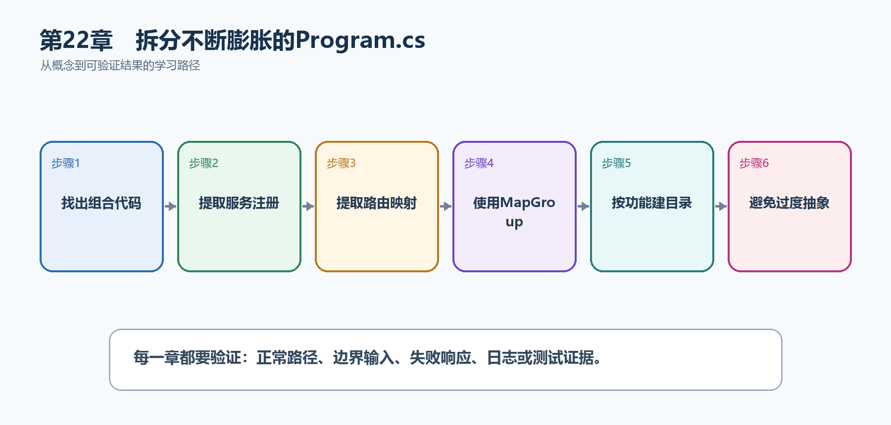

# 第23章　拆分不断膨胀的Program.cs

Program.cs是应用的组合根，不应该永久容纳所有模型、服务和端点。拆分的目标不是文件越多越好，而是让每个功能模块有清楚入口，同时一眼看懂应用怎样组装。

  -------------------------------------------------------------------------------------------------------------------------------------
  **先把三个问题说清楚　**这是什么：拆分Program.cs是把服务注册和端点映射提取为按功能组织的扩展方法或模块，Program.cs只保留启动顺序。\
  目的是什么：控制文件膨胀、减少多人修改冲突，并让任务、用户等模块可以独立维护和测试。\
  最后得到什么：Program.cs只包含AddTaskHub、Build、中间件和MapTaskEndpoints；任务模块拥有独立DTO、服务和路由文件。
  -------------------------------------------------------------------------------------------------------------------------------------

  -------------------------------------------------------------------------------------------------------------------------------------

  -----------------------------------------------------------------------------------------------------------
  **本章操作路线　**找出组合代码 → 提取服务注册 → 提取路由映射 → 使用MapGroup → 按功能建目录 → 避免过度抽象
  -----------------------------------------------------------------------------------------------------------

  -----------------------------------------------------------------------------------------------------------

{width="6.102362204724409in" height="2.915573053368329in"}

图23-1　拆分不断膨胀的Program.cs从概念到结果的实现路线

## 23.1 先看最终效果

Program.cs只包含AddTaskHub、Build、中间件和MapTaskEndpoints；任务模块拥有独立DTO、服务和路由文件。

本章仍然使用TaskHub任务协作API作为落点。请先完成最小成功路径，再故意制造一次失败；只有能解释状态码、日志或测试结果，才算真正掌握。

179. Program.cs能够在一屏内看清启动顺序。

180. 任务模块端点路径和运行结果与拆分前一致。

181. 新增用户模块时不需要修改任务模块内部文件。

182. OpenAPI、认证和Filter仍可通过RouteGroupBuilder统一配置。

## 23.2 本章核心示例：把服务和任务路由拆出Program.cs

本节先展示本章核心写法。若代码定义了所用的全部类型，它可以独立运行；若引用TaskDbContext、TaskEntity、GetTasks等本节没有定义的名称，它就是加入前文TaskHub项目的增量代码，不能直接粘贴到空项目。附录A和附录B提供从空目录开始、能够完整复制运行的项目。

示例23-2　把服务和任务路由拆出Program.cs

```csharp
// Program.cs
var builder = WebApplication.CreateBuilder(args);
builder.Services.AddTaskHub(builder.Configuration);

var app = builder.Build();
app.UseExceptionHandler();
app.MapTaskEndpoints();
app.Run();

// DependencyInjection.cs
static class DependencyInjection
{
public static IServiceCollection AddTaskHub(
this IServiceCollection services,
IConfiguration configuration)
{
services.AddProblemDetails();
services.AddScoped<TaskService>();
return services;
}
}

// Tasks/TaskEndpoints.cs
static class TaskEndpoints
{
public static RouteGroupBuilder MapTaskEndpoints(
this IEndpointRouteBuilder endpoints)
{
var group = endpoints.MapGroup("/api/tasks")
.WithTags("Tasks");

group.MapGet("/", (TaskService service) =>
Results.Ok(service.GetAll()));

return group;
}
}
```

-   Program.cs保留组合顺序，不保留任务端点细节。

-   AddTaskHub集中注册应用服务。

-   MapTaskEndpoints集中映射任务模块并返回RouteGroupBuilder。

-   WithTags和以后统一授权都可以加在组上。

  ------------------------------------------------------------------------------------------------
  **运行后应该看到什么　**重构前后的/api/tasks响应一致；Program.cs明显缩短，任务模块可独立定位。
  ------------------------------------------------------------------------------------------------

  ------------------------------------------------------------------------------------------------

## 23.3 为什么要这样做

把所有代码塞进Program.cs并不是Minimal API的要求。Program.cs应该表达应用全局结构；端点细节放在功能模块，既保持简洁也不隐藏关键启动顺序。

在TaskHub中，本章把它应用到"把任务端点和服务注册拆到Tasks功能目录"。实现时要明确输入来自哪里、状态在哪里改变、失败怎样返回，以及运维或测试人员从哪里获得证据。

## 23.4 使用局部处理函数

这是什么：把长Lambda提取成Program.cs中的局部函数是第一步拆分，适合小项目。函数变多后再移动到静态端点模块。

## 23.5 使用静态处理方法

这是什么：命名静态方法能明确参数和返回类型，也更容易做Handler单元测试。处理方法仍通过参数接收依赖，不使用全局服务定位器。

## 23.6 Endpoint Module

这是什么：Endpoint Module通常是提供MapXxxEndpoints扩展方法的静态类，把同一功能的MapGet/MapPost集中起来。它不是框架强制模式，而是控制Program.cs规模的简单约定。

## 23.7 路由组组织

这是什么：每个模块内部先MapGroup统一前缀、标签、认证和Filter，再映射具体端点。公共约定写一次即可。

## 23.8 项目结构

这是什么：综合项目按Api、Application、Domain、Infrastructure和Tests划分职责。小团队也可先放在一个项目的功能目录中，保持相同边界。

怎样做：先加入下面的最小配置或处理代码，保存并重新启动应用，再按示例给出的地址或命令验证。

示例23-3　按功能组织TaskHub目录

```text
TaskHub/
├─ Program.cs
├─ DependencyInjection.cs
├─ Features/
│ ├─ Tasks/
│ │ ├─ TaskEndpoints.cs
│ │ ├─ TaskService.cs
│ │ ├─ TaskDtos.cs
│ │ └─ TaskEntity.cs
│ └─ Users/
│ ├─ UserEndpoints.cs
│ └─ UserService.cs
├─ Infrastructure/
│ └─ TaskDbContext.cs
└─ appsettings.json
```

-   同一功能的端点、DTO和服务放在相邻目录。

-   跨功能基础设施单独放置。

-   目录结构表达业务边界，而不是只按Controllers/Models机械分类。

  ----------------------------------------------------------------------------------------
  **预期结果　**开发者从Features/Tasks即可找到任务功能主要代码，不需要在整个项目中搜索。
  ----------------------------------------------------------------------------------------

  ----------------------------------------------------------------------------------------

## 23.9 避免过度架构

这是什么：一个小CRUD项目不需要一开始加入所有设计模式和微服务。每次拆层都应回答它消除了哪种重复、耦合或测试困难。

## 23.10 最终结果与注意事项

完成本章后，不要只确认项目能够编译。请按下面清单检查运行结果，并保留能够复现的请求、日志或测试。

183. Program.cs能够在一屏内看清启动顺序。

184. 任务模块端点路径和运行结果与拆分前一致。

185. 新增用户模块时不需要修改任务模块内部文件。

186. OpenAPI、认证和Filter仍可通过RouteGroupBuilder统一配置。

  -----------------------------------------------------------------------------------------------------------------------------------------------------------
  **特别注意　**不要把Program.cs拆成无法追踪的魔法扫描；模块按业务功能而不是只按文件类型组织；扩展方法应返回builder以便继续配置；小项目不必提前建立复杂架构
  -----------------------------------------------------------------------------------------------------------------------------------------------------------

  -----------------------------------------------------------------------------------------------------------------------------------------------------------
