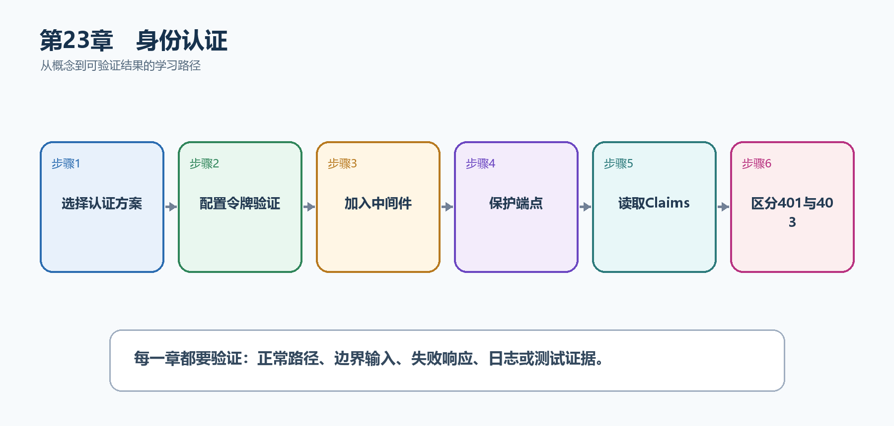

# 第24章　身份认证

认证回答"请求者是谁"。生产系统通常不自己发明登录协议，而是验证成熟身份提供商签发的Cookie或Bearer Token。本章重点解释API怎样验证令牌并建立HttpContext.User。

  -------------------------------------------------------------------------------------------------------
  **先把三个问题说清楚　**这是什么：身份认证是验证凭据并创建用户身份与ClaimsPrincipal的过程。\
  目的是什么：让后端只相信经过签名、发行方、受众和有效期验证的身份，而不是客户端自己提交的userId。\
  最后得到什么：TaskHub验证JWT Bearer Token；未带令牌返回401，有效令牌可以访问/api/me和受保护任务端点。
  -------------------------------------------------------------------------------------------------------

  -------------------------------------------------------------------------------------------------------

  ---------------------------------------------------------------------------------------------------
  **本章操作路线　**选择认证方案 → 配置令牌验证 → 加入中间件 → 保护端点 → 读取Claims → 区分401与403
  ---------------------------------------------------------------------------------------------------

  ---------------------------------------------------------------------------------------------------

{width="6.102362204724409in" height="2.915573053368329in"}

图24-1　身份认证从概念到结果的实现路线

## 24.1 先看最终效果

TaskHub验证JWT Bearer Token；未带令牌返回401，有效令牌可以访问/api/me和受保护任务端点。

本章仍然使用TaskHub任务协作API作为落点。请先完成最小成功路径，再故意制造一次失败；只有能解释状态码、日志或测试结果，才算真正掌握。

187. 不带Authorization请求受保护端点，确认返回401。

188. 使用签名、issuer、audience正确的Token，确认返回当前用户Claims。

189. 使用过期或错误受众Token，确认仍返回401。

190. 日志不记录完整Token，Swagger测试结束后清除授权信息。

## 24.2 本章核心示例：配置JWT Bearer验证并保护端点

本节先展示本章核心写法。若代码定义了所用的全部类型，它可以独立运行；若引用TaskDbContext、TaskEntity、GetTasks等本节没有定义的名称，它就是加入前文TaskHub项目的增量代码，不能直接粘贴到空项目。附录A和附录B提供从空目录开始、能够完整复制运行的项目。

示例24-2　配置JWT Bearer验证并保护端点

```csharp
using Microsoft.AspNetCore.Authentication.JwtBearer;
using Microsoft.IdentityModel.Tokens;
using System.Security.Claims;
using System.Text;

var builder = WebApplication.CreateBuilder(args);

var jwt = builder.Configuration.GetSection("Jwt");
var key = jwt["SigningKey"]
?? throw new InvalidOperationException("缺少Jwt:SigningKey");

builder.Services
.AddAuthentication(JwtBearerDefaults.AuthenticationScheme)
.AddJwtBearer(options =>
{
options.TokenValidationParameters = new()
{
ValidateIssuerSigningKey = true,
IssuerSigningKey = new SymmetricSecurityKey(
Encoding.UTF8.GetBytes(key)),
ValidateIssuer = true,
ValidIssuer = jwt["Issuer"],
ValidateAudience = true,
ValidAudience = jwt["Audience"],
ValidateLifetime = true,
ClockSkew = TimeSpan.FromMinutes(1)
};
});

builder.Services.AddAuthorization();

var app = builder.Build();
app.UseAuthentication();
app.UseAuthorization();

app.MapGet("/api/me", (ClaimsPrincipal user) =>
Results.Ok(new
{
subject = user.FindFirstValue(ClaimTypes.NameIdentifier),
name = user.Identity?.Name
}))
.RequireAuthorization();

app.Run();
```

-   AddAuthentication选择Bearer为默认方案。

-   TokenValidationParameters同时验证签名、发行方、受众和有效期。

-   UseAuthentication必须在UseAuthorization之前。

-   RequireAuthorization使端点拒绝匿名请求。

  -------------------------------------------------------------------------------------------------------------------
  **运行后应该看到什么　**匿名请求/api/me得到401；有效Token得到200和用户subject；过期、伪造或错误受众Token得到401。
  -------------------------------------------------------------------------------------------------------------------

  -------------------------------------------------------------------------------------------------------------------

## 24.3 为什么要这样做

JWT只是令牌格式，不是完整登录系统。API的职责是严格验证Token；登录、MFA、密码恢复和令牌撤销通常交给成熟身份提供商。

在TaskHub中，本章把它应用到"验证Bearer Token并建立当前用户身份"。实现时要明确输入来自哪里、状态在哪里改变、失败怎样返回，以及运维或测试人员从哪里获得证据。

## 24.4 Cookie认证

这是什么：Cookie适合同源浏览器会话，必须配置Secure、HttpOnly、SameSite并考虑CSRF；API失败应返回401/403而不是登录HTML。

怎样做：先加入下面的最小配置或处理代码，保存并重新启动应用，再按示例给出的地址或命令验证。

示例24-3　API使用Cookie时返回401而不是登录HTML

```csharp
builder.Services
.AddAuthentication("TaskCookie")
.AddCookie("TaskCookie", options =>
{
options.Cookie.HttpOnly = true;
options.Cookie.SecurePolicy = CookieSecurePolicy.Always;
options.Cookie.SameSite = SameSiteMode.Lax;

options.Events.OnRedirectToLogin = context =>
{
context.Response.StatusCode = StatusCodes.Status401Unauthorized;
return Task.CompletedTask;
};
options.Events.OnRedirectToAccessDenied = context =>
{
context.Response.StatusCode = StatusCodes.Status403Forbidden;
return Task.CompletedTask;
};
});
```

-   同源浏览器会话常使用Cookie。

-   API客户端不需要登录HTML，未认证应直接得到401。

-   Cookie自动携带，因此必须同时考虑CSRF。

  -----------------------------------------------------------------------
  **预期结果　**未登录API请求得到401状态码，不被302重定向到HTML页面。
  -----------------------------------------------------------------------

  -----------------------------------------------------------------------

## 24.5 Access Token与Refresh Token

这是什么：刷新令牌寿命更长，必须安全存储、轮换并检测重放；泄露后的处置比访问令牌更重要。

## 24.6 密码安全

这是什么：不要自行用普通哈希保存密码，应使用ASP.NET Core Identity或成熟身份系统提供的加盐密码哈希、锁定、MFA和恢复流程。日志永远不记录密码。

## 24.7 OpenID Connect与OAuth 2.0

这是什么：OIDC负责身份认证，OAuth 2.0负责授权委托；生产系统优先接入成熟身份提供商而非自造协议。

## 24.8 Identity API Endpoints

这是什么：Identity API Endpoints可提供注册、登录和身份管理能力，适合需要本地账户的应用。使用前仍要设计邮件确认、MFA、令牌存储和生产安全边界。

## 24.9 最终结果与注意事项

完成本章后，不要只确认项目能够编译。请按下面清单检查运行结果，并保留能够复现的请求、日志或测试。

191. 不带Authorization请求受保护端点，确认返回401。

192. 使用签名、issuer、audience正确的Token，确认返回当前用户Claims。

193. 使用过期或错误受众Token，确认仍返回401。

194. 日志不记录完整Token，Swagger测试结束后清除授权信息。

  ------------------------------------------------------------------------------------------------------------------------------------
  **特别注意　**不要只解码JWT而不验证签名；不要信任客户端提交的userId；访问令牌应短期有效并使用HTTPS；生产系统优先接入成熟身份提供商
  ------------------------------------------------------------------------------------------------------------------------------------

  ------------------------------------------------------------------------------------------------------------------------------------
